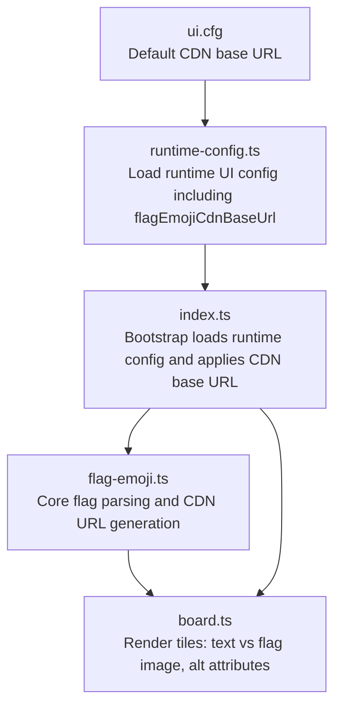
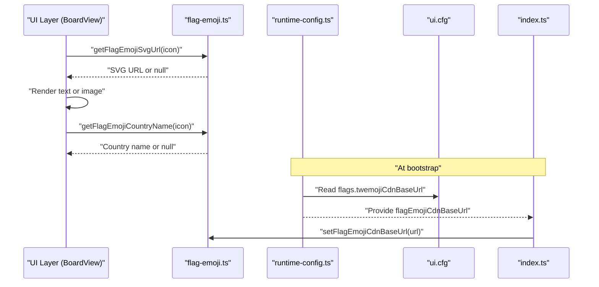
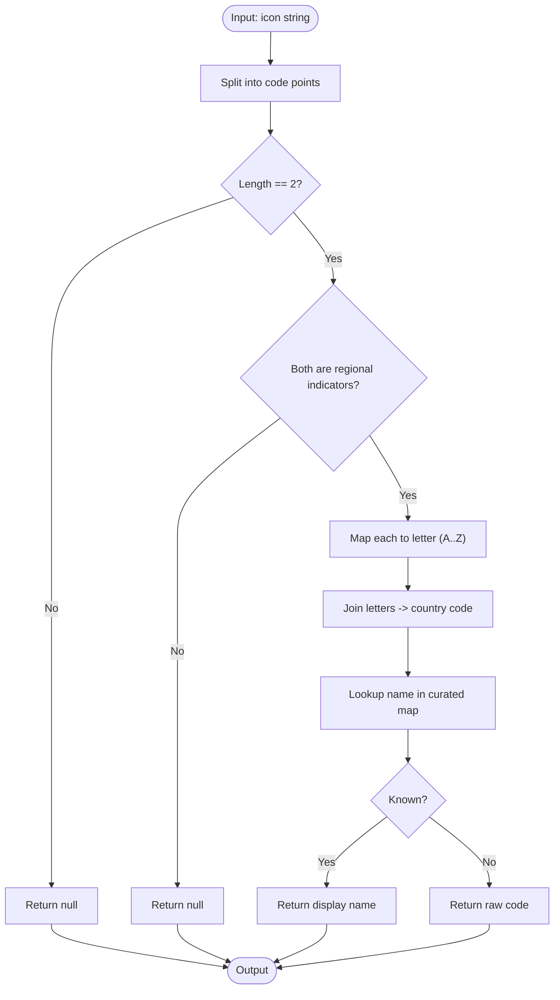
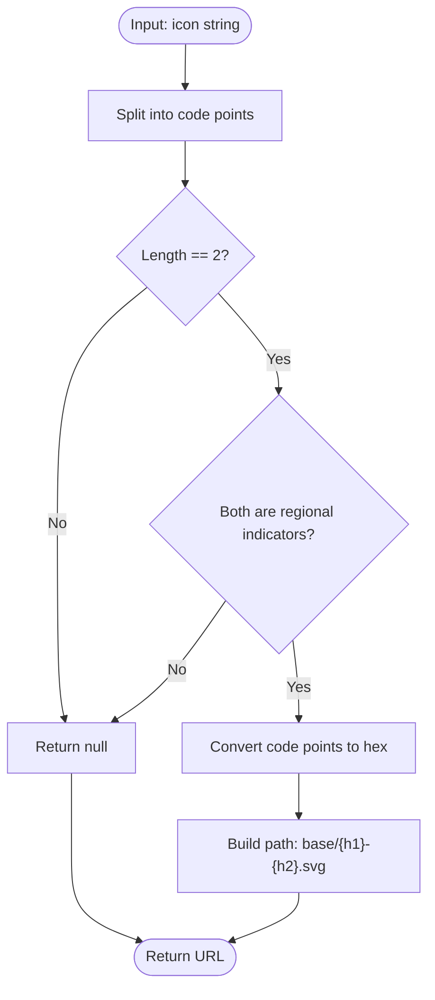
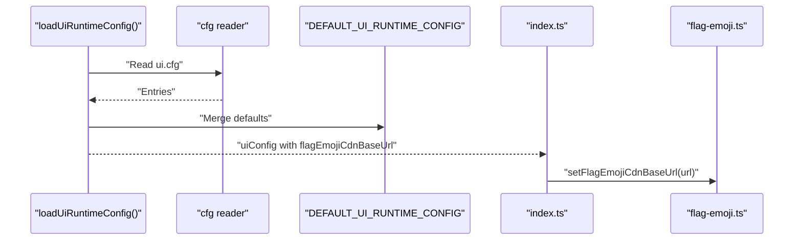
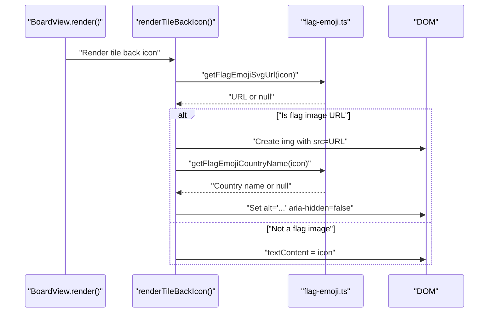
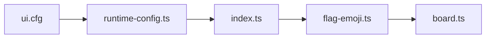

# Flag Emoji System

<cite>
**Referenced Files in This Document**
- [flag-emoji.ts](file://src/flag-emoji.ts)
- [flag-emoji.test.ts](file://tests/flag-emoji.test.ts)
- [board.ts](file://src/board.ts)
- [index.ts](file://src/index.ts)
- [runtime-config.ts](file://src/runtime-config.ts)
- [ui.cfg](file://config/ui.cfg)
- [emoji-inventory.md](file://docs/emoji-inventory.md)
</cite>

## Table of Contents
1. [Introduction](#introduction)
2. [Project Structure](#project-structure)
3. [Core Components](#core-components)
4. [Architecture Overview](#architecture-overview)
5. [Detailed Component Analysis](#detailed-component-analysis)
6. [Dependency Analysis](#dependency-analysis)
7. [Performance Considerations](#performance-considerations)
8. [Troubleshooting Guide](#troubleshooting-guide)
9. [Conclusion](#conclusion)
10. [Appendices](#appendices)

## Introduction
This document explains the flag emoji system used to represent countries in the application. It covers how flag emojis are identified, resolved to country codes and names, generated into Twemoji CDN URLs, integrated into tile rendering, and configured at runtime. It also documents accessibility considerations, customization points, and strategies for handling edge cases such as unsupported regions or configuration overrides.

## Project Structure
The flag emoji system spans several modules:
- Core logic for parsing flag emojis and generating CDN URLs
- Runtime configuration that supplies the CDN base URL
- Board rendering that selects between text and image rendering for tiles
- Tests validating behavior and edge cases
- Configuration files enabling environment-specific CDN base URLs

**Diagram sources**
- [flag-emoji.ts:1-161](file://src/flag-emoji.ts#L1-L161)
- [runtime-config.ts:238-353](file://src/runtime-config.ts#L238-L353)
- [ui.cfg:9-10](file://config/ui.cfg#L9-L10)
- [index.ts:846-900](file://src/index.ts#L846-L900)
- [board.ts:74-119](file://src/board.ts#L74-L119)

**Section sources**
- [flag-emoji.ts:1-161](file://src/flag-emoji.ts#L1-L161)
- [runtime-config.ts:238-353](file://src/runtime-config.ts#L238-L353)
- [ui.cfg:9-10](file://config/ui.cfg#L9-L10)
- [index.ts:846-900](file://src/index.ts#L846-L900)
- [board.ts:74-119](file://src/board.ts#L74-L119)

## Core Components
- Flag emoji parser: extracts two regional indicator code points from a flag emoji and converts them into an ISO 3166-1 alpha-2 country code.
- Country name resolver: maps known country codes to human-readable names; falls back to the raw code otherwise.
- CDN URL generator: builds a Twemoji SVG URL using the configured base URL and the two regional indicator code points.
- Runtime configuration: loads the CDN base URL from configuration and applies it at startup.
- Board renderer: decides whether to render a tile’s back face as plain text or as a flag image, and sets accessible labels.

Key responsibilities:
- Parsing: validate flag emoji structure and extract country code
- Resolution: map code to display name
- Rendering: choose text or image, set alt text for accessibility
- Configuration: supply CDN base URL at runtime

**Section sources**
- [flag-emoji.ts:93-119](file://src/flag-emoji.ts#L93-L119)
- [flag-emoji.ts:137-153](file://src/flag-emoji.ts#L137-L153)
- [runtime-config.ts:294-295](file://src/runtime-config.ts#L294-L295)
- [index.ts:892-892](file://src/index.ts#L892-L892)
- [board.ts:74-119](file://src/board.ts#L74-L119)

## Architecture Overview
The system follows a layered approach:
- Presentation layer (board) requests rendering for a tile’s back face
- If the icon is a flag emoji, the system generates a CDN URL and renders an image
- Otherwise, it renders the icon as text
- The CDN base URL is supplied by runtime configuration and applied during bootstrap

**Diagram sources**
- [board.ts:74-119](file://src/board.ts#L74-L119)
- [flag-emoji.ts:137-153](file://src/flag-emoji.ts#L137-L153)
- [flag-emoji.ts:111-119](file://src/flag-emoji.ts#L111-L119)
- [runtime-config.ts:294-295](file://src/runtime-config.ts#L294-L295)
- [ui.cfg:9-10](file://config/ui.cfg#L9-L10)
- [index.ts:892-892](file://src/index.ts#L892-L892)

## Detailed Component Analysis

### Flag Emoji Parser and Resolver
The parser validates that an input consists of exactly two regional indicator characters and converts them into a country code. The resolver maps known codes to names; unknown codes fall back to the raw code.

**Diagram sources**
- [flag-emoji.ts:93-119](file://src/flag-emoji.ts#L93-L119)
- [flag-emoji.ts:56-85](file://src/flag-emoji.ts#L56-L85)

**Section sources**
- [flag-emoji.ts:93-119](file://src/flag-emoji.ts#L93-L119)
- [flag-emoji.ts:56-85](file://src/flag-emoji.ts#L56-L85)

### CDN URL Generation
The CDN URL generator constructs a path from two regional indicator code points. It validates the input and returns null for non-flag emoji inputs.

**Diagram sources**
- [flag-emoji.ts:137-153](file://src/flag-emoji.ts#L137-L153)

**Section sources**
- [flag-emoji.ts:137-153](file://src/flag-emoji.ts#L137-L153)

### Runtime Configuration and Bootstrap
The runtime configuration loader reads the CDN base URL from ui.cfg and applies it during bootstrap. The index module sets the URL globally for the flag emoji module.

**Diagram sources**
- [runtime-config.ts:294-295](file://src/runtime-config.ts#L294-L295)
- [index.ts:892-892](file://src/index.ts#L892-L892)
- [flag-emoji.ts:155-160](file://src/flag-emoji.ts#L155-L160)

**Section sources**
- [runtime-config.ts:294-295](file://src/runtime-config.ts#L294-L295)
- [index.ts:892-892](file://src/index.ts#L892-L892)
- [flag-emoji.ts:155-160](file://src/flag-emoji.ts#L155-L160)

### Board Rendering Integration
The board renderer chooses between text and image rendering for tiles. For flag emojis, it creates an image with appropriate alt text and aria-hidden semantics.

**Diagram sources**
- [board.ts:74-119](file://src/board.ts#L74-L119)
- [flag-emoji.ts:137-153](file://src/flag-emoji.ts#L137-L153)
- [flag-emoji.ts:111-119](file://src/flag-emoji.ts#L111-L119)

**Section sources**
- [board.ts:74-119](file://src/board.ts#L74-L119)

### Regional Variant Handling
The system recognizes flag emojis as composed of exactly two regional indicator code points. It does not implement explicit regional variant logic beyond this constraint. Unknown or unsupported combinations fall back to rendering as text or returning null for URL generation.

**Section sources**
- [flag-emoji.ts:93-119](file://src/flag-emoji.ts#L93-L119)
- [flag-emoji.ts:137-153](file://src/flag-emoji.ts#L137-L153)

### Country Name Mapping and Display Formatting
A curated map associates known country codes with display names. Unknown codes are returned as-is. The board renderer uses this to set alt text when accessible labels are not provided.

**Section sources**
- [flag-emoji.ts:23-54](file://src/flag-emoji.ts#L23-L54)
- [flag-emoji.ts:111-119](file://src/flag-emoji.ts#L111-L119)
- [board.ts:108-115](file://src/board.ts#L108-L115)

### Integration with the World Flags Emoji Pack
The World Flags pack is one of the icon packs and contains flag emojis. The inventory documentation lists the flags included in that pack.

**Section sources**
- [emoji-inventory.md:51-56](file://docs/emoji-inventory.md#L51-L56)

## Dependency Analysis
The flag emoji system exhibits low coupling and clear separation of concerns:
- flag-emoji.ts depends only on constants and a small internal runtime config
- board.ts depends on flag-emoji.ts for parsing and resolution
- index.ts depends on runtime-config.ts and applies the CDN base URL to flag-emoji.ts
- runtime-config.ts depends on ui.cfg for defaults

**Diagram sources**
- [ui.cfg:9-10](file://config/ui.cfg#L9-L10)
- [runtime-config.ts:294-295](file://src/runtime-config.ts#L294-L295)
- [index.ts:892-892](file://src/index.ts#L892-L892)
- [flag-emoji.ts:1-161](file://src/flag-emoji.ts#L1-L161)
- [board.ts:1-119](file://src/board.ts#L1-L119)

**Section sources**
- [flag-emoji.ts:1-161](file://src/flag-emoji.ts#L1-L161)
- [board.ts:1-119](file://src/board.ts#L1-L119)
- [runtime-config.ts:294-295](file://src/runtime-config.ts#L294-L295)
- [index.ts:892-892](file://src/index.ts#L892-L892)
- [ui.cfg:9-10](file://config/ui.cfg#L9-L10)

## Performance Considerations
- Lazy rendering: The board caches rendered back faces to avoid redundant work across renders.
- Minimal parsing cost: The flag parser performs constant-time checks and conversions.
- CDN caching: Using a CDN reduces server load and improves global delivery latency.
- Image decoding: Async decoding is used to avoid blocking the main thread.

Recommendations:
- Prefer the curated country list to minimize unnecessary lookups.
- Keep the CDN base URL stable to benefit from browser and CDN caching.
- Avoid frequent reconfiguration of the CDN base URL during gameplay.

**Section sources**
- [board.ts:142-147](file://src/board.ts#L142-L147)
- [board.ts:102-106](file://src/board.ts#L102-L106)
- [flag-emoji.ts:137-153](file://src/flag-emoji.ts#L137-L153)

## Troubleshooting Guide
Common issues and resolutions:
- Invalid flag emoji input: Functions return null; the board falls back to text rendering.
- Blank or whitespace-only CDN base URL: Automatically falls back to the default CDN base URL.
- Unknown country code: Name resolution returns the raw code; alt text uses “flag” fallback.
- Mixed-length emoji strings: Not treated as flag emojis; rendered as text.
- Single regional indicator: Treated as incomplete and returns null.

Validation and normalization:
- Input trimming and normalization are handled by the CDN base URL setter.
- Tests cover all edge cases and expected behaviors.

**Section sources**
- [flag-emoji.test.ts:23-27](file://tests/flag-emoji.test.ts#L23-L27)
- [flag-emoji.test.ts:41-47](file://tests/flag-emoji.test.ts#L41-L47)
- [flag-emoji.test.ts:65-69](file://tests/flag-emoji.test.ts#L65-L69)
- [flag-emoji.test.ts:71-76](file://tests/flag-emoji.test.ts#L71-L76)
- [flag-emoji.test.ts:93-103](file://tests/flag-emoji.test.ts#L93-L103)
- [flag-emoji.test.ts:123-127](file://tests/flag-emoji.test.ts#L123-L127)
- [flag-emoji.ts:155-160](file://src/flag-emoji.ts#L155-L160)

## Conclusion
The flag emoji system provides robust parsing, resolution, and rendering for flag-based identification. It integrates cleanly with the board rendering pipeline, supports runtime configuration of the Twemoji CDN base URL, and maintains accessibility standards. The design favors simplicity and performance while offering clear extension points for future enhancements.

## Appendices

### Customization Examples
- Change the Twemoji CDN base URL via configuration:
  - Set the key in ui.cfg to point to a mirror or custom host.
  - The runtime loader merges this into the UI configuration.
  - The application applies the URL during bootstrap.
- Add new flag variants:
  - Extend the curated country name map with additional codes and names.
  - Ensure the new codes align with the regional indicator parsing logic.
- Handling edge cases:
  - Unsupported regions: Unknown codes fall back to raw codes and generic alt text.
  - Disputed territories or special administrative regions: Treat as unknown codes; customize the curated map to reflect desired display names.

**Section sources**
- [ui.cfg:9-10](file://config/ui.cfg#L9-L10)
- [runtime-config.ts:294-295](file://src/runtime-config.ts#L294-L295)
- [index.ts:892-892](file://src/index.ts#L892-L892)
- [flag-emoji.ts:23-54](file://src/flag-emoji.ts#L23-L54)
- [flag-emoji.ts:111-119](file://src/flag-emoji.ts#L111-L119)