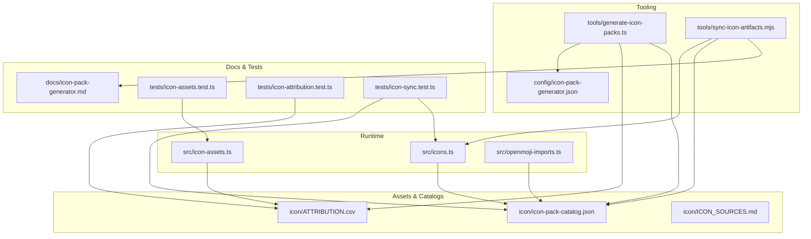
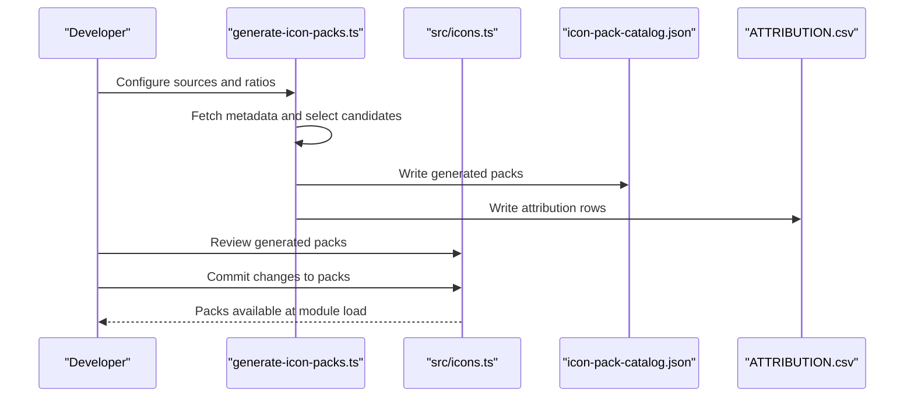
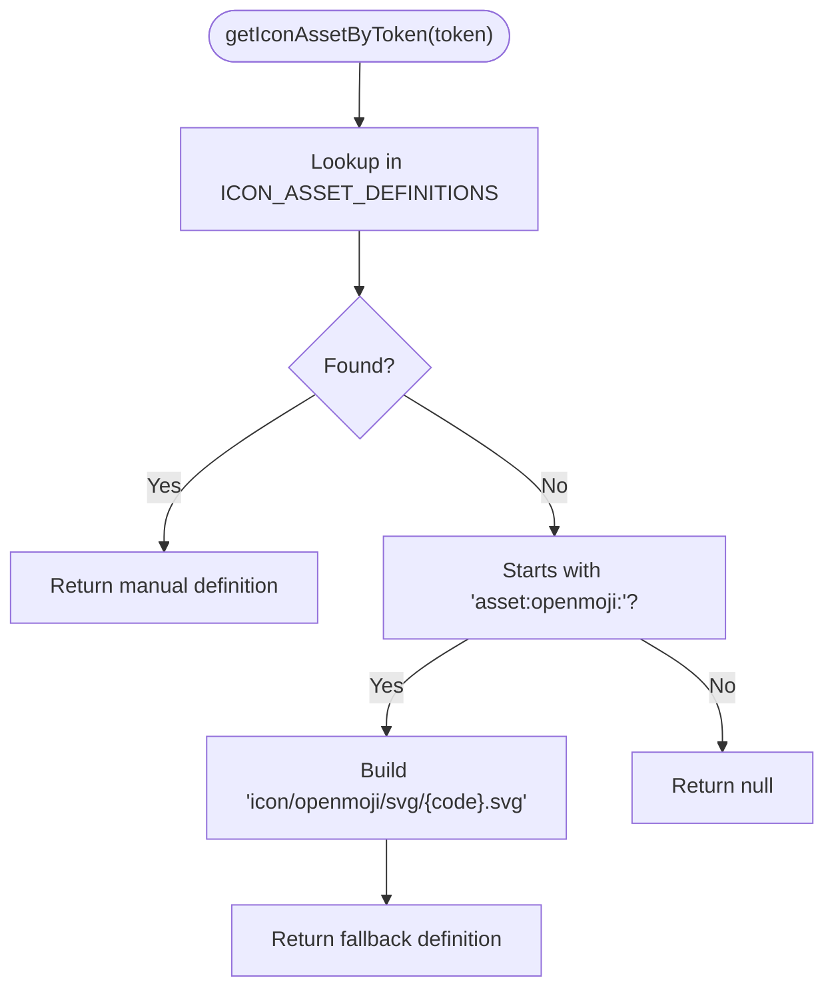
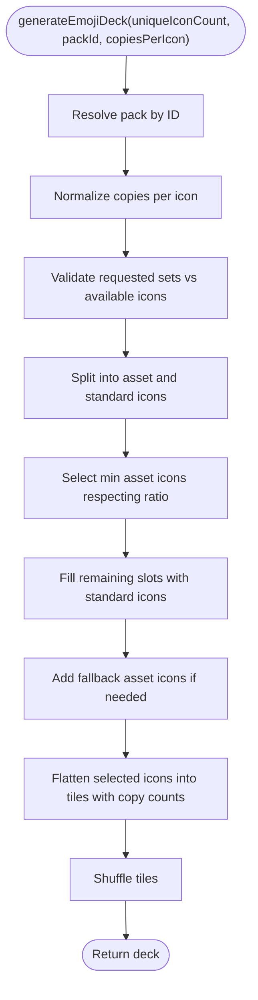
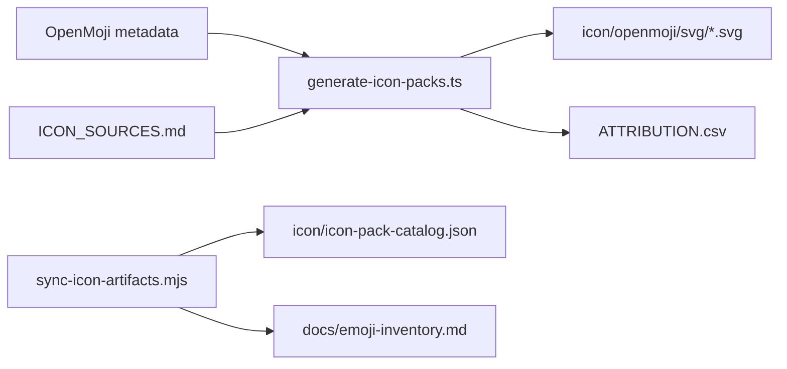
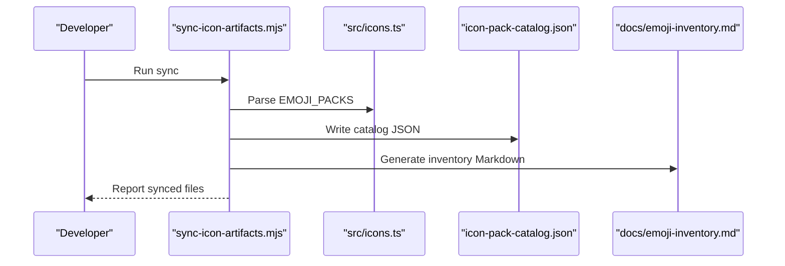
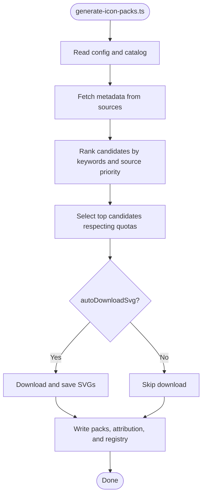
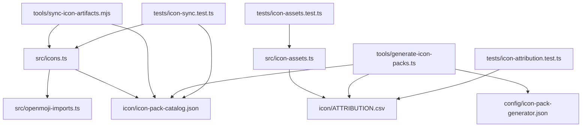

# Icon Assets Management

<cite>
**Referenced Files in This Document**
- [src/icon-assets.ts](file://src/icon-assets.ts)
- [src/icons.ts](file://src/icons.ts)
- [src/openmoji-imports.ts](file://src/openmoji-imports.ts)
- [icon/ATTRIBUTION.csv](file://icon/ATTRIBUTION.csv)
- [icon/ICON_SOURCES.md](file://icon/ICON_SOURCES.md)
- [icon/icon-pack-catalog.json](file://icon/icon-pack-catalog.json)
- [icon/README.md](file://icon/README.md)
- [tools/generate-icon-packs.ts](file://tools/generate-icon-packs.ts)
- [tools/sync-icon-artifacts.mjs](file://tools/sync-icon-artifacts.mjs)
- [docs/icon-pack-generator.md](file://docs/icon-pack-generator.md)
- [config/icon-pack-generator.json](file://config/icon-pack-generator.json)
- [tests/icon-assets.test.ts](file://tests/icon-assets.test.ts)
- [tests/icon-attribution.test.ts](file://tests/icon-attribution.test.ts)
- [tests/icon-sync.test.ts](file://tests/icon-sync.test.ts)
- [package.json](file://package.json)
</cite>

## Table of Contents
1. [Introduction](#introduction)
2. [Project Structure](#project-structure)
3. [Core Components](#core-components)
4. [Architecture Overview](#architecture-overview)
5. [Detailed Component Analysis](#detailed-component-analysis)
6. [Dependency Analysis](#dependency-analysis)
7. [Performance Considerations](#performance-considerations)
8. [Troubleshooting Guide](#troubleshooting-guide)
9. [Conclusion](#conclusion)
10. [Appendices](#appendices)

## Introduction
This document explains the icon assets management and attribution system used by the project. It covers how icon assets are defined, resolved, validated, and synchronized; how attribution and licensing are tracked; and how the system supports large icon libraries with performance-conscious design. It also documents the asset synchronization workflow, automated update mechanisms, quality assurance procedures, and legal compliance practices for commercial distribution.

## Project Structure
The icon system spans several areas:
- Runtime asset resolution and validation live in the source tree.
- Canonical icon pack catalogs and attribution records live under the icon directory.
- Tooling automates generation, synchronization, and inventory maintenance.
- Tests enforce correctness and compliance.

**Diagram sources**
- [src/icons.ts:56-528](file://src/icons.ts#L56-L528)
- [src/icon-assets.ts:1-189](file://src/icon-assets.ts#L1-L189)
- [src/openmoji-imports.ts:1-199](file://src/openmoji-imports.ts#L1-L199)
- [icon/icon-pack-catalog.json:1-474](file://icon/icon-pack-catalog.json#L1-L474)
- [icon/ATTRIBUTION.csv:1-42](file://icon/ATTRIBUTION.csv#L1-L42)
- [icon/ICON_SOURCES.md:1-28](file://icon/ICON_SOURCES.md#L1-L28)
- [tools/generate-icon-packs.ts:351-474](file://tools/generate-icon-packs.ts#L351-L474)
- [tools/sync-icon-artifacts.mjs:126-142](file://tools/sync-icon-artifacts.mjs#L126-L142)
- [config/icon-pack-generator.json:1-67](file://config/icon-pack-generator.json#L1-L67)
- [docs/icon-pack-generator.md:1-43](file://docs/icon-pack-generator.md#L1-L43)
- [tests/icon-assets.test.ts:1-37](file://tests/icon-assets.test.ts#L1-L37)
- [tests/icon-attribution.test.ts:1-67](file://tests/icon-attribution.test.ts#L1-L67)
- [tests/icon-sync.test.ts:1-27](file://tests/icon-sync.test.ts#L1-L27)

**Section sources**
- [src/icons.ts:56-528](file://src/icons.ts#L56-L528)
- [src/icon-assets.ts:1-189](file://src/icon-assets.ts#L1-L189)
- [src/openmoji-imports.ts:1-199](file://src/openmoji-imports.ts#L1-L199)
- [icon/icon-pack-catalog.json:1-474](file://icon/icon-pack-catalog.json#L1-L474)
- [icon/ATTRIBUTION.csv:1-42](file://icon/ATTRIBUTION.csv#L1-L42)
- [icon/ICON_SOURCES.md:1-28](file://icon/ICON_SOURCES.md#L1-L28)
- [tools/generate-icon-packs.ts:351-474](file://tools/generate-icon-packs.ts#L351-L474)
- [tools/sync-icon-artifacts.mjs:126-142](file://tools/sync-icon-artifacts.mjs#L126-L142)
- [config/icon-pack-generator.json:1-67](file://config/icon-pack-generator.json#L1-L67)
- [docs/icon-pack-generator.md:1-43](file://docs/icon-pack-generator.md#L1-L43)
- [tests/icon-assets.test.ts:1-37](file://tests/icon-assets.test.ts#L1-L37)
- [tests/icon-attribution.test.ts:1-67](file://tests/icon-attribution.test.ts#L1-L67)
- [tests/icon-sync.test.ts:1-27](file://tests/icon-sync.test.ts#L1-L27)

## Core Components
- Icon asset definition and resolution: resolves tokenized asset identifiers to on-disk paths and labels.
- Icon pack catalog and validation: defines packs, validates uniqueness and minimum sizes, and generates decks.
- Attribution and licensing: tracks per-asset licenses and authors, enforcing compliance.
- Synchronization and inventory: keeps catalogs and documentation in sync with source definitions.
- Generation pipeline: fetches metadata, selects candidates, downloads assets, and emits attribution.

Key responsibilities:
- Token parsing and fallback resolution for OpenMoji assets.
- Enforcing minimum icon counts and uniqueness across packs.
- Generating decks with controlled asset-to-standard icon ratios.
- Maintaining a unified attribution record and source policy.
- Automating catalog and inventory updates.

**Section sources**
- [src/icon-assets.ts:1-189](file://src/icon-assets.ts#L1-L189)
- [src/icons.ts:56-528](file://src/icons.ts#L56-L528)
- [icon/ATTRIBUTION.csv:1-42](file://icon/ATTRIBUTION.csv#L1-L42)
- [icon/ICON_SOURCES.md:1-28](file://icon/ICON_SOURCES.md#L1-L28)
- [tools/sync-icon-artifacts.mjs:126-142](file://tools/sync-icon-artifacts.mjs#L126-L142)
- [tools/generate-icon-packs.ts:351-474](file://tools/generate-icon-packs.ts#L351-L474)

## Architecture Overview
The system separates concerns between runtime asset resolution, pack composition, and tooling-driven generation and synchronization.

**Diagram sources**
- [tools/generate-icon-packs.ts:351-474](file://tools/generate-icon-packs.ts#L351-L474)
- [src/icons.ts:56-528](file://src/icons.ts#L56-L528)
- [icon/icon-pack-catalog.json:1-474](file://icon/icon-pack-catalog.json#L1-L474)
- [icon/ATTRIBUTION.csv:1-42](file://icon/ATTRIBUTION.csv#L1-L42)

## Detailed Component Analysis

### Icon Asset Resolution
The runtime resolver:
- Supports explicit manual entries for known tokens.
- Provides a fallback mechanism for OpenMoji tokens by deriving paths and labels.
- Identifies whether a given token refers to an asset.

**Diagram sources**
- [src/icon-assets.ts:167-188](file://src/icon-assets.ts#L167-L188)

**Section sources**
- [src/icon-assets.ts:1-189](file://src/icon-assets.ts#L1-L189)
- [tests/icon-assets.test.ts:1-37](file://tests/icon-assets.test.ts#L1-L37)

### Icon Pack Catalog and Deck Generation
The pack catalog:
- Defines canonical packs with IDs, names, preview icons, and icon lists.
- Enforces uniqueness and minimum counts per pack.
- Exposes helpers to compute active/inactive imported OpenMoji tokens.

Deck generation:
- Selects icons from a pack with a controlled ratio of asset icons to standard emojis.
- Ensures at least one copy per icon (pairs) and supports mixed copy counts.
- Shuffles to avoid bias and prevent repetition across the deck.

**Diagram sources**
- [src/icons.ts:652-725](file://src/icons.ts#L652-L725)

**Section sources**
- [src/icons.ts:56-528](file://src/icons.ts#L56-L528)
- [src/openmoji-imports.ts:1-199](file://src/openmoji-imports.ts#L1-L199)
- [tests/icon-assets.test.ts:1-37](file://tests/icon-assets.test.ts#L1-L37)

### Attribution Tracking and License Compliance
Attribution tracking:
- Maintains a CSV with per-asset fields: file path, title, author, source URL, license, license URL, modifications, notes.
- Source policy document enumerates approved sources and intake checklist.

Quality assurance:
- Tests verify that all imported OpenMoji SVGs exist and are recorded in attribution.
- Tests verify that the catalog JSON matches the source packs and that inventory documentation reflects the generated source.

**Diagram sources**
- [tools/generate-icon-packs.ts:351-474](file://tools/generate-icon-packs.ts#L351-L474)
- [tools/sync-icon-artifacts.mjs:126-142](file://tools/sync-icon-artifacts.mjs#L126-L142)
- [icon/ATTRIBUTION.csv:1-42](file://icon/ATTRIBUTION.csv#L1-L42)
- [icon/ICON_SOURCES.md:1-28](file://icon/ICON_SOURCES.md#L1-L28)
- [icon/icon-pack-catalog.json:1-474](file://icon/icon-pack-catalog.json#L1-L474)

**Section sources**
- [icon/ATTRIBUTION.csv:1-42](file://icon/ATTRIBUTION.csv#L1-L42)
- [icon/ICON_SOURCES.md:1-28](file://icon/ICON_SOURCES.md#L1-L28)
- [tests/icon-attribution.test.ts:1-67](file://tests/icon-attribution.test.ts#L1-L67)
- [tests/icon-sync.test.ts:1-27](file://tests/icon-sync.test.ts#L1-L27)

### Asset Synchronization Workflow
The synchronization script:
- Reads packs from the canonical source file.
- Writes the catalog JSON and generates an inventory Markdown.
- Tracks imported OpenMoji tokens and distinguishes active vs inactive usage.

**Diagram sources**
- [tools/sync-icon-artifacts.mjs:126-142](file://tools/sync-icon-artifacts.mjs#L126-L142)
- [src/icons.ts:56-528](file://src/icons.ts#L56-L528)
- [icon/icon-pack-catalog.json:1-474](file://icon/icon-pack-catalog.json#L1-L474)

**Section sources**
- [tools/sync-icon-artifacts.mjs:126-142](file://tools/sync-icon-artifacts.mjs#L126-L142)
- [tests/icon-sync.test.ts:1-27](file://tests/icon-sync.test.ts#L1-L27)

### Automated Update Mechanisms
Generation pipeline:
- Loads configuration for sources, ratios, and pack keywords.
- Fetches metadata, ranks candidates, and selects assets.
- Optionally downloads SVGs and writes outputs for packs, attribution, and asset registry.

**Diagram sources**
- [tools/generate-icon-packs.ts:351-474](file://tools/generate-icon-packs.ts#L351-L474)
- [config/icon-pack-generator.json:1-67](file://config/icon-pack-generator.json#L1-L67)

**Section sources**
- [tools/generate-icon-packs.ts:351-474](file://tools/generate-icon-packs.ts#L351-L474)
- [docs/icon-pack-generator.md:1-43](file://docs/icon-pack-generator.md#L1-L43)
- [config/icon-pack-generator.json:1-67](file://config/icon-pack-generator.json#L1-L67)

## Dependency Analysis
The following diagram shows how core modules depend on each other and on external assets and tools.

**Diagram sources**
- [src/icons.ts:56-528](file://src/icons.ts#L56-L528)
- [src/openmoji-imports.ts:1-199](file://src/openmoji-imports.ts#L1-L199)
- [src/icon-assets.ts:1-189](file://src/icon-assets.ts#L1-L189)
- [icon/icon-pack-catalog.json:1-474](file://icon/icon-pack-catalog.json#L1-L474)
- [icon/ATTRIBUTION.csv:1-42](file://icon/ATTRIBUTION.csv#L1-L42)
- [tools/sync-icon-artifacts.mjs:126-142](file://tools/sync-icon-artifacts.mjs#L126-L142)
- [tools/generate-icon-packs.ts:351-474](file://tools/generate-icon-packs.ts#L351-L474)
- [config/icon-pack-generator.json:1-67](file://config/icon-pack-generator.json#L1-L67)
- [tests/icon-assets.test.ts:1-37](file://tests/icon-assets.test.ts#L1-L37)
- [tests/icon-attribution.test.ts:1-67](file://tests/icon-attribution.test.ts#L1-L67)
- [tests/icon-sync.test.ts:1-27](file://tests/icon-sync.test.ts#L1-L27)

**Section sources**
- [src/icons.ts:56-528](file://src/icons.ts#L56-L528)
- [src/icon-assets.ts:1-189](file://src/icon-assets.ts#L1-L189)
- [src/openmoji-imports.ts:1-199](file://src/openmoji-imports.ts#L1-L199)
- [icon/icon-pack-catalog.json:1-474](file://icon/icon-pack-catalog.json#L1-L474)
- [icon/ATTRIBUTION.csv:1-42](file://icon/ATTRIBUTION.csv#L1-L42)
- [tools/sync-icon-artifacts.mjs:126-142](file://tools/sync-icon-artifacts.mjs#L126-L142)
- [tools/generate-icon-packs.ts:351-474](file://tools/generate-icon-packs.ts#L351-L474)
- [config/icon-pack-generator.json:1-67](file://config/icon-pack-generator.json#L1-L67)
- [tests/icon-assets.test.ts:1-37](file://tests/icon-assets.test.ts#L1-L37)
- [tests/icon-attribution.test.ts:1-67](file://tests/icon-attribution.test.ts#L1-L67)
- [tests/icon-sync.test.ts:1-27](file://tests/icon-sync.test.ts#L1-L27)

## Performance Considerations
- Inline pack definitions: Packs are embedded in source for immediate availability and tree-shaking benefits.
- Deterministic shuffling: Uses seeded randomization to ensure reproducible outcomes during generation and testing.
- Ratio-based selection: Controls the proportion of asset vs standard icons to balance fidelity and performance.
- Metadata caching: Generator caches metadata fetches to reduce network overhead.
- Minimal runtime I/O: Asset resolution relies on precomputed token sets and simple string operations.

Recommendations:
- Keep asset icons minimal and representative to reduce bundle size.
- Prefer SVG assets for scalability and consistent rendering.
- Monitor pack sizes to maintain the minimum icon count requirement.

**Section sources**
- [src/icons.ts:48-54](file://src/icons.ts#L48-L54)
- [tools/generate-icon-packs.ts:109-127](file://tools/generate-icon-packs.ts#L109-L127)
- [tools/generate-icon-packs.ts:177-199](file://tools/generate-icon-packs.ts#L177-L199)

## Troubleshooting Guide
Common issues and resolutions:
- Missing asset files: Ensure all imported OpenMoji SVGs exist in the unified folder and are recorded in attribution.
- Out-of-sync catalog: Re-run the synchronization script to regenerate the catalog and inventory.
- License mismatch: Verify that the source policy allows the asset and that attribution fields are complete.
- Deck generation errors: Confirm that each pack meets the minimum icon count and that the requested sets are feasible.

Validation steps:
- Run the test suite to validate asset resolution, attribution completeness, and synchronization accuracy.
- Use the generation script with a fixed seed to reproduce candidate selections.

**Section sources**
- [tests/icon-assets.test.ts:1-37](file://tests/icon-assets.test.ts#L1-L37)
- [tests/icon-attribution.test.ts:1-67](file://tests/icon-attribution.test.ts#L1-L67)
- [tests/icon-sync.test.ts:1-27](file://tests/icon-sync.test.ts#L1-L27)
- [tools/sync-icon-artifacts.mjs:126-142](file://tools/sync-icon-artifacts.mjs#L126-L142)

## Conclusion
The icon assets management system combines explicit runtime resolution, robust pack validation, and automated tooling to support large icon libraries while maintaining legal compliance and performance. By centralizing attribution, synchronizing catalogs, and enforcing quality checks, the system ensures reliable asset delivery and straightforward maintenance for commercial distribution.

## Appendices

### Adding New Icon Sources
Steps:
- Add the source to the generator configuration with metadata URL, SVG base URL, and priority.
- Define keywords per target pack to guide candidate selection.
- Run the generation script to fetch metadata, select candidates, and optionally download assets.
- Merge generated attribution rows into the unified attribution CSV.
- Regenerate the catalog and inventory to reflect changes.

**Section sources**
- [config/icon-pack-generator.json:1-67](file://config/icon-pack-generator.json#L1-L67)
- [docs/icon-pack-generator.md:1-43](file://docs/icon-pack-generator.md#L1-L43)
- [tools/generate-icon-packs.ts:351-474](file://tools/generate-icon-packs.ts#L351-L474)

### Managing Asset Dependencies
- Keep imported OpenMoji tokens in a dedicated set for quick lookup.
- Track active vs inactive tokens to identify unused assets.
- Maintain a unified folder for SVGs and a single attribution record.

**Section sources**
- [src/openmoji-imports.ts:1-199](file://src/openmoji-imports.ts#L1-L199)
- [tools/sync-icon-artifacts.mjs:63-124](file://tools/sync-icon-artifacts.mjs#L63-L124)

### Implementing Fallback Systems
- Use tokenized asset identifiers with fallback resolution for unknown OpenMoji codes.
- Ensure fallback paths align with the unified asset directory structure.
- Validate that fallback assets exist and are properly attributed.

**Section sources**
- [src/icon-assets.ts:167-188](file://src/icon-assets.ts#L167-L188)
- [tests/icon-assets.test.ts:17-24](file://tests/icon-assets.test.ts#L17-L24)

### Copyright and Legal Compliance
- Approved sources and intake checklist are documented for legal compliance.
- Attribution records must include author, source URL, license, and license URL.
- Keep source URLs intact and avoid importing assets with unclear terms.
- Prefer SVG resources for visual consistency and licensing clarity.

**Section sources**
- [icon/ICON_SOURCES.md:1-28](file://icon/ICON_SOURCES.md#L1-L28)
- [icon/ATTRIBUTION.csv:1-42](file://icon/ATTRIBUTION.csv#L1-L42)

### Quality Assurance Procedures
- Unit tests validate asset resolution and attribution coverage.
- Integration tests verify catalog synchronization and inventory generation.
- Run the full validation pipeline to catch issues early.

**Section sources**
- [tests/icon-assets.test.ts:1-37](file://tests/icon-assets.test.ts#L1-L37)
- [tests/icon-attribution.test.ts:1-67](file://tests/icon-attribution.test.ts#L1-L67)
- [tests/icon-sync.test.ts:1-27](file://tests/icon-sync.test.ts#L1-L27)
- [package.json:1-1](file://package.json#L1-L1)