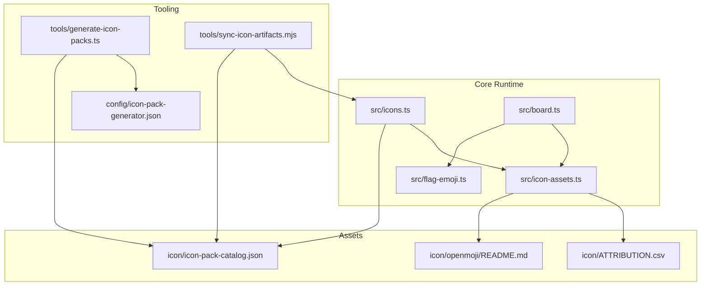
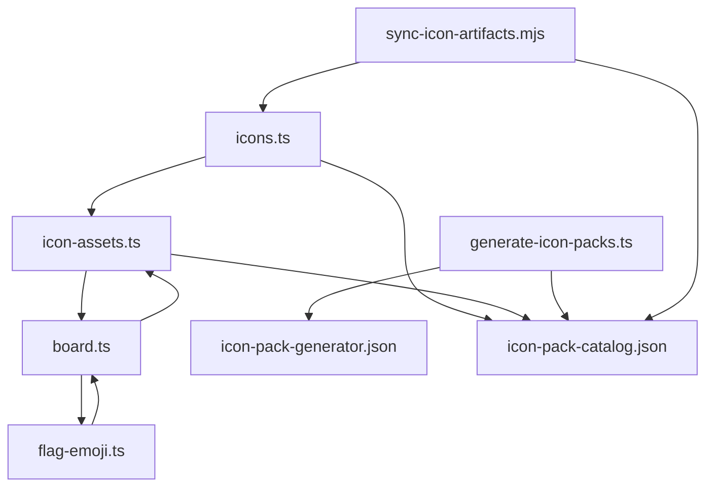
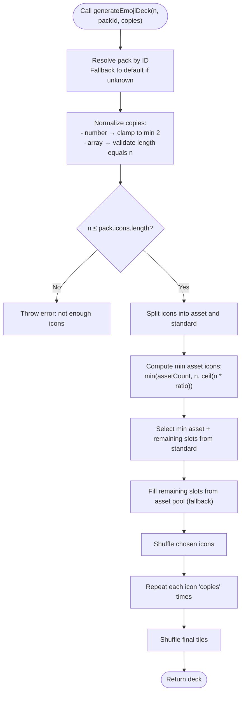
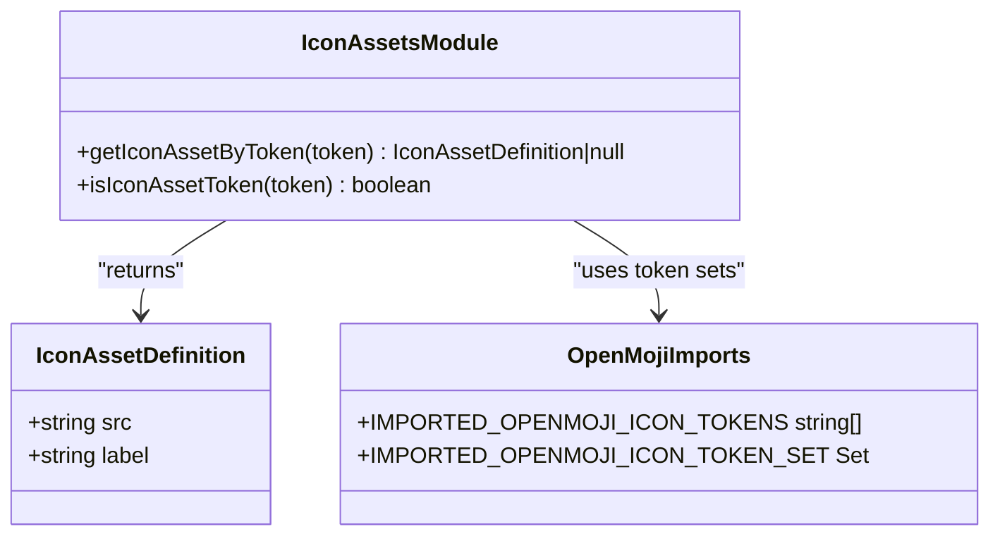
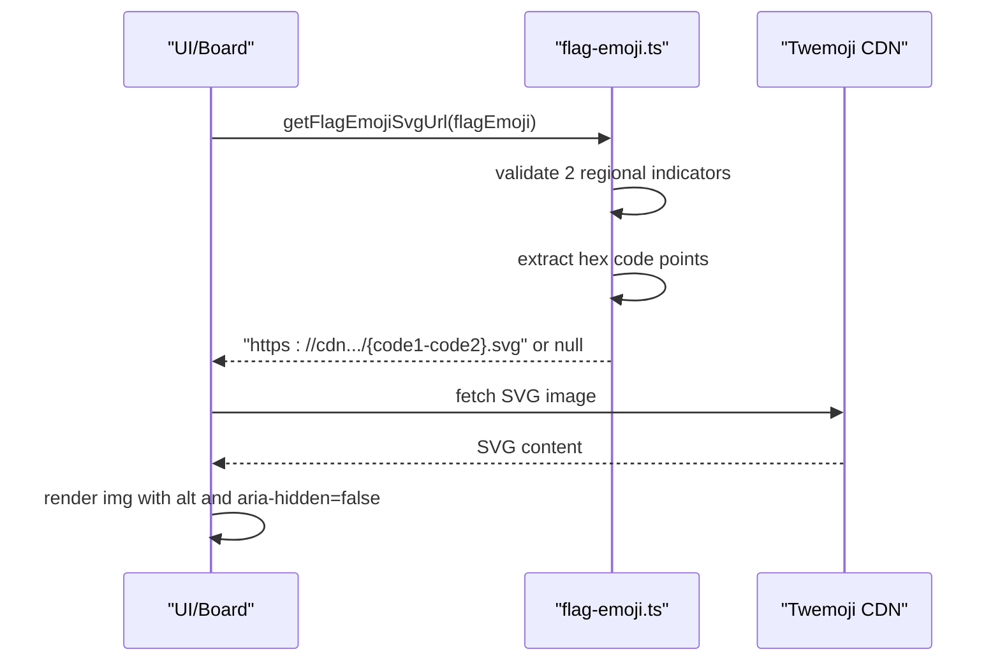
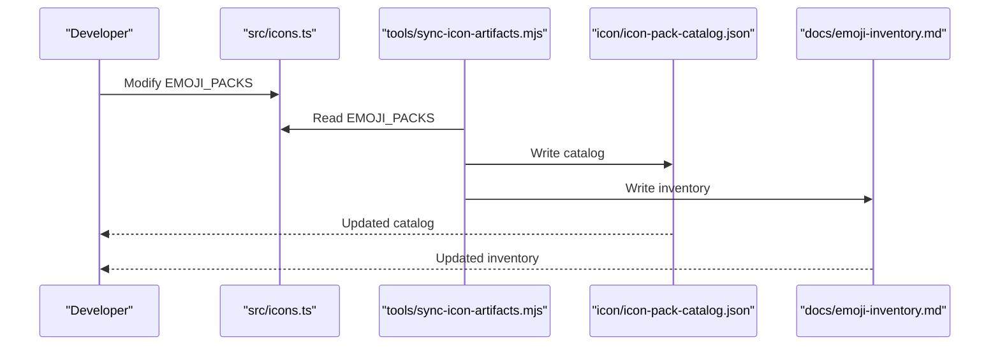
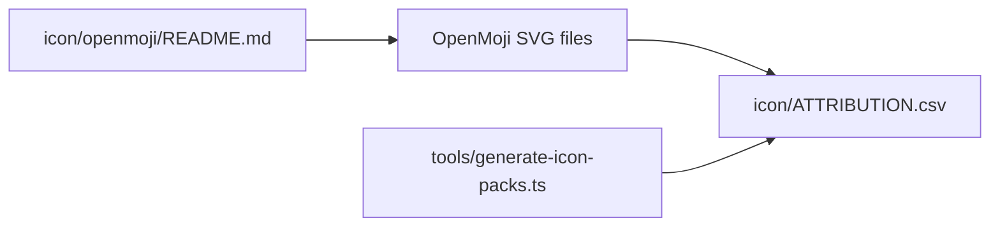
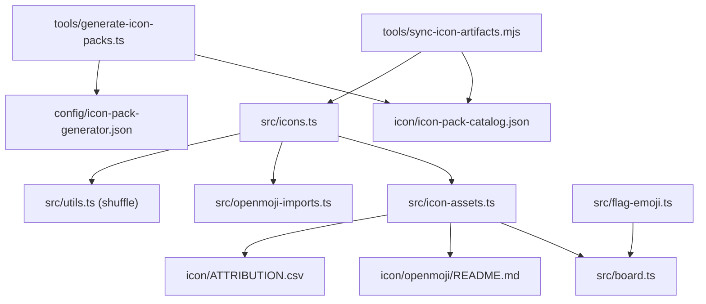

# Icon and Theme System

<cite>
**Referenced Files in This Document**
- [icons.ts](file://src/icons.ts)
- [icon-assets.ts](file://src/icon-assets.ts)
- [openmoji-imports.ts](file://src/openmoji-imports.ts)
- [flag-emoji.ts](file://src/flag-emoji.ts)
- [board.ts](file://src/board.ts)
- [icon-pack-catalog.json](file://icon/icon-pack-catalog.json)
- [icon-pack-generator.json](file://config/icon-pack-generator.json)
- [ATTRIBUTION.csv](file://icon/ATTRIBUTION.csv)
- [ICON_SOURCES.md](file://icon/ICON_SOURCES.md)
- [README.md (OpenMoji)](file://icon/openmoji/README.md)
- [generate-icon-packs.ts](file://tools/generate-icon-packs.ts)
- [sync-icon-artifacts.mjs](file://tools/sync-icon-artifacts.mjs)
- [icons.test.ts](file://tests/icons.test.ts)
- [icon-assets.test.ts](file://tests/icon-assets.test.ts)
- [flag-emoji.test.ts](file://tests/flag-emoji.test.ts)
- [icon-sync.test.ts](file://tests/icon-sync.test.ts)
</cite>

## Table of Contents
1. [Introduction](#introduction)
2. [Project Structure](#project-structure)
3. [Core Components](#core-components)
4. [Architecture Overview](#architecture-overview)
5. [Detailed Component Analysis](#detailed-component-analysis)
6. [Dependency Analysis](#dependency-analysis)
7. [Performance Considerations](#performance-considerations)
8. [Troubleshooting Guide](#troubleshooting-guide)
9. [Conclusion](#conclusion)
10. [Appendices](#appendices)

## Introduction
This document explains the icon and theme system with a focus on dynamic emoji-based icon packs and visual theming. It covers the icon deck generation algorithm, OpenMoji SVG asset integration, theme switching mechanisms, the icon pack catalog system, flag emoji CDN integration, and attribution management. It also documents icon loading, caching strategies, performance optimizations for large icon sets, practical examples for creating custom icon packs and integrating new emoji sources, maintaining visual consistency, the relationship between icon themes and game board layout, accessibility considerations, and troubleshooting common icon loading issues.

## Project Structure
The icon and theme system spans several modules:
- Icon definitions and deck generation live in the icons module.
- OpenMoji SVG assets and their definitions are integrated via dedicated modules.
- Flag emoji rendering uses a CDN URL builder with configurable base URLs.
- The board view renders tiles with lazy-loading and caching of back-face icons.
- Tooling automates catalog synchronization and asset generation.

**Diagram sources**
- [icons.ts:1-726](file://src/icons.ts#L1-L726)
- [icon-assets.ts:1-189](file://src/icon-assets.ts#L1-L189)
- [flag-emoji.ts:1-161](file://src/flag-emoji.ts#L1-L161)
- [board.ts:1-523](file://src/board.ts#L1-L523)
- [icon-pack-catalog.json:1-474](file://icon/icon-pack-catalog.json#L1-L474)
- [icon/openmoji/README.md:1-17](file://icon/openmoji/README.md#L1-L17)
- [ATTRIBUTION.csv:1-42](file://icon/ATTRIBUTION.csv#L1-L42)
- [icon-pack-generator.json:1-67](file://config/icon-pack-generator.json#L1-L67)
- [generate-icon-packs.ts:1-474](file://tools/generate-icon-packs.ts#L1-L474)
- [sync-icon-artifacts.mjs:1-142](file://tools/sync-icon-artifacts.mjs#L1-L142)

**Section sources**
- [icons.ts:1-726](file://src/icons.ts#L1-L726)
- [icon-assets.ts:1-189](file://src/icon-assets.ts#L1-L189)
- [flag-emoji.ts:1-161](file://src/flag-emoji.ts#L1-L161)
- [board.ts:1-523](file://src/board.ts#L1-L523)
- [icon-pack-catalog.json:1-474](file://icon/icon-pack-catalog.json#L1-L474)
- [icon/openmoji/README.md:1-17](file://icon/openmoji/README.md#L1-L17)
- [ATTRIBUTION.csv:1-42](file://icon/ATTRIBUTION.csv#L1-L42)
- [icon-pack-generator.json:1-67](file://config/icon-pack-generator.json#L1-L67)
- [generate-icon-packs.ts:1-474](file://tools/generate-icon-packs.ts#L1-L474)
- [sync-icon-artifacts.mjs:1-142](file://tools/sync-icon-artifacts.mjs#L1-L142)

## Core Components
- Icon pack definitions and validation:
  - Defines emoji packs with unique IDs, names, preview icons, and icon arrays.
  - Enforces uniqueness within and across packs and a minimum icon count per pack.
  - Provides APIs to list packs, compute active/inactive imported OpenMoji tokens, and generate decks.
- OpenMoji asset integration:
  - Maintains a registry of SVG asset definitions and resolves tokens to asset paths.
  - Supports dynamic fallback resolution for unknown OpenMoji tokens.
- Flag emoji CDN integration:
  - Parses regional indicator flag emojis and generates Twemoji CDN URLs.
  - Allows runtime configuration of the CDN base URL.
- Board rendering and caching:
  - Renders tile back-faces lazily and caches rendered icons to avoid repeated work.
  - Handles flag images with accessible alt text and aria attributes.
- Tooling:
  - Generates icon packs from curated sources and metadata.
  - Synchronizes catalogs and inventory documentation.

**Section sources**
- [icons.ts:17-528](file://src/icons.ts#L17-L528)
- [icon-assets.ts:1-189](file://src/icon-assets.ts#L1-L189)
- [openmoji-imports.ts:1-199](file://src/openmoji-imports.ts#L1-L199)
- [flag-emoji.ts:1-161](file://src/flag-emoji.ts#L1-L161)
- [board.ts:74-119](file://src/board.ts#L74-L119)
- [generate-icon-packs.ts:1-474](file://tools/generate-icon-packs.ts#L1-L474)
- [sync-icon-artifacts.mjs:1-142](file://tools/sync-icon-artifacts.mjs#L1-L142)

## Architecture Overview
The system separates concerns across modules:
- Definitions and generation live in the icons module.
- Asset resolution and CDN logic are encapsulated in separate modules.
- Rendering logic is isolated in the board view, which depends on asset and flag modules.
- Tooling orchestrates catalog synchronization and asset generation.

**Diagram sources**
- [icons.ts:1-726](file://src/icons.ts#L1-L726)
- [icon-assets.ts:1-189](file://src/icon-assets.ts#L1-L189)
- [flag-emoji.ts:1-161](file://src/flag-emoji.ts#L1-L161)
- [board.ts:1-523](file://src/board.ts#L1-L523)
- [generate-icon-packs.ts:1-474](file://tools/generate-icon-packs.ts#L1-L474)
- [sync-icon-artifacts.mjs:1-142](file://tools/sync-icon-artifacts.mjs#L1-L142)
- [icon-pack-generator.json:1-67](file://config/icon-pack-generator.json#L1-L67)
- [icon-pack-catalog.json:1-474](file://icon/icon-pack-catalog.json#L1-L474)

## Detailed Component Analysis

### Icon Deck Generation Algorithm
The deck generator selects unique icons from a chosen pack, duplicates them per copy policy, and shuffles the resulting tiles. It ensures a minimum proportion of imported SVG assets and validates inputs rigorously.

**Diagram sources**
- [icons.ts:652-725](file://src/icons.ts#L652-L725)

**Section sources**
- [icons.ts:635-725](file://src/icons.ts#L635-L725)
- [icons.test.ts:321-398](file://tests/icons.test.ts#L321-L398)

### OpenMoji SVG Asset Integration
OpenMoji assets are tokenized and resolved to local SVG paths. A registry maps known tokens to asset definitions, with automatic fallback for unknown tokens. Imported tokens are tracked centrally.

**Diagram sources**
- [icon-assets.ts:1-189](file://src/icon-assets.ts#L1-L189)
- [openmoji-imports.ts:1-199](file://src/openmoji-imports.ts#L1-L199)

**Section sources**
- [icon-assets.ts:1-189](file://src/icon-assets.ts#L1-L189)
- [openmoji-imports.ts:1-199](file://src/openmoji-imports.ts#L1-L199)
- [ATTRIBUTION.csv:1-42](file://icon/ATTRIBUTION.csv#L1-L42)
- [ICON_SOURCES.md:1-28](file://icon/ICON_SOURCES.md#L1-L28)
- [README.md (OpenMoji):1-17](file://icon/openmoji/README.md#L1-L17)

### Flag Emoji CDN Integration
Flag emojis are parsed into country codes and mapped to human-readable names. The system constructs Twemoji CDN URLs using a configurable base URL and supports runtime overrides.

**Diagram sources**
- [flag-emoji.ts:137-153](file://src/flag-emoji.ts#L137-L153)
- [board.ts:94-118](file://src/board.ts#L94-L118)

**Section sources**
- [flag-emoji.ts:1-161](file://src/flag-emoji.ts#L1-L161)
- [board.ts:74-119](file://src/board.ts#L74-L119)
- [flag-emoji.test.ts:1-137](file://tests/flag-emoji.test.ts#L1-L137)

### Theme Switching Mechanisms
Themes are primarily represented by icon packs and their associated assets. The board view renders tiles using the current pack’s icons and assets. To switch themes:
- Select a new pack ID and regenerate the deck.
- Re-render the board, ensuring the back-face cache is reset to avoid stale icons.

Practical steps:
- Use the pack selection API to choose a new pack ID.
- Regenerate the deck with the desired size and copy policy.
- Clear the board’s back-face cache and re-render.

**Section sources**
- [icons.ts:613-633](file://src/icons.ts#L613-L633)
- [icons.ts:652-725](file://src/icons.ts#L652-L725)
- [board.ts:316-318](file://src/board.ts#L316-L318)

### Icon Pack Catalog System
The catalog is maintained in two places:
- A machine-readable JSON catalog for tooling and automation.
- An in-source TypeScript definition for compile-time guarantees and immediate availability.

Synchronization:
- A sync script reads the source pack definitions and writes the JSON catalog and an inventory document.
- Tests verify that the JSON catalog matches the source definitions.

**Diagram sources**
- [sync-icon-artifacts.mjs:126-142](file://tools/sync-icon-artifacts.mjs#L126-L142)
- [icons.ts:56-528](file://src/icons.ts#L56-L528)
- [icon-sync.test.ts:8-26](file://tests/icon-sync.test.ts#L8-L26)

**Section sources**
- [icon-pack-catalog.json:1-474](file://icon/icon-pack-catalog.json#L1-L474)
- [icons.ts:56-528](file://src/icons.ts#L56-L528)
- [sync-icon-artifacts.mjs:1-142](file://tools/sync-icon-artifacts.mjs#L1-L142)
- [icon-sync.test.ts:8-26](file://tests/icon-sync.test.ts#L8-L26)

### Attribution Management
Attribution is managed via a CSV file that records imported assets. The generator tool writes attributions for generated assets, and the OpenMoji README documents import rules.

**Diagram sources**
- [ATTRIBUTION.csv:1-42](file://icon/ATTRIBUTION.csv#L1-L42)
- [generate-icon-packs.ts:328-349](file://tools/generate-icon-packs.ts#L328-L349)
- [README.md (OpenMoji):1-17](file://icon/openmoji/README.md#L1-L17)

**Section sources**
- [ATTRIBUTION.csv:1-42](file://icon/ATTRIBUTION.csv#L1-L42)
- [ICON_SOURCES.md:1-28](file://icon/ICON_SOURCES.md#L1-L28)
- [README.md (OpenMoji):1-17](file://icon/openmoji/README.md#L1-L17)
- [generate-icon-packs.ts:328-349](file://tools/generate-icon-packs.ts#L328-L349)

### Practical Examples

- Creating a custom icon pack:
  - Extend the source pack definitions with a new pack ID, name, preview icon, and icon list.
  - Ensure the icon list contains at least the minimum required unique icons.
  - Run the sync tool to update the JSON catalog and inventory.
  - Reference the pack by ID when generating decks.

  **Section sources**
  - [icons.ts:56-528](file://src/icons.ts#L56-L528)
  - [sync-icon-artifacts.mjs:126-142](file://tools/sync-icon-artifacts.mjs#L126-L142)

- Integrating new emoji sources:
  - Configure the generator with a new source entry (metadata URL, SVG base URL, output directory).
  - Define keywords for the target pack to guide asset selection.
  - Optionally auto-download assets and update the asset registry and attribution CSV.

  **Section sources**
  - [icon-pack-generator.json:10-31](file://config/icon-pack-generator.json#L10-L31)
  - [generate-icon-packs.ts:138-150](file://tools/generate-icon-packs.ts#L138-L150)
  - [generate-icon-packs.ts:201-242](file://tools/generate-icon-packs.ts#L201-L242)
  - [generate-icon-packs.ts:312-326](file://tools/generate-icon-packs.ts#L312-L326)
  - [generate-icon-packs.ts:426-459](file://tools/generate-icon-packs.ts#L426-L459)

- Maintaining visual consistency:
  - Use curated keywords to select assets aligned with the pack theme.
  - Maintain a balanced ratio of emoji to SVG assets.
  - Avoid anti-clusters and visually similar icons that reduce distinguishability.

  **Section sources**
  - [icon-pack-generator.json:6-8](file://config/icon-pack-generator.json#L6-L8)
  - [icons.ts:696-716](file://src/icons.ts#L696-L716)
  - [icons.test.ts:276-294](file://tests/icons.test.ts#L276-L294)

### Relationship Between Icon Themes and Game Board Layout
The board view renders tiles using the current pack’s icons. It:
- Lazily renders back-face icons only when tiles are revealed or matched.
- Caches rendered back faces to avoid repeated DOM work and image fetches.
- Resets the cache when starting a new game to prevent stale icons from leaking between games.

These behaviors ensure that theme changes (different packs) are reflected immediately and efficiently.

**Section sources**
- [board.ts:227-306](file://src/board.ts#L227-L306)
- [board.ts:316-318](file://src/board.ts#L316-L318)

### Accessibility Considerations for Icon Visibility
Accessibility is addressed during rendering:
- Flag images receive an accessible alt text derived from country names or a fallback.
- All tile faces are marked aria-hidden to avoid polluting the accessibility tree; accessibility is provided by the tile button’s aria-label.
- Images are marked aria-hidden=false to ensure assistive technologies can interpret the image content when needed.

**Section sources**
- [board.ts:74-119](file://src/board.ts#L74-L119)
- [board.ts:360-383](file://src/board.ts#L360-L383)
- [flag-emoji.ts:111-118](file://src/flag-emoji.ts#L111-L118)

## Dependency Analysis
The following diagram shows key dependencies among modules:

**Diagram sources**
- [icons.ts:1-726](file://src/icons.ts#L1-L726)
- [openmoji-imports.ts:1-199](file://src/openmoji-imports.ts#L1-L199)
- [icon-assets.ts:1-189](file://src/icon-assets.ts#L1-L189)
- [flag-emoji.ts:1-161](file://src/flag-emoji.ts#L1-L161)
- [board.ts:1-523](file://src/board.ts#L1-L523)
- [generate-icon-packs.ts:1-474](file://tools/generate-icon-packs.ts#L1-L474)
- [sync-icon-artifacts.mjs:1-142](file://tools/sync-icon-artifacts.mjs#L1-L142)
- [icon-pack-generator.json:1-67](file://config/icon-pack-generator.json#L1-L67)
- [icon-pack-catalog.json:1-474](file://icon/icon-pack-catalog.json#L1-L474)
- [ATTRIBUTION.csv:1-42](file://icon/ATTRIBUTION.csv#L1-L42)
- [README.md (OpenMoji):1-17](file://icon/openmoji/README.md#L1-L17)

**Section sources**
- [icons.ts:1-726](file://src/icons.ts#L1-L726)
- [icon-assets.ts:1-189](file://src/icon-assets.ts#L1-L189)
- [flag-emoji.ts:1-161](file://src/flag-emoji.ts#L1-L161)
- [board.ts:1-523](file://src/board.ts#L1-L523)
- [generate-icon-packs.ts:1-474](file://tools/generate-icon-packs.ts#L1-L474)
- [sync-icon-artifacts.mjs:1-142](file://tools/sync-icon-artifacts.mjs#L1-L142)

## Performance Considerations
- Lazy rendering of back-face icons:
  - Back faces are rendered only when tiles are revealed or matched, minimizing DOM work and image fetches.
- Back-face cache:
  - A WeakSet tracks rendered back faces to avoid re-rendering on subsequent passes.
- Shuffling strategy:
  - Uses a seeded random source in tools and a standard shuffle utility in runtime to ensure reproducibility and performance.
- Asset resolution:
  - Token-based resolution avoids repeated parsing and reduces branching in rendering.
- CDN usage for flags:
  - Offloads image delivery to a CDN, improving perceived performance and scalability.

[No sources needed since this section provides general guidance]

## Troubleshooting Guide
Common issues and resolutions:
- Not enough unique icons in a pack:
  - The deck generator validates pack sizes and throws an error if the requested count exceeds available icons. Increase the pack size or adjust the requested count.

  **Section sources**
  - [icons.ts:676-693](file://src/icons.ts#L676-L693)
  - [icons.test.ts:370-377](file://tests/icons.test.ts#L370-L377)

- Duplicate icons within or across packs:
  - Validation routines detect duplicates and throw errors with details. Ensure each pack and the global set maintains unique icons.

  **Section sources**
  - [icons.ts:541-568](file://src/icons.ts#L541-L568)
  - [icons.test.ts:47-86](file://tests/icons.test.ts#L47-L86)

- Missing default pack:
  - If the default pack is missing, the generator falls back to it; otherwise, an error is thrown. Ensure the default pack exists.

  **Section sources**
  - [icons.ts:624-632](file://src/icons.ts#L624-L632)

- Flag emoji rendering failures:
  - If a flag emoji is invalid or the CDN base URL is misconfigured, rendering returns null. Verify the flag emoji composition and set a valid CDN base URL.

  **Section sources**
  - [flag-emoji.ts:137-153](file://src/flag-emoji.ts#L137-L153)
  - [flag-emoji.test.ts:23-27](file://tests/flag-emoji.test.ts#L23-L27)
  - [flag-emoji.test.ts:93-103](file://tests/flag-emoji.test.ts#L93-L103)

- Stale icons after theme change:
  - The board caches rendered back faces. Reset the cache at the start of a new game to prevent stale icons from leaking.

  **Section sources**
  - [board.ts:316-318](file://src/board.ts#L316-L318)

- Asset token resolution issues:
  - For unknown OpenMoji tokens, the resolver falls back to constructing a path from the token. Ensure the token format is correct and the asset exists.

  **Section sources**
  - [icon-assets.ts:174-184](file://src/icon-assets.ts#L174-L184)
  - [icon-assets.test.ts:17-24](file://tests/icon-assets.test.ts#L17-L24)

## Conclusion
The icon and theme system combines curated emoji packs, tokenized OpenMoji assets, and a robust deck generation algorithm. It integrates flag emoji rendering via a CDN, supports theme switching through pack selection, and employs lazy rendering and caching for performance. Tooling automates catalog synchronization and asset generation while enforcing quality policies and attribution compliance.

[No sources needed since this section summarizes without analyzing specific files]

## Appendices

### API and Data Model Summary

- Icon pack definitions:
  - Fields: id, name, previewIcon, icons.
  - Validation: uniqueness within and across packs, minimum icon count.

  **Section sources**
  - [icons.ts:17-528](file://src/icons.ts#L17-L528)
  - [icons.test.ts:88-149](file://tests/icons.test.ts#L88-L149)

- Asset token resolution:
  - Known tokens: resolved from a registry.
  - Unknown tokens: constructed from the OpenMoji prefix and code.

  **Section sources**
  - [icon-assets.ts:167-184](file://src/icon-assets.ts#L167-L184)
  - [icon-assets.test.ts:10-29](file://tests/icon-assets.test.ts#L10-L29)

- Flag emoji URL construction:
  - Validates two regional indicators, extracts hex code points, and builds a CDN URL.

  **Section sources**
  - [flag-emoji.ts:137-153](file://src/flag-emoji.ts#L137-L153)
  - [flag-emoji.test.ts:33-47](file://tests/flag-emoji.test.ts#L33-L47)

- Deck generation parameters:
  - uniqueIconCount: number of unique icons to include.
  - packId: target pack ID (defaults to a predefined ID).
  - copiesPerIcon: uniform or per-icon copy counts.

  **Section sources**
  - [icons.ts:652-656](file://src/icons.ts#L652-L656)
  - [icons.test.ts:321-368](file://tests/icons.test.ts#L321-L368)