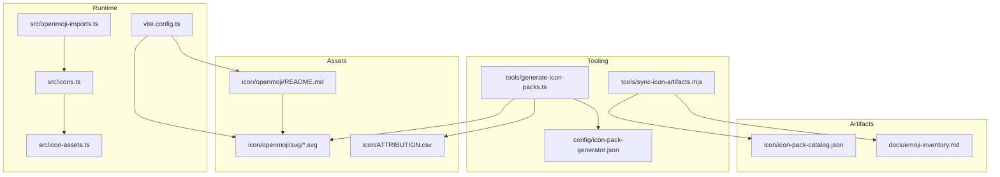
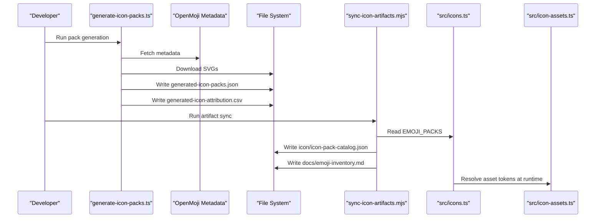
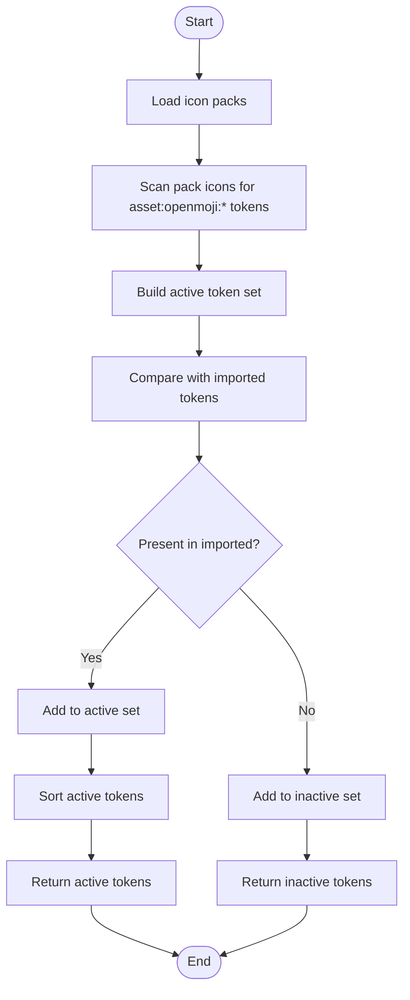
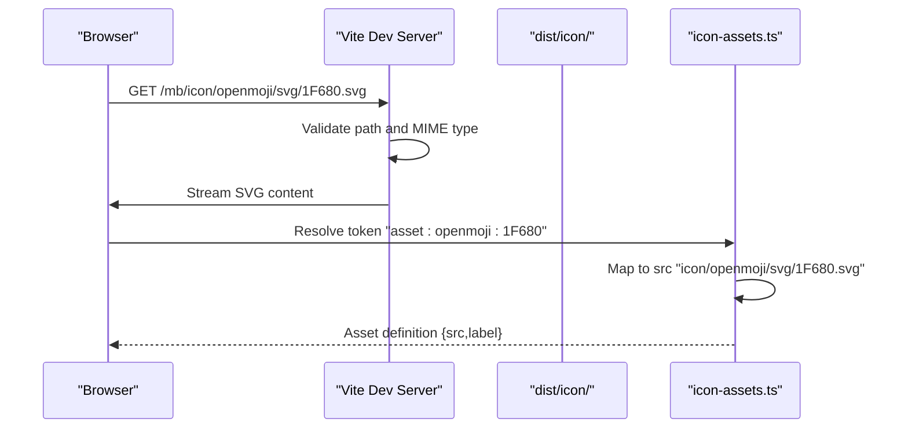
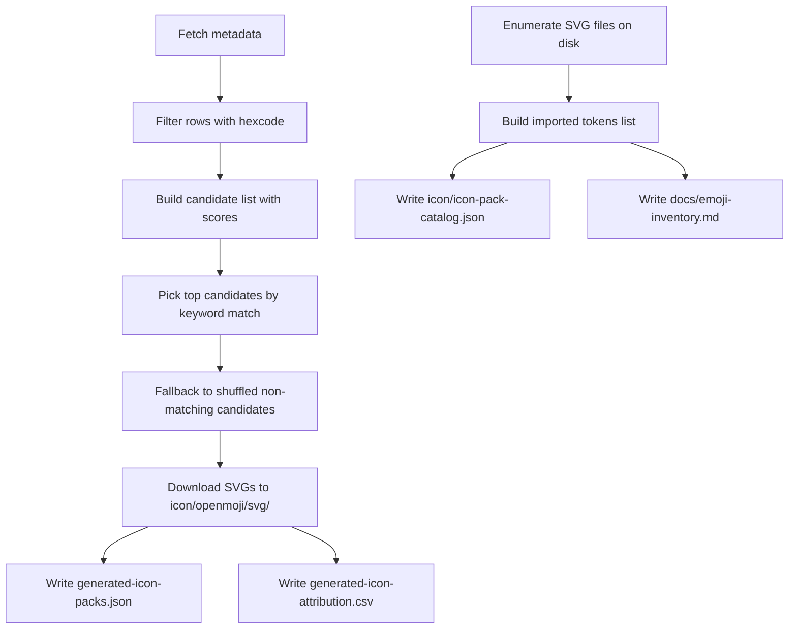
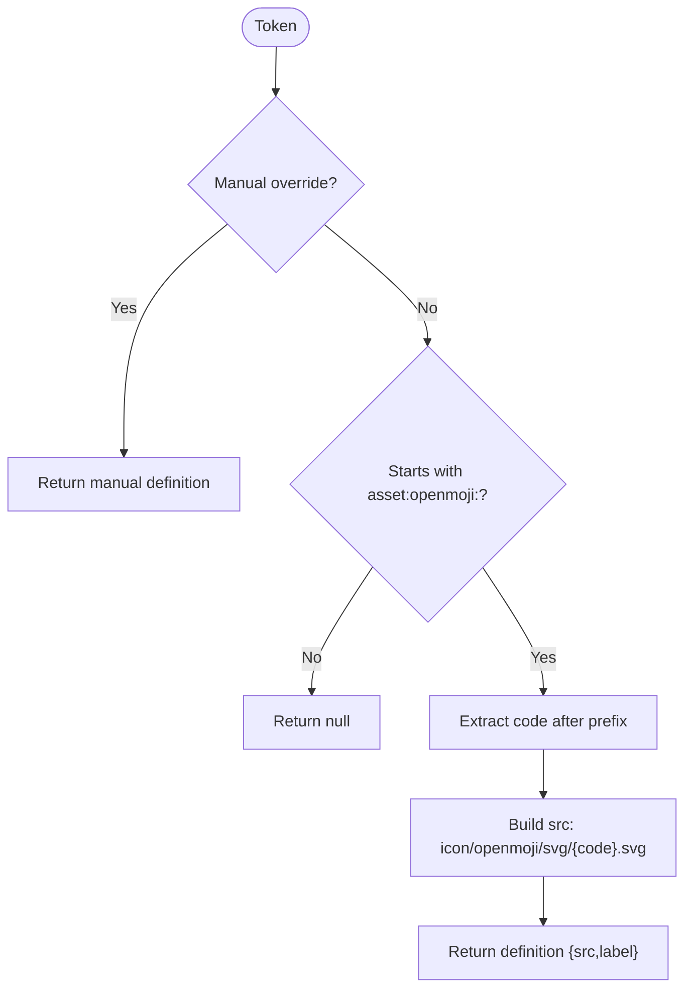
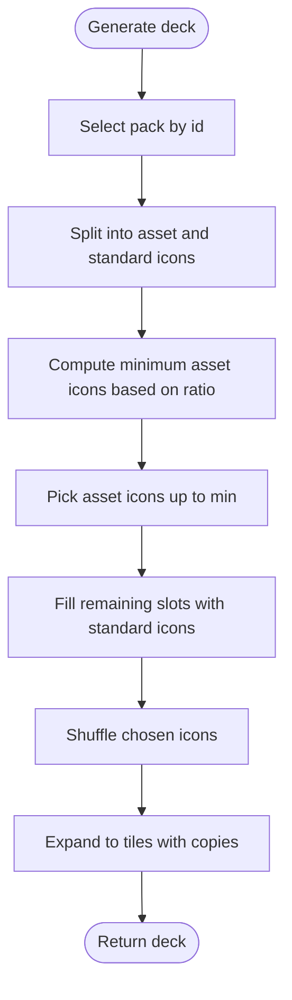
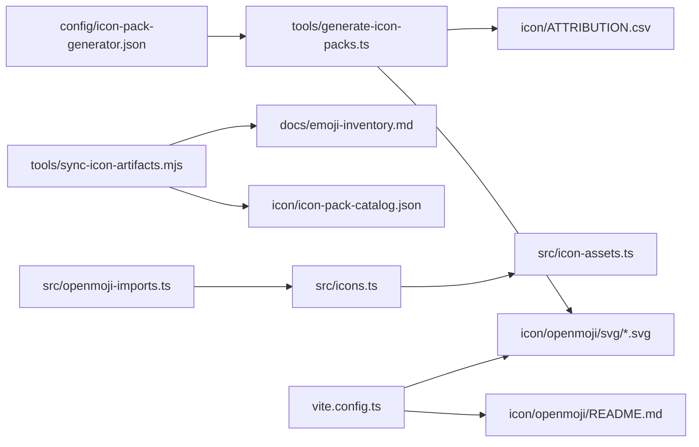

# OpenMoji SVG Integration

<cite>
**Referenced Files in This Document**
- [openmoji-imports.ts](file://src/openmoji-imports.ts)
- [icons.ts](file://src/icons.ts)
- [icon-assets.ts](file://src/icon-assets.ts)
- [icon-pack-catalog.json](file://icon/icon-pack-catalog.json)
- [README.md](file://icon/openmoji/README.md)
- [ATTRIBUTION.csv](file://icon/ATTRIBUTION.csv)
- [vite.config.ts](file://vite.config.ts)
- [generate-icon-packs.ts](file://tools/generate-icon-packs.ts)
- [sync-icon-artifacts.mjs](file://tools/sync-icon-artifacts.mjs)
- [icon-pack-generator.json](file://config/icon-pack-generator.json)
- [emoji-inventory.md](file://docs/emoji-inventory.md)
- [package.json](file://package.json)
</cite>

## Table of Contents
1. [Introduction](#introduction)
2. [Project Structure](#project-structure)
3. [Core Components](#core-components)
4. [Architecture Overview](#architecture-overview)
5. [Detailed Component Analysis](#detailed-component-analysis)
6. [Dependency Analysis](#dependency-analysis)
7. [Performance Considerations](#performance-considerations)
8. [Troubleshooting Guide](#troubleshooting-guide)
9. [Conclusion](#conclusion)
10. [Appendices](#appendices)

## Introduction
This document explains the OpenMoji SVG asset integration system used by the project. It covers how imported OpenMoji icons are represented as asset tokens, how they are tracked and filtered, how the asset loading pipeline works, and how to add new assets while maintaining licensing compliance and performance. It also documents the asset token format, the import process from SVG files, and the functions used to track asset usage.

## Project Structure
The OpenMoji integration spans several areas:
- Source of truth for imported tokens and their set representation
- Icon pack catalogs that reference asset tokens
- Tooling to generate packs and synchronize artifacts
- Build-time asset copying and development server routing
- Runtime asset resolution and validation

**Diagram sources**
- [generate-icon-packs.ts:351-474](file://tools/generate-icon-packs.ts#L351-L474)
- [sync-icon-artifacts.mjs:126-142](file://tools/sync-icon-artifacts.mjs#L126-L142)
- [icon-pack-generator.json:1-67](file://config/icon-pack-generator.json#L1-L67)
- [README.md:1-17](file://icon/openmoji/README.md#L1-L17)
- [openmoji-imports.ts:1-199](file://src/openmoji-imports.ts#L1-L199)
- [icons.ts:587-611](file://src/icons.ts#L587-L611)
- [icon-assets.ts:165-188](file://src/icon-assets.ts#L165-L188)
- [vite.config.ts:1-80](file://vite.config.ts#L1-L80)
- [icon-pack-catalog.json:1-474](file://icon/icon-pack-catalog.json#L1-L474)
- [emoji-inventory.md:137-158](file://docs/emoji-inventory.md#L137-L158)

**Section sources**
- [openmoji-imports.ts:1-199](file://src/openmoji-imports.ts#L1-L199)
- [icons.ts:587-611](file://src/icons.ts#L587-L611)
- [icon-assets.ts:165-188](file://src/icon-assets.ts#L165-L188)
- [README.md:1-17](file://icon/openmoji/README.md#L1-L17)
- [vite.config.ts:1-80](file://vite.config.ts#L1-L80)
- [generate-icon-packs.ts:351-474](file://tools/generate-icon-packs.ts#L351-L474)
- [sync-icon-artifacts.mjs:126-142](file://tools/sync-icon-artifacts.mjs#L126-L142)
- [icon-pack-generator.json:1-67](file://config/icon-pack-generator.json#L1-L67)
- [icon-pack-catalog.json:1-474](file://icon/icon-pack-catalog.json#L1-L474)
- [emoji-inventory.md:137-158](file://docs/emoji-inventory.md#L137-L158)

## Core Components
- IMPORTED_OPENMOJI_ICON_TOKENS: An ordered array of asset tokens representing imported OpenMoji SVGs.
- IMPORTED_OPENMOJI_ICON_TOKEN_SET: A Set built from the token array for fast membership checks.
- getActiveOpenmojiIconTokens(): Returns the subset of imported tokens actively used across icon packs, sorted.
- getInactiveImportedOpenmojiIconTokens(): Returns the subset of imported tokens not currently used.
- getIconAssetByToken(): Resolves an asset token to a runtime asset definition (src and label), including dynamic OpenMoji token handling.
- isIconAssetToken(): Predicate to check if a string is an asset token.
- Icon pack catalogs: JSON catalogs that enumerate icon tokens and emoji icons per category.

Key behaviors:
- Token format: asset:openmoji:<hexcode-or-combined-code>
- Dynamic resolution: tokens starting with asset:openmoji: are resolved to icon/openmoji/svg/<code>.svg
- Manual overrides: Some tokens have explicit entries in ICON_ASSET_DEFINITIONS for special handling

**Section sources**
- [openmoji-imports.ts:2-199](file://src/openmoji-imports.ts#L2-L199)
- [icons.ts:587-611](file://src/icons.ts#L587-L611)
- [icon-assets.ts:165-188](file://src/icon-assets.ts#L165-L188)
- [icon-pack-catalog.json:1-474](file://icon/icon-pack-catalog.json#L1-L474)

## Architecture Overview
The system integrates OpenMoji SVGs through a deterministic pipeline:
- Generation: Tools fetch metadata and SVGs, select candidates, and produce catalogs and attributions.
- Synchronization: Artifacts are written to the repository and consumed by runtime modules.
- Runtime: Tokens are validated, resolved to assets, and used to construct decks and render UI.

**Diagram sources**
- [generate-icon-packs.ts:351-474](file://tools/generate-icon-packs.ts#L351-L474)
- [sync-icon-artifacts.mjs:126-142](file://tools/sync-icon-artifacts.mjs#L126-L142)
- [icons.ts:587-611](file://src/icons.ts#L587-L611)
- [icon-assets.ts:165-188](file://src/icon-assets.ts#L165-L188)

## Detailed Component Analysis

### Asset Token Model and Tracking
- Token format: asset:openmoji:<hexcode-or-combined-code>
- Imported tokens are enumerated and exposed as a frozen array and a Set for efficient lookup.
- Active/inactive token discovery:
  - Active tokens are those present in any icon pack.
  - Inactive tokens are those imported but not currently used.
- Sorting ensures deterministic ordering for reproducibility.

**Diagram sources**
- [icons.ts:589-607](file://src/icons.ts#L589-L607)

**Section sources**
- [openmoji-imports.ts:2-199](file://src/openmoji-imports.ts#L2-L199)
- [icons.ts:589-607](file://src/icons.ts#L589-L607)

### Asset Loading Pipeline
- Development server routes icon requests under /mb/icon to the local icon directory with proper MIME type for SVG.
- Build process copies the entire icon tree into dist/icon for production delivery.
- At runtime, tokens are resolved to asset definitions; dynamic OpenMoji tokens are mapped to icon/openmoji/svg/<code>.svg.

**Diagram sources**
- [vite.config.ts:11-62](file://vite.config.ts#L11-L62)
- [icon-assets.ts:165-188](file://src/icon-assets.ts#L165-L188)

**Section sources**
- [vite.config.ts:11-62](file://vite.config.ts#L11-L62)
- [icon-assets.ts:165-188](file://src/icon-assets.ts#L165-L188)

### Import Process from SVG Files
- Tooling downloads SVGs from OpenMoji CDN based on metadata and writes them to icon/openmoji/svg/.
- Attribution CSV is generated for each imported asset.
- The sync script enumerates SVG files on disk and generates the list of imported tokens.

**Diagram sources**
- [generate-icon-packs.ts:177-326](file://tools/generate-icon-packs.ts#L177-L326)
- [sync-icon-artifacts.mjs:9-15](file://tools/sync-icon-artifacts.mjs#L9-L15)

**Section sources**
- [generate-icon-packs.ts:177-326](file://tools/generate-icon-packs.ts#L177-L326)
- [sync-icon-artifacts.mjs:9-15](file://tools/sync-icon-artifacts.mjs#L9-L15)
- [README.md:1-17](file://icon/openmoji/README.md#L1-L17)
- [ATTRIBUTION.csv:1-42](file://icon/ATTRIBUTION.csv#L1-L42)

### Asset Resolution and Validation
- getIconAssetByToken():
  - Checks for manual overrides in ICON_ASSET_DEFINITIONS.
  - For asset:openmoji:* tokens, constructs src dynamically from the code part.
  - Returns null for unrecognized tokens.
- isIconAssetToken(): Convenience predicate for token validation.

**Diagram sources**
- [icon-assets.ts:167-184](file://src/icon-assets.ts#L167-L184)

**Section sources**
- [icon-assets.ts:167-184](file://src/icon-assets.ts#L167-L184)

### Deck Composition and Asset Ratio
- The deck generator selects icons from packs, ensuring at least 50 unique icons per pack and enforcing a minimum of two copies per icon.
- It maintains a minimum ratio of imported assets to balance variety and performance.

**Diagram sources**
- [icons.ts:652-725](file://src/icons.ts#L652-L725)

**Section sources**
- [icons.ts:652-725](file://src/icons.ts#L652-L725)

## Dependency Analysis
- Tooling depends on:
  - OpenMoji metadata and SVG endpoints configured in the generator config.
  - Local filesystem for writing SVGs and attributions.
- Runtime depends on:
  - Generated catalogs and imported tokens lists.
  - Development server middleware for serving icons.
  - Asset resolver for dynamic token mapping.

**Diagram sources**
- [icon-pack-generator.json:1-67](file://config/icon-pack-generator.json#L1-L67)
- [generate-icon-packs.ts:351-474](file://tools/generate-icon-packs.ts#L351-L474)
- [sync-icon-artifacts.mjs:126-142](file://tools/sync-icon-artifacts.mjs#L126-L142)
- [openmoji-imports.ts:1-199](file://src/openmoji-imports.ts#L1-L199)
- [icons.ts:587-611](file://src/icons.ts#L587-L611)
- [icon-assets.ts:165-188](file://src/icon-assets.ts#L165-L188)
- [vite.config.ts:1-80](file://vite.config.ts#L1-L80)
- [README.md:1-17](file://icon/openmoji/README.md#L1-L17)

**Section sources**
- [icon-pack-generator.json:1-67](file://config/icon-pack-generator.json#L1-L67)
- [generate-icon-packs.ts:351-474](file://tools/generate-icon-packs.ts#L351-L474)
- [sync-icon-artifacts.mjs:126-142](file://tools/sync-icon-artifacts.mjs#L126-L142)
- [openmoji-imports.ts:1-199](file://src/openmoji-imports.ts#L1-L199)
- [icons.ts:587-611](file://src/icons.ts#L587-L611)
- [icon-assets.ts:165-188](file://src/icon-assets.ts#L165-L188)
- [vite.config.ts:1-80](file://vite.config.ts#L1-L80)
- [README.md:1-17](file://icon/openmoji/README.md#L1-L17)

## Performance Considerations
- Vector graphics advantages:
  - SVGs scale crisply at any size, reducing bandwidth compared to multiple raster sizes.
  - Smaller payload for a single scalable asset versus multiple PNG/JPEG variants.
  - Faster rendering on high-DPI displays.
- Optimization strategies:
  - Prefer minimal, clean SVGs from trusted sources.
  - Keep icon libraries curated to avoid excessive DOM complexity.
  - Serve via efficient static file delivery and caching.
- Browser compatibility:
  - Modern browsers widely support inline SVG rendering.
  - For older environments, ensure fallbacks to raster equivalents are available if needed.
- Deployment:
  - Base path /mb/ requires relative asset paths to avoid broken links in production builds.

[No sources needed since this section provides general guidance]

## Troubleshooting Guide
Common issues and resolutions:
- Missing or invalid asset token:
  - Verify the token format asset:openmoji:<hexcode>.
  - Confirm the corresponding SVG exists in icon/openmoji/svg/.
- Token not resolving at runtime:
  - Check that getIconAssetByToken returns a definition for the token.
  - Ensure the token appears in IMPORTED_OPENMOJI_ICON_TOKEN_SET if it is imported.
- Active/inactive token mismatch:
  - Recompute active tokens using getActiveOpenmojiIconTokens().
  - Regenerate catalogs and inventory via the sync script.
- Build-time asset not served:
  - Confirm the icon directory is copied to dist/icon during build.
  - Verify development server middleware handles /mb/icon requests.
- Licensing and attribution:
  - Ensure icon/ATTRIBUTION.csv includes entries for all imported assets.
  - Keep README.md consistent with import rules.

**Section sources**
- [icon-assets.ts:167-184](file://src/icon-assets.ts#L167-L184)
- [icons.ts:589-607](file://src/icons.ts#L589-L607)
- [sync-icon-artifacts.mjs:126-142](file://tools/sync-icon-artifacts.mjs#L126-L142)
- [vite.config.ts:11-62](file://vite.config.ts#L11-L62)
- [ATTRIBUTION.csv:1-42](file://icon/ATTRIBUTION.csv#L1-L42)

## Conclusion
The OpenMoji SVG integration system provides a robust, automated pipeline for importing, cataloging, and consuming vector icons. By using deterministic tokens, dynamic resolution, and tooling-driven synchronization, the system balances flexibility, maintainability, and performance. Adhering to the import rules and licensing requirements ensures long-term sustainability and cross-browser compatibility.

[No sources needed since this section summarizes without analyzing specific files]

## Appendices

### Adding New OpenMoji Assets
Steps:
1. Place SVG files directly in icon/openmoji/svg/.
2. Update icon/ATTRIBUTION.csv with entries for the new assets.
3. Run the artifact sync to regenerate catalogs and inventory.
4. Reference the new asset token in icon packs as asset:openmoji:<hexcode>.

Verification:
- Confirm the token appears in the imported tokens list.
- Verify getIconAssetByToken resolves to the correct src.
- Ensure the asset renders correctly in the UI.

**Section sources**
- [README.md:11-17](file://icon/openmoji/README.md#L11-L17)
- [ATTRIBUTION.csv:1-42](file://icon/ATTRIBUTION.csv#L1-L42)
- [sync-icon-artifacts.mjs:126-142](file://tools/sync-icon-artifacts.mjs#L126-L142)
- [icon-assets.ts:167-184](file://src/icon-assets.ts#L167-L184)

### Managing Asset Dependencies
- Keep imported tokens aligned with icon packs to minimize unused assets.
- Use getInactiveImportedOpenmojiIconTokens() to identify assets that can be removed.
- Maintain icon-pack-catalog.json and docs/emoji-inventory.md in sync with src/icons.ts.

**Section sources**
- [icons.ts:603-607](file://src/icons.ts#L603-L607)
- [sync-icon-artifacts.mjs:63-124](file://tools/sync-icon-artifacts.mjs#L63-L124)

### Browser Compatibility and Fallbacks
- Inline SVG rendering is broadly supported; ensure base path /mb/ is respected.
- For legacy environments, consider providing raster fallbacks and testing across target browsers.
- Validate rendering consistency across devices and DPI settings.

[No sources needed since this section provides general guidance]