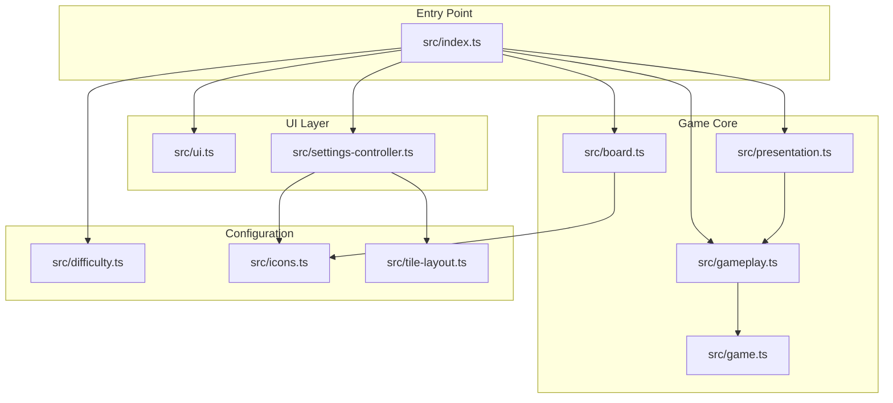
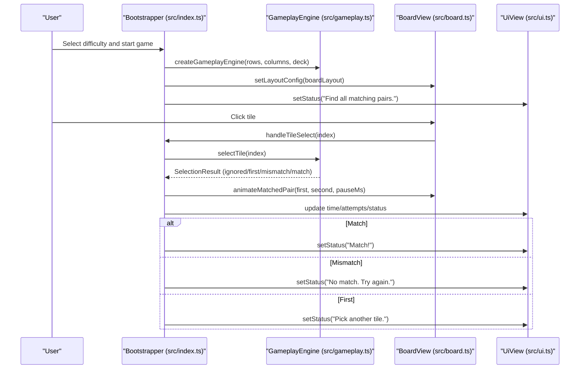
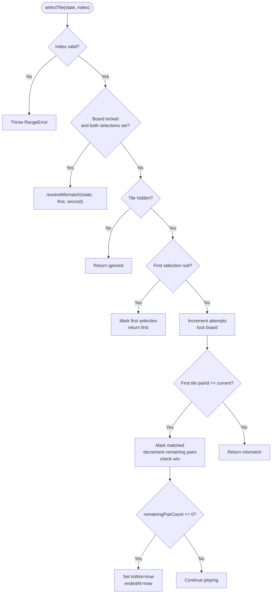
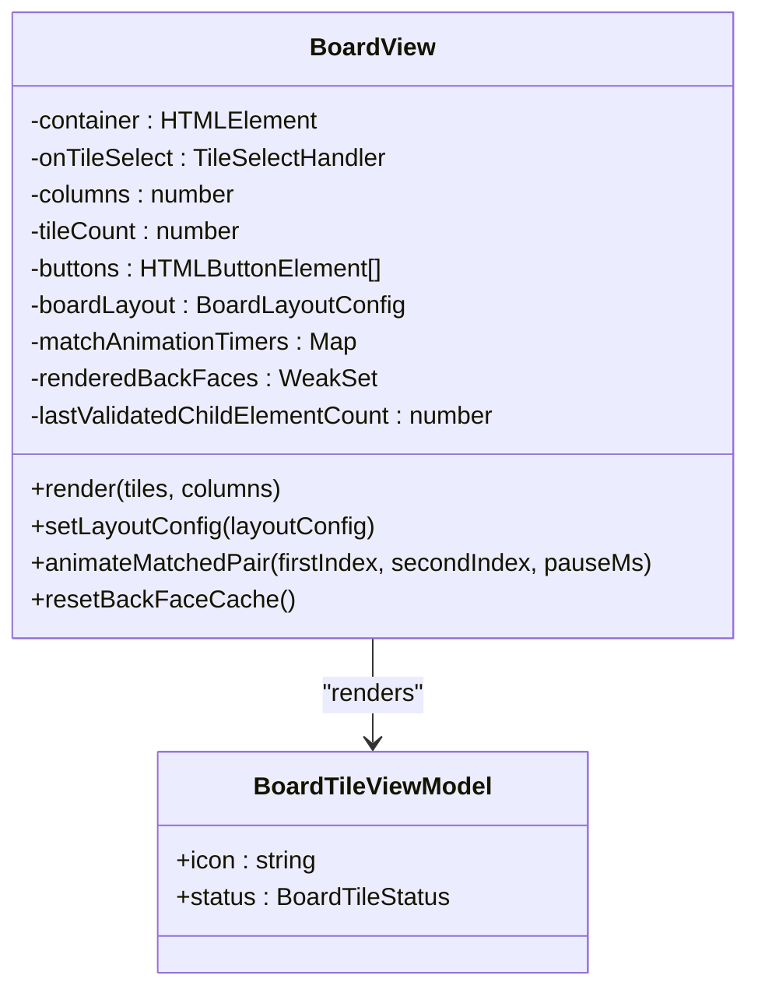
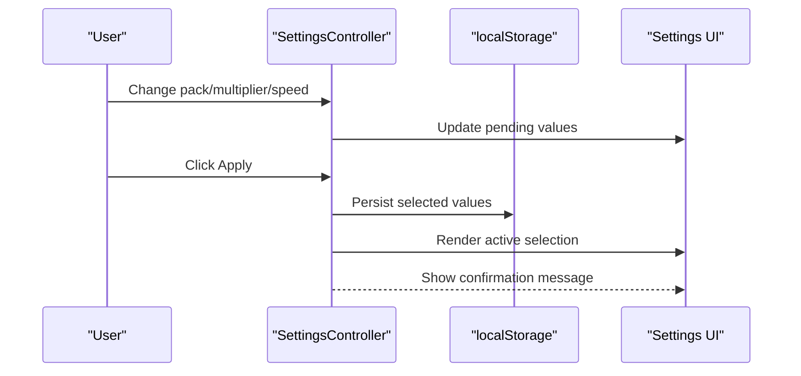
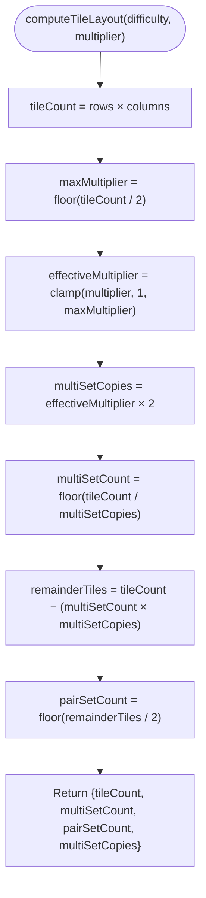
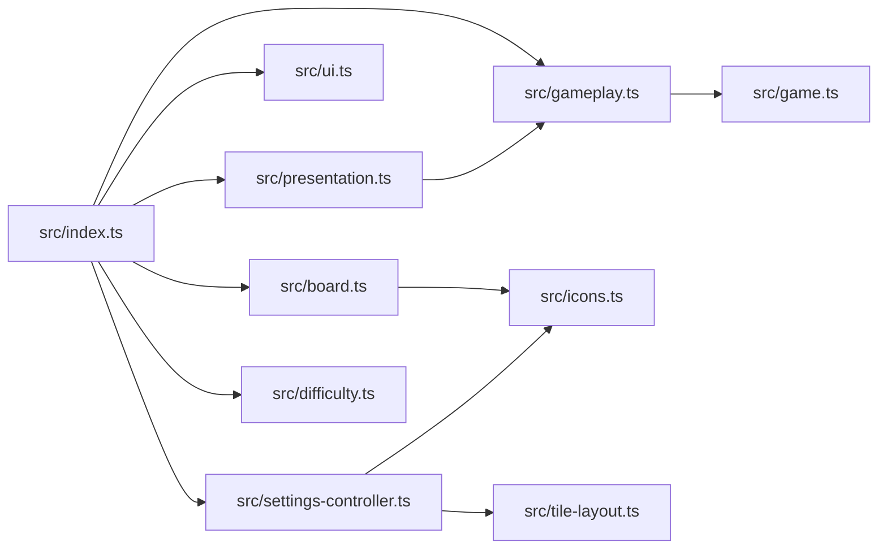

# Project Overview

<cite>
**Referenced Files in This Document**
- [README.md](file://README.md)
- [package.json](file://package.json)
- [index.html](file://index.html)
- [src/index.ts](file://src/index.ts)
- [src/game.ts](file://src/game.ts)
- [src/gameplay.ts](file://src/gameplay.ts)
- [src/board.ts](file://src/board.ts)
- [src/difficulty.ts](file://src/difficulty.ts)
- [src/icons.ts](file://src/icons.ts)
- [src/tile-layout.ts](file://src/tile-layout.ts)
- [src/ui.ts](file://src/ui.ts)
- [src/presentation.ts](file://src/presentation.ts)
- [src/settings-controller.ts](file://src/settings-controller.ts)
</cite>

## Table of Contents
1. [Introduction](#introduction)
2. [Project Structure](#project-structure)
3. [Core Components](#core-components)
4. [Architecture Overview](#architecture-overview)
5. [Detailed Component Analysis](#detailed-component-analysis)
6. [Dependency Analysis](#dependency-analysis)
7. [Performance Considerations](#performance-considerations)
8. [Troubleshooting Guide](#troubleshooting-guide)
9. [Conclusion](#conclusion)

## Introduction
MemoryBlox is a browser-based recreation of the classic Windows 9x MEMORYBLOX game, implemented with modern HTML, CSS, and TypeScript without any external frameworks. The project brings nostalgic tile-matching gameplay to contemporary browsers while leveraging vanilla DOM APIs and a clean, modular architecture.

Key goals:
- Faithful recreation of the original tile-matching experience with modern visuals and interactions
- Playable memory boards with multiple difficulty levels (5×6, 5×8 [default], 5×10)
- Dynamic emoji-based icon decks generated at runtime using curated emoji icon packs
- Configurable gameplay features: tile multiplier (1×–3×), animation speed (1×–3×), and themeable icon packs
- Complete game lifecycle: timer, attempts counter, restart capability, and win celebration
- Leaderboard integration with persistent scoring and cross-device sharing
- Accessibility-first UI with keyboard navigation and screen reader support

Target audience:
- Nostalgic players seeking a faithful recreation of the Windows 9x game
- Developers interested in a framework-free, modular implementation of a classic puzzle game
- Educators and learners exploring vanilla DOM manipulation, TypeScript, and game state management

## Project Structure
The project follows a layered, feature-oriented structure with clear separation between bootstrapping, game logic, rendering, and UI concerns. The entry point initializes controllers and wires DOM interactions, while dedicated modules encapsulate gameplay rules, board rendering, and presentation logic.

**Diagram sources**
- [src/index.ts:1-120](file://src/index.ts#L1-L120)
- [src/game.ts:1-60](file://src/game.ts#L1-L60)
- [src/gameplay.ts:1-40](file://src/gameplay.ts#L1-L40)
- [src/board.ts:1-60](file://src/board.ts#L1-L60)
- [src/ui.ts:1-49](file://src/ui.ts#L1-L49)
- [src/presentation.ts:1-25](file://src/presentation.ts#L1-L25)
- [src/settings-controller.ts:1-60](file://src/settings-controller.ts#L1-L60)
- [src/difficulty.ts:1-40](file://src/difficulty.ts#L1-L40)
- [src/icons.ts:1-60](file://src/icons.ts#L1-L60)
- [src/tile-layout.ts:1-30](file://src/tile-layout.ts#L1-L30)

**Section sources**
- [README.md:162-206](file://README.md#L162-L206)
- [package.json:1-1](file://package.json#L1-L1)
- [index.html:1-196](file://index.html#L1-L196)

## Core Components
- Bootstrapper and game loop wiring: Initializes controllers, manages frames, orchestrates gameplay events, and coordinates UI updates.
- Game state and matching rules: Encapsulates tile matching logic, win conditions, and state transitions.
- Gameplay engine facade: Provides a typed interface over game state for the bootstrap layer.
- Board rendering and tile input handling: Renders tiles with 3D block visuals, handles click and keyboard interactions, and animates tile reveals/matches.
- HUD and status messaging: Updates timer, attempts, and status messages.
- Dynamic icon deck generation: Builds shuffled decks from curated emoji icon packs with configurable tile multipliers.
- Settings controller: Manages emoji packs, tile multiplier, and animation speed with persisted preferences.
- Difficulty presets: Defines board sizes and score multipliers for Easy, Normal, and Hard modes.

Practical examples:
- Tile matching: Select two tiles to reveal their icons; if they match, they disappear and the game updates the HUD.
- Difficulty levels: Choose Easy (5×6), Normal (5×8), or Hard (5×10) to adjust board size and challenge.
- Emoji icon packs: Switch between themed packs (e.g., Space & Astronomy, Food & Drinks) for visual variety.
- Tile multiplier: Increase tile density to create more challenging decks with repeated icons.
- Animation speed: Adjust animation speed to 1×, 2×, or 3× for faster or slower tile reveals and matches.

**Section sources**
- [src/index.ts:586-622](file://src/index.ts#L586-L622)
- [src/game.ts:159-243](file://src/game.ts#L159-L243)
- [src/gameplay.ts:28-41](file://src/gameplay.ts#L28-L41)
- [src/board.ts:227-306](file://src/board.ts#L227-L306)
- [src/ui.ts:15-49](file://src/ui.ts#L15-L49)
- [src/icons.ts:652-725](file://src/icons.ts#L652-L725)
- [src/settings-controller.ts:33-138](file://src/settings-controller.ts#L33-L138)
- [src/difficulty.ts:17-21](file://src/difficulty.ts#L17-L21)

## Architecture Overview
The application uses a controller-centric architecture with a strict separation between display views and event wiring. Controllers manage state and orchestrate interactions, while views are display-only and receive updates from controllers.

**Diagram sources**
- [src/index.ts:639-779](file://src/index.ts#L639-L779)
- [src/gameplay.ts:101-107](file://src/gameplay.ts#L101-L107)
- [src/board.ts:331-354](file://src/board.ts#L331-L354)
- [src/ui.ts:37-47](file://src/ui.ts#L37-L47)

## Detailed Component Analysis

### Game State and Matching Rules
The core game logic resides in a pure state machine with explicit selection handling and win detection. The state tracks tiles, attempts, matches, and win conditions, while providing deterministic selection outcomes.

**Diagram sources**
- [src/game.ts:159-243](file://src/game.ts#L159-L243)
- [src/game.ts:245-264](file://src/game.ts#L245-L264)
- [src/game.ts:289-299](file://src/game.ts#L289-L299)

**Section sources**
- [src/game.ts:1-42](file://src/game.ts#L1-L42)
- [src/game.ts:159-243](file://src/game.ts#L159-L243)
- [src/game.ts:245-264](file://src/game.ts#L245-L264)
- [src/game.ts:289-299](file://src/game.ts#L289-L299)

### Board Rendering and Tile Interaction
The board view renders tiles as 3D blocks with front/back faces, lazily rendering back-face icons only when revealed or matched. It supports click and keyboard navigation, maintains accessibility attributes, and animates matched pairs.

**Diagram sources**
- [src/board.ts:121-523](file://src/board.ts#L121-L523)

**Section sources**
- [src/board.ts:121-523](file://src/board.ts#L121-L523)

### Settings Controller and Emoji Packs
The settings controller manages persisted preferences for emoji packs, tile multiplier, and animation speed. It provides a two-phase commit pattern to preview changes before applying them.

**Diagram sources**
- [src/settings-controller.ts:33-138](file://src/settings-controller.ts#L33-L138)
- [src/settings-controller.ts:281-294](file://src/settings-controller.ts#L281-L294)

**Section sources**
- [src/settings-controller.ts:33-138](file://src/settings-controller.ts#L33-L138)
- [src/settings-controller.ts:281-294](file://src/settings-controller.ts#L281-L294)
- [src/icons.ts:56-528](file://src/icons.ts#L56-L528)

### Difficulty Levels and Tile Layout
Difficulty presets define board dimensions and score multipliers. The tile layout computation determines how many multi-copy sets and pair sets are included based on the selected tile multiplier.

**Diagram sources**
- [src/tile-layout.ts:36-53](file://src/tile-layout.ts#L36-L53)

**Section sources**
- [src/difficulty.ts:17-21](file://src/difficulty.ts#L17-L21)
- [src/tile-layout.ts:19-53](file://src/tile-layout.ts#L19-L53)

### Conceptual Overview
Beginners can enjoy a straightforward tile-matching experience with three difficulty levels and a variety of themed emoji icon packs. Experienced developers can explore the clean separation between controllers and views, the pure game state machine, and the modular architecture that enables easy customization and extension.

Practical examples for beginners:
- Start with Normal difficulty and gradually increase the tile multiplier for more challenge.
- Try different emoji packs to change the visual theme of the game.
- Use the keyboard arrow keys to navigate tiles for a more accessible experience.

Practical examples for experienced developers:
- Extend the game by adding new difficulty presets or icon packs.
- Customize animations and timing by adjusting runtime configuration values.
- Integrate additional audio effects or visual feedback through the existing sound manager and win sequence controller.

[No sources needed since this section doesn't analyze specific source files]

## Dependency Analysis
The bootstrapper coordinates multiple controllers and views, while the game logic is encapsulated in a small set of pure functions. The settings controller depends on icon packs and tile layout utilities, and the board view integrates with icon assets and flag emoji resolution.

**Diagram sources**
- [src/index.ts:1-120](file://src/index.ts#L1-L120)
- [src/gameplay.ts:1-40](file://src/gameplay.ts#L1-L40)
- [src/board.ts:1-60](file://src/board.ts#L1-L60)
- [src/ui.ts:1-49](file://src/ui.ts#L1-L49)
- [src/settings-controller.ts:1-60](file://src/settings-controller.ts#L1-L60)
- [src/game.ts:1-60](file://src/game.ts#L1-L60)
- [src/presentation.ts:1-25](file://src/presentation.ts#L1-L25)
- [src/icons.ts:1-60](file://src/icons.ts#L1-L60)
- [src/tile-layout.ts:1-30](file://src/tile-layout.ts#L1-L30)
- [src/difficulty.ts:1-40](file://src/difficulty.ts#L1-L40)

**Section sources**
- [src/index.ts:1-120](file://src/index.ts#L1-L120)
- [src/gameplay.ts:1-40](file://src/gameplay.ts#L1-L40)
- [src/board.ts:1-60](file://src/board.ts#L1-L60)
- [src/ui.ts:1-49](file://src/ui.ts#L1-L49)
- [src/settings-controller.ts:1-60](file://src/settings-controller.ts#L1-L60)
- [src/game.ts:1-60](file://src/game.ts#L1-L60)
- [src/presentation.ts:1-25](file://src/presentation.ts#L1-L25)
- [src/icons.ts:1-60](file://src/icons.ts#L1-L60)
- [src/tile-layout.ts:1-30](file://src/tile-layout.ts#L1-L30)
- [src/difficulty.ts:1-40](file://src/difficulty.ts#L1-L40)

## Performance Considerations
- Lazy rendering of back-face icons reduces unnecessary DOM work and image fetches until tiles are revealed.
- Animation timers are managed per tile to avoid overlapping animations and to clean up resources promptly.
- The board view caches element validation results to skip expensive checks when the DOM structure remains unchanged.
- Tile layout computation is performed once per game start and reused for rendering, minimizing repeated calculations.

[No sources needed since this section provides general guidance]

## Troubleshooting Guide
Common issues and resolutions:
- Tiles not responding to clicks: Verify that the board container has the correct event listeners and that tiles are not disabled due to match or block status.
- Emoji icons not displaying: Ensure the icon pack contains valid emoji or asset tokens and that the icon asset lookup succeeds.
- Animation speed not applying: Confirm that the animation speed is within the allowed limits and that the settings controller has applied the change.
- Win state not recognized: Check that the remaining pair count reaches zero and that the game state indicates a win.

**Section sources**
- [src/board.ts:159-175](file://src/board.ts#L159-L175)
- [src/icons.ts:74-119](file://src/icons.ts#L74-L119)
- [src/settings-controller.ts:148-151](file://src/settings-controller.ts#L148-L151)
- [src/game.ts:213-217](file://src/game.ts#L213-L217)

## Conclusion
MemoryBlox delivers a faithful, modern recreation of the classic Windows 9x MEMORYBLOX game using vanilla web technologies. Its clean architecture separates concerns between controllers, views, and game logic, enabling easy customization and extension. Players can enjoy tile matching with varied difficulty levels, dynamic emoji icon packs, and configurable gameplay features, while developers gain insights into building robust, accessible, and performant browser applications without frameworks.