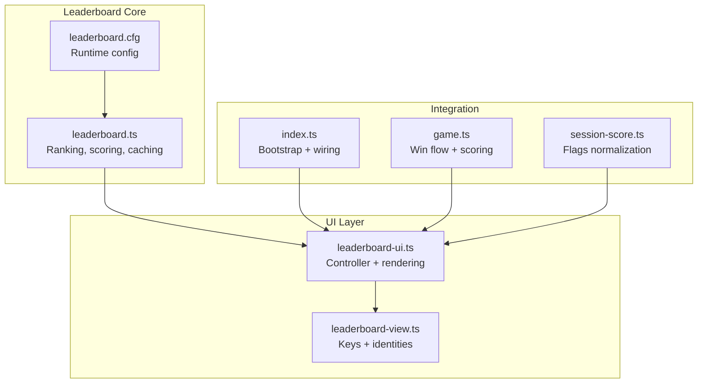
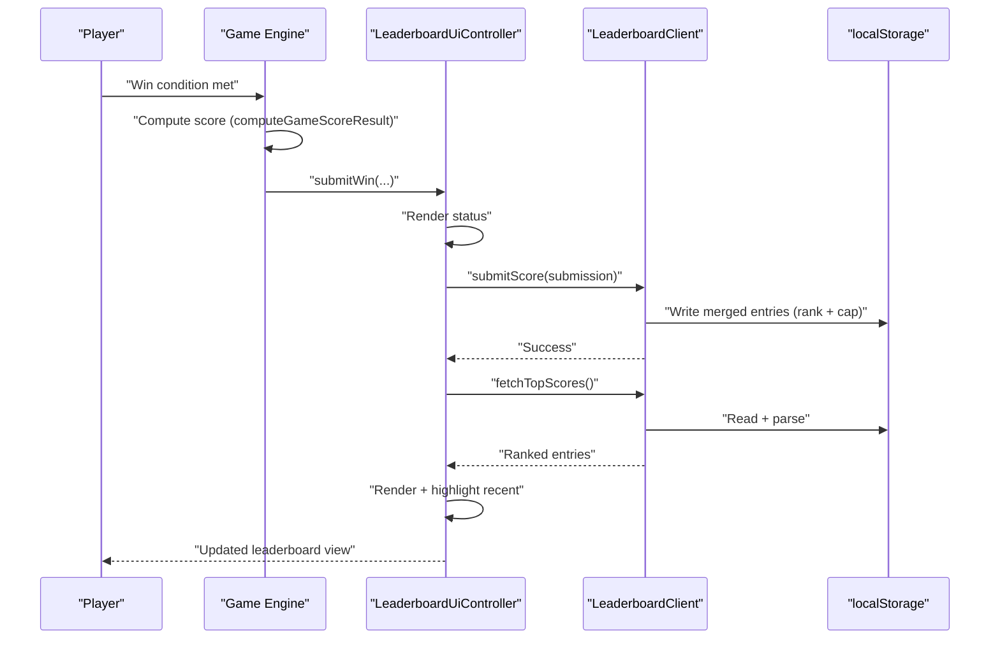
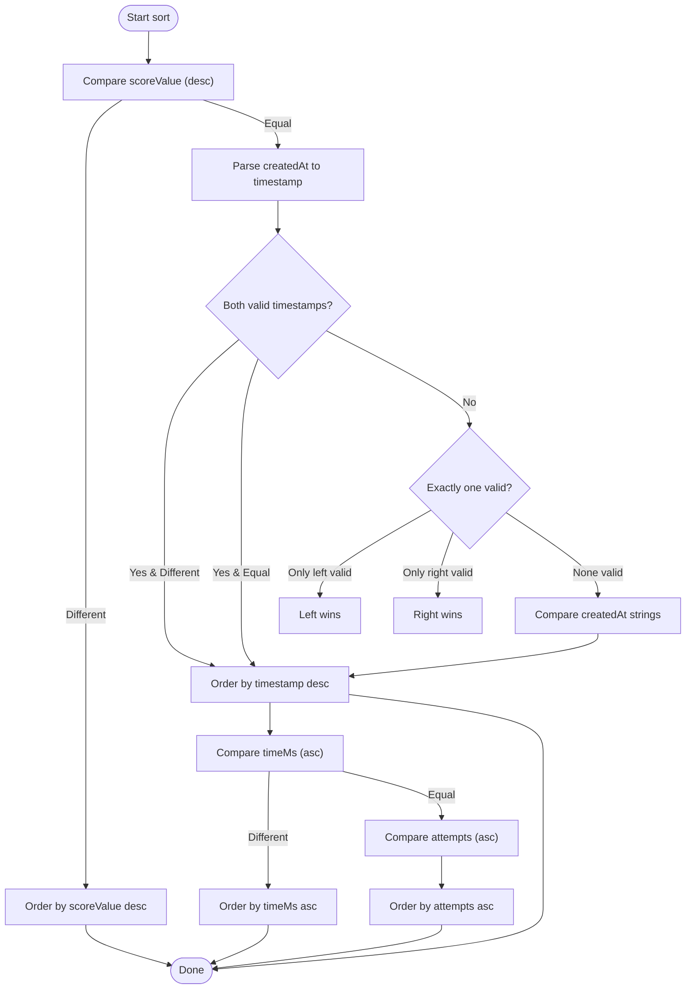
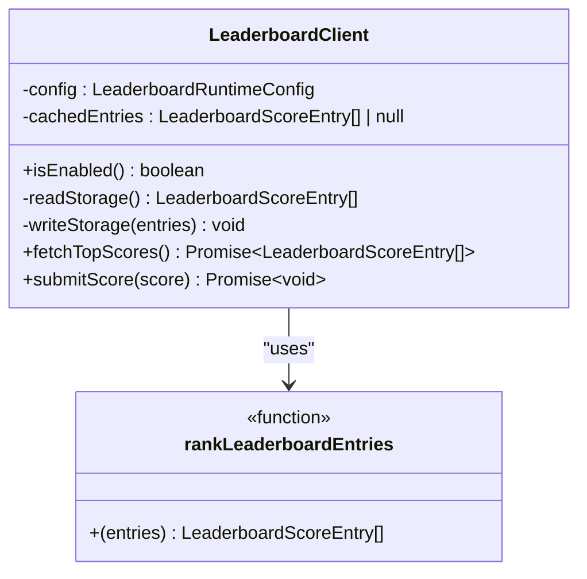
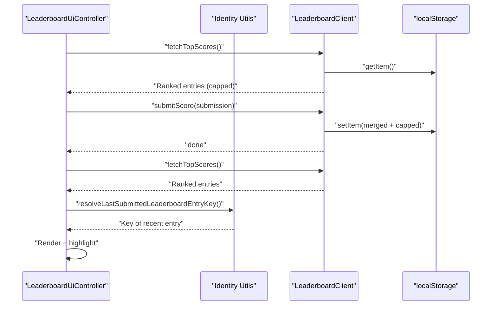
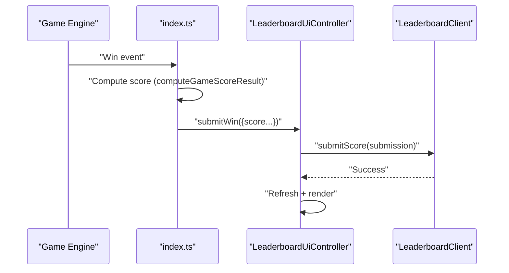
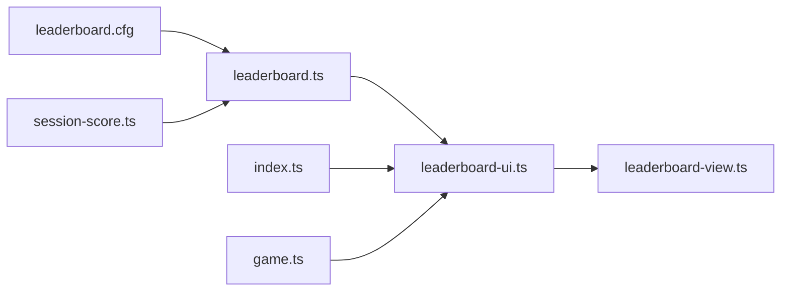

# Leaderboard Ranking System

<cite>
**Referenced Files in This Document**
- [leaderboard.ts](file://src/leaderboard.ts)
- [leaderboard-ui.ts](file://src/leaderboard-ui.ts)
- [leaderboard-view.ts](file://src/leaderboard-view.ts)
- [leaderboard.cfg](file://config/leaderboard.cfg)
- [leaderboard.test.ts](file://tests/leaderboard.test.ts)
- [leaderboard-ui.test.ts](file://tests/leaderboard-ui.test.ts)
- [leaderboard-view.test.ts](file://tests/leaderboard-view.test.ts)
- [index.ts](file://src/index.ts)
- [session-score.ts](file://src/session-score.ts)
- [game.ts](file://src/game.ts)
</cite>

## Table of Contents
1. [Introduction](#introduction)
2. [Project Structure](#project-structure)
3. [Core Components](#core-components)
4. [Architecture Overview](#architecture-overview)
5. [Detailed Component Analysis](#detailed-component-analysis)
6. [Dependency Analysis](#dependency-analysis)
7. [Performance Considerations](#performance-considerations)
8. [Troubleshooting Guide](#troubleshooting-guide)
9. [Conclusion](#conclusion)

## Introduction
This document explains the leaderboard ranking system with a focus on score sorting and tie-breaking algorithms. It details the rankLeaderboardEntries function implementation using multi-level sorting criteria (scoreValue, timestamp, timeMs, and attempts), ensures deterministic rankings across browsers and platforms, documents the ranking cache mechanism and performance optimizations for large datasets, and describes integration with the UI ranking display and real-time updates during score submissions.

## Project Structure
The leaderboard system spans several modules:
- Core ranking and persistence logic in leaderboard.ts
- UI controller and rendering in leaderboard-ui.ts
- Identity and key utilities in leaderboard-view.ts
- Runtime configuration in config/leaderboard.cfg
- Integration points in index.ts and game.ts
- Comprehensive tests validating ranking behavior and UI integration

**Diagram sources**
- [leaderboard.ts](file://src/leaderboard.ts)
- [leaderboard-ui.ts](file://src/leaderboard-ui.ts)
- [leaderboard-view.ts](file://src/leaderboard-view.ts)
- [leaderboard.cfg](file://config/leaderboard.cfg)
- [index.ts](file://src/index.ts)
- [game.ts](file://src/game.ts)
- [session-score.ts](file://src/session-score.ts)

**Section sources**
- [leaderboard.ts](file://src/leaderboard.ts)
- [leaderboard-ui.ts](file://src/leaderboard-ui.ts)
- [leaderboard-view.ts](file://src/leaderboard-view.ts)
- [leaderboard.cfg](file://config/leaderboard.cfg)
- [index.ts](file://src/index.ts)
- [game.ts](file://src/game.ts)
- [session-score.ts](file://src/session-score.ts)

## Core Components
- LeaderboardClient: Synchronous localStorage-backed client that caches entries, exposes fetchTopScores and submitScore, and enforces maxEntries limits.
- rankLeaderboardEntries: Deterministic sort function implementing multi-level tie-breaking.
- computeGameScoreResult: Computes scoreValue and scoreMultiplier for submission based on game state and runtime configuration.
- LeaderboardUiController: Orchestrates UI rendering, status messages, and real-time updates after score submission.
- Identity utilities: createLeaderboardEntryKey and resolveLastSubmittedLeaderboardEntryKey for deterministic identification and highlighting of recent submissions.

Key responsibilities:
- Deterministic ranking across browsers via strict ordering on scoreValue, timestamp, timeMs, and attempts.
- Efficient caching to avoid repeated parsing and sorting of localStorage data.
- Real-time UI updates with status feedback and visual highlighting of the most recent submission.

**Section sources**
- [leaderboard.ts](file://src/leaderboard.ts)
- [leaderboard-ui.ts](file://src/leaderboard-ui.ts)
- [leaderboard-view.ts](file://src/leaderboard-view.ts)
- [leaderboard.test.ts](file://tests/leaderboard.test.ts)
- [leaderboard-ui.test.ts](file://tests/leaderboard-ui.test.ts)
- [leaderboard-view.test.ts](file://tests/leaderboard-view.test.ts)

## Architecture Overview
The leaderboard system integrates tightly with the game win flow and UI:
- On win, the game computes score using computeGameScoreResult and delegates submission to LeaderboardUiController.
- LeaderboardUiController computes the score, submits via LeaderboardClient, refreshes the leaderboard, and highlights the newly submitted entry.
- UI rendering uses identity utilities to determine which row should be highlighted.

**Diagram sources**
- [index.ts](file://src/index.ts)
- [leaderboard-ui.ts](file://src/leaderboard-ui.ts)
- [leaderboard.ts](file://src/leaderboard.ts)
- [leaderboard-view.ts](file://src/leaderboard-view.ts)
- [game.ts](file://src/game.ts)

## Detailed Component Analysis

### rankLeaderboardEntries Tie-Breaking Algorithm
The rankLeaderboardEntries function performs a stable, deterministic sort using four levels:
1. Primary: scoreValue descending (higher scores rank first)
2. Secondary: createdAt timestamp descending (most recent ties resolved by recency)
3. Tertiary: timeMs ascending (faster times rank above slower times when scores and timestamps are equal)
4. Quaternary: attempts ascending (fewer attempts rank above more attempts when all else equals)

Timestamp resolution uses Date.parse for validity checks and falls back to string comparison when timestamps are invalid. This ensures deterministic behavior across browsers and platforms.

**Diagram sources**
- [leaderboard.ts](file://src/leaderboard.ts)

**Section sources**
- [leaderboard.ts](file://src/leaderboard.ts)
- [leaderboard.test.ts](file://tests/leaderboard.test.ts)

### Ranking Cache Mechanism and Performance Optimizations
LeaderboardClient caches deserialized entries in memory to avoid repeated JSON parsing and sorting:
- readStorage: Populates cache from localStorage if absent; guards against oversized payloads; returns cached entries.
- writeStorage: Clears cache on write to ensure freshness; warns when approaching storage limits.
- fetchTopScores: Returns cached entries, ranks them, slices to maxEntries.
- submitScore: Merges new entry with existing entries, ranks, caps to maxEntries, writes back to storage.

Performance characteristics:
- Sorting cost: O(n log n) per fetch/submit; acceptable for typical leaderboard sizes up to hundreds of entries.
- Memory: Single in-memory array of entries; minimal overhead.
- Persistence: Synchronous localStorage operations wrapped in Promise APIs for compatibility.

**Diagram sources**
- [leaderboard.ts](file://src/leaderboard.ts)

**Section sources**
- [leaderboard.ts](file://src/leaderboard.ts)
- [leaderboard.test.ts](file://tests/leaderboard.test.ts)

### Integration with UI Ranking Display and Real-Time Updates
LeaderboardUiController manages UI rendering and status messages:
- refresh: Fetches top scores and renders rows, capping to visible row count.
- submitWin: Computes score, submits to LeaderboardClient, refreshes, and highlights the most recent submission.
- Identity utilities: resolveLastSubmittedLeaderboardEntryKey and resolveMostRecentLeaderboardEntryKey ensure deterministic highlighting.

**Diagram sources**
- [leaderboard-ui.ts](file://src/leaderboard-ui.ts)
- [leaderboard-view.ts](file://src/leaderboard-view.ts)
- [leaderboard.ts](file://src/leaderboard.ts)

**Section sources**
- [leaderboard-ui.ts](file://src/leaderboard-ui.ts)
- [leaderboard-view.ts](file://src/leaderboard-view.ts)
- [leaderboard-ui.test.ts](file://tests/leaderboard-ui.test.ts)
- [leaderboard-view.test.ts](file://tests/leaderboard-view.test.ts)

### Scoring and Submission Pipeline
The game win flow computes score and triggers leaderboard submission:
- computeGameScoreResult: Applies difficulty multipliers, penalties (auto-demo, debug modes), portrait bonus, tile penalty, and flip-tiles rule.
- index.ts: On win, constructs submission and calls leaderboardUi.submitWin, which delegates to LeaderboardClient.

**Diagram sources**
- [index.ts](file://src/index.ts)
- [leaderboard-ui.ts](file://src/leaderboard-ui.ts)
- [leaderboard.ts](file://src/leaderboard.ts)
- [game.ts](file://src/game.ts)

**Section sources**
- [index.ts](file://src/index.ts)
- [leaderboard.ts](file://src/leaderboard.ts)
- [game.ts](file://src/game.ts)

## Dependency Analysis
The leaderboard system exhibits clean separation of concerns:
- leaderboard.ts depends on runtime configuration and provides core ranking, scoring, and persistence.
- leaderboard-ui.ts depends on leaderboard.ts and UI elements to render and manage state.
- leaderboard-view.ts provides deterministic identity and key utilities used by UI logic.
- index.ts wires the UI controller and integrates with the game win flow.
- session-score.ts normalizes flags for player vs auto-demo sessions.

**Diagram sources**
- [leaderboard.ts](file://src/leaderboard.ts)
- [leaderboard-ui.ts](file://src/leaderboard-ui.ts)
- [leaderboard-view.ts](file://src/leaderboard-view.ts)
- [leaderboard.cfg](file://config/leaderboard.cfg)
- [index.ts](file://src/index.ts)
- [game.ts](file://src/game.ts)
- [session-score.ts](file://src/session-score.ts)

**Section sources**
- [leaderboard.ts](file://src/leaderboard.ts)
- [leaderboard-ui.ts](file://src/leaderboard-ui.ts)
- [leaderboard-view.ts](file://src/leaderboard-view.ts)
- [leaderboard.cfg](file://config/leaderboard.cfg)
- [index.ts](file://src/index.ts)
- [game.ts](file://src/game.ts)
- [session-score.ts](file://src/session-score.ts)

## Performance Considerations
- Sorting complexity: O(n log n) per fetch/submit; acceptable for small-to-medium leaderboards.
- Caching: In-memory cache avoids repeated JSON.parse and reduces latency.
- Storage limits: Guardrails prevent oversized payloads; warnings guide users toward trimming old entries.
- Cap enforcement: maxEntries slicing keeps UI responsive and storage manageable.
- Deterministic comparisons: Strict ordering on numeric and string fields ensures consistent results across environments.

[No sources needed since this section provides general guidance]

## Troubleshooting Guide
Common issues and resolutions:
- Empty leaderboard despite submissions: Verify leaderboard.enabled and that localStorage is writable.
- Corrupted entries: readStorage recovers gracefully by returning an empty array when JSON is invalid or payload exceeds size limits.
- Disabled leaderboard: fetchTopScores returns empty; UI displays appropriate status.
- Over-limit storage: Excessive size triggers warnings; oldest entries are implicitly dropped by subsequent writes.
- Timestamp anomalies: Invalid timestamps fall back to string comparison; ensure ISO date strings for createdAt.

**Section sources**
- [leaderboard.ts](file://src/leaderboard.ts)
- [leaderboard.test.ts](file://tests/leaderboard.test.ts)
- [leaderboard-ui.test.ts](file://tests/leaderboard-ui.test.ts)

## Conclusion
The leaderboard ranking system provides a robust, deterministic, and performant solution for score sorting and tie-breaking. Its multi-level sort criteria, caching strategy, and tight UI integration deliver a smooth user experience with real-time updates. The design ensures cross-platform determinism and scalability for typical use cases.