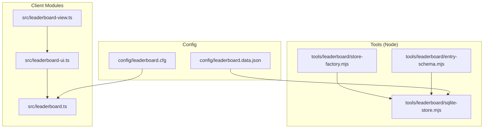
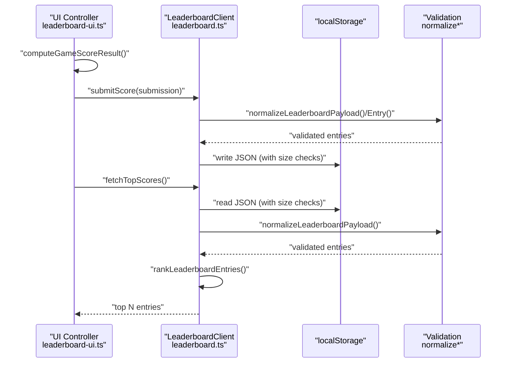
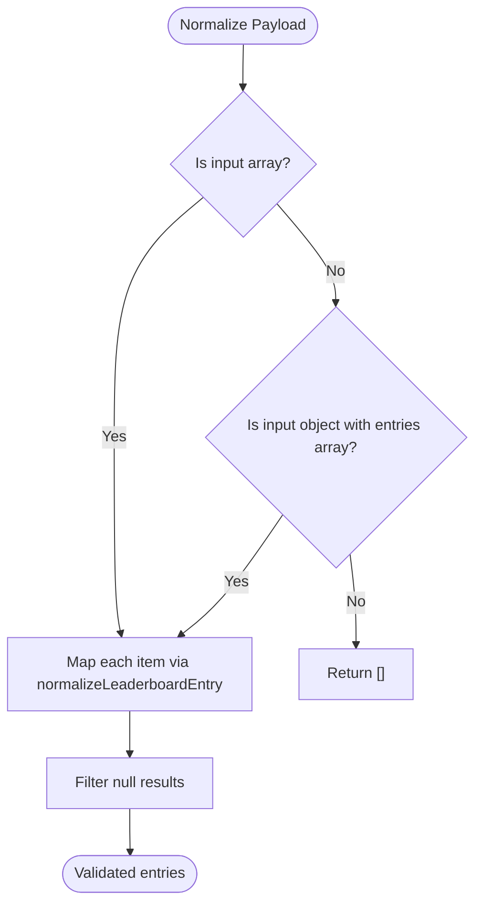
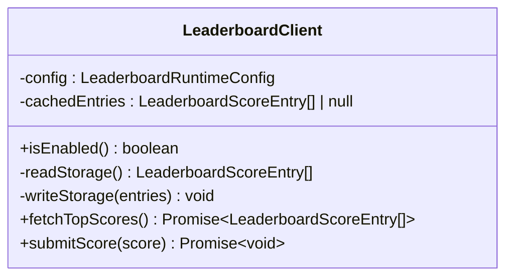
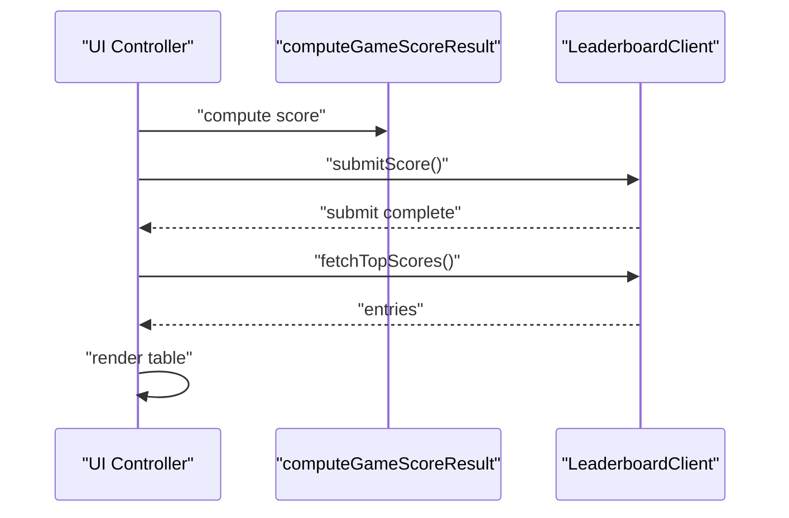
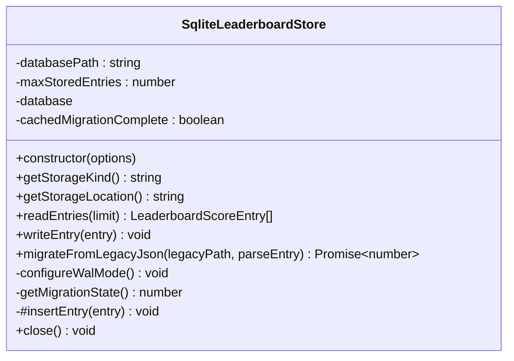
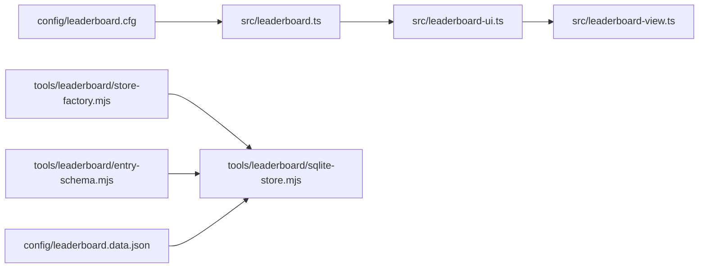

# Leaderboard Storage System

<cite>
**Referenced Files in This Document**
- [leaderboard.ts](file://src/leaderboard.ts)
- [leaderboard-ui.ts](file://src/leaderboard-ui.ts)
- [leaderboard-view.ts](file://src/leaderboard-view.ts)
- [sqlite-store.mjs](file://tools/leaderboard/sqlite-store.mjs)
- [store-factory.mjs](file://tools/leaderboard/store-factory.mjs)
- [entry-schema.mjs](file://tools/leaderboard/entry-schema.mjs)
- [leaderboard.cfg](file://config/leaderboard.cfg)
- [leaderboard.data.json](file://config/leaderboard.data.json)
- [leaderboard.test.ts](file://tests/leaderboard.test.ts)
- [sqlite-store.test.ts](file://tests/sqlite-store.test.ts)
</cite>

## Table of Contents
1. [Introduction](#introduction)
2. [Project Structure](#project-structure)
3. [Core Components](#core-components)
4. [Architecture Overview](#architecture-overview)
5. [Detailed Component Analysis](#detailed-component-analysis)
6. [Dependency Analysis](#dependency-analysis)
7. [Performance Considerations](#performance-considerations)
8. [Troubleshooting Guide](#troubleshooting-guide)
9. [Conclusion](#conclusion)
10. [Appendices](#appendices)

## Introduction
This document describes the leaderboard storage system with a focus on data persistence and retrieval mechanisms. It covers:
- localStorage-based storage architecture using a dedicated storage key and JSON serialization
- The LeaderboardClient class interface for fetching top scores, submitting scores, and cache management
- Data validation pipeline via normalization functions
- Storage size limits, warning thresholds, and error handling strategies
- An alternative SQLite store implementation including database schema, migration procedures, and performance considerations
- Examples of storage operations, serialization formats, cross-platform compatibility, storage quotas, cleanup procedures, and data integrity verification

## Project Structure
The leaderboard system spans client-side TypeScript modules and Node.js tools:
- Client-side modules define the data model, scoring computation, and localStorage-backed client
- UI controller integrates scoring computation and client operations
- Tools provide a SQLite-backed store with migration from legacy JSON

**Diagram sources**
- [leaderboard.ts](file://src/leaderboard.ts)
- [leaderboard-ui.ts](file://src/leaderboard-ui.ts)
- [leaderboard-view.ts](file://src/leaderboard-view.ts)
- [sqlite-store.mjs](file://tools/leaderboard/sqlite-store.mjs)
- [store-factory.mjs](file://tools/leaderboard/store-factory.mjs)
- [entry-schema.mjs](file://tools/leaderboard/entry-schema.mjs)
- [leaderboard.cfg](file://config/leaderboard.cfg)
- [leaderboard.data.json](file://config/leaderboard.data.json)

**Section sources**
- [leaderboard.ts](file://src/leaderboard.ts)
- [leaderboard-ui.ts](file://src/leaderboard-ui.ts)
- [leaderboard-view.ts](file://src/leaderboard-view.ts)
- [sqlite-store.mjs](file://tools/leaderboard/sqlite-store.mjs)
- [store-factory.mjs](file://tools/leaderboard/store-factory.mjs)
- [entry-schema.mjs](file://tools/leaderboard/entry-schema.mjs)
- [leaderboard.cfg](file://config/leaderboard.cfg)
- [leaderboard.data.json](file://config/leaderboard.data.json)

## Core Components
- Data model and scoring:
  - Interfaces for runtime configuration, score entries, and submissions
  - Scoring configuration constants and functions for computing and applying penalties
- Validation pipeline:
  - normalizeLeaderboardPayload and normalizeLeaderboardEntry transform raw payloads into validated entries
  - rankLeaderboardEntries sorts entries by score, recency, and tiebreakers
- Client for localStorage:
  - LeaderboardClient encapsulates read/write operations, caching, and size limits
- UI integration:
  - LeaderboardUiController orchestrates scoring computation, submission, and rendering
- SQLite store:
  - SqliteLeaderboardStore persists entries in SQLite with WAL mode, migrations, and trimming

**Section sources**
- [leaderboard.ts](file://src/leaderboard.ts)
- [leaderboard-ui.ts](file://src/leaderboard-ui.ts)
- [sqlite-store.mjs](file://tools/leaderboard/sqlite-store.mjs)

## Architecture Overview
The system supports two storage backends:
- localStorage (browser): fully offline, static-host compatible
- SQLite (Node): robust persistence with WAL, migration, and trimming

**Diagram sources**
- [leaderboard-ui.ts](file://src/leaderboard-ui.ts)
- [leaderboard.ts](file://src/leaderboard.ts)
- [leaderboard-view.ts](file://src/leaderboard-view.ts)

## Detailed Component Analysis

### Data Model and Validation Pipeline
- LeaderboardScoreEntry defines the canonical record shape persisted in storage
- normalizeLeaderboardPayload supports both array and object-wrapped arrays
- normalizeLeaderboardEntry enforces required fields, sanitizes strings, and computes score values with penalties
- rankLeaderboardEntries establishes deterministic ordering by score, recency, and tiebreakers

**Diagram sources**
- [leaderboard.ts](file://src/leaderboard.ts)

**Section sources**
- [leaderboard.ts](file://src/leaderboard.ts)

### LeaderboardClient (localStorage)
Responsibilities:
- Caching: maintains an in-process cache to avoid repeated parsing
- Fetching: reads, validates, and ranks entries up to maxEntries
- Submission: merges new entry, ranks, trims, and writes back
- Size limits: guards against oversized payloads and warns near threshold
- Error handling: catches parse/write errors and logs warnings

**Diagram sources**
- [leaderboard.ts](file://src/leaderboard.ts)

**Section sources**
- [leaderboard.ts](file://src/leaderboard.ts)

### UI Integration and Rendering
- LeaderboardUiController:
  - Computes score from game inputs
  - Submits to LeaderboardClient
  - Refreshes and renders top scores
  - Highlights recently submitted entries
- Key helpers:
  - createLeaderboardEntryKey and resolveLastSubmittedLeaderboardEntryKey for identity and highlighting

**Diagram sources**
- [leaderboard-ui.ts](file://src/leaderboard-ui.ts)
- [leaderboard-view.ts](file://src/leaderboard-view.ts)
- [leaderboard.ts](file://src/leaderboard.ts)

**Section sources**
- [leaderboard-ui.ts](file://src/leaderboard-ui.ts)
- [leaderboard-view.ts](file://src/leaderboard-view.ts)
- [leaderboard.ts](file://src/leaderboard.ts)

### SQLite Store Implementation
- Schema:
  - leaderboard_scores: primary table for entries
  - leaderboard_meta: metadata (migration state)
  - Index on created_at desc, id desc for efficient reads
- Operations:
  - readEntries(limit)
  - writeEntry(entry) inserts and trims to maxStoredEntries
  - migrateFromLegacyJson: one-time migration from legacy JSON with deduplication
- WAL mode:
  - Attempts to enable Write-Ahead Logging; logs warnings if ineffective
- Identity and deduplication:
  - createEntryIdentity builds a stable string from selected fields
  - Memory estimate warning for large retention limits during migration

**Diagram sources**
- [sqlite-store.mjs](file://tools/leaderboard/sqlite-store.mjs)

**Section sources**
- [sqlite-store.mjs](file://tools/leaderboard/sqlite-store.mjs)

### Entry Schema for Migration
- parseLeaderboardPayloadEntry validates and normalizes legacy entries
- Provides default emoji set label fallback and creation timestamps when absent
- Throws on invalid fields to skip malformed entries during migration

**Section sources**
- [entry-schema.mjs](file://tools/leaderboard/entry-schema.mjs)

## Dependency Analysis
- Runtime configuration:
  - LeaderboardClient depends on LeaderboardRuntimeConfig loaded from leaderboard.cfg
- UI dependencies:
  - LeaderboardUiController depends on LeaderboardClient and scoring configuration
- SQLite factory:
  - store-factory.mjs creates SqliteLeaderboardStore instances
- Tests:
  - leaderboard.test.ts validates localStorage behavior and normalization
  - sqlite-store.test.ts validates migration correctness and idempotence

**Diagram sources**
- [leaderboard.ts](file://src/leaderboard.ts)
- [leaderboard-ui.ts](file://src/leaderboard-ui.ts)
- [leaderboard-view.ts](file://src/leaderboard-view.ts)
- [store-factory.mjs](file://tools/leaderboard/store-factory.mjs)
- [sqlite-store.mjs](file://tools/leaderboard/sqlite-store.mjs)
- [entry-schema.mjs](file://tools/leaderboard/entry-schema.mjs)
- [leaderboard.cfg](file://config/leaderboard.cfg)
- [leaderboard.data.json](file://config/leaderboard.data.json)

**Section sources**
- [leaderboard.ts](file://src/leaderboard.ts)
- [leaderboard-ui.ts](file://src/leaderboard-ui.ts)
- [leaderboard-view.ts](file://src/leaderboard-view.ts)
- [store-factory.mjs](file://tools/leaderboard/store-factory.mjs)
- [sqlite-store.mjs](file://tools/leaderboard/sqlite-store.mjs)
- [entry-schema.mjs](file://tools/leaderboard/entry-schema.mjs)
- [leaderboard.cfg](file://config/leaderboard.cfg)
- [leaderboard.data.json](file://config/leaderboard.data.json)

## Performance Considerations
- localStorage:
  - Single JSON payload serialized/deserialized on each operation
  - Cache avoids repeated parsing until write
  - Sorting complexity O(n log n) for ranking; practical limit governed by maxEntries
- SQLite:
  - WAL mode improves concurrency and write performance when supported
  - Index on created_at desc ensures efficient top-N queries
  - Trimming via windowed ranking keeps table size bounded
  - Migration uses streaming iteration to minimize memory footprint

[No sources needed since this section provides general guidance]

## Troubleshooting Guide
Common issues and remedies:
- Excessive localStorage payload:
  - Symptom: fetchTopScores returns empty; warning logged
  - Cause: payload exceeds maximum size
  - Action: clear localStorage or reduce retained entries
- Approaching size limit:
  - Symptom: warning about approaching limit before write
  - Action: reduce maxStoredEntries or prune old entries
- Write failures:
  - Symptom: warning indicating storage quota exceeded or generic write error
  - Action: verify quota, permissions, and free disk space
- Corrupted or invalid data:
  - Symptom: read errors caught and defaulted to empty set
  - Action: inspect and repair or replace storage key value
- SQLite WAL mode not effective:
  - Symptom: warning about journal mode
  - Action: verify filesystem support, permissions, and SQLite build capabilities
- Migration anomalies:
  - Symptom: unexpected counts or duplicates
  - Action: confirm migration state flag and retry only if necessary

**Section sources**
- [leaderboard.ts](file://src/leaderboard.ts)
- [sqlite-store.mjs](file://tools/leaderboard/sqlite-store.mjs)
- [leaderboard.test.ts](file://tests/leaderboard.test.ts)
- [sqlite-store.test.ts](file://tests/sqlite-store.test.ts)

## Conclusion
The leaderboard system provides a robust, configurable, and portable solution for score persistence:
- localStorage enables offline-first, static-host deployment
- SQLite offers scalable persistence with WAL, migrations, and trimming
- Strong validation and normalization ensure data integrity
- Clear error handling and warnings improve operability across environments

[No sources needed since this section summarizes without analyzing specific files]

## Appendices

### Storage Operations and Serialization Formats
- localStorage:
  - Storage key: a single JSON array of entries
  - Format: array of LeaderboardScoreEntry objects
  - Operations: read, write, and rank with size checks
- SQLite:
  - Table: leaderboard_scores with indexed created_at
  - Metadata: leaderboard_meta for migration state
  - Operations: insert, read top N, trim, migrate from legacy JSON

**Section sources**
- [leaderboard.ts](file://src/leaderboard.ts)
- [sqlite-store.mjs](file://tools/leaderboard/sqlite-store.mjs)

### Cross-Platform Compatibility
- localStorage:
  - Works on browsers and static hosts (e.g., GitHub Pages)
  - Offline-first behavior
- SQLite:
  - Requires Node.js environment
  - Filesystem permissions and WAL support vary by platform

**Section sources**
- [leaderboard.ts](file://src/leaderboard.ts)
- [sqlite-store.mjs](file://tools/leaderboard/sqlite-store.mjs)

### Storage Quotas and Cleanup
- localStorage:
  - Maximum payload size and warning threshold defined and enforced
  - Cleanup: clear storage key or reduce entries to stay within limits
- SQLite:
  - Trimming to maxStoredEntries maintains bounded size
  - WAL mode reduces contention and improves durability

**Section sources**
- [leaderboard.ts](file://src/leaderboard.ts)
- [sqlite-store.mjs](file://tools/leaderboard/sqlite-store.mjs)

### Data Integrity Verification
- Validation:
  - normalizeLeaderboardPayload and normalizeLeaderboardEntry reject invalid records
  - rankLeaderboardEntries provides deterministic ordering
- SQLite:
  - Unique identity via createEntryIdentity prevents duplicates during migration
  - Transactional migration ensures atomicity

**Section sources**
- [leaderboard.ts](file://src/leaderboard.ts)
- [sqlite-store.mjs](file://tools/leaderboard/sqlite-store.mjs)
- [entry-schema.mjs](file://tools/leaderboard/entry-schema.mjs)