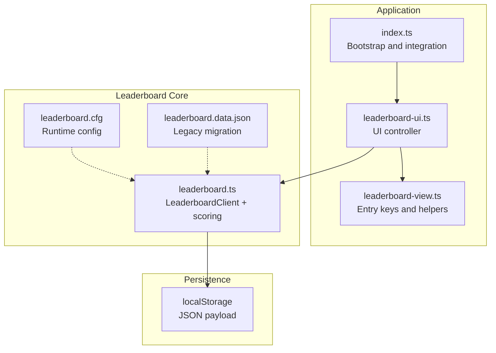
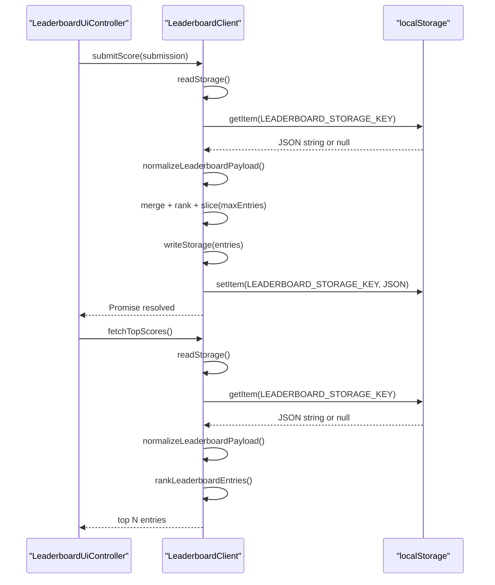
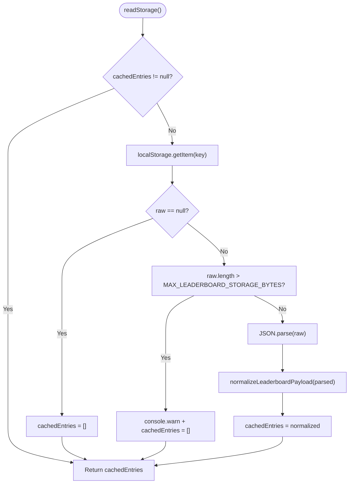
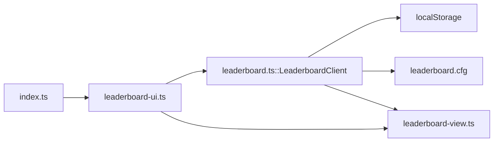

# LocalStorage Implementation

<cite>
**Referenced Files in This Document**
- [leaderboard.ts](file://src/leaderboard.ts)
- [leaderboard-ui.ts](file://src/leaderboard-ui.ts)
- [leaderboard-view.ts](file://src/leaderboard-view.ts)
- [index.ts](file://src/index.ts)
- [leaderboard.cfg](file://config/leaderboard.cfg)
- [leaderboard.data.json](file://config/leaderboard.data.json)
- [leaderboard.test.ts](file://tests/leaderboard.test.ts)
- [leaderboard-ui.test.ts](file://tests/leaderboard-ui.test.ts)
- [README.md](file://README.md)
- [.github/workflows/pages.yml](file://.github/workflows/pages.yml)
</cite>

## Table of Contents
1. [Introduction](#introduction)
2. [Project Structure](#project-structure)
3. [Core Components](#core-components)
4. [Architecture Overview](#architecture-overview)
5. [Detailed Component Analysis](#detailed-component-analysis)
6. [Dependency Analysis](#dependency-analysis)
7. [Performance Considerations](#performance-considerations)
8. [Troubleshooting Guide](#troubleshooting-guide)
9. [Conclusion](#conclusion)

## Introduction
This document explains the localStorage-based leaderboard implementation that powers client-side score persistence. It covers the storage key, JSON serialization format, caching strategy with automatic cache invalidation, robust read/write operations with comprehensive error handling, storage limits and warnings, and the offline-first architecture suitable for static hosting environments such as GitHub Pages. Practical examples and browser compatibility considerations are included to guide both developers and operators deploying the application.

## Project Structure
The leaderboard feature spans three primary modules:
- Storage and computation logic: [leaderboard.ts](file://src/leaderboard.ts)
- UI controller and submission flow: [leaderboard-ui.ts](file://src/leaderboard-ui.ts)
- Rendering helpers and entry identity: [leaderboard-view.ts](file://src/leaderboard-view.ts)
- Application bootstrap and integration: [index.ts](file://src/index.ts)
- Runtime configuration: [leaderboard.cfg](file://config/leaderboard.cfg)
- Legacy migration data: [leaderboard.data.json](file://config/leaderboard.data.json)
- Tests validating behavior: [leaderboard.test.ts](file://tests/leaderboard.test.ts), [leaderboard-ui.test.ts](file://tests/leaderboard-ui.test.ts)
- Deployment and offline-first context: [README.md](file://README.md), [.github/workflows/pages.yml](file://.github/workflows/pages.yml)

**Diagram sources**
- [index.ts:269-280](file://src/index.ts#L269-L280)
- [leaderboard-ui.ts:51-71](file://src/leaderboard-ui.ts#L51-L71)
- [leaderboard-view.ts:1-17](file://src/leaderboard-view.ts#L1-L17)
- [leaderboard.ts:362-455](file://src/leaderboard.ts#L362-L455)
- [leaderboard.cfg:1-17](file://config/leaderboard.cfg#L1-L17)
- [leaderboard.data.json:1-3](file://config/leaderboard.data.json#L1-L3)

**Section sources**
- [index.ts:269-280](file://src/index.ts#L269-L280)
- [leaderboard-ui.ts:51-71](file://src/leaderboard-ui.ts#L51-L71)
- [leaderboard-view.ts:1-17](file://src/leaderboard-view.ts#L1-L17)
- [leaderboard.ts:362-455](file://src/leaderboard.ts#L362-L455)
- [leaderboard.cfg:1-17](file://config/leaderboard.cfg#L1-L17)
- [leaderboard.data.json:1-3](file://config/leaderboard.data.json#L1-L3)

## Core Components
- LeaderboardClient: Synchronous localStorage wrapper with caching, JSON serialization, size guarding, and error handling. Exposes fetchTopScores and submitScore methods.
- Scoring and normalization: Compute game scores, normalize persisted entries, rank entries deterministically, and enforce runtime configuration.
- UI controller: Orchestrates score submission, refresh, and rendering with graceful degradation when disabled or failing.
- View helpers: Create stable entry keys and identity fingerprints for highlighting recently submitted entries.

Key constants and limits:
- LEADERBOARD_STORAGE_KEY: localStorage key for the leaderboard payload.
- MAX_LEADERBOARD_STORAGE_BYTES: hard limit on serialized payload size.
- STORAGE_WARNING_THRESHOLD: threshold proportion to warn before writing near the limit.

**Section sources**
- [leaderboard.ts:65-72](file://src/leaderboard.ts#L65-L72)
- [leaderboard.ts:362-455](file://src/leaderboard.ts#L362-L455)
- [leaderboard.ts:528-541](file://src/leaderboard.ts#L528-L541)

## Architecture Overview
The leaderboard operates offline-first and fully client-side:
- Scores are stored as a JSON array under a single localStorage key.
- Reads and writes are synchronous (wrapped in Promises for API compatibility).
- No network requests are performed; the leaderboard works on static-file hosts such as GitHub Pages.

**Diagram sources**
- [leaderboard-ui.ts:119-172](file://src/leaderboard-ui.ts#L119-L172)
- [leaderboard.ts:424-454](file://src/leaderboard.ts#L424-L454)
- [leaderboard.ts:374-401](file://src/leaderboard.ts#L374-L401)
- [leaderboard.ts:403-422](file://src/leaderboard.ts#L403-L422)

**Section sources**
- [leaderboard.ts:354-361](file://src/leaderboard.ts#L354-L361)
- [leaderboard-ui.ts:119-172](file://src/leaderboard-ui.ts#L119-L172)
- [leaderboard.ts:424-454](file://src/leaderboard.ts#L424-L454)

## Detailed Component Analysis

### LeaderboardClient: Storage, Caching, and Error Handling
Responsibilities:
- Caching: Maintains an in-memory cache of parsed entries; invalidated on write.
- Read path: getItem, guard against oversized payloads, parse JSON, normalize, and return ranked entries.
- Write path: Serialize entries, warn when approaching the size limit, and persist to localStorage; catch quota exceeded and write errors.
- Ranking: Stable sort by score, then recency, then time, then attempts.

Error handling:
- Read failures: Logs a warning and returns an empty cache.
- Write failures: Detects DOMException as “Storage quota exceeded” vs. other write errors; logs a warning and continues.
- Size guarding: Ignores payloads exceeding the byte limit.

**Diagram sources**
- [leaderboard.ts:374-401](file://src/leaderboard.ts#L374-L401)

**Section sources**
- [leaderboard.ts:374-401](file://src/leaderboard.ts#L374-L401)
- [leaderboard.ts:403-422](file://src/leaderboard.ts#L403-L422)
- [leaderboard.ts:65-72](file://src/leaderboard.ts#L65-L72)

### JSON Serialization Format and Payload Shape
- Storage key: LEADERBOARD_STORAGE_KEY.
- Serialized payload: JSON array of score entries.
- Entry shape: Includes player metadata, difficulty info, emoji set info, score multiplier/value, flags, and creation timestamp.
- Legacy compatibility: Accepts an object wrapper with an entries array field.

Validation and normalization:
- Trims and sanitizes strings.
- Derives missing scoreMultiplier from difficulty when absent.
- Applies penalties for debug/auto-demo modes.
- Filters out entries with invalid required fields.

Practical examples (paths):
- Submitting a score: [leaderboard-ui.ts:135-148](file://src/leaderboard-ui.ts#L135-L148)
- Fetching top scores: [leaderboard.ts:424-430](file://src/leaderboard.ts#L424-L430)
- Legacy emoji label fallback: [leaderboard.ts:164-170](file://src/leaderboard.ts#L164-L170)
- Legacy emoji ID fallback: [leaderboard.ts:184-187](file://src/leaderboard.ts#L184-L187)

**Section sources**
- [leaderboard.ts:21-33](file://src/leaderboard.ts#L21-L33)
- [leaderboard.ts:245-267](file://src/leaderboard.ts#L245-L267)
- [leaderboard.ts:164-170](file://src/leaderboard.ts#L164-L170)
- [leaderboard.ts:184-187](file://src/leaderboard.ts#L184-L187)

### Ranking and Deterministic Tiebreaking
Ranking criteria (in order):
1. scoreValue (higher is better)
2. createdAt (more recent is better)
3. timeMs (lower is better)
4. attempts (lower is better)

This ensures fair, deterministic ordering across sessions and devices.

**Section sources**
- [leaderboard.ts:269-298](file://src/leaderboard.ts#L269-L298)

### Offline-First and Static Hosting
- Fully offline: No network requests; relies solely on localStorage.
- Static hosting ready: Designed for GitHub Pages and similar static hosts.
- Deployment pipeline: Assets and configs are prepared into a static site artifact.

**Section sources**
- [leaderboard.ts:354-361](file://src/leaderboard.ts#L354-L361)
- [README.md:42-45](file://README.md#L42-L45)
- [.github/workflows/pages.yml:42-55](file://.github/workflows/pages.yml#L42-L55)

### Runtime Configuration and Tuning
- Enabled/disabled, max entries, and scoring parameters are loaded from leaderboard.cfg.
- Values are clamped to safe ranges and defaults are applied when loading fails.

**Section sources**
- [leaderboard.ts:300-352](file://src/leaderboard.ts#L300-L352)
- [leaderboard.cfg:1-17](file://config/leaderboard.cfg#L1-L17)

### UI Integration and Submission Flow
- The UI controller computes the final score, submits to the client, refreshes the leaderboard, and highlights the most recent entry.
- Graceful degradation: Disabled leaderboard shows a friendly message; submission failures are surfaced to the user.

**Section sources**
- [leaderboard-ui.ts:119-172](file://src/leaderboard-ui.ts#L119-L172)
- [index.ts:709-762](file://src/index.ts#L709-L762)

## Dependency Analysis
The leaderboard depends on:
- localStorage for persistence
- UI controller for submission orchestration
- Runtime configuration for scoring and limits
- View helpers for entry identity and highlighting

**Diagram sources**
- [leaderboard-ui.ts:51-71](file://src/leaderboard-ui.ts#L51-L71)
- [leaderboard.ts:362-455](file://src/leaderboard.ts#L362-L455)
- [leaderboard-view.ts:1-17](file://src/leaderboard-view.ts#L1-L17)
- [index.ts:269-280](file://src/index.ts#L269-L280)

**Section sources**
- [leaderboard-ui.ts:51-71](file://src/leaderboard-ui.ts#L51-L71)
- [leaderboard.ts:362-455](file://src/leaderboard.ts#L362-L455)
- [leaderboard-view.ts:1-17](file://src/leaderboard-view.ts#L1-L17)
- [index.ts:269-280](file://src/index.ts#L269-L280)

## Performance Considerations
- Caching: readStorage caches parsed entries until the next write, reducing repeated JSON parsing and normalization overhead.
- Ranking cost: Sorting is O(n log n); capped by maxEntries from runtime config.
- Storage pressure: Early warning when approaching the size limit reduces risk of quota exceeded errors.
- Offline-first: Eliminates network latency and server dependencies.

[No sources needed since this section provides general guidance]

## Troubleshooting Guide
Common issues and resolutions:
- Quota exceeded: Detected via DOMException; the write path logs a warning and aborts the write. Reduce maxEntries or prune old entries.
- Corrupted data: JSON parse errors or oversized payloads are ignored and treated as empty storage; entries are rebuilt from valid submissions.
- Disabled leaderboard: Methods return early; UI displays a disabled message.
- Refresh failures: Submission succeeds but refresh fails; UI informs the user and logs a warning.
- Private browsing mode: Some browsers restrict or clear localStorage aggressively; behavior varies by vendor and mode.

Recovery tips:
- Clear localStorage selectively (key: LEADERBOARD_STORAGE_KEY) to remove corrupted data.
- Lower maxEntries or disable leaderboard temporarily to avoid quota pressure.
- Verify runtime configuration values if scoring seems incorrect.

**Section sources**
- [leaderboard.ts:374-401](file://src/leaderboard.ts#L374-L401)
- [leaderboard.ts:403-422](file://src/leaderboard.ts#L403-L422)
- [leaderboard-ui.ts:155-171](file://src/leaderboard-ui.ts#L155-L171)
- [leaderboard.test.ts:256-262](file://tests/leaderboard.test.ts#L256-L262)
- [leaderboard.test.ts:604-636](file://tests/leaderboard.test.ts#L604-L636)

## Conclusion
The localStorage-based leaderboard provides a robust, offline-first solution for client-side score persistence. Its design emphasizes safety (size guarding, strict validation, and comprehensive error handling), performance (caching and deterministic ranking), and operability (static hosting readiness and runtime configuration). Together with the UI controller’s graceful degradation and the deployment pipeline’s artifact preparation, it delivers a reliable high scores experience across diverse environments.