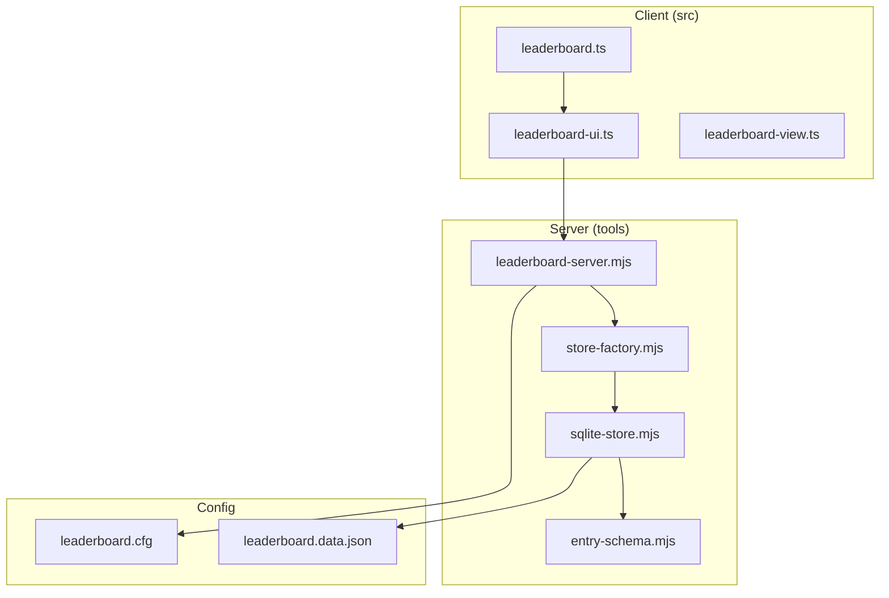
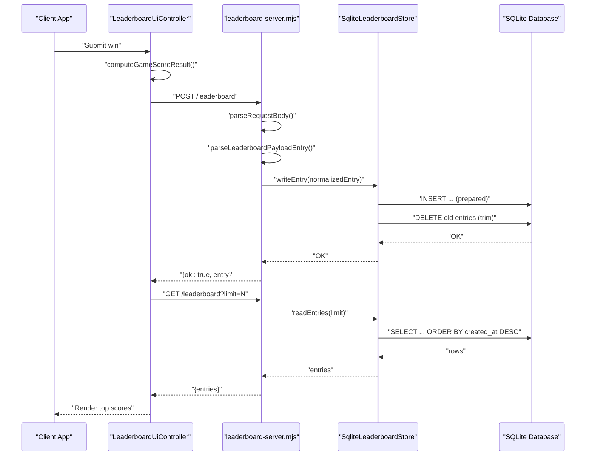
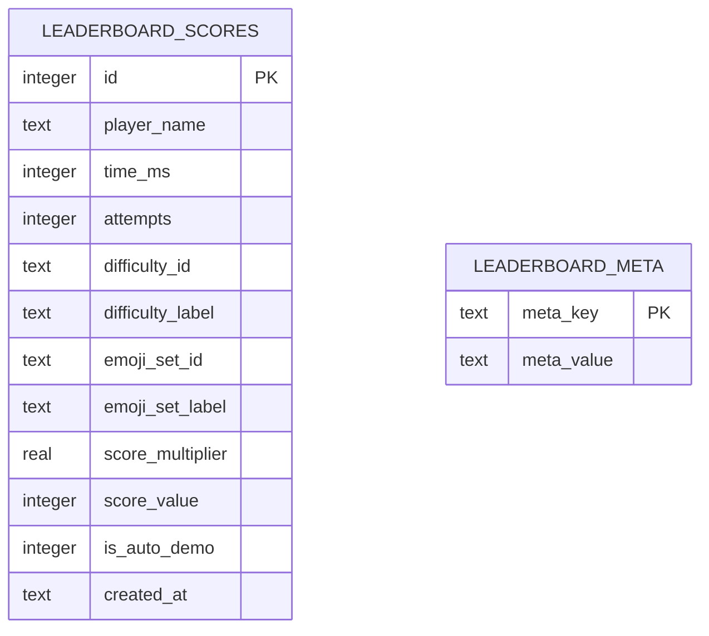
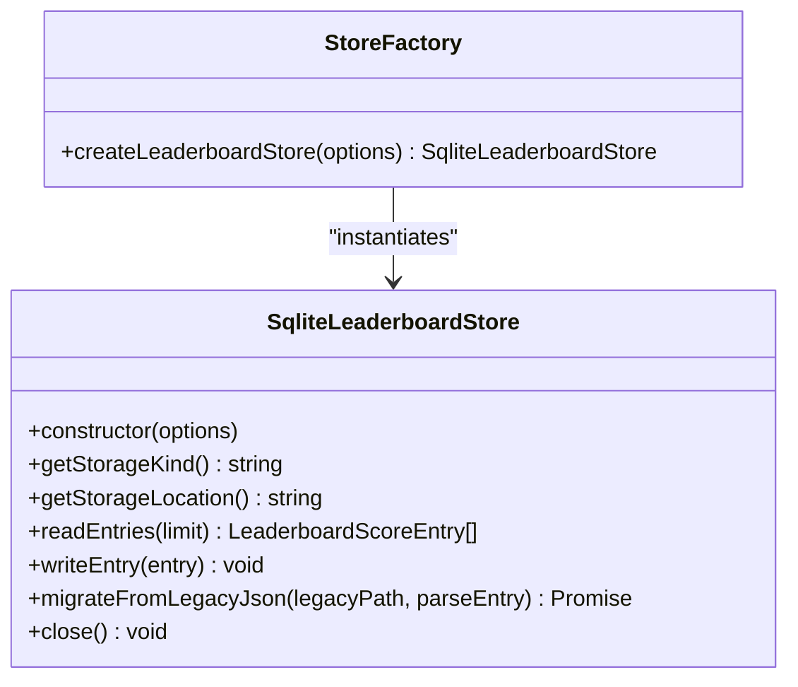
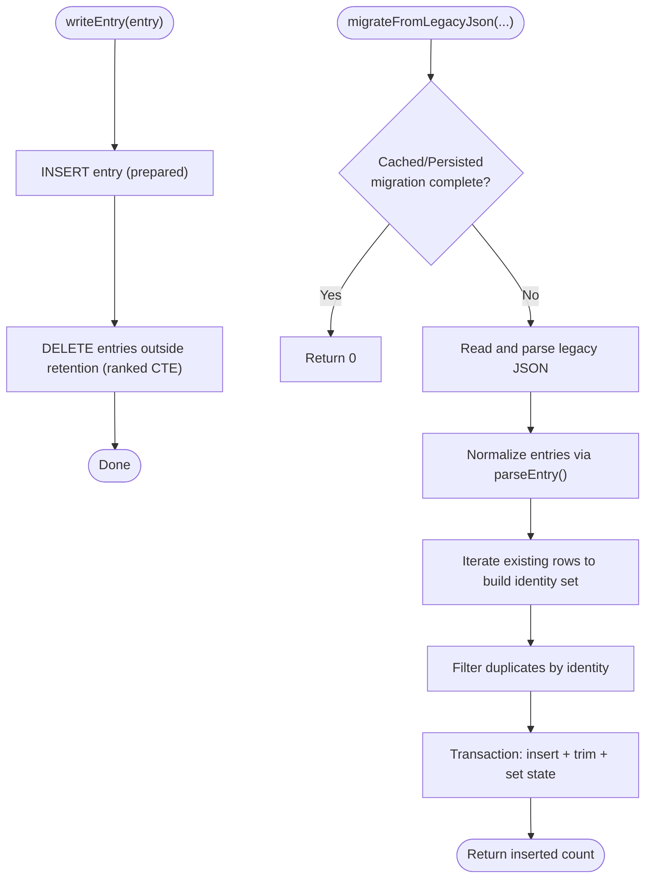
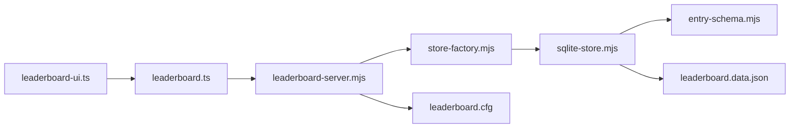

# SQLite Implementation

<cite>
**Referenced Files in This Document**
- [sqlite-store.mjs](file://tools/leaderboard/sqlite-store.mjs)
- [store-factory.mjs](file://tools/leaderboard/store-factory.mjs)
- [entry-schema.mjs](file://tools/leaderboard/entry-schema.mjs)
- [leaderboard-server.mjs](file://tools/leaderboard-server.mjs)
- [leaderboard.ts](file://src/leaderboard.ts)
- [leaderboard-ui.ts](file://src/leaderboard-ui.ts)
- [leaderboard-view.ts](file://src/leaderboard-view.ts)
- [sqlite-store.test.ts](file://tests/sqlite-store.test.ts)
- [leaderboard.cfg](file://config/leaderboard.cfg)
- [leaderboard.data.json](file://config/leaderboard.data.json)
- [runtime-config.md](file://docs/runtime-config.md)
- [README.md](file://README.md)
</cite>

## Table of Contents
1. [Introduction](#introduction)
2. [Project Structure](#project-structure)
3. [Core Components](#core-components)
4. [Architecture Overview](#architecture-overview)
5. [Detailed Component Analysis](#detailed-component-analysis)
6. [Dependency Analysis](#dependency-analysis)
7. [Performance Considerations](#performance-considerations)
8. [Troubleshooting Guide](#troubleshooting-guide)
9. [Conclusion](#conclusion)
10. [Appendices](#appendices)

## Introduction
This document explains the SQLite-based leaderboard implementation for server-side persistence and scalability. It covers the database schema design, indexing strategies, the store factory pattern enabling backend switching, the SQLite store’s CRUD operations, migration procedures, synchronization between backends, performance optimization techniques, transaction management, and production deployment considerations.

## Project Structure
The leaderboard feature is implemented across client and server modules:
- Client-side scoring and UI integration live in the src/ folder.
- Server-side persistence and API live in tools/leaderboard/ and tools/leaderboard-server.mjs.
- Configuration and migration behavior are documented in docs/ and config/.

**Diagram sources**
- [leaderboard.ts:1-541](file://src/leaderboard.ts#L1-L541)
- [leaderboard-ui.ts:1-234](file://src/leaderboard-ui.ts#L1-L234)
- [leaderboard-view.ts:1-110](file://src/leaderboard-view.ts#L1-L110)
- [store-factory.mjs:1-25](file://tools/leaderboard/store-factory.mjs#L1-L25)
- [sqlite-store.mjs:1-531](file://tools/leaderboard/sqlite-store.mjs#L1-L531)
- [entry-schema.mjs:1-91](file://tools/leaderboard/entry-schema.mjs#L1-L91)
- [leaderboard-server.mjs:1-161](file://tools/leaderboard-server.mjs#L1-L161)
- [leaderboard.cfg:1-17](file://config/leaderboard.cfg#L1-L17)
- [leaderboard.data.json:1-3](file://config/leaderboard.data.json#L1-L3)

**Section sources**
- [README.md:95-122](file://README.md#L95-L122)
- [runtime-config.md:134-217](file://docs/runtime-config.md#L134-L217)

## Core Components
- Store Factory Pattern: Selects the storage backend via driver option and constructs the appropriate store.
- SQLite Store: Implements database initialization, prepared statements, WAL mode configuration, CRUD operations, retention trimming, and one-time migration from legacy JSON.
- Entry Schema Parser: Validates and normalizes incoming score payloads.
- Leaderboard Server: Exposes GET/POST endpoints, parses request bodies, and delegates to the store.
- Client Integration: Computes scores, submits to the server, and renders top scores.

**Section sources**
- [store-factory.mjs:16-24](file://tools/leaderboard/store-factory.mjs#L16-L24)
- [sqlite-store.mjs:150-531](file://tools/leaderboard/sqlite-store.mjs#L150-L531)
- [entry-schema.mjs:18-91](file://tools/leaderboard/entry-schema.mjs#L18-L91)
- [leaderboard-server.mjs:67-153](file://tools/leaderboard-server.mjs#L67-L153)
- [leaderboard.ts:476-526](file://src/leaderboard.ts#L476-L526)

## Architecture Overview
The server exposes a simple HTTP API for leaderboard reads and writes. The store abstraction enables swapping implementations without changing the API or client logic.

**Diagram sources**
- [leaderboard-ui.ts:119-172](file://src/leaderboard-ui.ts#L119-L172)
- [leaderboard-server.mjs:130-153](file://tools/leaderboard-server.mjs#L130-L153)
- [sqlite-store.mjs:391-399](file://tools/leaderboard/sqlite-store.mjs#L391-L399)
- [sqlite-store.mjs:186-202](file://tools/leaderboard/sqlite-store.mjs#L186-L202)

## Detailed Component Analysis

### Database Schema Design
- Table: leaderboard_scores
  - Columns: id (PK), player_name, time_ms, attempts, difficulty_id, difficulty_label, emoji_set_id, emoji_set_label, score_multiplier, score_value, is_auto_demo, created_at.
  - Index: leaderboard_scores_recent_idx on (created_at DESC, id DESC) to optimize top-N reads.
- Table: leaderboard_meta
  - Columns: meta_key (PK), meta_value.
  - Purpose: Stores migration state and other metadata.

**Diagram sources**
- [sqlite-store.mjs:48-75](file://tools/leaderboard/sqlite-store.mjs#L48-L75)

**Section sources**
- [sqlite-store.mjs:48-75](file://tools/leaderboard/sqlite-store.mjs#L48-L75)

### Store Factory Pattern
- createLeaderboardStore(options) selects the backend by driver.
- Supports "sqlite" driver and constructs SqliteLeaderboardStore with databasePath and maxStoredEntries.

**Diagram sources**
- [store-factory.mjs:16-24](file://tools/leaderboard/store-factory.mjs#L16-L24)
- [sqlite-store.mjs:150-354](file://tools/leaderboard/sqlite-store.mjs#L150-L354)

**Section sources**
- [store-factory.mjs:16-24](file://tools/leaderboard/store-factory.mjs#L16-L24)

### SQLiteStore Class Methods and Operations
- Constructor
  - Opens database, creates tables and indexes, prepares statements, caches migration state, and configures WAL.
- readEntries(limit)
  - Uses a prepared SELECT with ORDER BY created_at DESC, id DESC and LIMIT to fetch top entries efficiently.
- writeEntry(entry)
  - Inserts a normalized entry and trims to maxStoredEntries using a window function ranking.
- migrateFromLegacyJson(legacyPath, parseEntry)
  - One-time migration from config/leaderboard.data.json:
    - Checks cached and persisted migration state.
    - Parses and normalizes legacy entries.
    - Deduplicates using identity strings built from all fields.
    - Performs a transaction to insert, trim, and mark migration complete.
- WAL Mode Configuration
  - Requests journal_mode=WAL and warns if ineffective, ensuring better concurrency and durability.

**Diagram sources**
- [sqlite-store.mjs:391-399](file://tools/leaderboard/sqlite-store.mjs#L391-L399)
- [sqlite-store.mjs:442-529](file://tools/leaderboard/sqlite-store.mjs#L442-L529)
- [sqlite-store.mjs:303-337](file://tools/leaderboard/sqlite-store.mjs#L303-L337)

**Section sources**
- [sqlite-store.mjs:150-354](file://tools/leaderboard/sqlite-store.mjs#L150-L354)
- [sqlite-store.mjs:391-399](file://tools/leaderboard/sqlite-store.mjs#L391-L399)
- [sqlite-store.mjs:442-529](file://tools/leaderboard/sqlite-store.mjs#L442-L529)

### Entry Schema and Payload Normalization
- parseLeaderboardPayloadEntry validates and normalizes incoming submissions:
  - Ensures required fields are present and non-negative where applicable.
  - Provides default emoji set label when missing.
  - Generates createdAt if allowed and missing.

**Section sources**
- [entry-schema.mjs:18-91](file://tools/leaderboard/entry-schema.mjs#L18-L91)

### Leaderboard Server API
- Endpoint: /leaderboard
  - GET /leaderboard?limit=N returns top N entries.
  - POST /leaderboard accepts a compact JSON payload and persists it.
- Request Body Parsing
  - Streams request body chunks, enforces a maximum size, and parses JSON.
- Migration
  - On startup, migrates legacy JSON data into SQLite if present and needed.

**Section sources**
- [leaderboard-server.mjs:117-153](file://tools/leaderboard-server.mjs#L117-L153)
- [leaderboard-server.mjs:73-97](file://tools/leaderboard-server.mjs#L73-L97)
- [leaderboard-server.mjs:99-113](file://tools/leaderboard-server.mjs#L99-L113)

### Client-Side Integration
- LeaderboardClient (localStorage-backed) demonstrates the expected interface for fetching top scores and submitting scores.
- LeaderboardUiController orchestrates score computation, submission, and rendering.

**Section sources**
- [leaderboard.ts:362-455](file://src/leaderboard.ts#L362-L455)
- [leaderboard-ui.ts:51-172](file://src/leaderboard-ui.ts#L51-L172)

## Dependency Analysis
- The server depends on the store factory to construct the SQLite store.
- The SQLite store depends on better-sqlite3 and uses prepared statements and WAL.
- The client depends on the leaderboard scoring utilities and UI controller.

**Diagram sources**
- [leaderboard-ui.ts:1-234](file://src/leaderboard-ui.ts#L1-L234)
- [leaderboard.ts:1-541](file://src/leaderboard.ts#L1-L541)
- [leaderboard-server.mjs:1-161](file://tools/leaderboard-server.mjs#L1-L161)
- [store-factory.mjs:1-25](file://tools/leaderboard/store-factory.mjs#L1-L25)
- [sqlite-store.mjs:1-531](file://tools/leaderboard/sqlite-store.mjs#L1-L531)
- [entry-schema.mjs:1-91](file://tools/leaderboard/entry-schema.mjs#L1-L91)
- [leaderboard.cfg:1-17](file://config/leaderboard.cfg#L1-L17)
- [leaderboard.data.json:1-3](file://config/leaderboard.data.json#L1-L3)

**Section sources**
- [store-factory.mjs:16-24](file://tools/leaderboard/store-factory.mjs#L16-L24)
- [sqlite-store.mjs:150-354](file://tools/leaderboard/sqlite-store.mjs#L150-L354)
- [leaderboard-server.mjs:67-153](file://tools/leaderboard-server.mjs#L67-L153)

## Performance Considerations
- Prepared Statements
  - All DML uses prepared statements to prevent SQL injection and improve reuse.
- Indexing
  - The composite index on (created_at DESC, id DESC) optimizes top-N reads.
- WAL Mode
  - Journal mode WAL improves write concurrency and crash safety; warnings are emitted if unsupported.
- Retention Trimming
  - Uses a window function to delete older entries beyond retention, avoiding costly sorts.
- Memory During Migration
  - One-time migration builds an identity set of existing rows; a warning is issued for high retention limits.

**Section sources**
- [sqlite-store.mjs:186-202](file://tools/leaderboard/sqlite-store.mjs#L186-L202)
- [sqlite-store.mjs:303-337](file://tools/leaderboard/sqlite-store.mjs#L303-L337)
- [sqlite-store.mjs:260-273](file://tools/leaderboard/sqlite-store.mjs#L260-L273)
- [sqlite-store.mjs:474-485](file://tools/leaderboard/sqlite-store.mjs#L474-L485)

## Troubleshooting Guide
- WAL Mode Issues
  - If WAL cannot be enabled, the server logs a warning with remediation steps. Ensure write permissions and filesystem support.
- Database File Access
  - Constructor errors indicate missing directory, insufficient permissions, or read-only filesystem.
- Migration Failures
  - Migration transactions log a detailed error and roll back; inspect logs and ensure the legacy JSON is readable.
- Request Body Size
  - The server enforces a maximum request body size to prevent memory exhaustion.
- Concurrency and Locking
  - WAL reduces blocking; if contention persists, consider tuning filesystem or moving the database to a local disk.

**Section sources**
- [sqlite-store.mjs:167-177](file://tools/leaderboard/sqlite-store.mjs#L167-L177)
- [sqlite-store.mjs:303-337](file://tools/leaderboard/sqlite-store.mjs#L303-L337)
- [sqlite-store.mjs:504-524](file://tools/leaderboard/sqlite-store.mjs#L504-L524)
- [leaderboard-server.mjs:80-96](file://tools/leaderboard-server.mjs#L80-L96)

## Conclusion
The SQLite leaderboard implementation provides robust server-side persistence with a clean abstraction layer, strong indexing, and a one-time migration path from legacy JSON. WAL mode and prepared statements deliver good performance and reliability. The store factory pattern enables easy backend switching, and the server API remains stable across implementations.

## Appendices

### Migration Procedures
- Automatic One-Time Migration
  - On server startup, if the legacy JSON file exists and migration is not marked complete, the server migrates entries into SQLite, deduplicating by identity, trimming to retention, and marking completion.
- Persistence Keys
  - Migration state is stored under a stable key in the metadata table.

**Section sources**
- [runtime-config.md:154-184](file://docs/runtime-config.md#L154-L184)
- [leaderboard-server.mjs:99-113](file://tools/leaderboard-server.mjs#L99-L113)
- [sqlite-store.mjs:442-529](file://tools/leaderboard/sqlite-store.mjs#L442-L529)

### Transaction Management
- Migration uses a transaction to ensure atomicity of insertions, trimming, and state updates.
- Write operations combine insertion and trimming in a single logical unit.

**Section sources**
- [sqlite-store.mjs:504-524](file://tools/leaderboard/sqlite-store.mjs#L504-L524)
- [sqlite-store.mjs:391-399](file://tools/leaderboard/sqlite-store.mjs#L391-L399)

### Backup Procedures
- Recommended Steps
  - Stop the server.
  - Back up the database file and any associated WAL/SHM files if present.
  - Restore by replacing the database file and restarting the server.

**Section sources**
- [README.md:117-122](file://README.md#L117-L122)

### Production Deployment Considerations
- Environment Variables
  - LEADERBOARD_DB_DRIVER: select "sqlite".
  - LEADERBOARD_RETENTION: positive integer controlling retention.
  - LEADERBOARD_PORT/HOST: bind address and port.
- Filesystem Permissions
  - Ensure the process has read/write access to the database directory.
- Network Mounts
  - Prefer local filesystems for WAL support and performance.
- Scaling
  - For high write throughput, consider WAL tuning, SSD storage, and connection pooling at the application layer if extending beyond this module.

**Section sources**
- [leaderboard-server.mjs:28-54](file://tools/leaderboard-server.mjs#L28-L54)
- [sqlite-store.mjs:303-337](file://tools/leaderboard/sqlite-store.mjs#L303-L337)
- [README.md:95-122](file://README.md#L95-L122)