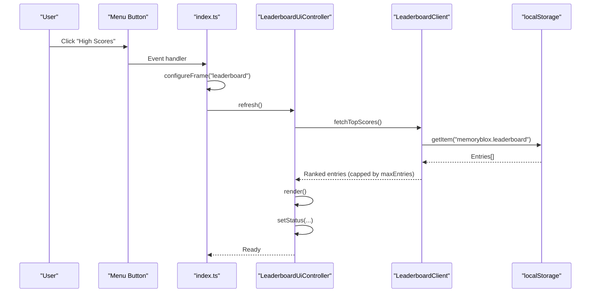
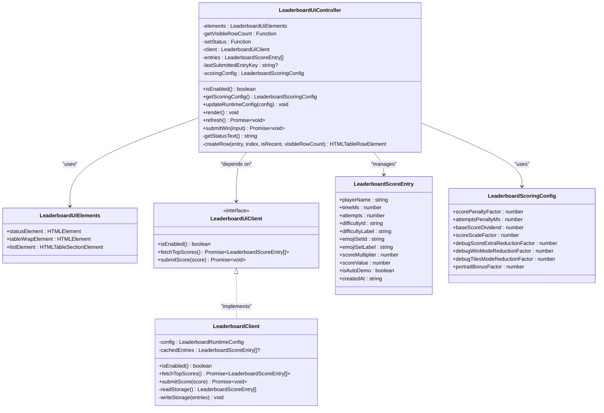
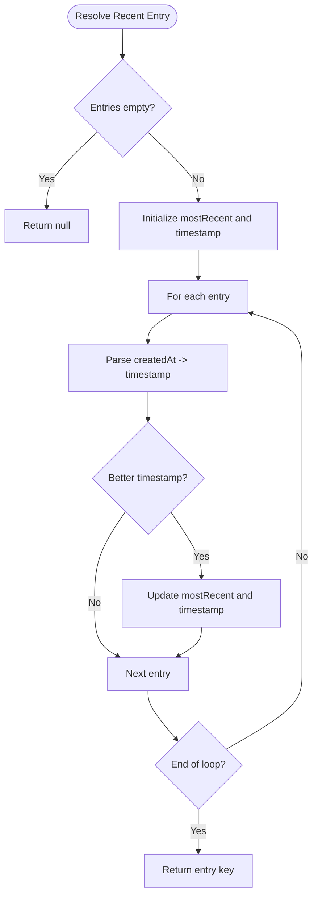
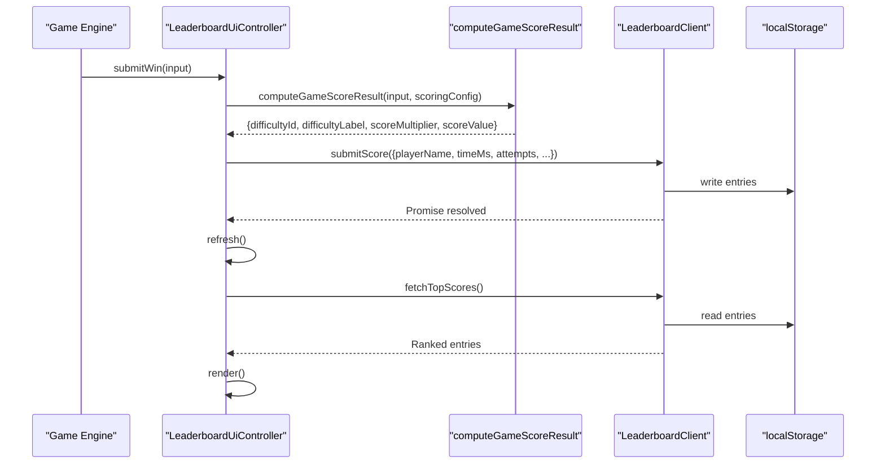
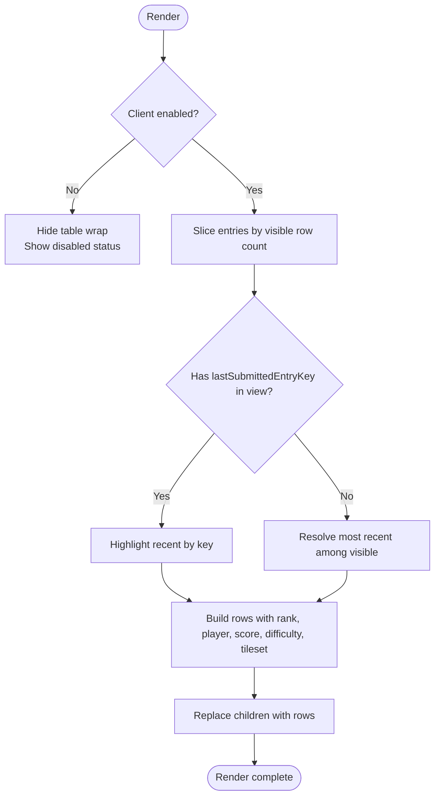
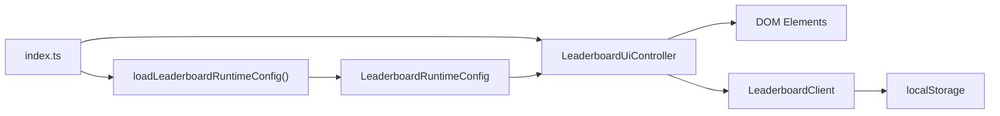

# Leaderboard UI Integration

<cite>
**Referenced Files in This Document**
- [index.html](file://index.html)
- [leaderboard-ui.ts](file://src/leaderboard-ui.ts)
- [leaderboard-view.ts](file://src/leaderboard-view.ts)
- [leaderboard.ts](file://src/leaderboard.ts)
- [index.ts](file://src/index.ts)
- [runtime-config.ts](file://src/runtime-config.ts)
- [ui.ts](file://src/ui.ts)
- [leaderboard.cfg](file://config/leaderboard.cfg)
- [leaderboard.data.json](file://config/leaderboard.data.json)
- [styles.css](file://styles.css)
- [leaderboard-ui.test.ts](file://tests/leaderboard-ui.test.ts)
- [leaderboard-view.test.ts](file://tests/leaderboard-view.test.ts)
</cite>

## Table of Contents
1. [Introduction](#introduction)
2. [Project Structure](#project-structure)
3. [Core Components](#core-components)
4. [Architecture Overview](#architecture-overview)
5. [Detailed Component Analysis](#detailed-component-analysis)
6. [Dependency Analysis](#dependency-analysis)
7. [Performance Considerations](#performance-considerations)
8. [Troubleshooting Guide](#troubleshooting-guide)
9. [Conclusion](#conclusion)

## Introduction
This document explains the leaderboard UI integration, focusing on the presentation layer and user interaction patterns. It covers the leaderboard-view component architecture, data binding, real-time updates, state management, loading and error handling, responsive design, accessibility, cross-device compatibility, and integration with the main game UI and navigation flow.

## Project Structure
The leaderboard UI is implemented as a cohesive module integrated into the main application bootstrap. Key elements:
- HTML template defines the leaderboard panel with status, table, and back button.
- Controller manages UI state, rendering, and user interactions.
- Client handles local storage-backed leaderboard persistence.
- View utilities support row creation and identity resolution.
- Runtime configuration controls visibility and limits.

```mermaid
graph TB
subgraph "HTML Template"
LFrame["#leaderboardFrame"]
LPanel[".leaderboard-panel"]
LStatus[".leaderboard-status"]
LTableWrap[".leaderboard-table-wrap"]
LTable["table.leaderboard-table"]
LHead["thead"]
LBody["tbody#leaderboardList"]
LBack[".leaderboard-back-btn"]
end
subgraph "UI Controller"
Controller["LeaderboardUiController"]
Elements["LeaderboardUiElements<br/>statusElement, tableWrapElement, listElement"]
GetVisible["getVisibleRowCount()"]
SetStatus["setStatus(message)"]
end
subgraph "Client Layer"
Client["LeaderboardClient (localStorage)"]
Storage["localStorage.memoryblox.leaderboard"]
end
subgraph "Bootstrap"
Bootstrap["index.ts"]
Runtime["loadLeaderboardRuntimeConfig()"]
Config["LeaderboardRuntimeConfig"]
end
LFrame --> LPanel
LPanel --> LStatus
LPanel --> LTableWrap
LTableWrap --> LTable
LTable --> LHead
LTable --> LBody
LPanel --> LBack
Bootstrap --> Controller
Controller --> Elements
Controller --> GetVisible
Controller --> SetStatus
Controller --> Client
Client --> Storage
Bootstrap --> Runtime
Runtime --> Config
Config --> Controller
```

**Diagram sources**
- [index.html:40-59](file://index.html#L40-L59)
- [leaderboard-ui.ts:32-49](file://src/leaderboard-ui.ts#L32-L49)
- [leaderboard-ui.ts:51-71](file://src/leaderboard-ui.ts#L51-L71)
- [leaderboard.ts:362-455](file://src/leaderboard.ts#L362-L455)
- [index.ts:269-280](file://src/index.ts#L269-L280)
- [index.ts:846-900](file://src/index.ts#L846-L900)

**Section sources**
- [index.html:40-59](file://index.html#L40-L59)
- [leaderboard-ui.ts:32-49](file://src/leaderboard-ui.ts#L32-L49)
- [leaderboard-ui.ts:51-71](file://src/leaderboard-ui.ts#L51-L71)
- [leaderboard.ts:362-455](file://src/leaderboard.ts#L362-L455)
- [index.ts:269-280](file://src/index.ts#L269-L280)
- [index.ts:846-900](file://src/index.ts#L846-L900)

## Core Components
- LeaderboardUiController: Orchestrates rendering, submission, and status messaging. Manages client switching and scoring configuration updates.
- LeaderboardClient: Encapsulates local storage operations for leaderboard entries with normalization and ranking.
- View utilities: Provide deterministic entry keys, submission identity, and resolution of most recent/most recent matching entries.
- UI elements: Status text, table container, and tbody list bound by the controller.
- Runtime configuration: Controls enablement, max entries, and scoring parameters.

Key responsibilities:
- Rendering: Creates table rows with rank, player, score, difficulty, and tileset columns; highlights recent submissions.
- Submission: Computes score result, submits to client, refreshes, and sets status messages.
- State: Tracks entries, last submitted entry key, and scoring configuration.
- Error handling: Reports submission failures and refresh failures with user-friendly messages.

**Section sources**
- [leaderboard-ui.ts:51-234](file://src/leaderboard-ui.ts#L51-L234)
- [leaderboard.ts:362-455](file://src/leaderboard.ts#L362-L455)
- [leaderboard-view.ts:1-110](file://src/leaderboard-view.ts#L1-L110)

## Architecture Overview
The leaderboard UI follows a clean separation of concerns:
- Presentation: HTML template defines the leaderboard panel structure.
- Controller: LeaderboardUiController binds DOM elements and orchestrates rendering and submission.
- Data: LeaderboardClient persists and retrieves entries from localStorage.
- Scoring: computeGameScoreResult integrates with LeaderboardUiController to produce score values.
- Navigation: Bootstrap wires menu buttons to show the leaderboard frame and triggers refresh.



**Diagram sources**
- [index.ts:1030-1032](file://src/index.ts#L1030-L1032)
- [index.ts:402-420](file://src/index.ts#L402-L420)
- [leaderboard-ui.ts:114-117](file://src/leaderboard-ui.ts#L114-L117)
- [leaderboard.ts:424-430](file://src/leaderboard.ts#L424-L430)

**Section sources**
- [index.ts:1030-1032](file://src/index.ts#L1030-L1032)
- [index.ts:402-420](file://src/index.ts#L402-L420)
- [leaderboard-ui.ts:114-117](file://src/leaderboard-ui.ts#L114-L117)
- [leaderboard.ts:424-430](file://src/leaderboard.ts#L424-L430)

## Detailed Component Analysis

### LeaderboardUiController
Responsibilities:
- Manage UI state: entries, last submitted entry key, scoring configuration.
- Render leaderboard: cap entries by visible row count, highlight recent submission if in view, create table rows.
- Refresh and submit: fetch top scores, compute score result, submit score, refresh, and set status.
- Status messaging: reflect enablement, empty state, and sort order.

Rendering logic:
- Cap entries to getVisibleRowCount().
- Determine recent entry key: prefer last submitted entry if present in view; otherwise, most recent among visible entries.
- Create row cells: rank, player, score, difficulty, tileset; append suffixes for auto-demo and debug difficulty.

Submission flow:
- Compute score result using current scoring configuration.
- Submit score to client; if successful, refresh and set last submitted entry key.
- Report outcomes via setStatus with user-friendly messages.



**Diagram sources**
- [leaderboard-ui.ts:32-49](file://src/leaderboard-ui.ts#L32-L49)
- [leaderboard-ui.ts:51-234](file://src/leaderboard-ui.ts#L51-L234)
- [leaderboard.ts:4-13](file://src/leaderboard.ts#L4-L13)
- [leaderboard.ts:21-33](file://src/leaderboard.ts#L21-L33)
- [leaderboard.ts:362-455](file://src/leaderboard.ts#L362-L455)

**Section sources**
- [leaderboard-ui.ts:51-234](file://src/leaderboard-ui.ts#L51-L234)
- [leaderboard.ts:4-13](file://src/leaderboard.ts#L4-L13)
- [leaderboard.ts:21-33](file://src/leaderboard.ts#L21-L33)
- [leaderboard.ts:362-455](file://src/leaderboard.ts#L362-L455)

### View Utilities and Identity Resolution
Purpose:
- createLeaderboardEntryKey: Deterministic key for an entry to compare rows.
- createLeaderboardSubmissionIdentity: Identity for submission matching, excluding createdAt.
- resolveLastSubmittedLeaderboardEntryKey: Most recent matching submission among entries.
- resolveMostRecentLeaderboardEntryKey: Most recent entry by timestamp.

Behavior:
- Robust timestamp handling: prefers valid dates, falls back to string comparison.
- Identity excludes createdAt to match repeated submissions of the same game conditions.



**Diagram sources**
- [leaderboard-view.ts:82-109](file://src/leaderboard-view.ts#L82-L109)
- [leaderboard-view.ts:50-80](file://src/leaderboard-view.ts#L50-L80)

**Section sources**
- [leaderboard-view.ts:1-110](file://src/leaderboard-view.ts#L1-L110)

### Scoring and Client Integration
Scoring computation:
- computeGameScoreResult: Calculates score multiplier and value considering difficulty, session mode, tile multiplier, portrait mode, and penalties.
- LeaderboardClient: Persists entries to localStorage, normalizes payloads, ranks entries, and caps by maxEntries.



**Diagram sources**
- [leaderboard-ui.ts:119-172](file://src/leaderboard-ui.ts#L119-L172)
- [leaderboard.ts:476-526](file://src/leaderboard.ts#L476-L526)
- [leaderboard.ts:432-454](file://src/leaderboard.ts#L432-L454)

**Section sources**
- [leaderboard-ui.ts:119-172](file://src/leaderboard-ui.ts#L119-L172)
- [leaderboard.ts:476-526](file://src/leaderboard.ts#L476-L526)
- [leaderboard.ts:432-454](file://src/leaderboard.ts#L432-L454)

### UI State Management, Loading, and Error Handling
- State: entries array, lastSubmittedEntryKey, scoringConfig, and client instance.
- Loading: setStatus reflects enablement and empty state; table wrap hidden when disabled.
- Error handling: Submission failures log warnings and set user-facing messages; refresh failures after submission also reported.



**Diagram sources**
- [leaderboard-ui.ts:86-112](file://src/leaderboard-ui.ts#L86-L112)

**Section sources**
- [leaderboard-ui.ts:86-112](file://src/leaderboard-ui.ts#L86-L112)
- [leaderboard-ui.ts:119-172](file://src/leaderboard-ui.ts#L119-L172)

### Responsive Design, Accessibility, and Cross-Device Compatibility
- Responsive layout: Uses Tailwind and DaisyUI utilities (.dui-table, .dui-table-xs) for compactness on smaller screens.
- Accessibility: Status elements use role="status" and aria-atomic="true"; table has aria-label; buttons include aria-label and aria-pressed where applicable.
- Cross-device: Bootstrap applies orientation-specific board layouts and toggles orientation button visibility per frame; leaderboard frame hides orientation toggle to simplify UX.

**Section sources**
- [index.html:40-59](file://index.html#L40-L59)
- [index.ts:390-400](file://src/index.ts#L390-L400)
- [index.ts:521-545](file://src/index.ts#L521-L545)
- [styles.css:8-11](file://styles.css#L8-L11)

### Integration with Main Game UI and Navigation Flow
- Navigation: Menu button "High Scores" switches to leaderboard frame, configures chrome, resets effects, and triggers refresh.
- Data binding: Controller receives DOM elements and a function to determine visible row count; status updates via shared UiView.
- Runtime config: Bootstrap loads leaderboard runtime config and updates controller; controller renders immediately after config load.

**Section sources**
- [index.ts:1030-1032](file://src/index.ts#L1030-L1032)
- [index.ts:402-420](file://src/index.ts#L402-L420)
- [index.ts:846-900](file://src/index.ts#L846-L900)
- [leaderboard-ui.ts:269-280](file://src/leaderboard-ui.ts#L269-L280)

## Dependency Analysis
- Controller depends on:
  - DOM elements (status, table wrap, list)
  - getVisibleRowCount function
  - setStatus callback
  - LeaderboardClient interface (default implementation provided)
- Client depends on:
  - localStorage for persistence
  - Normalization and ranking utilities
  - Runtime scoring configuration
- Bootstrap coordinates:
  - Loads runtime configs
  - Initializes controller with DOM elements and runtime config
  - Wires navigation events



**Diagram sources**
- [index.ts:269-280](file://src/index.ts#L269-L280)
- [index.ts:846-900](file://src/index.ts#L846-L900)
- [leaderboard.ts:362-455](file://src/leaderboard.ts#L362-L455)

**Section sources**
- [index.ts:269-280](file://src/index.ts#L269-L280)
- [index.ts:846-900](file://src/index.ts#L846-L900)
- [leaderboard.ts:362-455](file://src/leaderboard.ts#L362-L455)

## Performance Considerations
- Rendering cost: Sorting and ranking are O(n log n); capped by visible row count and maxEntries to limit DOM operations.
- Storage I/O: Reads/writes are synchronous wrappers around localStorage; payload size guarded to prevent excessive memory usage.
- Real-time updates: refresh() replaces list children; lastSubmittedEntryKey ensures minimal re-rendering for highlighted row.
- Scrolling and responsiveness: getVisibleRowCount and runtime config control visible entries to maintain smooth scrolling on small screens.

[No sources needed since this section provides general guidance]

## Troubleshooting Guide
Common issues and resolutions:
- Leaderboard disabled: Controller hides table wrap and shows disabled status; verify runtime config enablement.
- Empty leaderboard: Controller shows "No scores yet. Be the first!" and hides table wrap when entries are absent.
- Submission failures: Controller logs warnings and sets "Leaderboard submit failed." message; verify localStorage availability.
- Refresh failures after submission: Controller logs warnings and sets "Score saved, but leaderboard refresh failed."
- Visibility issues: If last submitted entry is outside visible range, no highlight is shown; adjust ui.leaderboardVisibleRowCount.

Validation references:
- Controller behavior verified in tests for disabled state, empty state, row rendering, highlighting, and status messages.
- View utilities validated for identity matching and timestamp handling.

**Section sources**
- [leaderboard-ui.test.ts:111-306](file://tests/leaderboard-ui.test.ts#L111-L306)
- [leaderboard-ui.test.ts:337-404](file://tests/leaderboard-ui.test.ts#L337-L404)
- [leaderboard-view.test.ts:56-115](file://tests/leaderboard-view.test.ts#L56-L115)

## Conclusion
The leaderboard UI integration cleanly separates presentation, state management, and persistence. It provides robust rendering, user feedback, and accessibility while remaining responsive and configurable. The controller’s design supports easy extension for future features like filtering and sorting without disrupting the existing rendering pipeline.