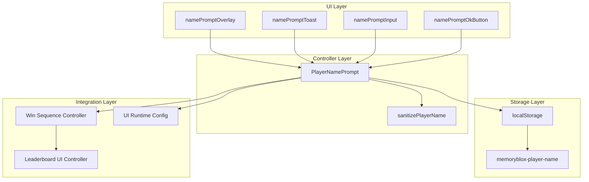
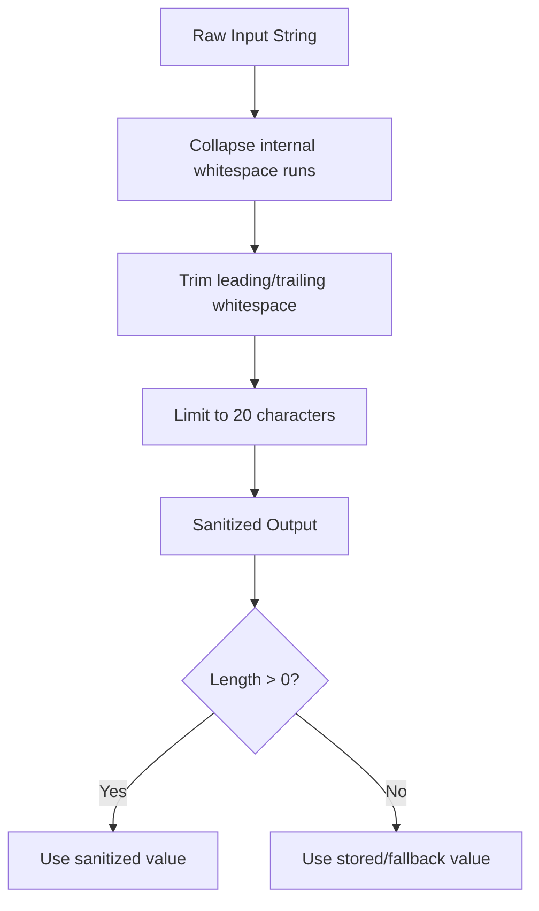
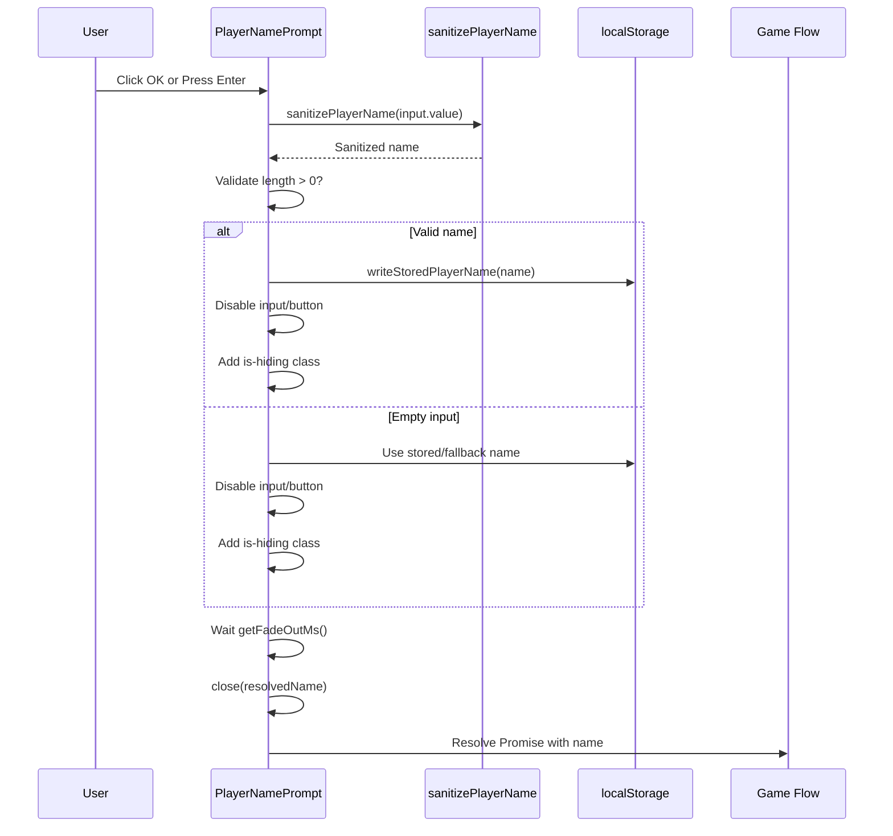
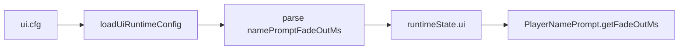
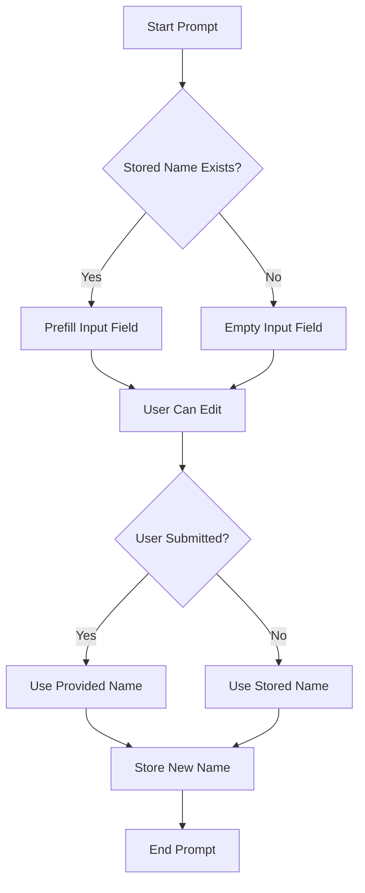
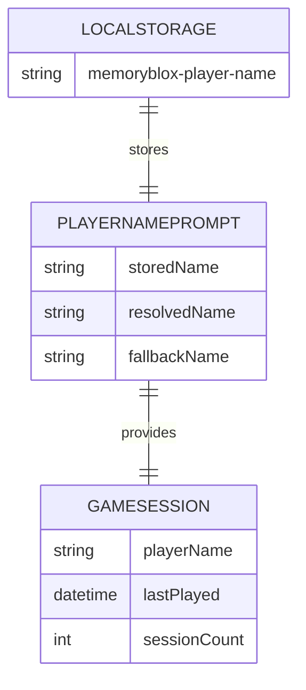

# Player Name Prompt System

<cite>
**Referenced Files in This Document**
- [player-name-prompt.ts](file://src/player-name-prompt.ts)
- [index.ts](file://src/index.ts)
- [index.html](file://index.html)
- [utils.ts](file://src/utils.ts)
- [runtime-config.ts](file://src/runtime-config.ts)
- [ui.cfg](file://config/ui.cfg)
- [runtime-config.md](file://docs/runtime-config.md)
- [player-name-prompt.test.ts](file://tests/player-name-prompt.test.ts)
- [win-flow.integration.test.ts](file://tests/win-flow.integration.test.ts)
- [leaderboard-ui.ts](file://src/leaderboard-ui.ts)
</cite>

## Table of Contents
1. [Introduction](#introduction)
2. [System Architecture](#system-architecture)
3. [Modal Dialog Implementation](#modal-dialog-implementation)
4. [Input Validation and Sanitization](#input-validation-and-sanitization)
5. [Submission Handling](#submission-handling)
6. [Integration with Score Submission Workflow](#integration-with-score-submission-workflow)
7. [Automatic Name Capture Scenarios](#automatic-name-capture-scenarios)
8. [Accessibility Features](#accessibility-features)
9. [Keyboard Navigation](#keyboard-navigation)
10. [Form Validation Feedback](#form-validation-feedback)
11. [Prompt Customization](#prompt-customization)
12. [Default Name Generation](#default-name-generation)
13. [Error Handling](#error-handling)
14. [Persistence and Cross-Session Retention](#persistence-and-cross-session-retention)
15. [Performance Considerations](#performance-considerations)
16. [Troubleshooting Guide](#troubleshooting-guide)
17. [Conclusion](#conclusion)

## Introduction

The Player Name Prompt System is a modal dialog component responsible for collecting player names during game completion events. This system integrates seamlessly with the game's win flow, automatically capturing names for demo wins while allowing manual input for regular gameplay. The system implements robust validation, persistence, and accessibility features to ensure a smooth user experience across different scenarios.

## System Architecture

The Player Name Prompt System follows a modular architecture with clear separation of concerns:



**Diagram sources**
- [player-name-prompt.ts:31-118](file://src/player-name-prompt.ts#L31-L118)
- [index.ts:260-268](file://src/index.ts#L260-L268)
- [index.html:109-124](file://index.html#L109-L124)

**Section sources**
- [player-name-prompt.ts:31-118](file://src/player-name-prompt.ts#L31-L118)
- [index.ts:260-268](file://src/index.ts#L260-L268)

## Modal Dialog Implementation

The modal dialog is implemented as a self-contained overlay system with proper accessibility attributes and visual states.

### HTML Structure and Accessibility

The modal dialog consists of several key elements with comprehensive ARIA support:

```mermaid
flowchart TD
Overlay[overlay<br/>aria-hidden="true"<br/>hidden] --> Toast[toast<br/>role="dialog"<br/>aria-modal="true"]
Toast --> Label[label<br/>id="namePromptLabel"<br/>aria-labelledby]
Toast --> Input[input<br/>type="text"<br/>maxlength="20"<br/>autocomplete="name"]
Toast --> OkBtn[okButton<br/>type="button"]
Input --> Focus[Auto-focus on show]
Input --> Select[Auto-select text]
OkBtn --> Submit[Submit handler]
```

**Diagram sources**
- [index.html:109-124](file://index.html#L109-L124)

### Visual States and Transitions

The system manages three primary visual states:

1. **Hidden State**: `hidden` attribute present, `aria-hidden="true"`
2. **Visible State**: `hidden` removed, `aria-hidden="false"`
3. **Hiding State**: `is-hiding` class added during fade-out

**Section sources**
- [index.html:109-124](file://index.html#L109-L124)
- [player-name-prompt.ts:42-57](file://src/player-name-prompt.ts#L42-L57)

## Input Validation and Sanitization

The system implements comprehensive input validation through a two-tier approach:

### Validation Rules

1. **Sanitization**: Removes invalid characters and normalizes whitespace
2. **Length Limitation**: Maximum 20 characters
3. **Fallback Resolution**: Graceful handling of empty inputs

### Sanitization Process



**Diagram sources**
- [utils.ts:139-144](file://src/utils.ts#L139-L144)

**Section sources**
- [utils.ts:139-144](file://src/utils.ts#L139-L144)
- [player-name-prompt.ts:74-77](file://src/player-name-prompt.ts#L74-L77)

## Submission Handling

The submission process follows a structured workflow with proper state management:

### Submission Flow



**Diagram sources**
- [player-name-prompt.ts:73-87](file://src/player-name-prompt.ts#L73-L87)
- [player-name-prompt.ts:84-86](file://src/player-name-prompt.ts#L84-L86)

**Section sources**
- [player-name-prompt.ts:59-117](file://src/player-name-prompt.ts#L59-L117)

## Integration with Score Submission Workflow

The player name serves as a critical component in the score submission pipeline:

### Win Flow Integration

```mermaid
flowchart TD
WinDetected[Win Detected] --> AutoDemo{Is Auto Demo?}
AutoDemo --> |Yes| UseDemoName[Use "Demo"]
AutoDemo --> |No| ShowPrompt[Show Player Name Prompt]
ShowPrompt --> UserInput[Collect User Input]
UserInput --> Sanitize[Sanitize Input]
Sanitize --> SubmitScore[Submit to Leaderboard]
UseDemoName --> SubmitScore
SubmitScore --> Celebration[Play Win Sequence]
SubmitScore --> Leaderboard[Leaderboard UI Controller]
Leaderboard --> UpdateUI[Update Leaderboard Display]
```

**Diagram sources**
- [index.ts:716-762](file://src/index.ts#L716-L762)
- [leaderboard-ui.ts:119-172](file://src/leaderboard-ui.ts#L119-L172)

**Section sources**
- [index.ts:716-762](file://src/index.ts#L716-L762)
- [leaderboard-ui.ts:119-172](file://src/leaderboard-ui.ts#L119-L172)

## Automatic Name Capture Scenarios

The system handles automatic name capture for demo mode without user intervention:

### Demo Mode Behavior

| Scenario | Action | Result |
|----------|--------|---------|
| Auto Demo Win | `selectionSource === "demo"` | Uses "Demo" as player name |
| Manual Play Win | Normal gameplay | Shows name prompt |
| Stored Name Available | Previous session | Prefills input field |
| No Stored Name | First-time user | Shows empty input |

**Section sources**
- [index.ts:716-718](file://src/index.ts#L716-L718)
- [player-name-prompt.ts:62-63](file://src/player-name-prompt.ts#L62-L63)

## Accessibility Features

The system implements comprehensive accessibility features following WCAG guidelines:

### ARIA Attributes and Roles

- **Dialog Role**: `role="dialog"` on the toast container
- **Modal State**: `aria-modal="true"` indicates modal behavior
- **Label Association**: `aria-labelledby` links to the prompt label
- **Hidden State**: `aria-hidden="true/false"` manages screen reader visibility
- **Input Label**: `aria-label="Player name"` for assistive technologies

### Focus Management

- **Auto-focus**: Input receives focus when prompt opens
- **Auto-select**: Text is automatically selected for quick editing
- **Tab Navigation**: Proper tab order maintained through form elements

**Section sources**
- [index.html:110-121](file://index.html#L110-L121)
- [player-name-prompt.ts:112-114](file://src/player-name-prompt.ts#L112-L114)

## Keyboard Navigation

The system supports full keyboard interaction for accessibility compliance:

### Keyboard Shortcuts

| Key | Action | Description |
|-----|--------|-------------|
| `Enter` | Submit | Submits the current input value |
| `Escape` | Cancel | Currently handled by browser default behavior |
| `Tab` | Navigate | Moves focus between input and button |
| `Shift+Tab` | Navigate | Moves focus in reverse order |

### Event Handling

The system captures and processes keyboard events specifically for the Enter key, preventing default behavior and triggering form submission.

**Section sources**
- [player-name-prompt.ts:89-96](file://src/player-name-prompt.ts#L89-L96)

## Form Validation Feedback

The system provides immediate feedback through visual and behavioral cues:

### Real-time Validation

- **Input Disabled**: During submission process to prevent duplicate submissions
- **Button Disabled**: Prevents multiple click submissions
- **Fade-out Animation**: Visual indication that submission is in progress
- **Promise Resolution**: Returns validated name to calling code

### Error Prevention

- **Immediate Sanitization**: Invalid characters removed before validation
- **Length Enforcement**: Automatic truncation to 20-character limit
- **Whitespace Normalization**: Multiple spaces collapsed to single spaces

**Section sources**
- [player-name-prompt.ts:80-82](file://src/player-name-prompt.ts#L80-L82)
- [player-name-prompt.ts:74-77](file://src/player-name-prompt.ts#L74-L77)

## Prompt Customization

The system offers runtime customization through configuration files:

### Configuration Options

| Setting | Type | Default | Description |
|---------|------|---------|-------------|
| `ui.namePromptFadeOutMs` | Integer | 220 | Fade-out duration in milliseconds |
| `namePromptOverlay` | CSS Class | `name-prompt-overlay` | Container styling |
| `namePromptToast` | CSS Class | `name-prompt-toast` | Dialog styling |
| `namePromptInput` | CSS Class | `name-prompt-input` | Input field styling |
| `namePromptOkBtn` | CSS Class | `name-prompt-ok-btn` | Button styling |

### Runtime Configuration Loading

The system dynamically loads configuration values during application initialization:



**Diagram sources**
- [runtime-config.ts:289-301](file://src/runtime-config.ts#L289-L301)
- [ui.cfg:24](file://config/ui.cfg#L24)

**Section sources**
- [runtime-config.ts:289-301](file://src/runtime-config.ts#L289-L301)
- [ui.cfg:24](file://config/ui.cfg#L24)
- [runtime-config.md:42-43](file://docs/runtime-config.md#L42-L43)

## Default Name Generation

The system implements intelligent default name resolution:

### Priority Order

1. **Stored Name**: Previously saved player name from localStorage
2. **Fallback Name**: "Player" when no stored name exists
3. **Demo Name**: "Demo" for automated gameplay scenarios

### Storage Mechanism



**Diagram sources**
- [player-name-prompt.ts:62-63](file://src/player-name-prompt.ts#L62-L63)
- [player-name-prompt.ts:47-48](file://src/player-name-prompt.ts#L47-L48)

**Section sources**
- [player-name-prompt.ts:47-48](file://src/player-name-prompt.ts#L47-L48)
- [player-name-prompt.ts:62-63](file://src/player-name-prompt.ts#L62-L63)

## Error Handling

The system implements robust error handling and graceful degradation:

### Error Scenarios

1. **Invalid Input**: Empty or whitespace-only strings
2. **Storage Failures**: localStorage unavailability
3. **Configuration Errors**: Missing or malformed config values
4. **Race Conditions**: Prompt closure during submission

### Error Recovery Strategies

- **Graceful Degradation**: Falls back to "Player" for empty inputs
- **State Cleanup**: Ensures proper cleanup of event listeners
- **Promise Resolution**: Always resolves with a valid name
- **Visual Feedback**: Clear indication of submission state

**Section sources**
- [player-name-prompt.ts:74-77](file://src/player-name-prompt.ts#L74-L77)
- [player-name-prompt.ts:42-57](file://src/player-name-prompt.ts#L42-L57)

## Persistence and Cross-Session Retention

The system implements reliable persistence using browser localStorage:

### Storage Strategy



**Diagram sources**
- [player-name-prompt.ts:3](file://src/player-name-prompt.ts#L3)
- [player-name-prompt.ts:5-18](file://src/player-name-prompt.ts#L5-L18)

### Persistence Features

- **Cross-Session Retention**: Names persist between browser sessions
- **Automatic Prefill**: Previous names automatically populated
- **Trimming**: Excess whitespace automatically removed
- **Validation**: Ensures only meaningful names are stored

**Section sources**
- [player-name-prompt.ts:5-18](file://src/player-name-prompt.ts#L5-L18)

## Performance Considerations

The system is optimized for minimal performance impact:

### Optimization Strategies

1. **Lazy Loading**: Prompt only initialized when needed
2. **Efficient DOM Access**: Elements cached during construction
3. **Minimal Re-rendering**: CSS classes preferred over DOM manipulation
4. **Event Delegation**: Single event listeners for cleanup
5. **Timeout Management**: Proper cleanup of async operations

### Memory Management

- **Weak References**: No circular references maintained
- **Event Listener Cleanup**: All listeners removed on close
- **Promise Resolution**: Ensures garbage collection of pending promises
- **Timeout Cleanup**: Proper cleanup of fade-out timeouts

## Troubleshooting Guide

Common issues and their solutions:

### Prompt Not Appearing

**Symptoms**: Prompt fails to show when expected
**Causes**: 
- Missing DOM elements
- Incorrect selectors
- CSS display issues
**Solutions**:
- Verify HTML structure matches selectors
- Check CSS display properties
- Ensure proper initialization order

### Input Not Accepting Values

**Symptoms**: Cannot type in input field
**Causes**:
- Input disabled state
- Focus issues
- Event handler conflicts
**Solutions**:
- Check for disabled attribute
- Verify focus management
- Review event listener conflicts

### Name Not Persisting

**Symptoms**: Name not remembered between sessions
**Causes**:
- localStorage disabled
- Storage quota exceeded
- Browser privacy settings
**Solutions**:
- Test localStorage availability
- Check browser developer tools
- Verify storage permissions

**Section sources**
- [player-name-prompt.test.ts:36-60](file://tests/player-name-prompt.test.ts#L36-L60)
- [player-name-prompt.test.ts:100-116](file://tests/player-name-prompt.test.ts#L100-L116)

## Conclusion

The Player Name Prompt System provides a robust, accessible, and user-friendly solution for collecting player names during game completion events. Its modular architecture ensures maintainability while comprehensive validation and persistence mechanisms guarantee reliability across different scenarios. The system's integration with the broader game architecture enables seamless score submission and leaderboard integration, while its accessibility features ensure inclusivity for all users.

The implementation demonstrates best practices in modern web development, including proper state management, error handling, and performance optimization. The system's extensibility through configuration files allows for easy customization without modifying core functionality, making it adaptable to various deployment scenarios and user requirements.