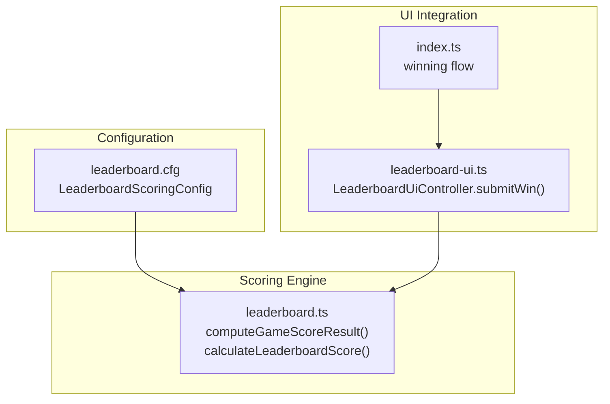
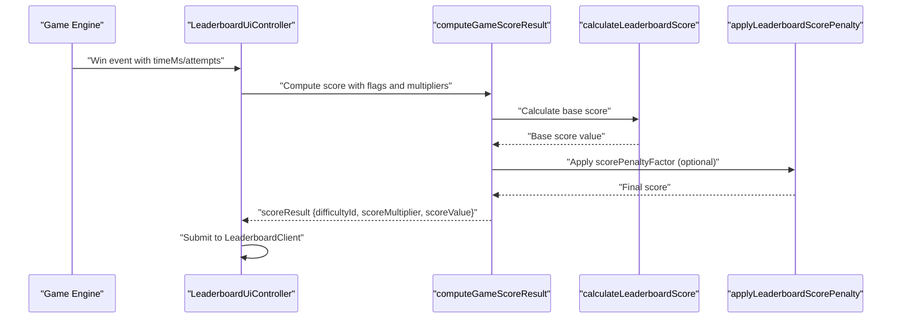
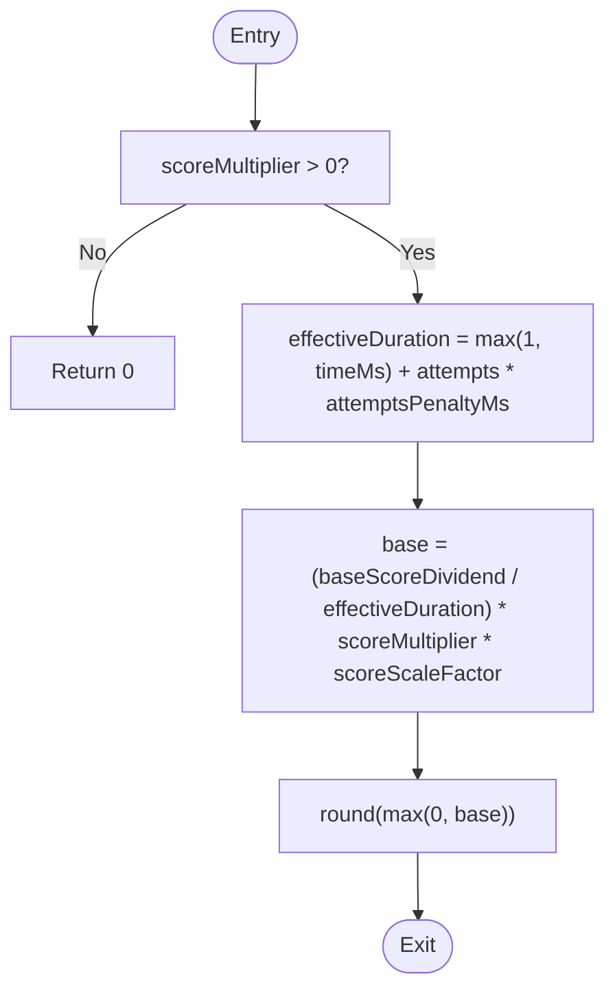
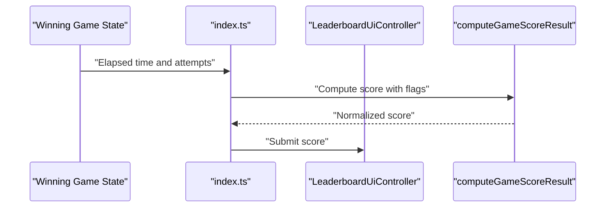
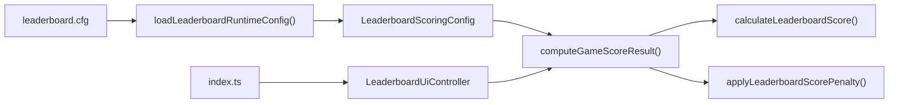

# Score Calculation Algorithm

<cite>
**Referenced Files in This Document**
- [leaderboard.ts](file://src/leaderboard.ts)
- [leaderboard.cfg](file://config/leaderboard.cfg)
- [leaderboard-ui.ts](file://src/leaderboard-ui.ts)
- [index.ts](file://src/index.ts)
- [leaderboard.test.ts](file://tests/leaderboard.test.ts)
- [session-score.ts](file://src/session-score.ts)
</cite>

## Table of Contents
1. [Introduction](#introduction)
2. [Project Structure](#project-structure)
3. [Core Components](#core-components)
4. [Architecture Overview](#architecture-overview)
5. [Detailed Component Analysis](#detailed-component-analysis)
6. [Dependency Analysis](#dependency-analysis)
7. [Performance Considerations](#performance-considerations)
8. [Troubleshooting Guide](#troubleshooting-guide)
9. [Conclusion](#conclusion)

## Introduction
This document explains the score calculation algorithm used for computing normalized leaderboard scores. It covers the mathematical formula, scoring mechanics, configuration parameters, penalty reductions for debug modes and auto-demo sessions, tile multiplier impacts, portrait bonus calculations, and edge cases. Practical examples illustrate how different game scenarios influence final scores, and code references guide you to the exact implementation locations.

## Project Structure
The scoring logic is centralized in the leaderboard module and integrated into the UI and game flow:
- Scoring engine and normalization: leaderboard.ts
- Runtime configuration: leaderboard.cfg
- UI integration and submission: leaderboard-ui.ts
- Game flow integration: index.ts
- Tests validating scoring behavior: leaderboard.test.ts
- Player selection normalization for auto-demo: session-score.ts

**Diagram sources**
- [leaderboard.ts:476-526](file://src/leaderboard.ts#L476-L526)
- [leaderboard.cfg:1-17](file://config/leaderboard.cfg#L1-L17)
- [leaderboard-ui.ts:119-172](file://src/leaderboard-ui.ts#L119-L172)
- [index.ts:736-762](file://src/index.ts#L736-L762)

**Section sources**
- [leaderboard.ts:1-541](file://src/leaderboard.ts#L1-L541)
- [leaderboard.cfg:1-17](file://config/leaderboard.cfg#L1-L17)
- [leaderboard-ui.ts:1-234](file://src/leaderboard-ui.ts#L1-L234)
- [index.ts:730-929](file://src/index.ts#L730-L929)

## Core Components
- LeaderboardScoringConfig: Defines all tunable parameters for the scoring model.
- computeGameScoreResult: Orchestrates multiplier adjustments, base score calculation, penalties, and final score derivation.
- calculateLeaderboardScore: Implements the core time-based scoring formula with attempt penalties and scaling.
- LeaderboardClient: Persists and ranks scores locally.

Key configuration parameters:
- scorePenaltyFactor: Global multiplicative factor applied to score multipliers and penalties.
- attemptsPenaltyMs: Penalty contribution per attempt to the effective duration.
- baseScoreDividend: Numerator constant in the base score formula.
- scoreScaleFactor: Scaling multiplier for final score magnitude.
- debugScoreExtraReductionFactor: Additional reduction for debug category scores.
- debugWinModeReductionFactor: Reduction for debug wins outside debug-tiles mode.
- debugTilesModeReductionFactor: Extra reduction for debug-tiles mode.
- portraitBonusFactor: Bonus multiplier for portrait orientation.

**Section sources**
- [leaderboard.ts:4-13](file://src/leaderboard.ts#L4-L13)
- [leaderboard.ts:74-87](file://src/leaderboard.ts#L74-L87)
- [leaderboard.cfg:8-16](file://config/leaderboard.cfg#L8-L16)
- [leaderboard.ts:476-526](file://src/leaderboard.ts#L476-L526)

## Architecture Overview
The scoring pipeline integrates game metrics (time, attempts, difficulty), session flags (debug/auto-demo), and device orientation into a normalized score.

**Diagram sources**
- [leaderboard-ui.ts:119-172](file://src/leaderboard-ui.ts#L119-L172)
- [leaderboard.ts:476-526](file://src/leaderboard.ts#L476-L526)
- [leaderboard.ts:136-153](file://src/leaderboard.ts#L136-L153)
- [leaderboard.ts:129-134](file://src/leaderboard.ts#L129-L134)

## Detailed Component Analysis

### Mathematical Formula and Scoring Mechanics
The base score is computed from the effective duration and score multiplier, then scaled and rounded to an integer. Attempt penalties increase the effective duration to penalize slower completion.

Core formula breakdown:
- Effective duration = max(1, timeMs) + (max(0, attempts) × attemptsPenaltyMs)
- Base score = (baseScoreDividend / effectiveDuration) × scoreMultiplier × scoreScaleFactor
- Final score = round(max(0, Base score))

Penalties and reductions:
- Multiplier penalties: scoreMultiplier is multiplied by scorePenaltyFactor when debug or auto-demo conditions apply.
- Category-specific reductions: debug category scores are further reduced by debugScoreExtraReductionFactor; debug wins outside debug-tiles incur debugWinModeReductionFactor; debug-tiles mode incurs debugTilesModeReductionFactor.
- Portrait bonus: scoreMultiplier is multiplied by portraitBonusFactor when isPortraitMode is true.
- Tile multiplier penalty: scoreMultiplier is divided by max(1, tileMultiplier) to reflect higher tile counts.

Edge cases:
- Non-positive scoreMultiplier yields a final score of 0.
- Negative or invalid inputs are clamped to non-negative values.
- usedFlipTiles forces scoreValue to 0.

**Section sources**
- [leaderboard.ts:136-153](file://src/leaderboard.ts#L136-L153)
- [leaderboard.ts:476-526](file://src/leaderboard.ts#L476-L526)
- [leaderboard.ts:129-134](file://src/leaderboard.ts#L129-L134)

### Scoring Configuration Parameters
The scoring model is configurable via leaderboard.cfg and loaded into LeaderboardRuntimeConfig.scoring. The default values are embedded in the module and can be overridden at runtime.

Parameters and defaults:
- scorePenaltyFactor: 0.1
- attemptsPenaltyMs: 1500
- baseScoreDividend: 1000000
- scoreScaleFactor: 1000
- debugScoreExtraReductionFactor: 0.08
- debugWinModeReductionFactor: 0.04
- debugTilesModeReductionFactor: 0.02
- portraitBonusFactor: 1.2

Validation and bounds:
- Values are clamped to safe ranges (min/max) during runtime loading.

**Section sources**
- [leaderboard.cfg:8-16](file://config/leaderboard.cfg#L8-L16)
- [leaderboard.ts:74-87](file://src/leaderboard.ts#L74-L87)
- [leaderboard.ts:300-352](file://src/leaderboard.ts#L300-L352)

### Penalty Reduction Factors for Debug Modes and Auto-Demo Sessions
- Debug category: scoreValue is additionally multiplied by debugScoreExtraReductionFactor.
- Debug-tiles mode: scoreValue is additionally multiplied by debugTilesModeReductionFactor.
- Other debug modes: scoreValue is additionally multiplied by debugWinModeReductionFactor.
- Auto-demo: scoreMultiplier is reduced by scorePenaltyFactor; base score is then reduced by scorePenaltyFactor.

These reductions ensure debug and automated runs yield lower scores than normal play.

**Section sources**
- [leaderboard.ts:498-518](file://src/leaderboard.ts#L498-L518)
- [leaderboard.ts:129-134](file://src/leaderboard.ts#L129-L134)

### Tile Multiplier Impact and Portrait Bonus Calculations
- Tile multiplier penalty: scoreMultiplier is multiplied by 1/max(1, tileMultiplier), reducing the multiplier for higher tile counts.
- Portrait bonus: when isPortraitMode is true, scoreMultiplier is multiplied by portraitBonusFactor.

These effects stack: portrait bonus increases the multiplier; tile penalty reduces it.

**Section sources**
- [leaderboard.ts:495-497](file://src/leaderboard.ts#L495-L497)
- [leaderboard.test.ts:799-840](file://tests/leaderboard.test.ts#L799-L840)

### Practical Examples of Score Computation
Below are scenario-based examples derived from the implementation and tests. Replace placeholder values with actual game metrics to compute normalized scores.

Example A: Standard game with moderate time and attempts
- Inputs: timeMs = 30000, attempts = 20, difficultyMultiplier = 1.2, tileMultiplier = 1, isPortraitMode = false, usedFlipTiles = false
- Steps:
  - Base multiplier = 1.2
  - No debug/auto-demo penalty
  - Effective duration = max(1, 30000) + (20 × 1500) = 30000 + 30000 = 60000
  - Base score ≈ (1000000 / 60000) × 1.2 × 1000 ≈ 20000
  - Rounded score ≈ 20000

Example B: Debug category with debug-tiles mode
- Inputs: same as Example A, plus scoreCategory = "debug", sessionMode = "debug-tiles"
- Steps:
  - Apply debug multiplier reduction by scorePenaltyFactor
  - Apply debugScoreExtraReductionFactor
  - Apply debugTilesModeReductionFactor
  - Final score ≈ reduced value

Example C: Portrait bonus and tile penalty combined
- Inputs: tileMultiplier = 2, isPortraitMode = true
- Steps:
  - Adjusted multiplier = 1.2 × 1.2 (portrait) × 0.5 (tile penalty) = 0.72
  - Recalculate base score with adjusted multiplier
  - Apply penalties if applicable

Example D: Used flip tiles
- Inputs: usedFlipTiles = true
- Result: scoreValue = 0

Example E: Auto-demo scoring
- Inputs: isAutoDemoScore = true
- Steps:
  - Reduce scoreMultiplier by scorePenaltyFactor
  - Recalculate base score and apply scorePenaltyFactor again

Notes:
- These examples illustrate the algorithmic flow; actual values depend on exact configuration and inputs.

**Section sources**
- [leaderboard.ts:476-526](file://src/leaderboard.ts#L476-L526)
- [leaderboard.test.ts:649-867](file://tests/leaderboard.test.ts#L649-L867)

### Code Reference: calculateLeaderboardScore Function
The function computes the base score using the core formula and applies rounding and non-negativity constraints.

**Diagram sources**
- [leaderboard.ts:136-153](file://src/leaderboard.ts#L136-L153)

**Section sources**
- [leaderboard.ts:136-153](file://src/leaderboard.ts#L136-L153)

### Integration Points
- UI submission: LeaderboardUiController.submitWin constructs inputs and calls computeGameScoreResult, then persists the score.
- Game flow: The winning path in index.ts gathers timeMs and attempts, computes the score, and triggers submission.

**Diagram sources**
- [index.ts:736-762](file://src/index.ts#L736-L762)
- [leaderboard-ui.ts:119-172](file://src/leaderboard-ui.ts#L119-L172)
- [leaderboard.ts:476-526](file://src/leaderboard.ts#L476-L526)

**Section sources**
- [leaderboard-ui.ts:119-172](file://src/leaderboard-ui.ts#L119-L172)
- [index.ts:736-762](file://src/index.ts#L736-L762)

### Edge Cases and Floating-Point Precision Handling
- Minimum score threshold: Scores are clamped to non-negative values; the base score is rounded to integers.
- Non-positive multipliers: Yields a final score of 0.
- Invalid inputs: Normalization routines clamp negative or invalid numeric inputs to non-negative values.
- Precision: Intermediate computations use floating-point arithmetic; final score is rounded to the nearest integer.

**Section sources**
- [leaderboard.ts:136-153](file://src/leaderboard.ts#L136-L153)
- [leaderboard.ts:172-243](file://src/leaderboard.ts#L172-L243)

## Dependency Analysis
The scoring module depends on runtime configuration and integrates with UI and game flow.

**Diagram sources**
- [leaderboard.cfg:1-17](file://config/leaderboard.cfg#L1-L17)
- [leaderboard.ts:300-352](file://src/leaderboard.ts#L300-L352)
- [leaderboard.ts:476-526](file://src/leaderboard.ts#L476-L526)
- [leaderboard.ts:136-153](file://src/leaderboard.ts#L136-L153)
- [leaderboard.ts:129-134](file://src/leaderboard.ts#L129-L134)
- [leaderboard-ui.ts:119-172](file://src/leaderboard-ui.ts#L119-L172)
- [index.ts:736-762](file://src/index.ts#L736-L762)

**Section sources**
- [leaderboard.ts:300-352](file://src/leaderboard.ts#L300-L352)
- [leaderboard.ts:476-526](file://src/leaderboard.ts#L476-L526)
- [leaderboard-ui.ts:119-172](file://src/leaderboard-ui.ts#L119-L172)
- [index.ts:736-762](file://src/index.ts#L736-L762)

## Performance Considerations
- The scoring computation is O(1) with minimal arithmetic operations.
- Rounding and clamping occur once per score calculation.
- Runtime configuration loading happens once at startup; subsequent scoring uses cached values.

## Troubleshooting Guide
Common issues and resolutions:
- Scores unexpectedly low:
  - Verify attemptsPenaltyMs and baseScoreDividend are set appropriately.
  - Confirm tileMultiplier and portraitBonusFactor are not overly penalizing the multiplier.
- Debug or auto-demo scores too high:
  - Check debugScoreExtraReductionFactor, debugWinModeReductionFactor, debugTilesModeReductionFactor, and scorePenaltyFactor.
- Scores not saved:
  - Ensure leaderboard.enabled is true and localStorage capacity is sufficient.
- Flip tiles forcing zero score:
  - Confirm usedFlipTiles is not unintentionally set to true.

**Section sources**
- [leaderboard.ts:300-352](file://src/leaderboard.ts#L300-L352)
- [leaderboard.ts:432-454](file://src/leaderboard.ts#L432-L454)
- [leaderboard.test.ts:744-757](file://tests/leaderboard.test.ts#L744-L757)

## Conclusion
The scoring algorithm combines a time-based formula with attempt penalties, difficulty multipliers, and optional reductions for debug and auto-demo contexts. Configurable parameters enable fine-tuning of score sensitivity and fairness across different play modes. The implementation ensures robustness through input validation, non-negative thresholds, and integer rounding.