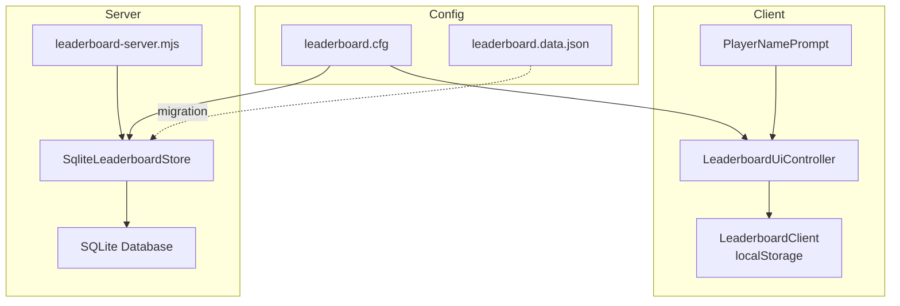
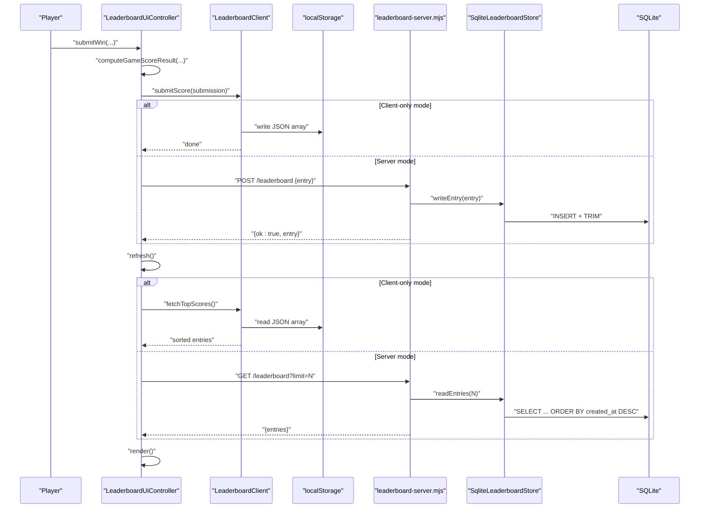
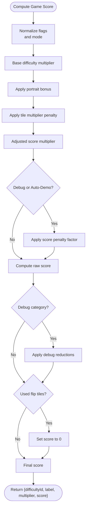
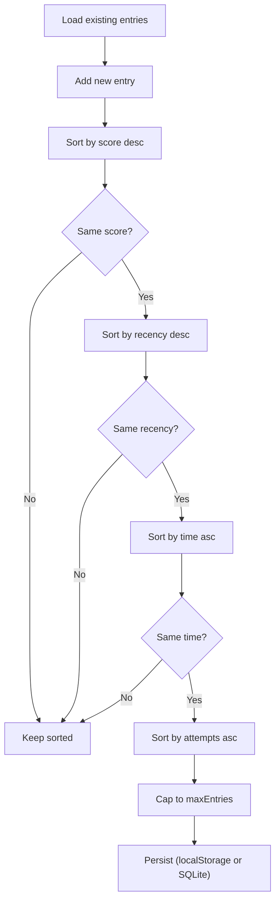
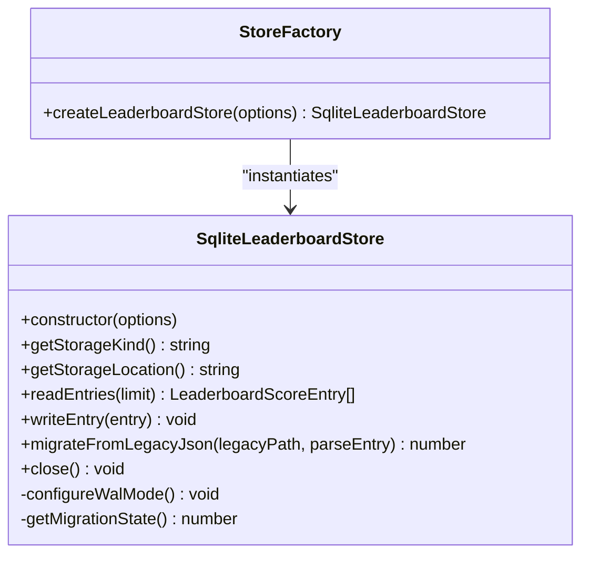
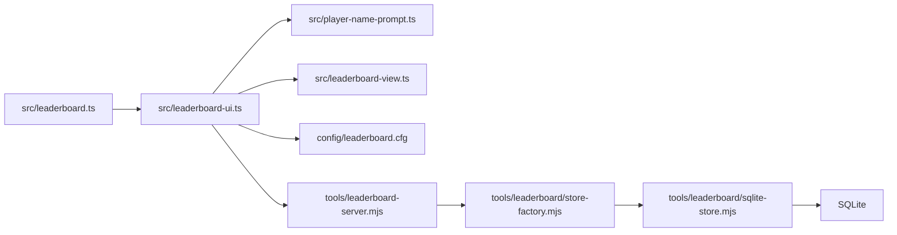

# Scoring and Leaderboards

<cite>
**Referenced Files in This Document**
- [leaderboard.ts](file://src/leaderboard.ts)
- [leaderboard-ui.ts](file://src/leaderboard-ui.ts)
- [leaderboard-view.ts](file://src/leaderboard-view.ts)
- [session-score.ts](file://src/session-score.ts)
- [player-name-prompt.ts](file://src/player-name-prompt.ts)
- [sqlite-store.mjs](file://tools/leaderboard/sqlite-store.mjs)
- [store-factory.mjs](file://tools/leaderboard/store-factory.mjs)
- [leaderboard-server.mjs](file://tools/leaderboard-server.mjs)
- [leaderboard.cfg](file://config/leaderboard.cfg)
- [leaderboard.data.json](file://config/leaderboard.data.json)
- [leaderboard.test.ts](file://tests/leaderboard.test.ts)
- [leaderboard-ui.test.ts](file://tests/leaderboard-ui.test.ts)
- [leaderboard-view.test.ts](file://tests/leaderboard-view.test.ts)
- [session-score.test.ts](file://tests/session-score.test.ts)
</cite>

## Table of Contents
1. [Introduction](#introduction)
2. [Project Structure](#project-structure)
3. [Core Components](#core-components)
4. [Architecture Overview](#architecture-overview)
5. [Detailed Component Analysis](#detailed-component-analysis)
6. [Dependency Analysis](#dependency-analysis)
7. [Performance Considerations](#performance-considerations)
8. [Troubleshooting Guide](#troubleshooting-guide)
9. [Conclusion](#conclusion)
10. [Appendices](#appendices)

## Introduction
This document describes the scoring and leaderboard system with a focus on high score persistence and ranking. It covers the SQLite database schema, score calculation algorithms, session score normalization, leaderboard API endpoints, data validation rules, retention policies, player name prompt integration, localStorage usage, and the storage adapter pattern enabling database implementation swapping. Practical examples illustrate score computation, ranking, and persistence strategies, along with performance considerations for large datasets and data migration from legacy formats.

## Project Structure
The leaderboard system spans client-side TypeScript modules and a Node.js server with a SQLite store. Key areas:
- Client-side scoring and UI: leaderboard computation, normalization, ranking, and UI rendering
- Persistence: localStorage for client, SQLite for server
- Server: HTTP endpoint for GET/POST leaderboard entries, retention trimming, and legacy migration
- Configuration: runtime config for scoring parameters and limits

**Diagram sources**
- [leaderboard-ui.ts:51-172](file://src/leaderboard-ui.ts#L51-L172)
- [leaderboard.ts:362-455](file://src/leaderboard.ts#L362-L455)
- [player-name-prompt.ts:31-117](file://src/player-name-prompt.ts#L31-L117)
- [leaderboard-server.mjs:117-153](file://tools/leaderboard-server.mjs#L117-L153)
- [sqlite-store.mjs:150-284](file://tools/leaderboard/sqlite-store.mjs#L150-L284)
- [leaderboard.cfg:1-17](file://config/leaderboard.cfg#L1-L17)
- [leaderboard.data.json:1-3](file://config/leaderboard.data.json#L1-L3)

**Section sources**
- [leaderboard.ts:1-541](file://src/leaderboard.ts#L1-L541)
- [leaderboard-ui.ts:1-234](file://src/leaderboard-ui.ts#L1-L234)
- [leaderboard-server.mjs:1-161](file://tools/leaderboard-server.mjs#L1-L161)
- [sqlite-store.mjs:1-531](file://tools/leaderboard/sqlite-store.mjs#L1-L531)
- [leaderboard.cfg:1-17](file://config/leaderboard.cfg#L1-L17)
- [leaderboard.data.json:1-3](file://config/leaderboard.data.json#L1-L3)

## Core Components
- Leaderboard scoring configuration and runtime config loader
- Score computation pipeline for game sessions
- Client-side leaderboard persistence using localStorage
- Server-side leaderboard store with SQLite and retention trimming
- Leaderboard UI controller for rendering and submission
- Player name prompt with localStorage integration
- Storage adapter factory supporting pluggable drivers
- Legacy JSON-to-SQLite migration

**Section sources**
- [leaderboard.ts:4-87](file://src/leaderboard.ts#L4-L87)
- [leaderboard.ts:476-526](file://src/leaderboard.ts#L476-L526)
- [leaderboard.ts:362-455](file://src/leaderboard.ts#L362-L455)
- [sqlite-store.mjs:150-284](file://tools/leaderboard/sqlite-store.mjs#L150-L284)
- [leaderboard-ui.ts:51-172](file://src/leaderboard-ui.ts#L51-L172)
- [player-name-prompt.ts:31-117](file://src/player-name-prompt.ts#L31-L117)
- [store-factory.mjs:16-24](file://tools/leaderboard/store-factory.mjs#L16-L24)
- [leaderboard-server.mjs:99-113](file://tools/leaderboard-server.mjs#L99-L113)

## Architecture Overview
The system supports two operational modes:
- Client-only mode: localStorage-backed leaderboard with UI rendering and submission
- Server mode: HTTP API backed by SQLite with retention trimming and optional legacy migration

**Diagram sources**
- [leaderboard-ui.ts:119-172](file://src/leaderboard-ui.ts#L119-L172)
- [leaderboard.ts:476-526](file://src/leaderboard.ts#L476-L526)
- [leaderboard.ts:432-454](file://src/leaderboard.ts#L432-L454)
- [leaderboard.ts:424-430](file://src/leaderboard.ts#L424-L430)
- [leaderboard-server.mjs:130-153](file://tools/leaderboard-server.mjs#L130-L153)
- [sqlite-store.mjs:391-399](file://tools/leaderboard/sqlite-store.mjs#L391-L399)

## Detailed Component Analysis

### Score Calculation and Normalization
- Difficulty-based score multipliers
- Attempt penalties and base score formula
- Debug and auto-demo penalties
- Portrait mode bonus and tile multiplier penalties
- Score normalization and validation for persistence

**Diagram sources**
- [leaderboard.ts:476-526](file://src/leaderboard.ts#L476-L526)

**Section sources**
- [leaderboard.ts:89-109](file://src/leaderboard.ts#L89-L109)
- [leaderboard.ts:129-134](file://src/leaderboard.ts#L129-L134)
- [leaderboard.ts:136-153](file://src/leaderboard.ts#L136-L153)
- [leaderboard.ts:476-526](file://src/leaderboard.ts#L476-L526)
- [session-score.ts:11-23](file://src/session-score.ts#L11-L23)
- [session-score.test.ts:5-45](file://tests/session-score.test.ts#L5-L45)

### Ranking and Persistence
- Ranking tiebreakers: score descending, then recency, then time, then attempts
- Client-side localStorage persistence with size guards and warnings
- Server-side SQLite persistence with WAL mode and retention trimming

**Diagram sources**
- [leaderboard.ts:269-298](file://src/leaderboard.ts#L269-L298)
- [leaderboard.ts:424-454](file://src/leaderboard.ts#L424-L454)
- [sqlite-store.mjs:260-273](file://tools/leaderboard/sqlite-store.mjs#L260-L273)

**Section sources**
- [leaderboard.ts:269-298](file://src/leaderboard.ts#L269-L298)
- [leaderboard.ts:374-422](file://src/leaderboard.ts#L374-L422)
- [sqlite-store.mjs:260-273](file://tools/leaderboard/sqlite-store.mjs#L260-L273)

### Player Name Prompt and Cross-Device Considerations
- Player name prompt reads/writes localStorage and sanitizes input
- Cross-device synchronization is not implemented; localStorage is device-bound
- For cross-device persistence, integrate a server-backed store and synchronize via API

**Section sources**
- [player-name-prompt.ts:5-18](file://src/player-name-prompt.ts#L5-L18)
- [player-name-prompt.ts:59-117](file://src/player-name-prompt.ts#L59-L117)

### Leaderboard UI Controller
- Computes score, submits to client or server, refreshes, and renders
- Highlights the most recent or submitted entry depending on visibility
- Handles disabled state and error messaging

**Section sources**
- [leaderboard-ui.ts:51-172](file://src/leaderboard-ui.ts#L51-L172)
- [leaderboard-view.ts:3-17](file://src/leaderboard-view.ts#L3-L17)
- [leaderboard-view.ts:50-80](file://src/leaderboard-view.ts#L50-L80)
- [leaderboard-ui.test.ts:132-184](file://tests/leaderboard-ui.test.ts#L132-L184)

### Storage Adapter Pattern and SQLite Schema
- Factory creates a SQLite store with configurable retention
- SQLite schema includes a scores table, a meta table for migration state, and a composite index for recency
- WAL mode is configured for improved concurrency and durability

**Diagram sources**
- [sqlite-store.mjs:150-284](file://tools/leaderboard/sqlite-store.mjs#L150-L284)
- [store-factory.mjs:16-24](file://tools/leaderboard/store-factory.mjs#L16-L24)

**Section sources**
- [sqlite-store.mjs:48-75](file://tools/leaderboard/sqlite-store.mjs#L48-L75)
- [sqlite-store.mjs:150-284](file://tools/leaderboard/sqlite-store.mjs#L150-L284)
- [store-factory.mjs:16-24](file://tools/leaderboard/store-factory.mjs#L16-L24)

### Leaderboard API Endpoints
- GET /leaderboard?limit=N: returns top N entries ordered by recency and id
- POST /leaderboard: accepts a compact JSON entry payload, validates, persists, trims, and returns the stored entry
- CORS headers and caching controls are set for public access

**Section sources**
- [leaderboard-server.mjs:130-153](file://tools/leaderboard-server.mjs#L130-L153)

### Data Validation Rules
- Required fields for entries: player name, difficulty identifiers and labels, emoji set identifiers and labels, timestamps, durations, attempts, multipliers, and scores
- Validation rejects negative durations/attempts, invalid timestamps, and malformed payloads
- Legacy fields fallback to defaults when missing

**Section sources**
- [leaderboard.ts:172-243](file://src/leaderboard.ts#L172-L243)
- [leaderboard.ts:245-267](file://src/leaderboard.ts#L245-L267)
- [leaderboard.test.ts:414-447](file://tests/leaderboard.test.ts#L414-L447)

### Retention Policies
- Client: maxEntries caps the number of stored entries after sorting
- Server: retention trimming performed after each write to maintain the configured maximum

**Section sources**
- [leaderboard.ts:313-316](file://src/leaderboard.ts#L313-L316)
- [sqlite-store.mjs:260-273](file://tools/leaderboard/sqlite-store.mjs#L260-L273)
- [leaderboard-server.mjs:51-54](file://tools/leaderboard-server.mjs#L51-L54)

### Data Migration from Legacy Formats
- One-time migration from legacy JSON to SQLite
- Deduplicates entries using identity hashing and a transaction to ensure atomicity
- Persists migration state in the meta table to prevent repeated runs

**Section sources**
- [sqlite-store.mjs:442-529](file://tools/leaderboard/sqlite-store.mjs#L442-L529)
- [leaderboard-server.mjs:99-113](file://tools/leaderboard-server.mjs#L99-L113)
- [leaderboard.data.json:1-3](file://config/leaderboard.data.json#L1-L3)

## Dependency Analysis
The client and server share the same scoring and normalization logic, ensuring consistent score computation regardless of persistence backend. The UI controller depends on the scoring module and either a client or server store.

**Diagram sources**
- [leaderboard-ui.ts:1-16](file://src/leaderboard-ui.ts#L1-L16)
- [leaderboard.ts:1-13](file://src/leaderboard.ts#L1-L13)
- [leaderboard-server.mjs:5-6](file://tools/leaderboard-server.mjs#L5-L6)
- [store-factory.mjs:1-8](file://tools/leaderboard/store-factory.mjs#L1-L8)
- [sqlite-store.mjs:1-3](file://tools/leaderboard/sqlite-store.mjs#L1-L3)

**Section sources**
- [leaderboard-ui.ts:1-16](file://src/leaderboard-ui.ts#L1-L16)
- [leaderboard.ts:1-13](file://src/leaderboard.ts#L1-L13)
- [leaderboard-server.mjs:5-6](file://tools/leaderboard-server.mjs#L5-L6)
- [store-factory.mjs:1-8](file://tools/leaderboard/store-factory.mjs#L1-L8)
- [sqlite-store.mjs:1-3](file://tools/leaderboard/sqlite-store.mjs#L1-L3)

## Performance Considerations
- Client-side
  - localStorage read/write is synchronous; batching submissions minimizes writes
  - Size guard prevents oversized payloads; warnings trigger at 80% of the 512 KB limit
  - Sorting is O(n log n); cap maxEntries to bound complexity
- Server-side
  - WAL mode improves write concurrency and durability; warnings are issued if unsupported
  - Retention trimming uses a window function to delete older entries efficiently
  - Request body size is bounded to 1 MB to prevent memory exhaustion
  - Composite index on created_at and id optimizes retrieval

**Section sources**
- [leaderboard.ts:388-392](file://src/leaderboard.ts#L388-L392)
- [leaderboard.ts:409-421](file://src/leaderboard.ts#L409-L421)
- [sqlite-store.mjs:303-337](file://tools/leaderboard/sqlite-store.mjs#L303-L337)
- [sqlite-store.mjs:260-273](file://tools/leaderboard/sqlite-store.mjs#L260-L273)
- [leaderboard-server.mjs:32-35](file://tools/leaderboard-server.mjs#L32-L35)
- [sqlite-store.mjs:65-68](file://tools/leaderboard/sqlite-store.mjs#L65-L68)

## Troubleshooting Guide
- Leaderboard disabled
  - Verify runtime config enables the leaderboard and sets maxEntries appropriately
- Submission succeeds but refresh fails
  - UI reports a specific message when refresh fails after a successful submit
- localStorage errors
  - Excessively large payloads are ignored with a warning; reduce entries or increase retention
  - Write errors are caught and reported; check quota and permissions
- Server API issues
  - Empty or oversized request bodies are rejected
  - Non-OK HTTP responses indicate parsing/validation errors
- Migration issues
  - Migration state is persisted; warnings guide operators on memory usage for large retention limits

**Section sources**
- [leaderboard-ui.test.ts:383-403](file://tests/leaderboard-ui.test.ts#L383-L403)
- [leaderboard.ts:388-421](file://src/leaderboard.ts#L388-L421)
- [leaderboard-server.mjs:73-97](file://tools/leaderboard-server.mjs#L73-L97)
- [sqlite-store.mjs:474-484](file://tools/leaderboard/sqlite-store.mjs#L474-L484)

## Conclusion
The scoring and leaderboard system provides a robust, configurable, and extensible foundation for high score persistence and ranking. It supports both client-only and server-backed modes, with consistent scoring logic, strong validation, and clear retention policies. The storage adapter pattern enables future database backends, while SQLite offers scalable persistence with WAL and trimming. For cross-device synchronization, integrate a server-backed store and extend the UI to support remote submission and refresh.

## Appendices

### Practical Examples

- Score calculation formula outline
  - Weighted duration = max(1, timeMs) + (attempts × attemptsPenaltyMs)
  - Base score = (baseScoreDividend / weightedDuration) × scoreMultiplier × scoreScaleFactor
  - Apply penalties for debug/auto-demo scenarios and tile flips
  - Final score = clamp(0, round(base score × penalty factor))

- Ranking tiebreakers
  - Primary: scoreValue descending
  - Secondary: createdAt descending (by timestamp validity and string fallback)
  - Tertiary: timeMs ascending
  - Quaternary: attempts ascending

- Persistence strategies
  - Client: JSON array in localStorage with size guard and maxEntries cap
  - Server: SQLite with WAL, composite index, and retention trimming

- Cross-device synchronization
  - Not implemented in current code; propose a server-backed store and extend UI to submit and refresh remotely

**Section sources**
- [leaderboard.ts:136-153](file://src/leaderboard.ts#L136-L153)
- [leaderboard.ts:269-298](file://src/leaderboard.ts#L269-L298)
- [leaderboard.ts:424-454](file://src/leaderboard.ts#L424-L454)
- [sqlite-store.mjs:48-75](file://tools/leaderboard/sqlite-store.mjs#L48-L75)
- [sqlite-store.mjs:260-273](file://tools/leaderboard/sqlite-store.mjs#L260-L273)