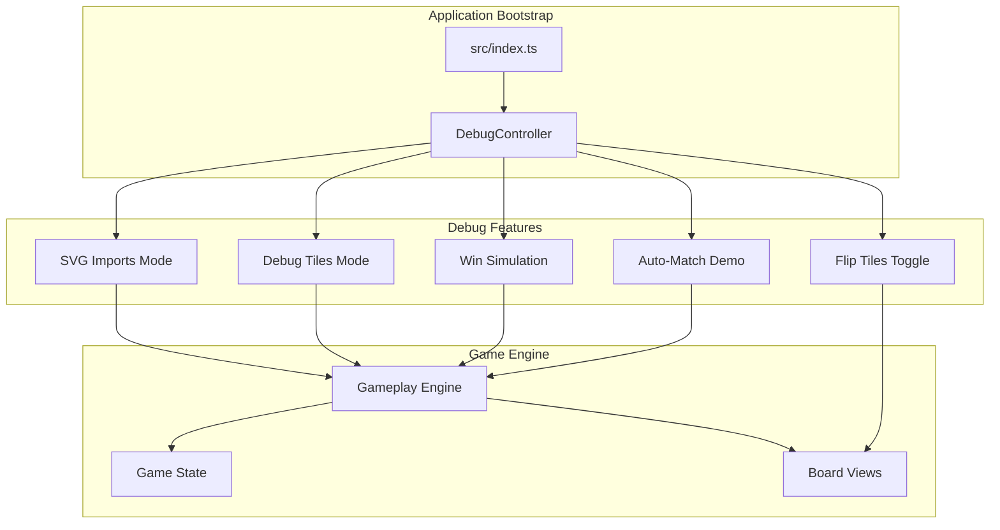
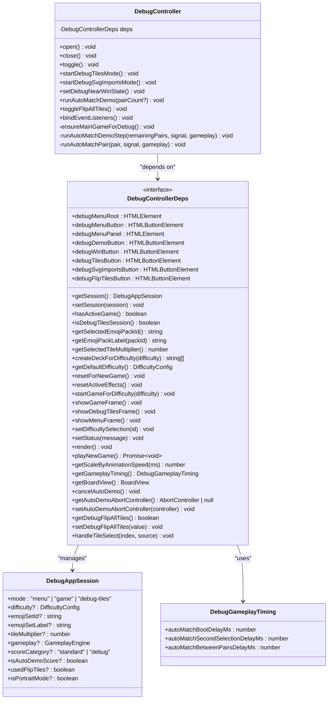
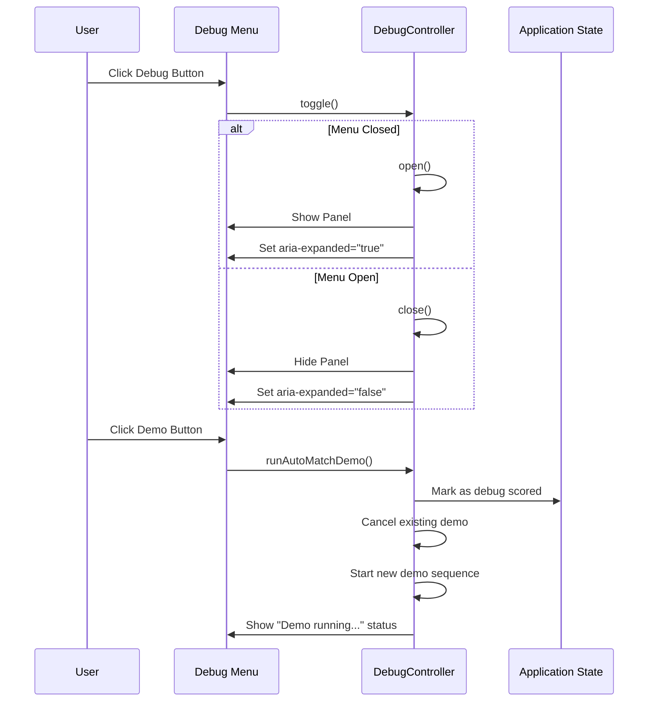
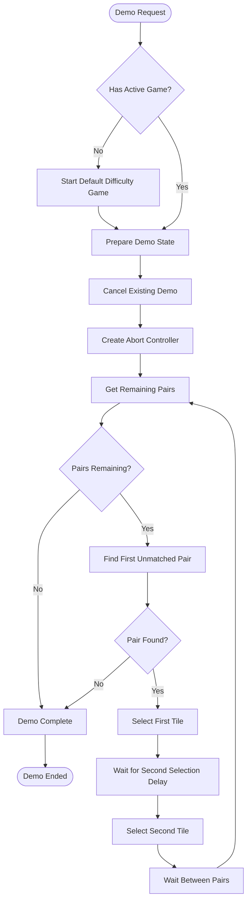
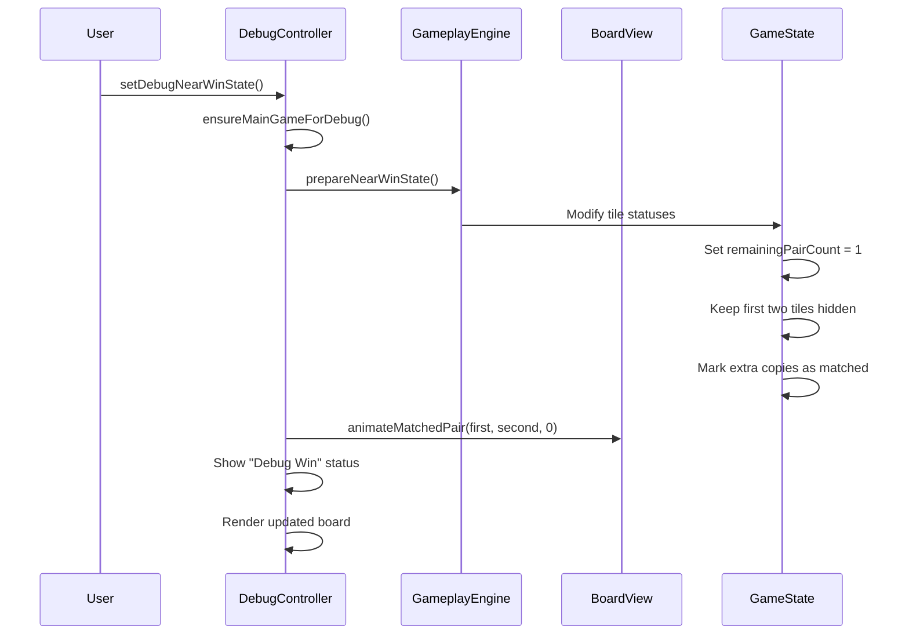
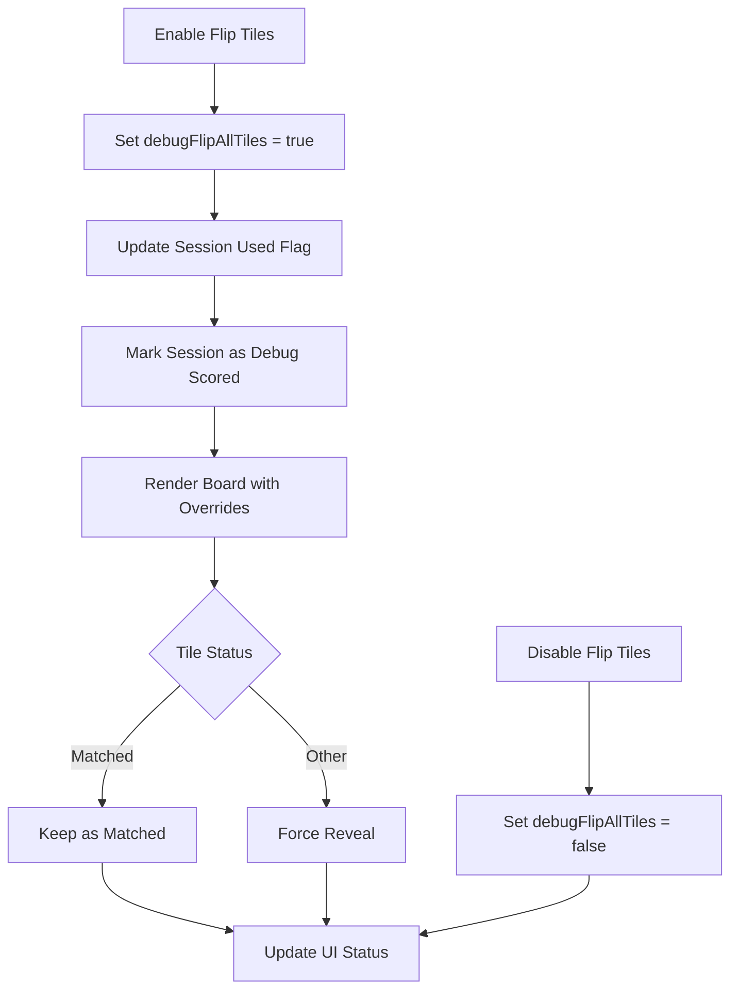
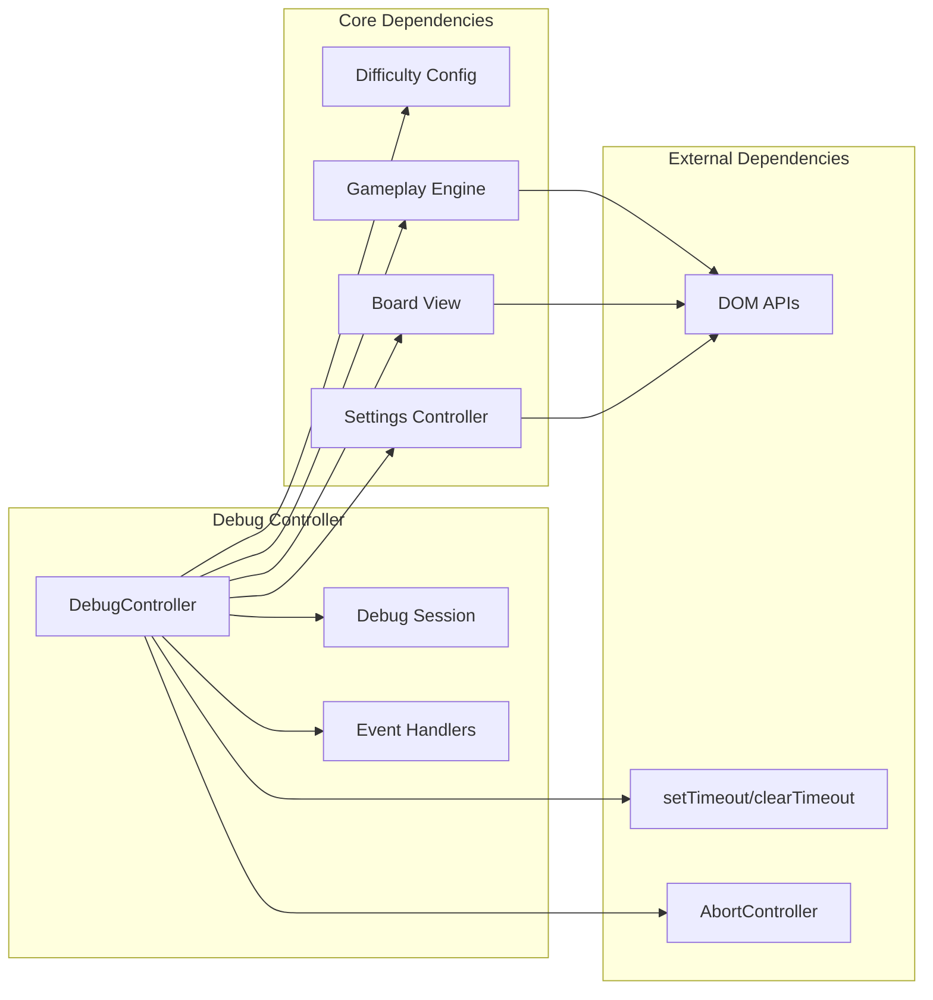

# Debug Controller

<cite>
**Referenced Files in This Document**
- [debug-controller.ts](file://src/debug-controller.ts)
- [index.ts](file://src/index.ts)
- [difficulty.ts](file://src/difficulty.ts)
- [board.ts](file://src/board.ts)
- [gameplay.ts](file://src/gameplay.ts)
- [game.ts](file://src/game.ts)
- [index.html](file://index.html)
- [debug-controller.test.ts](file://tests/debug-controller.test.ts)
</cite>

## Table of Contents
1. [Introduction](#introduction)
2. [Project Structure](#project-structure)
3. [Core Components](#core-components)
4. [Architecture Overview](#architecture-overview)
5. [Detailed Component Analysis](#detailed-component-analysis)
6. [Dependency Analysis](#dependency-analysis)
7. [Performance Considerations](#performance-considerations)
8. [Troubleshooting Guide](#troubleshooting-guide)
9. [Security Considerations](#security-considerations)
10. [Conclusion](#conclusion)

## Introduction
This document provides comprehensive technical documentation for the debug controller system, focusing on the debug menu implementation, demo modes, win simulation tools, and diagnostic utilities. The debug controller enhances development workflows by offering controlled environments for testing, validation, and performance analysis without affecting production scoring or gameplay integrity.

The system integrates tightly with the main application bootstrap, exposing a debug menu with actionable commands for developers and testers. It maintains strict separation between debug and production states, ensuring that debug features are disabled in production builds and do not impact real player sessions.

## Project Structure
The debug controller system spans several core modules:

- **Debug Controller**: Orchestrates debug menu UI, debug modes, and state management
- **Bootstrap Integration**: Wires debug controller into the main application lifecycle
- **Game Engine Integration**: Leverages gameplay engine for demo automation and win simulation
- **UI Components**: Provides dedicated debug frames and board views for isolated testing
- **Configuration**: Defines debug-specific difficulty presets and runtime behavior

**Diagram sources**
- [index.ts:930-971](file://src/index.ts#L930-L971)
- [debug-controller.ts:87-470](file://src/debug-controller.ts#L87-L470)

**Section sources**
- [index.ts:930-971](file://src/index.ts#L930-L971)
- [debug-controller.ts:17-59](file://src/debug-controller.ts#L17-L59)

## Core Components
The debug controller system comprises several key components working together to provide comprehensive debugging capabilities:

### Debug Controller Class
The central orchestrator managing all debug functionality through a clean dependency injection pattern. It exposes methods for:
- Menu visibility control (open/close/toggle)
- Debug mode activation (tiles, SVG imports, win simulation)
- Auto-match demo execution with cancellation support
- Flip tiles toggle with persistent state tracking

### Debug Session Management
Maintains separate debug application state with distinct modes:
- **Menu Mode**: Default state with debug menu hidden
- **Game Mode**: Standard gameplay with debug scoring penalties
- **Debug Tiles Mode**: Minimal 1x2 board for tile inspection and visual testing

### Debug Game Modes
Four specialized debug modes designed for specific testing scenarios:
- **Debug Tiles**: 1x2 board for individual tile verification
- **SVG Imports**: Hard difficulty with pure SVG icon set
- **Win Simulation**: Near-win state preparation for testing victory conditions
- **Auto-Match Demo**: Automated pair matching demonstration

**Section sources**
- [debug-controller.ts:87-144](file://src/debug-controller.ts#L87-L144)
- [debug-controller.ts:118-187](file://src/debug-controller.ts#L118-L187)
- [debug-controller.ts:199-234](file://src/debug-controller.ts#L199-L234)
- [debug-controller.ts:238-298](file://src/debug-controller.ts#L238-L298)

## Architecture Overview
The debug controller architecture follows a layered approach with clear separation of concerns:

**Diagram sources**
- [debug-controller.ts:87-470](file://src/debug-controller.ts#L87-L470)
- [debug-controller.ts:17-79](file://src/debug-controller.ts#L17-L79)

The architecture ensures loose coupling through dependency injection, allowing for easy testing and maintenance. The debug controller delegates all UI and game operations to injected dependencies, maintaining a clean separation between debug logic and core application functionality.

**Section sources**
- [debug-controller.ts:87-470](file://src/debug-controller.ts#L87-L470)
- [index.ts:930-971](file://src/index.ts#L930-L971)

## Detailed Component Analysis

### Debug Menu Implementation
The debug menu provides intuitive access to all debugging features through a collapsible interface:

**Diagram sources**
- [debug-controller.ts:96-114](file://src/debug-controller.ts#L96-L114)
- [debug-controller.ts:302-369](file://src/debug-controller.ts#L302-L369)

The menu implements proper accessibility features including ARIA attributes, keyboard navigation, and screen reader support. It automatically manages button states based on game activity and provides contextual status messages.

**Section sources**
- [debug-controller.ts:96-114](file://src/debug-controller.ts#L96-L114)
- [debug-controller.ts:302-369](file://src/debug-controller.ts#L302-L369)

### Demo Modes and Automation
The auto-match demo system provides comprehensive automated testing capabilities:

**Diagram sources**
- [debug-controller.ts:238-263](file://src/debug-controller.ts#L238-L263)
- [debug-controller.ts:384-426](file://src/debug-controller.ts#L384-L426)
- [debug-controller.ts:428-468](file://src/debug-controller.ts#L428-L468)

The demo system includes sophisticated cancellation mechanisms using AbortController instances, ensuring proper cleanup when demos are interrupted or new demos are started. Timing scales according to animation speed settings for consistent behavior across different performance configurations.

**Section sources**
- [debug-controller.ts:238-263](file://src/debug-controller.ts#L238-L263)
- [debug-controller.ts:384-426](file://src/debug-controller.ts#L384-L426)
- [debug-controller.ts:428-468](file://src/debug-controller.ts#L428-L468)

### Win Simulation Tools
The near-win state preparation system creates realistic test scenarios for victory condition validation:

**Diagram sources**
- [debug-controller.ts:199-234](file://src/debug-controller.ts#L199-L234)
- [game.ts:334-418](file://src/game.ts#L334-L418)

The win simulation preserves game integrity by maintaining proper state transitions and ensuring the final pair remains challenging to match. It leverages existing board animation systems for consistent visual feedback.

**Section sources**
- [debug-controller.ts:199-234](file://src/debug-controller.ts#L199-L234)
- [game.ts:334-418](file://src/game.ts#L334-L418)

### Board Manipulation Utilities
The debug flip tiles feature provides powerful board inspection capabilities:

**Diagram sources**
- [index.ts:98](file://src/index.ts#L98)
- [index.ts:790-807](file://src/index.ts#L790-L807)
- [debug-controller.ts:277-298](file://src/debug-controller.ts#L277-L298)

The board manipulation system operates at the rendering level, overriding tile statuses without affecting underlying game state. This ensures accurate testing of visual elements while maintaining game integrity.

**Section sources**
- [index.ts:98](file://src/index.ts#L98)
- [index.ts:790-807](file://src/index.ts#L790-L807)
- [debug-controller.ts:277-298](file://src/debug-controller.ts#L277-L298)

### Debug State Management
The debug controller maintains comprehensive state tracking across all debug operations:

| State Property | Purpose | Scope | Persistence |
|---|---|---|---|
| `mode` | Current application mode (menu/game/debug-tiles) | Global | Session-based |
| `scoreCategory` | Debug vs standard scoring classification | Individual sessions | Per-session |
| `isAutoDemoScore` | Demo-generated score flag | Sessions | Per-session |
| `usedFlipTiles` | Flip tiles usage tracking | Sessions | Per-session |
| `isPortraitMode` | Orientation state preservation | Sessions | Per-session |

The state management ensures proper isolation between debug and production sessions, preventing accidental debug state leakage into real gameplay.

**Section sources**
- [debug-controller.ts:61-72](file://src/debug-controller.ts#L61-L72)
- [debug-controller.ts:189-197](file://src/debug-controller.ts#L189-L197)

## Dependency Analysis
The debug controller system exhibits excellent modularity with well-defined dependencies:

**Diagram sources**
- [debug-controller.ts:17-59](file://src/debug-controller.ts#L17-L59)
- [index.ts:930-971](file://src/index.ts#L930-L971)

The dependency graph reveals a clean architecture where the debug controller depends on abstractions rather than concrete implementations, facilitating testing and maintenance.

**Section sources**
- [debug-controller.ts:17-59](file://src/debug-controller.ts#L17-L59)
- [index.ts:930-971](file://src/index.ts#L930-L971)

## Performance Considerations
The debug controller system incorporates several performance optimizations:

### Cancellation and Cleanup
- **AbortController Pattern**: All async operations use AbortController for immediate cancellation
- **Timer Management**: Proper cleanup of timeouts and intervals prevents memory leaks
- **Event Listener Cleanup**: Modular event handling with selective removal

### Rendering Optimizations
- **Selective Rendering**: Debug modes use minimal board layouts (1x2 tiles)
- **Lazy Initialization**: Debug boards are created only when needed
- **State Caching**: Game state is preserved between debug sessions

### Animation Scaling
The system respects user animation speed preferences, scaling all debug animations proportionally to maintain consistent timing across devices.

**Section sources**
- [debug-controller.ts:250-253](file://src/debug-controller.ts#L250-L253)
- [index.ts:209-221](file://src/index.ts#L209-L221)
- [index.ts:291-293](file://src/index.ts#L291-L293)

## Troubleshooting Guide

### Common Debug Issues and Solutions

**Issue**: Debug menu not responding to clicks
- **Cause**: Event listeners not properly bound
- **Solution**: Verify `bindEventListeners()` is called during bootstrap
- **Verification**: Check browser console for event binding errors

**Issue**: Auto-match demo stops prematurely
- **Cause**: AbortController cancellation or game state changes
- **Solution**: Ensure demo runs within active game session
- **Verification**: Monitor AbortController state and session changes

**Issue**: Flip tiles not persisting across sessions
- **Cause**: State not properly tracked in session
- **Solution**: Verify `usedFlipTiles` flag is set during toggle
- **Verification**: Check session state after enabling flip tiles

**Issue**: Win simulation not triggering victory
- **Cause**: Incorrect near-win state preparation
- **Solution**: Validate remaining pair count equals 1
- **Verification**: Inspect game state after `prepareNearWinState()`

### Debug Output Interpretation
The debug system provides structured status messages for different operations:

- **Demo Status**: "Demo running...", "Demo complete.", "Start a game to run the demo."
- **Win Simulation**: "Debug Win: match the final pair."
- **Tile Inspection**: "Debug Tiles: match the pair to test tile visuals."
- **SVG Testing**: "Debug SVG Imports: Hard board with SVG icons only."

**Section sources**
- [debug-controller.test.ts:120-181](file://tests/debug-controller.test.ts#L120-L181)
- [debug-controller.test.ts:354-521](file://tests/debug-controller.test.ts#L354-L521)

## Security Considerations
The debug controller system implements several security measures to prevent production exposure:

### Feature Isolation
- **Development-Only Access**: Debug features are only accessible through specific initialization paths
- **URL Parameter Protection**: Debug URLs are intentionally not exposed in UI
- **State Separation**: Debug sessions cannot affect production leaderboards

### Data Integrity
- **Score Penalties**: All debug actions are marked with `"debug"` score category
- **Session Isolation**: Debug state does not leak into player sessions
- **Validation**: Input validation prevents malformed debug requests

### Production Safety
- **No Production Impact**: Debug features are disabled in production builds
- **Clean State Management**: All debug modifications are reverted on session exit
- **Resource Cleanup**: Proper cleanup prevents memory leaks or resource exhaustion

**Section sources**
- [debug-controller.ts:80-86](file://src/debug-controller.ts#L80-L86)
- [index.ts:1003-1008](file://src/index.ts#L1003-L1008)

## Conclusion
The debug controller system provides a comprehensive, production-safe debugging framework that enhances development workflows without compromising game integrity. Its modular architecture, robust state management, and extensive testing coverage make it an essential tool for maintaining code quality and facilitating rapid iteration.

The system's design prioritizes developer productivity through intuitive interfaces, automated testing capabilities, and comprehensive diagnostic tools. By maintaining strict separation between debug and production states, it ensures that debugging activities never impact real player experiences or data integrity.

Key strengths include:
- **Modular Design**: Clean separation of concerns with dependency injection
- **Robust State Management**: Comprehensive session tracking and isolation
- **Automated Testing**: Built-in demo and simulation capabilities
- **Production Safety**: Multiple safeguards preventing debug feature exposure
- **Performance Optimization**: Efficient resource management and cleanup

This foundation provides an excellent base for extending debugging capabilities while maintaining the system's reliability and security standards.