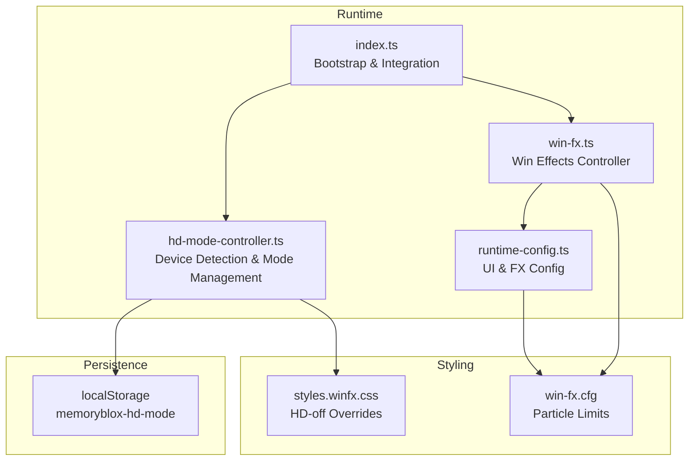
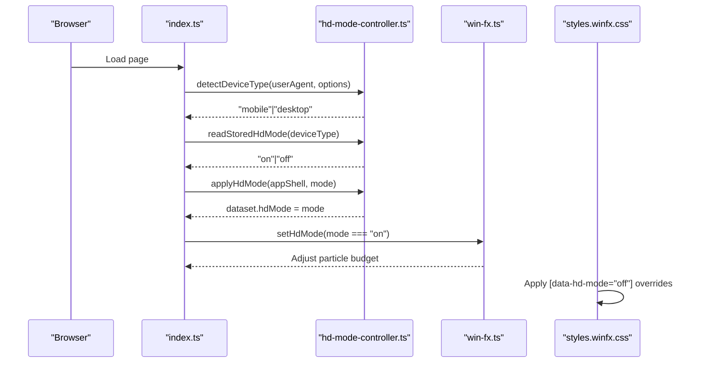
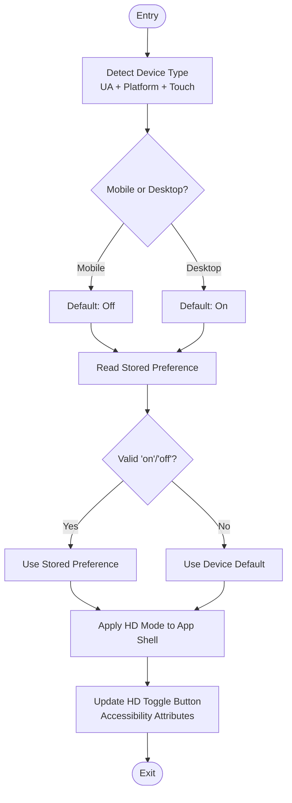
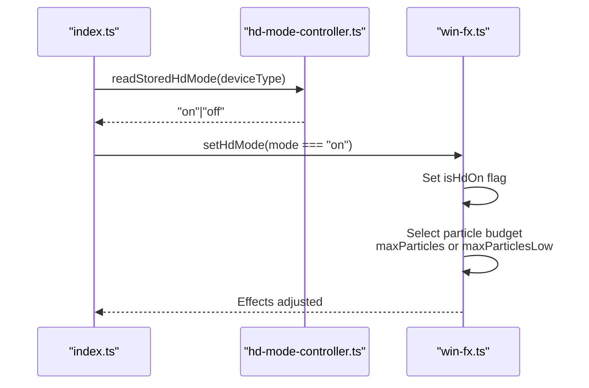
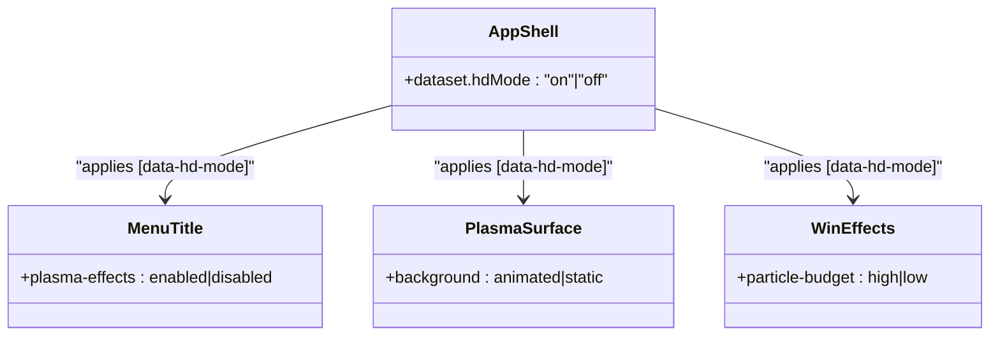
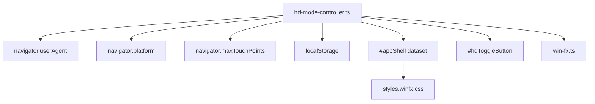

# HD Mode Controller

<cite>
**Referenced Files in This Document**
- [hd-mode-controller.ts](file://src/hd-mode-controller.ts)
- [index.ts](file://src/index.ts)
- [win-fx.ts](file://src/win-fx.ts)
- [runtime-config.ts](file://src/runtime-config.ts)
- [cfg.ts](file://src/cfg.ts)
- [style-guide.md](file://docs/style-guide.md)
- [styles.winfx.css](file://styles.winfx.css)
- [win-fx.cfg](file://config/win-fx.cfg)
- [index.html](file://index.html)
- [hd-mode-controller.test.ts](file://tests/hd-mode-controller.test.ts)
</cite>

## Table of Contents
1. [Introduction](#introduction)
2. [Project Structure](#project-structure)
3. [Core Components](#core-components)
4. [Architecture Overview](#architecture-overview)
5. [Detailed Component Analysis](#detailed-component-analysis)
6. [Dependency Analysis](#dependency-analysis)
7. [Performance Considerations](#performance-considerations)
8. [Troubleshooting Guide](#troubleshooting-guide)
9. [Conclusion](#conclusion)

## Introduction
The HD Mode Controller manages a high-definition rendering toggle that dramatically impacts visual quality and performance across devices. It automatically detects device types, applies device-aware defaults, persists user preferences, and integrates with the broader UI system to enable/disable advanced visual effects like animated plasma textures and particle celebrations. This document explains how HD mode works, how it's implemented, and how it affects performance and compatibility.

## Project Structure
The HD mode system spans several modules:
- Device detection and mode management in the HD controller
- Application bootstrap and integration in the main index module
- Visual effects integration via the WinFX controller
- Runtime configuration and fallback values
- CSS-based HD-off overrides
- Test coverage validating behavior

**Diagram sources**
- [index.ts:100-106](file://src/index.ts#L100-L106)
- [hd-mode-controller.ts:1-81](file://src/hd-mode-controller.ts#L1-L81)
- [win-fx.ts:232-234](file://src/win-fx.ts#L232-L234)
- [runtime-config.ts:1-399](file://src/runtime-config.ts#L1-L399)
- [styles.winfx.css:720-749](file://styles.winfx.css#L720-L749)
- [win-fx.cfg:1-30](file://config/win-fx.cfg#L1-L30)

**Section sources**
- [index.ts:100-106](file://src/index.ts#L100-L106)
- [hd-mode-controller.ts:1-81](file://src/hd-mode-controller.ts#L1-L81)
- [win-fx.ts:232-234](file://src/win-fx.ts#L232-L234)
- [runtime-config.ts:1-399](file://src/runtime-config.ts#L1-L399)
- [styles.winfx.css:720-749](file://styles.winfx.css#L720-L749)
- [win-fx.cfg:1-30](file://config/win-fx.cfg#L1-L30)

## Core Components
- Device detection and classification: Determines whether the device is mobile or desktop using user agent, platform, and touch capabilities.
- Default mode selection: Applies device-aware defaults (on for desktop, off for mobile).
- Persistence: Stores and retrieves the user's HD mode preference in localStorage.
- UI integration: Updates the HD toggle button accessibility attributes and applies the mode to the app shell dataset.
- Visual effects integration: Notifies the WinFX controller to adjust particle budgets and effects based on HD mode.

Key implementation details:
- Device detection uses a combined heuristic including user agent patterns and platform/touch characteristics.
- Defaults are applied based on device type, ensuring optimal performance on mobile.
- Mode persistence uses a stable key in localStorage with automatic fallback to defaults.
- The app shell dataset attribute enables CSS selectors to disable advanced visuals when HD is off.
- WinFX controller adjusts particle budgets and effect complexity according to HD mode.

**Section sources**
- [hd-mode-controller.ts:1-81](file://src/hd-mode-controller.ts#L1-L81)
- [index.ts:100-106](file://src/index.ts#L100-L106)
- [index.ts:828-835](file://src/index.ts#L828-L835)
- [win-fx.ts:268-269](file://src/win-fx.ts#L268-L269)
- [win-fx.cfg:1-30](file://config/win-fx.cfg#L1-L30)

## Architecture Overview
The HD mode system follows a clean separation of concerns:
- Device detection and mode lifecycle are encapsulated in the HD controller.
- The main application initializes device type, reads stored preferences, and applies the mode.
- Visual effects are decoupled and controlled by the WinFX controller, which respects HD mode.
- CSS selectors react to the app shell attribute to disable expensive animations.

**Diagram sources**
- [index.ts:100-106](file://src/index.ts#L100-L106)
- [index.ts:828-835](file://src/index.ts#L828-L835)
- [hd-mode-controller.ts:28-73](file://src/hd-mode-controller.ts#L28-L73)
- [win-fx.ts:232-234](file://src/win-fx.ts#L232-L234)
- [styles.winfx.css:720-749](file://styles.winfx.css#L720-L749)

## Detailed Component Analysis

### HD Mode Controller
The HD controller provides:
- Device classification using user agent, platform, and touch points
- Device-aware default selection
- Preference persistence and retrieval
- UI state synchronization for the HD toggle button
- Application shell attribute application

Implementation highlights:
- Pattern-based device detection covers major platforms and variants
- Desktop-class iPad detection accounts for touch-enabled Macs
- Defaults favor performance on mobile devices
- Accessibility attributes are updated for screen readers
- The app shell dataset attribute enables CSS-driven visual overrides

**Diagram sources**
- [hd-mode-controller.ts:28-73](file://src/hd-mode-controller.ts#L28-L73)
- [index.ts:828-835](file://src/index.ts#L828-L835)

**Section sources**
- [hd-mode-controller.ts:1-81](file://src/hd-mode-controller.ts#L1-L81)
- [index.ts:100-106](file://src/index.ts#L100-L106)
- [index.ts:828-835](file://src/index.ts#L828-L835)

### WinFX Controller Integration
The WinFX controller responds to HD mode changes by adjusting particle budgets and effect complexity:
- Uses HD mode to select between high and low particle budgets
- Maintains effect timing scaling via animation speed
- Clears and reinitializes effects when mode changes

**Diagram sources**
- [index.ts:832-835](file://src/index.ts#L832-L835)
- [win-fx.ts:232-234](file://src/win-fx.ts#L232-L234)
- [win-fx.ts:268-269](file://src/win-fx.ts#L268-L269)
- [win-fx.cfg:11-13](file://config/win-fx.cfg#L11-L13)

**Section sources**
- [win-fx.ts:232-234](file://src/win-fx.ts#L232-L234)
- [win-fx.ts:268-269](file://src/win-fx.ts#L268-L269)
- [win-fx.cfg:11-13](file://config/win-fx.cfg#L11-L13)

### CSS HD-Off Overrides
When HD mode is off, CSS selectors disable expensive animations and replace them with solid color fallbacks:
- Removes animated plasma gradients and textures
- Switches to static tile backgrounds
- Reduces particle counts to low budgets

**Diagram sources**
- [styles.winfx.css:720-749](file://styles.winfx.css#L720-L749)
- [style-guide.md:131-144](file://docs/style-guide.md#L131-L144)

**Section sources**
- [styles.winfx.css:720-749](file://styles.winfx.css#L720-L749)
- [style-guide.md:131-144](file://docs/style-guide.md#L131-L144)

### Configuration and Defaults
Runtime configuration provides:
- Default UI and gameplay timing values
- Visual effects parameters
- WinFX particle budget defaults
- Config loading and validation

**Diagram sources**
- [runtime-config.ts:158-201](file://src/runtime-config.ts#L158-L201)
- [runtime-config.ts:365-398](file://src/runtime-config.ts#L365-L398)
- [win-fx.cfg:1-30](file://config/win-fx.cfg#L1-L30)
- [win-fx.ts:268-269](file://src/win-fx.ts#L268-L269)

**Section sources**
- [runtime-config.ts:158-201](file://src/runtime-config.ts#L158-L201)
- [runtime-config.ts:365-398](file://src/runtime-config.ts#L365-L398)
- [win-fx.cfg:1-30](file://config/win-fx.cfg#L1-L30)
- [win-fx.ts:268-269](file://src/win-fx.ts#L268-L269)

## Dependency Analysis
The HD mode controller interacts with:
- Browser APIs for user agent and platform detection
- localStorage for preference persistence
- The app shell element for mode propagation
- The WinFX controller for visual effect adjustments
- CSS selectors for visual overrides

**Diagram sources**
- [hd-mode-controller.ts:1-81](file://src/hd-mode-controller.ts#L1-L81)
- [index.ts:100-106](file://src/index.ts#L100-L106)
- [index.ts:828-835](file://src/index.ts#L828-L835)
- [styles.winfx.css:720-749](file://styles.winfx.css#L720-L749)

**Section sources**
- [hd-mode-controller.ts:1-81](file://src/hd-mode-controller.ts#L1-L81)
- [index.ts:100-106](file://src/index.ts#L100-L106)
- [index.ts:828-835](file://src/index.ts#L828-L835)
- [styles.winfx.css:720-749](file://styles.winfx.css#L720-L749)

## Performance Considerations
- HD mode off reduces GPU/CPU usage by disabling animated plasma textures and lowering particle budgets.
- WinFX particle budgets drop from high ceilings to low ceilings when HD is off, significantly reducing rendering overhead.
- CSS-based overrides prevent expensive animations from running, improving battery life on mobile devices.
- Device-aware defaults ensure mobile devices start in a power-efficient mode.

Examples of performance implications:
- On high-end desktops, HD mode enables full particle celebrations and animated backgrounds.
- On mid-range tablets and phones, HD mode off reduces thermal throttling and extends battery life.
- Reduced motion preferences are respected independently of HD mode.

Compatibility considerations:
- User agent detection handles major platforms and variants.
- Desktop-class iPad detection prevents misclassification of touch-enabled Macs.
- CSS selectors provide graceful degradation for unsupported features.

**Section sources**
- [style-guide.md:131-144](file://docs/style-guide.md#L131-L144)
- [win-fx.cfg:8-13](file://config/win-fx.cfg#L8-L13)
- [win-fx.ts:268-269](file://src/win-fx.ts#L268-L269)

## Troubleshooting Guide
Common issues and resolutions:
- HD mode not persisting: Verify localStorage availability and key correctness.
- Incorrect device classification: Review user agent patterns and platform/touch thresholds.
- Visual effects not updating: Ensure the app shell attribute is set and CSS selectors are present.
- WinFX particle count not changing: Confirm the WinFX controller receives the HD mode update.

Validation and testing:
- Device detection tests cover multiple platforms and edge cases.
- Preference persistence tests verify fallback behavior for invalid values.
- UI state tests confirm accessibility attributes update correctly.

**Section sources**
- [hd-mode-controller.test.ts:15-95](file://tests/hd-mode-controller.test.ts#L15-L95)
- [hd-mode-controller.test.ts:111-142](file://tests/hd-mode-controller.test.ts#L111-L142)
- [hd-mode-controller.test.ts:146-164](file://tests/hd-mode-controller.test.ts#L146-L164)
- [hd-mode-controller.test.ts:168-180](file://tests/hd-mode-controller.test.ts#L168-L180)

## Conclusion
The HD Mode Controller provides a robust, device-aware system for managing high-definition rendering. By combining automatic device detection, user preference persistence, and CSS-driven visual overrides, it delivers optimal performance on mobile devices while enabling rich visual experiences on desktop systems. Its integration with the WinFX controller ensures that advanced effects scale appropriately with device capabilities, and the configuration system provides tunable defaults for various scenarios.