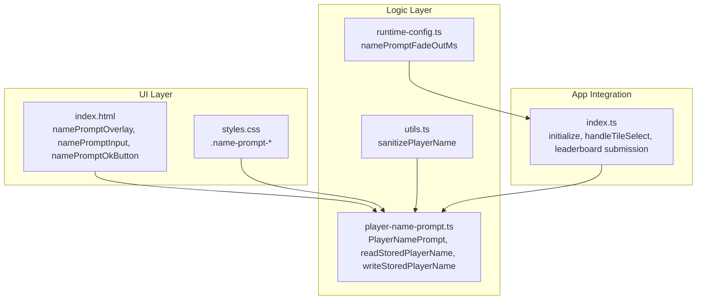
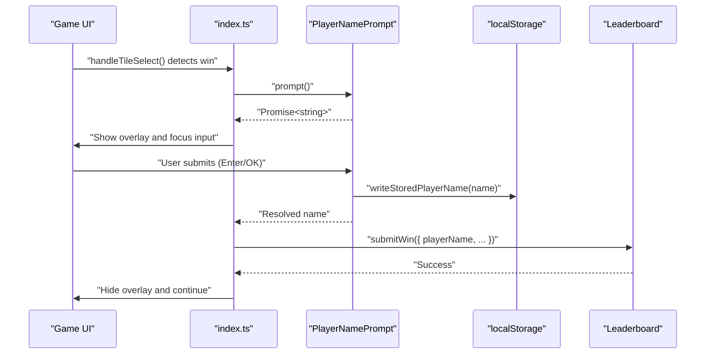
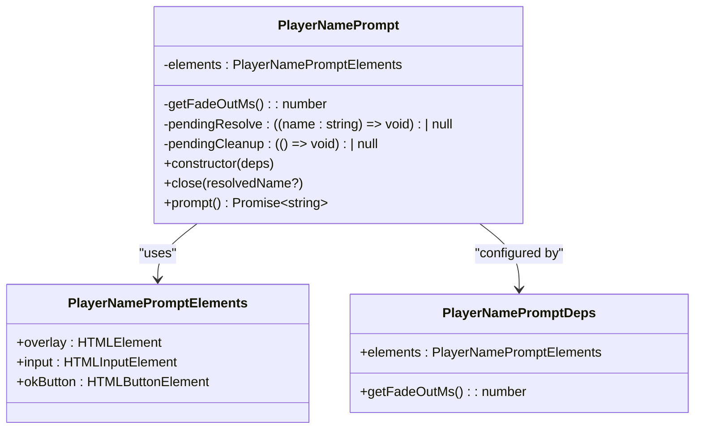
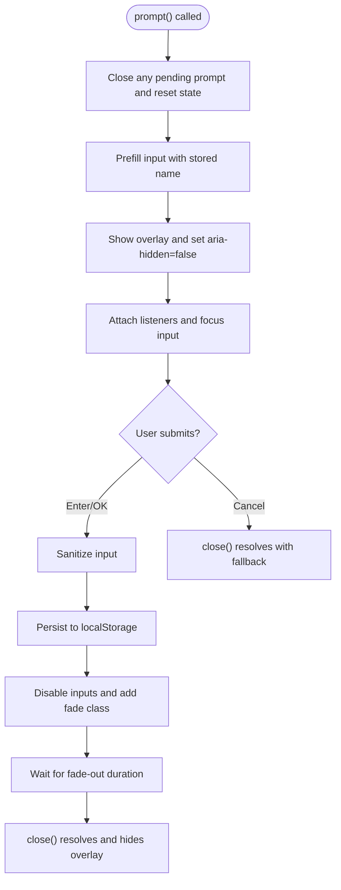
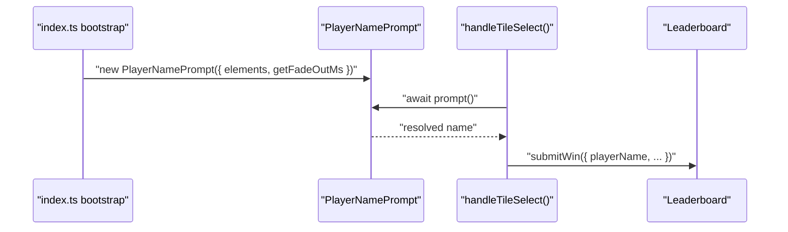
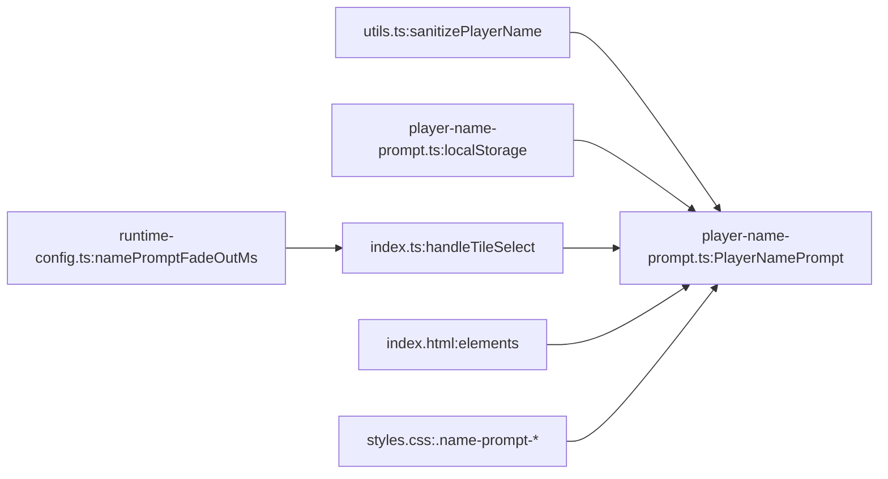

# Player Name Prompt

<cite>
**Referenced Files in This Document**
- [player-name-prompt.ts](file://src/player-name-prompt.ts)
- [index.ts](file://src/index.ts)
- [utils.ts](file://src/utils.ts)
- [runtime-config.ts](file://src/runtime-config.ts)
- [index.html](file://index.html)
- [styles.css](file://styles.css)
- [player-name-prompt.test.ts](file://tests/player-name-prompt.test.ts)
- [index-win-flow.integration.test.ts](file://tests/index-win-flow.integration.test.ts)
</cite>

## Table of Contents
1. [Introduction](#introduction)
2. [Project Structure](#project-structure)
3. [Core Components](#core-components)
4. [Architecture Overview](#architecture-overview)
5. [Detailed Component Analysis](#detailed-component-analysis)
6. [Dependency Analysis](#dependency-analysis)
7. [Performance Considerations](#performance-considerations)
8. [Troubleshooting Guide](#troubleshooting-guide)
9. [Conclusion](#conclusion)
10. [Appendices](#appendices)

## Introduction
This document explains the player name prompt system used to collect and persist user input before recording high scores. It covers the implementation of user input collection with validation, localStorage persistence, form handling, and the prompt lifecycle from initial setup through user confirmation. It also documents validation rules, character limits, special character handling, integration with game initialization flows, session management, and accessibility considerations for form inputs and error states.

## Project Structure
The player name prompt is implemented as a reusable UI component integrated into the main application bootstrap. The key pieces are:
- A prompt class that manages overlay visibility, input events, and resolution of the user’s chosen name
- Utility functions for sanitization and localStorage persistence
- HTML overlay with accessible attributes and styling
- Runtime configuration for animation timing
- Integration points in the game flow for capturing the name on win

**Diagram sources**
- [index.html:110-124](file://index.html#L110-L124)
- [styles.css:902-970](file://styles.css#L902-L970)
- [player-name-prompt.ts:1-124](file://src/player-name-prompt.ts#L1-L124)
- [utils.ts:132-145](file://src/utils.ts#L132-L145)
- [runtime-config.ts:99-156](file://src/runtime-config.ts#L99-L156)
- [index.ts:261-268](file://src/index.ts#L261-L268)

**Section sources**
- [index.html:110-124](file://index.html#L110-L124)
- [styles.css:902-970](file://styles.css#L902-L970)
- [player-name-prompt.ts:1-124](file://src/player-name-prompt.ts#L1-L124)
- [utils.ts:132-145](file://src/utils.ts#L132-L145)
- [runtime-config.ts:99-156](file://src/runtime-config.ts#L99-L156)
- [index.ts:261-268](file://src/index.ts#L261-L268)

## Core Components
- PlayerNamePrompt: Manages overlay visibility, input events, sanitization, persistence, and resolution of the user’s chosen name. It exposes a prompt() method that returns a Promise<string>.
- Storage helpers: readStoredPlayerName() and writeStoredPlayerName() manage localStorage persistence under a stable key.
- Sanitization: sanitizePlayerName() collapses internal whitespace, trims, and enforces a 20-character limit.
- Runtime configuration: namePromptFadeOutMs controls the overlay fade-out duration.
- HTML overlay: Provides accessible markup and styling for the prompt dialog.

Key behaviors:
- Prefill input with stored name if present
- Allow Enter key submission or clicking OK
- Disable inputs during submission and fade out overlay
- Resolve with sanitized input, stored name fallback, or default fallback
- Close gracefully and clean up event listeners

**Section sources**
- [player-name-prompt.ts:31-118](file://src/player-name-prompt.ts#L31-L118)
- [player-name-prompt.ts:5-18](file://src/player-name-prompt.ts#L5-L18)
- [utils.ts:132-145](file://src/utils.ts#L132-L145)
- [runtime-config.ts:99-156](file://src/runtime-config.ts#L99-L156)
- [index.html:110-124](file://index.html#L110-L124)

## Architecture Overview
The prompt integrates tightly with the game flow. When a player wins, the system requests the name via the prompt and proceeds with leaderboard submission.

**Diagram sources**
- [index.ts:718-766](file://src/index.ts#L718-L766)
- [player-name-prompt.ts:59-118](file://src/player-name-prompt.ts#L59-L118)
- [player-name-prompt.ts:16-18](file://src/player-name-prompt.ts#L16-L18)

## Detailed Component Analysis

### PlayerNamePrompt Class
The class encapsulates the prompt lifecycle and state transitions.

Behavior highlights:
- Initialization: Construct with elements and a function to supply fade-out duration
- prompt(): Resets overlay state, prefill input with stored name, attach listeners, focus input, and return a Promise
- submit path: Sanitize input, persist, disable inputs, add fade class, schedule close after fade-out
- close(): Removes listeners, resolves pending promise with fallback name if needed, hide overlay and reset ARIA attributes

Accessibility and UX:
- Overlay hidden by default, aria-hidden initially true
- On show, hidden=false and aria-hidden=false
- Focus and select input on show for quick typing
- Disabled inputs during submission to prevent duplicate submissions

**Diagram sources**
- [player-name-prompt.ts:31-118](file://src/player-name-prompt.ts#L31-L118)
- [player-name-prompt.ts:20-29](file://src/player-name-prompt.ts#L20-L29)

**Section sources**
- [player-name-prompt.ts:31-118](file://src/player-name-prompt.ts#L31-L118)

### Validation and Sanitization
- sanitizePlayerName() collapses internal whitespace runs, trims leading/trailing spaces, and truncates to 20 characters
- readStoredPlayerName() trims and treats empty/whitespace-only strings as null
- writeStoredPlayerName() persists the sanitized name

Validation rules:
- Non-empty input is accepted after sanitization
- Empty input falls back to stored name if present, otherwise to a default fallback
- Special characters are allowed; only internal whitespace is collapsed and length is enforced

**Section sources**
- [utils.ts:132-145](file://src/utils.ts#L132-L145)
- [player-name-prompt.ts:5-18](file://src/player-name-prompt.ts#L5-L18)
- [player-name-prompt.ts:73-87](file://src/player-name-prompt.ts#L73-L87)

### Form Handling and Lifecycle
- Event bindings: keydown on input (Enter) and click on OK button
- Submission triggers sanitization, persistence, disabling inputs, overlay fade-out, and scheduled close
- Timeout duration comes from runtime configuration
- Focus/select on show ensures immediate keyboard input

**Diagram sources**
- [player-name-prompt.ts:59-118](file://src/player-name-prompt.ts#L59-L118)
- [runtime-config.ts:299-301](file://src/runtime-config.ts#L299-L301)

**Section sources**
- [player-name-prompt.ts:59-118](file://src/player-name-prompt.ts#L59-L118)
- [runtime-config.ts:299-301](file://src/runtime-config.ts#L299-L301)

### Integration with Game Initialization and Session Management
- The prompt is constructed early in application bootstrap and injected into the game flow
- On win detection, the system awaits the prompt result before submitting to the leaderboard
- Demo mode bypasses the prompt and uses a fixed name
- The prompt’s fade-out duration is configurable and scaled by animation speed

**Diagram sources**
- [index.ts:261-268](file://src/index.ts#L261-L268)
- [index.ts:718-766](file://src/index.ts#L718-L766)

**Section sources**
- [index.ts:261-268](file://src/index.ts#L261-L268)
- [index.ts:718-766](file://src/index.ts#L718-L766)

### Accessibility Considerations
- Overlay uses aria-hidden and role="dialog" with aria-modal=true
- Input has aria-label and spellcheck="false"
- Button has accessible label
- Focus management: input is focused and selected on show for keyboard-first workflows
- Reduced-motion support: fade-out duration respects runtime configuration

HTML and CSS references:
- Overlay container: aria-hidden, hidden, and is-hiding class for transitions
- Toast dialog: role="dialog" and aria-modal
- Input: aria-label, maxlength, autocomplete="name", spellcheck="false"
- Button: accessible label

**Section sources**
- [index.html:110-124](file://index.html#L110-L124)
- [styles.css:902-970](file://styles.css#L902-L970)
- [player-name-prompt.ts:62-68](file://src/player-name-prompt.ts#L62-L68)

## Dependency Analysis
- PlayerNamePrompt depends on:
  - DOM elements (overlay, input, button)
  - sanitizePlayerName() for validation
  - localStorage for persistence
  - runtime configuration for fade-out duration
- Integration points:
  - index.ts constructs the prompt and wires it into win flow
  - Tests validate behavior without DOM dependencies by mocking elements

**Diagram sources**
- [utils.ts:132-145](file://src/utils.ts#L132-L145)
- [player-name-prompt.ts:1-18](file://src/player-name-prompt.ts#L1-L18)
- [runtime-config.ts:99-156](file://src/runtime-config.ts#L99-L156)
- [index.ts:718-766](file://src/index.ts#L718-L766)
- [index.html:110-124](file://index.html#L110-L124)
- [styles.css:902-970](file://styles.css#L902-L970)

**Section sources**
- [utils.ts:132-145](file://src/utils.ts#L132-L145)
- [player-name-prompt.ts:1-18](file://src/player-name-prompt.ts#L1-L18)
- [runtime-config.ts:99-156](file://src/runtime-config.ts#L99-L156)
- [index.ts:718-766](file://src/index.ts#L718-L766)
- [index.html:110-124](file://index.html#L110-L124)
- [styles.css:902-970](file://styles.css#L902-L970)

## Performance Considerations
- The prompt uses a short fade-out animation (default 220ms) to minimize perceived latency
- Sanitization is O(n) with a small constant-time regex and slice
- localStorage writes occur only on confirmed submission
- Event listeners are attached only during the active prompt lifecycle and cleaned up on close

[No sources needed since this section provides general guidance]

## Troubleshooting Guide
Common issues and resolutions:
- Prompt does not appear
  - Verify overlay hidden state and aria-hidden are toggled correctly
  - Ensure elements are provided and not null
- Input not focused
  - Confirm focus/select is triggered after showing the overlay
- Duplicate submissions
  - Inputs are disabled during submission; ensure close() is called after fade-out
- Name not saved
  - Confirm writeStoredPlayerName() is invoked after sanitization
- Fallback name unexpected
  - Stored name is trimmed; empty/whitespace-only stored values are treated as null
  - Empty input falls back to stored name or default fallback

Validation and integration tests:
- Tests cover show/hide, Enter key handling, OK click, fallback behavior, and persistence

**Section sources**
- [player-name-prompt.test.ts:29-236](file://tests/player-name-prompt.test.ts#L29-L236)
- [index-win-flow.integration.test.ts:188-221](file://tests/index-win-flow.integration.test.ts#L188-L221)

## Conclusion
The player name prompt is a focused, accessible, and resilient component that integrates cleanly with the game flow. It sanitizes input, persists names, and provides a smooth user experience with proper ARIA attributes and reduced-motion support. Its design makes it easy to extend or customize while maintaining predictable behavior across sessions.

[No sources needed since this section summarizes without analyzing specific files]

## Appendices

### Validation Rules and Limits
- Character limit: 20 characters after sanitization
- Internal whitespace collapsing: runs of whitespace become single spaces
- Leading/trailing whitespace removal
- Empty input fallback: stored name or default fallback

**Section sources**
- [utils.ts:132-145](file://src/utils.ts#L132-L145)
- [player-name-prompt.ts:73-87](file://src/player-name-prompt.ts#L73-L87)

### Integration Checklist
- Initialize PlayerNamePrompt with correct elements and fade-out provider
- Wire prompt into win flow before leaderboard submission
- Ensure close() is called after fade-out completes
- Test Enter key and OK button paths
- Verify localStorage persistence and fallback behavior

**Section sources**
- [index.ts:261-268](file://src/index.ts#L261-L268)
- [index.ts:718-766](file://src/index.ts#L718-L766)