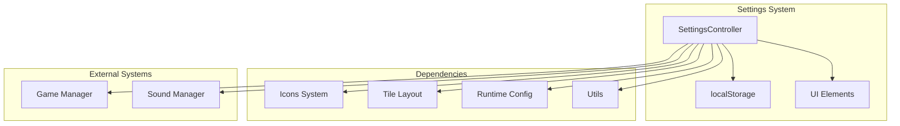
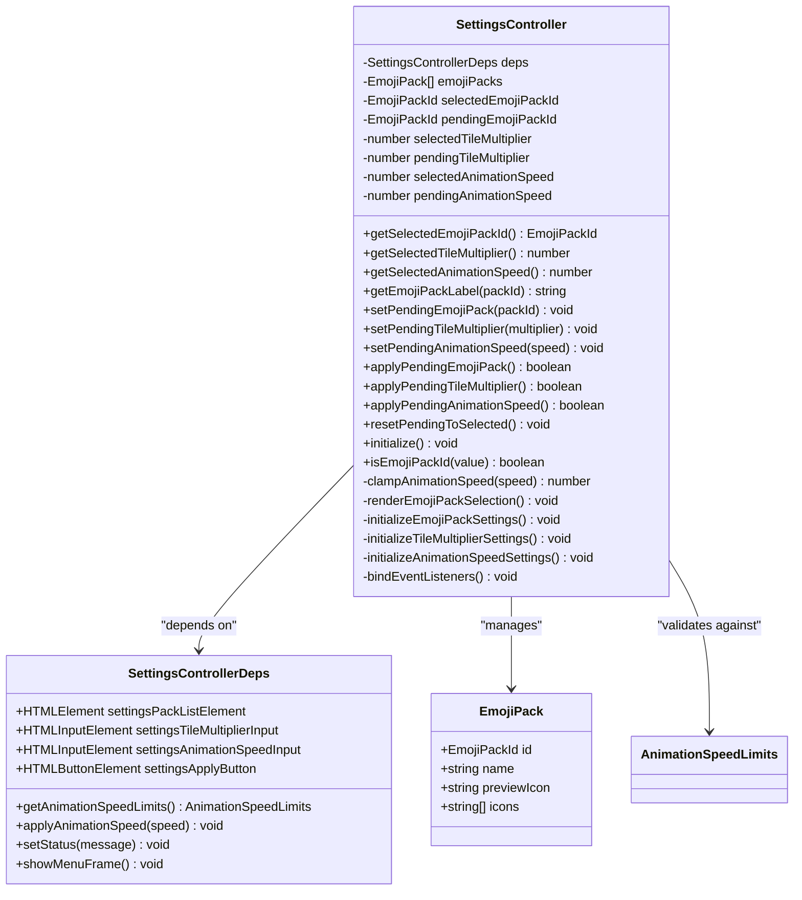
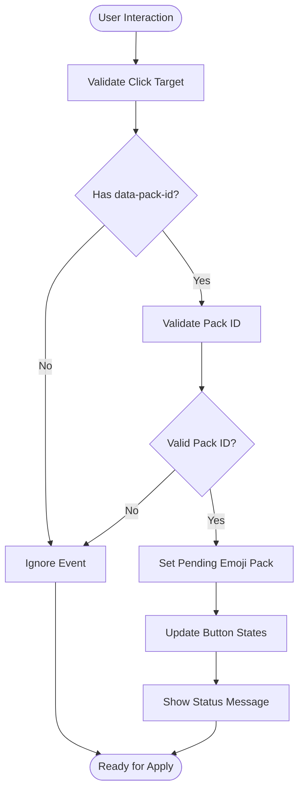
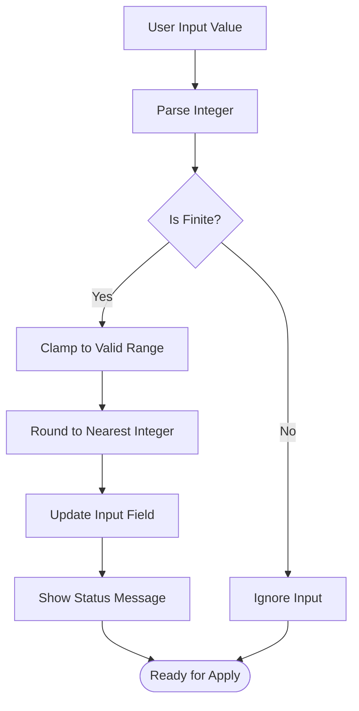
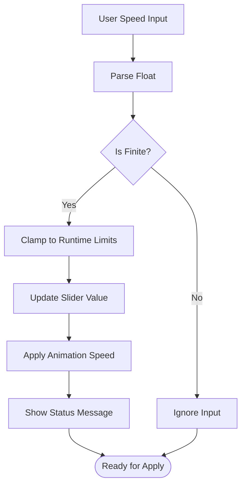
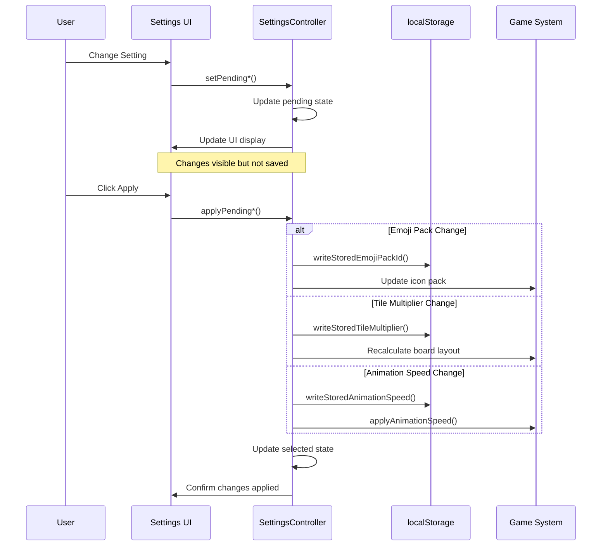
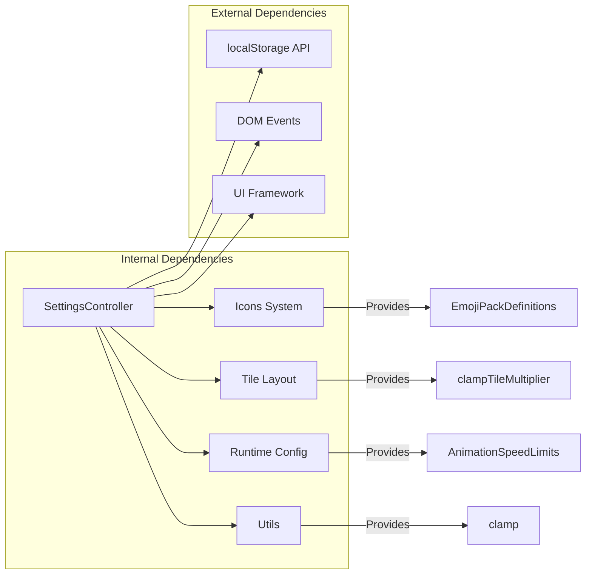
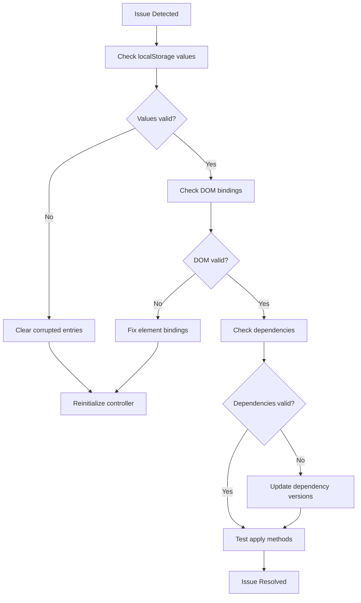

# Settings Controller

<cite>
**Referenced Files in This Document**
- [settings-controller.ts](file://src/settings-controller.ts)
- [icons.ts](file://src/icons.ts)
- [tile-layout.ts](file://src/tile-layout.ts)
- [runtime-config.ts](file://src/runtime-config.ts)
- [utils.ts](file://src/utils.ts)
- [settings-controller.test.ts](file://tests/settings-controller.test.ts)
- [styles.css](file://styles.css)
</cite>

## Table of Contents
1. [Introduction](#introduction)
2. [Project Structure](#project-structure)
3. [Core Components](#core-components)
4. [Architecture Overview](#architecture-overview)
5. [Detailed Component Analysis](#detailed-component-analysis)
6. [Dependency Analysis](#dependency-analysis)
7. [Performance Considerations](#performance-considerations)
8. [Troubleshooting Guide](#troubleshooting-guide)
9. [Conclusion](#conclusion)

## Introduction
The Settings Controller manages user preferences for the game with a robust two-phase commit pattern. It maintains separate "pending" and "selected" states for each setting, allowing users to preview changes before committing them. The controller handles emoji pack selection, tile multiplier controls, and animation speed configuration while persisting settings to localStorage and validating inputs against configured limits.

## Project Structure
The Settings Controller is part of the core game system and integrates with several subsystems:

**Diagram sources**
- [settings-controller.ts:35-49](file://src/settings-controller.ts#L35-L49)
- [icons.ts:56-528](file://src/icons.ts#L56-L528)
- [tile-layout.ts:19-22](file://src/tile-layout.ts#L19-L22)
- [runtime-config.ts:17-21](file://src/runtime-config.ts#L17-L21)

**Section sources**
- [settings-controller.ts:10-23](file://src/settings-controller.ts#L10-L23)
- [settings-controller.ts:35-49](file://src/settings-controller.ts#L35-L49)

## Core Components
The Settings Controller consists of four primary areas of functionality:

### Two-Phase Commit Pattern
The controller implements a transaction-like pattern where changes exist in "pending" state until explicitly committed:

- **Pending State**: Temporary values shown in UI but not yet saved
- **Selected State**: Persisted values that affect gameplay
- **Commit Process**: Persists pending values to selected state and localStorage

### Settings Categories
1. **Emoji Pack Selection**: Complete icon theme system with accessibility support
2. **Tile Multiplier Controls**: Board layout configuration with validation
3. **Animation Speed**: Runtime animation timing with configurable limits

### Persistence Layer
- localStorage keys for each setting category
- Automatic migration and validation of stored values
- Graceful fallback to defaults when storage is invalid

**Section sources**
- [settings-controller.ts:25-32](file://src/settings-controller.ts#L25-L32)
- [settings-controller.ts:91-121](file://src/settings-controller.ts#L91-L121)

## Architecture Overview
The Settings Controller follows a dependency injection pattern with clear separation of concerns:

**Diagram sources**
- [settings-controller.ts:14-49](file://src/settings-controller.ts#L14-L49)
- [icons.ts:17-22](file://src/icons.ts#L17-L22)
- [runtime-config.ts:17-21](file://src/runtime-config.ts#L17-L21)

## Detailed Component Analysis

### Emoji Pack Selection System
The emoji pack system provides thematic customization with comprehensive accessibility support:

#### Data Model and Validation

**Diagram sources**
- [settings-controller.ts:224-248](file://src/settings-controller.ts#L224-L248)
- [settings-controller.ts:153-166](file://src/settings-controller.ts#L153-L166)

#### Accessibility Features
- ARIA role="radio" for screen reader support
- aria-checked attribute for current selection state
- Proper focus management and keyboard navigation
- Semantic button structure with meaningful labels

#### Storage and Migration
The system automatically handles invalid or missing stored values:

**Section sources**
- [settings-controller.ts:72-75](file://src/settings-controller.ts#L72-L75)
- [settings-controller.ts:153-166](file://src/settings-controller.ts#L153-L166)
- [settings-controller.ts:168-199](file://src/settings-controller.ts#L168-L199)
- [settings-controller.ts:299-309](file://src/settings-controller.ts#L299-L309)

### Tile Multiplier Controls
The tile multiplier system adjusts board complexity dynamically:

#### Range Validation and Clamping

**Diagram sources**
- [settings-controller.ts:250-264](file://src/settings-controller.ts#L250-L264)
- [tile-layout.ts:19-22](file://src/tile-layout.ts#L19-L22)

#### Dynamic Range Calculation
The system calculates valid ranges based on board dimensions:
- Minimum: 1 (always at least one tile)
- Maximum: floor(tileCount / 2) (based on available tiles)
- Rounded to nearest integer for user-friendly values

**Section sources**
- [settings-controller.ts:77-81](file://src/settings-controller.ts#L77-L81)
- [settings-controller.ts:201-207](file://src/settings-controller.ts#L201-L207)
- [tile-layout.ts:24-34](file://src/tile-layout.ts#L24-L34)

### Animation Speed Configuration
The animation speed system provides precise control over game timing:

#### Speed Limits and Validation

**Diagram sources**
- [settings-controller.ts:266-279](file://src/settings-controller.ts#L266-L279)
- [settings-controller.ts:148-151](file://src/settings-controller.ts#L148-L151)
- [runtime-config.ts:347-352](file://src/runtime-config.ts#L347-L352)

#### Runtime Configuration Integration
Animation speed limits are loaded from runtime configuration:
- Configurable minimum and maximum bounds
- Default speed value for initial state
- Dynamic adjustment based on user preferences

**Section sources**
- [settings-controller.ts:83-87](file://src/settings-controller.ts#L83-L87)
- [settings-controller.ts:209-221](file://src/settings-controller.ts#L209-L221)
- [runtime-config.ts:151-155](file://src/runtime-config.ts#L151-L155)

### Two-Phase Commit Implementation
The commit pattern ensures data integrity and provides undo capability:

**Diagram sources**
- [settings-controller.ts:91-121](file://src/settings-controller.ts#L91-L121)
- [settings-controller.ts:281-294](file://src/settings-controller.ts#L281-L294)

### Public API Reference
The Settings Controller exposes a clean public interface:

#### Getters
- `getSelectedEmojiPackId()`: Current active emoji pack identifier
- `getSelectedTileMultiplier()`: Current tile multiplier value
- `getSelectedAnimationSpeed()`: Current animation speed setting
- `getEmojiPackLabel(packId)`: Human-readable pack name

#### Pending Setters
- `setPendingEmojiPack(packId)`: Preview emoji pack change
- `setPendingTileMultiplier(multiplier)`: Preview tile multiplier change
- `setPendingAnimationSpeed(speed)`: Preview animation speed change

#### Apply Methods
- `applyPendingEmojiPack()`: Commit emoji pack change
- `applyPendingTileMultiplier()`: Commit tile multiplier change
- `applyPendingAnimationSpeed()`: Commit animation speed change

#### Utility Methods
- `resetPendingToSelected()`: Discard uncommitted changes
- `initialize()`: Load settings and bind event listeners
- `isEmojiPackId(value)`: Validate emoji pack identifiers

**Section sources**
- [settings-controller.ts:53-68](file://src/settings-controller.ts#L53-L68)
- [settings-controller.ts:72-87](file://src/settings-controller.ts#L72-L87)
- [settings-controller.ts:91-121](file://src/settings-controller.ts#L91-L121)
- [settings-controller.ts:123-129](file://src/settings-controller.ts#L123-L129)
- [settings-controller.ts:133-138](file://src/settings-controller.ts#L133-L138)
- [settings-controller.ts:142-144](file://src/settings-controller.ts#L142-L144)

## Dependency Analysis
The Settings Controller has carefully managed dependencies that promote modularity and testability:

**Diagram sources**
- [settings-controller.ts:1-8](file://src/settings-controller.ts#L1-L8)
- [icons.ts:56-528](file://src/icons.ts#L56-L528)
- [tile-layout.ts:19-22](file://src/tile-layout.ts#L19-L22)
- [runtime-config.ts:17-21](file://src/runtime-config.ts#L17-L21)
- [utils.ts:68-70](file://src/utils.ts#L68-L70)

### Coupling and Cohesion
- **High Cohesion**: All settings-related logic is contained within the controller
- **Moderate Coupling**: Dependencies are through interfaces and pure functions
- **Testability**: Dependencies are injected via constructor parameters
- **Extensibility**: New settings can be added with minimal interface changes

**Section sources**
- [settings-controller.ts:14-49](file://src/settings-controller.ts#L14-L49)
- [settings-controller.ts:315-358](file://src/settings-controller.ts#L315-L358)

## Performance Considerations
The Settings Controller is designed for optimal performance:

### Memory Management
- No memory leaks from event listeners (bound during initialization)
- Minimal DOM manipulation through batched updates
- Efficient localStorage operations with single write per setting

### Computational Efficiency
- O(1) operations for all setting changes
- Lazy evaluation of expensive operations
- Minimal reflows through targeted DOM updates

### User Experience
- Immediate UI feedback without blocking operations
- Debounced status messages to prevent UI flicker
- Efficient validation through early returns

## Troubleshooting Guide

### Common Issues and Solutions

#### Settings Not Persisting
**Symptoms**: Changes reset after page refresh
**Causes**: 
- localStorage disabled or blocked
- Invalid storage format
- Browser privacy settings

**Solutions**:
- Verify localStorage availability in browser console
- Clear corrupted localStorage entries
- Check browser privacy settings

#### Emoji Pack Selection Issues
**Symptoms**: Selected pack not applying or reverting
**Causes**:
- Invalid pack ID in storage
- Missing emoji pack definition
- DOM element binding failures

**Solutions**:
- Validate pack ID against available definitions
- Check emoji pack catalog integrity
- Verify DOM element selectors

#### Animation Speed Problems
**Symptoms**: Speed changes not taking effect
**Causes**:
- Speed limits configuration errors
- Runtime configuration conflicts
- Apply function not called

**Solutions**:
- Verify animation speed limits in runtime config
- Check applyAnimationSpeed function implementation
- Ensure proper event binding

### Debugging Techniques
The controller includes comprehensive logging and validation:

**Section sources**
- [settings-controller.test.ts:364-445](file://tests/settings-controller.test.ts#L364-L445)
- [settings-controller.ts:299-358](file://src/settings-controller.ts#L299-L358)

## Conclusion
The Settings Controller provides a robust, accessible, and maintainable solution for managing game preferences. Its two-phase commit pattern ensures data integrity while providing immediate user feedback. The comprehensive validation, accessibility features, and localStorage integration create a seamless user experience. The modular design and extensive test coverage make it easy to extend with new settings categories while maintaining system stability.

The controller successfully balances user experience with technical rigor, providing both immediate feedback and reliable persistence. Its integration with the broader game system demonstrates good architectural practices while maintaining clear boundaries between concerns.