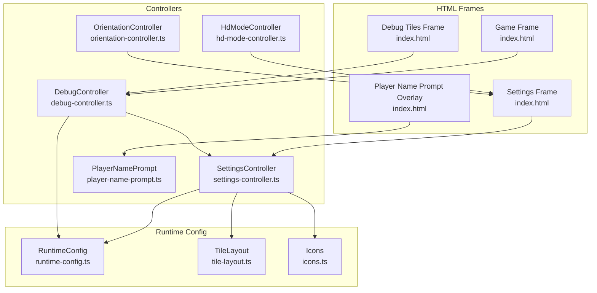
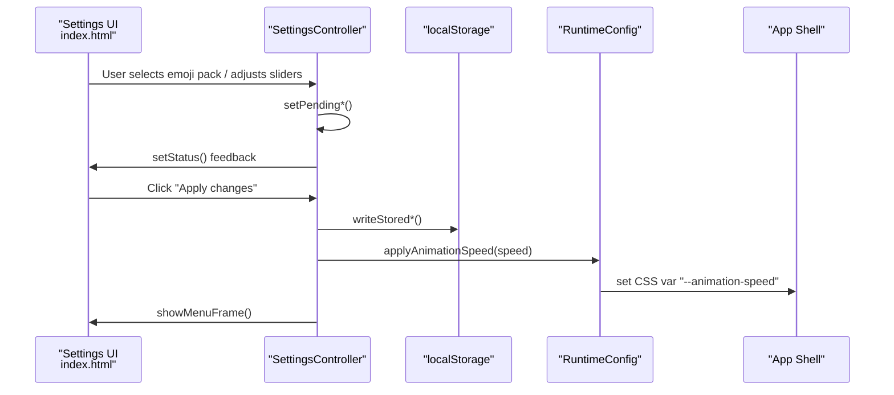
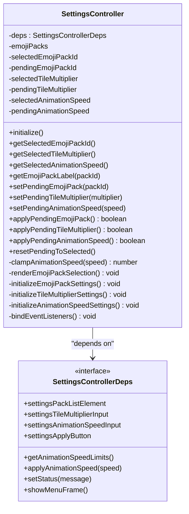
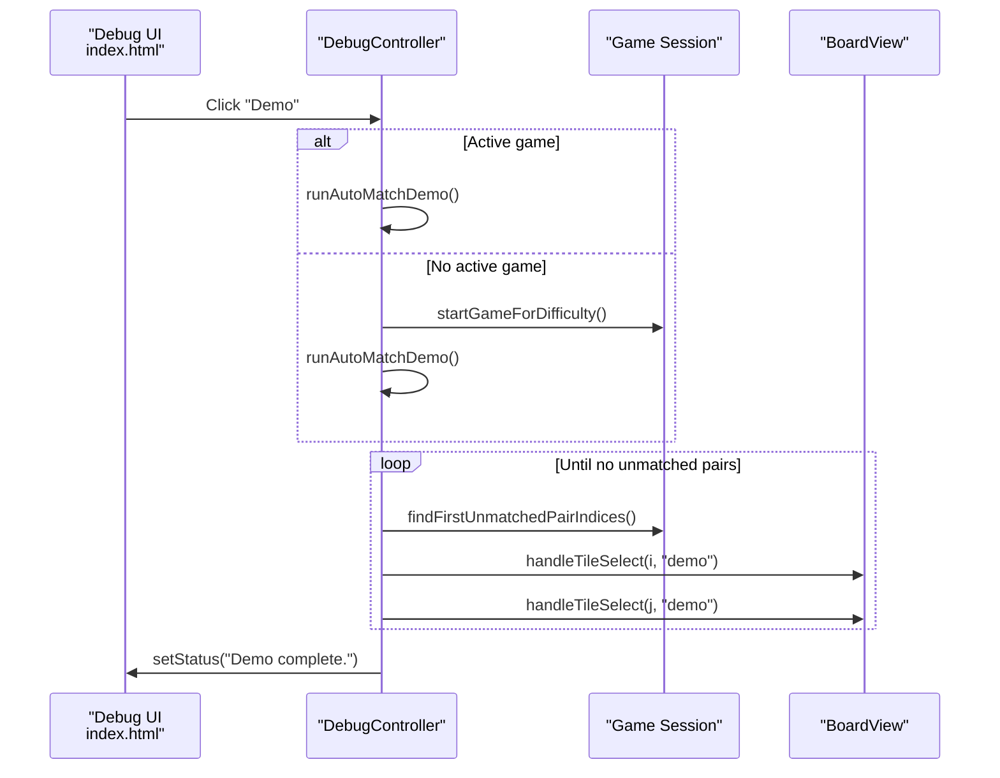
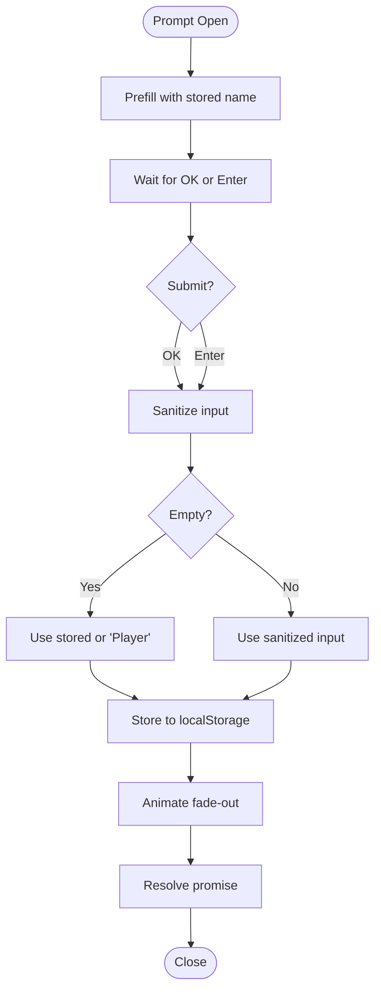
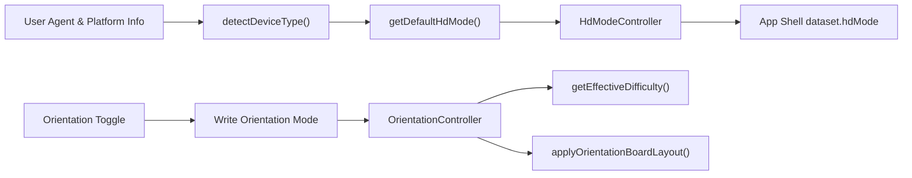
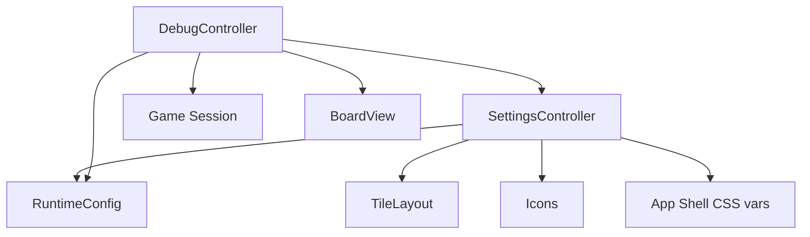

# Settings and Debug System

<cite>
**Referenced Files in This Document**
- [settings-controller.ts](file://src/settings-controller.ts)
- [debug-controller.ts](file://src/debug-controller.ts)
- [player-name-prompt.ts](file://src/player-name-prompt.ts)
- [hd-mode-controller.ts](file://src/hd-mode-controller.ts)
- [orientation-controller.ts](file://src/orientation-controller.ts)
- [index.ts](file://src/index.ts)
- [runtime-config.ts](file://src/runtime-config.ts)
- [tile-layout.ts](file://src/tile-layout.ts)
- [icons.ts](file://src/icons.ts)
- [index.html](file://index.html)
- [settings-controller.test.ts](file://tests/settings-controller.test.ts)
- [debug-controller.test.ts](file://tests/debug-controller.test.ts)
- [player-name-prompt.test.ts](file://tests/player-name-prompt.test.ts)
</cite>

## Table of Contents
1. [Introduction](#introduction)
2. [Project Structure](#project-structure)
3. [Core Components](#core-components)
4. [Architecture Overview](#architecture-overview)
5. [Detailed Component Analysis](#detailed-component-analysis)
6. [Dependency Analysis](#dependency-analysis)
7. [Performance Considerations](#performance-considerations)
8. [Troubleshooting Guide](#troubleshooting-guide)
9. [Conclusion](#conclusion)
10. [Appendices](#appendices)

## Introduction
This document explains the settings and debug system for user customization and development tools. It covers:
- Settings controller: theme switching (emoji packs), tile multiplier adjustment, and animation speed control with two-phase commit and localStorage persistence
- Debug menu: demo modes, win simulation, tile inspection, SVG import diagnostics, and flip-all-tiles toggle
- Player name prompt with localStorage persistence and sanitization
- HD mode toggles and orientation handling for responsive UX
- Practical debug workflows, development best practices, and accessibility features

## Project Structure
The settings and debug systems are implemented as cohesive controllers integrated into the main application bootstrap. The HTML provides dedicated frames and controls for settings, debug, and player prompts.

**Diagram sources**
- [index.html:62-92](file://index.html#L62-L92)
- [settings-controller.ts:33-295](file://src/settings-controller.ts#L33-L295)
- [debug-controller.ts:87-469](file://src/debug-controller.ts#L87-L469)
- [player-name-prompt.ts:31-124](file://src/player-name-prompt.ts#L31-L124)
- [runtime-config.ts:99-156](file://src/runtime-config.ts#L99-L156)
- [tile-layout.ts:19-53](file://src/tile-layout.ts#L19-L53)
- [icons.ts:56-528](file://src/icons.ts#L56-L528)

**Section sources**
- [index.html:1-196](file://index.html#L1-L196)
- [index.ts:919-971](file://src/index.ts#L919-L971)

## Core Components
- SettingsController: Manages emoji pack selection, tile multiplier, and animation speed with two-phase commit, UI rendering, and localStorage persistence
- DebugController: Provides debug modes (demo, win, tiles, SVG imports), near-win simulation, and flip-all-tiles toggle
- PlayerNamePrompt: Collects and persists player names with sanitization and accessibility
- HdModeController: Detects device type, manages HD mode toggle, and applies CSS dataset flags
- OrientationController: Manages orientation mode, persistence, and responsive layout adjustments

**Section sources**
- [settings-controller.ts:33-295](file://src/settings-controller.ts#L33-L295)
- [debug-controller.ts:87-469](file://src/debug-controller.ts#L87-L469)
- [player-name-prompt.ts:31-124](file://src/player-name-prompt.ts#L31-L124)
- [hd-mode-controller.ts:1-81](file://src/hd-mode-controller.ts#L1-L81)
- [orientation-controller.ts:1-105](file://src/orientation-controller.ts#L1-L105)

## Architecture Overview
The main application orchestrates controllers and runtime configuration. SettingsController reads/writes localStorage and applies animation speed to CSS variables and effect controllers. DebugController coordinates game sessions and debug-specific UI states.

**Diagram sources**
- [index.html:62-92](file://index.html#L62-L92)
- [settings-controller.ts:70-129](file://src/settings-controller.ts#L70-L129)
- [runtime-config.ts:151-155](file://src/runtime-config.ts#L151-L155)
- [index.ts:282-289](file://src/index.ts#L282-L289)

## Detailed Component Analysis

### SettingsController
Implements a two-phase commit pattern for settings:
- Pending state: reflects uncommitted changes in the UI
- Selected state: persisted and active configuration
- Apply: commits pending to selected and writes to localStorage
- Reset: discards pending changes and reverts UI

Key behaviors:
- Emoji pack selection with radio-group semantics and ARIA attributes
- Tile multiplier clamped to [1,3] with slider wheel support
- Animation speed clamped by runtime limits and applied to CSS variables
- Persistence via localStorage keys for emoji pack, tile multiplier, and animation speed

**Diagram sources**
- [settings-controller.ts:14-49](file://src/settings-controller.ts#L14-L49)
- [settings-controller.ts:33-295](file://src/settings-controller.ts#L33-L295)

Practical usage examples:
- Theme switching: Select an emoji pack, click Apply; the UI updates immediately and persists across sessions
- Tile multiplier: Adjust slider; the game deck adapts via tile layout computation
- Animation speed: Change speed; CSS variables scale gameplay timings

Accessibility features:
- Radio group semantics for emoji packs
- Proper aria-checked and aria-label attributes
- Slider wheel scrolling enabled for keyboard and mouse navigation

**Section sources**
- [settings-controller.ts:33-295](file://src/settings-controller.ts#L33-L295)
- [tile-layout.ts:19-53](file://src/tile-layout.ts#L19-L53)
- [runtime-config.ts:151-155](file://src/runtime-config.ts#L151-L155)
- [index.ts:1070-1072](file://src/index.ts#L1070-L1072)

### DebugController
Provides development and diagnostic tools:
- Debug menu visibility: open/close/toggle with escape handling and outside-click dismissal
- Demo mode: auto-match demonstration with abort control and scaled timing
- Near-win state: prepares a state where only one pair remains to test win conditions
- Debug tiles mode: specialized game with debug difficulty for tile inspection
- SVG imports mode: hard board with imported SVG icons for asset validation
- Flip tiles toggle: reveals all tiles for visual verification

**Diagram sources**
- [debug-controller.ts:238-426](file://src/debug-controller.ts#L238-L426)
- [index.html:172-181](file://index.html#L172-L181)

Additional capabilities:
- Score penalty for debug actions via session flags
- Abort controllers to cancel demos and clean up timeouts
- Orientation-aware gameplay timing scaling

**Section sources**
- [debug-controller.ts:87-469](file://src/debug-controller.ts#L87-L469)
- [index.ts:639-779](file://src/index.ts#L639-L779)

### PlayerNamePrompt
Collects and persists player names with sanitization and accessibility:
- Prefills input with stored name
- Trims and collapses whitespace; enforces length limit
- Stores resolved name on submit or Enter key
- Fallback to stored name or default "Player" when empty

**Diagram sources**
- [player-name-prompt.ts:59-117](file://src/player-name-prompt.ts#L59-L117)

**Section sources**
- [player-name-prompt.ts:31-124](file://src/player-name-prompt.ts#L31-L124)
- [index.ts:718-718](file://src/index.ts#L718-L718)

### HD Mode and Orientation Controllers
- HdModeController: detects device type, manages "on"/"off" mode, updates aria-pressed, applies dataset flag, and toggles visual effects
- OrientationController: manages "landscape"/"portrait" mode, persists choice, swaps difficulty rows/columns, updates icons, and adjusts window resize constraints

**Diagram sources**
- [hd-mode-controller.ts:28-55](file://src/hd-mode-controller.ts#L28-L55)
- [orientation-controller.ts:9-76](file://src/orientation-controller.ts#L9-L76)
- [index.ts:1055-1068](file://src/index.ts#L1055-L1068)

**Section sources**
- [hd-mode-controller.ts:1-81](file://src/hd-mode-controller.ts#L1-L81)
- [orientation-controller.ts:1-105](file://src/orientation-controller.ts#L1-L105)
- [index.ts:501-563](file://src/index.ts#L501-L563)

## Dependency Analysis
SettingsController depends on:
- Runtime configuration for animation speed limits
- Tile layout for multiplier clamping
- Icons for emoji pack metadata and deck generation
- Application shell for applying animation speed CSS variables

DebugController depends on:
- SettingsController for current selections
- Runtime configuration for scaled timings
- Game session state and board views for rendering and animations

**Diagram sources**
- [settings-controller.ts:14-49](file://src/settings-controller.ts#L14-L49)
- [debug-controller.ts:17-59](file://src/debug-controller.ts#L17-L59)
- [runtime-config.ts:151-155](file://src/runtime-config.ts#L151-L155)
- [tile-layout.ts:19-22](file://src/tile-layout.ts#L19-L22)
- [icons.ts:56-528](file://src/icons.ts#L56-L528)
- [index.ts:282-293](file://src/index.ts#L282-L293)

**Section sources**
- [index.ts:919-971](file://src/index.ts#L919-L971)
- [settings-controller.ts:14-49](file://src/settings-controller.ts#L14-L49)
- [debug-controller.ts:17-59](file://src/debug-controller.ts#L17-L59)

## Performance Considerations
- Two-phase commit reduces unnecessary DOM updates and localStorage writes until Apply
- Animation speed scaling uses CSS variables and a single conversion function to avoid repeated computations
- Abort controllers and timeout cancellation prevent resource leaks during demos
- Orientation and HD mode changes are applied via dataset flags and CSS variables for efficient rendering

[No sources needed since this section provides general guidance]

## Troubleshooting Guide
Common issues and resolutions:
- Settings not persisting: Verify localStorage keys and that apply methods are called
- Animation speed not changing: Ensure runtime limits are configured and applyAnimationSpeed is invoked
- Debug demo not starting: Confirm an active game session or allow automatic game creation from menu
- Flip tiles not working: Ensure a game is active; the debug button is disabled otherwise
- Player name not saved: Check sanitization and localStorage write paths

Validation and testing:
- SettingsController tests cover two-phase commit, initialization, and event handling
- DebugController tests cover menu visibility, demo timing, and abort scenarios
- PlayerNamePrompt tests cover storage, sanitization, and fallback behavior

**Section sources**
- [settings-controller.test.ts:44-362](file://tests/settings-controller.test.ts#L44-L362)
- [debug-controller.test.ts:110-705](file://tests/debug-controller.test.ts#L110-L705)
- [player-name-prompt.test.ts:29-237](file://tests/player-name-prompt.test.ts#L29-L237)

## Conclusion
The settings and debug system provides robust user customization and powerful development tools. SettingsController ensures safe, user-friendly configuration with persistence and accessibility. DebugController offers comprehensive diagnostics and automation for rapid iteration. Together with player name prompt, HD mode, and orientation handling, the system balances usability, performance, and developer productivity.

[No sources needed since this section summarizes without analyzing specific files]

## Appendices

### Practical Debug Workflows
- Demo automation: From the debug menu, start a demo to verify gameplay flow and timing
- Near-win testing: Prepare a near-win state to validate win conditions and animations
- Tile inspection: Use debug tiles mode to verify tile visuals and icon distribution
- Asset validation: Run SVG imports mode on hard difficulty to test imported assets
- Flip-all-tiles: Temporarily reveal all tiles to inspect duplicates and layout

### Development Best Practices
- Use two-phase commit for settings to minimize side effects until Apply
- Scale all animation-related delays using the runtime configuration and animation speed
- Always cancel demos and clear timeouts when leaving debug contexts
- Keep accessibility attributes synchronized with programmatic state changes
- Persist user preferences to localStorage and validate on startup

[No sources needed since this section provides general guidance]