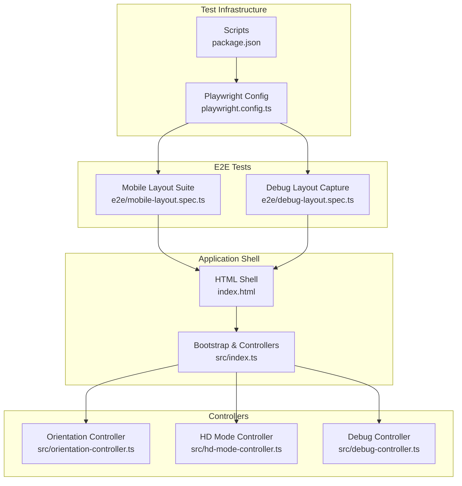
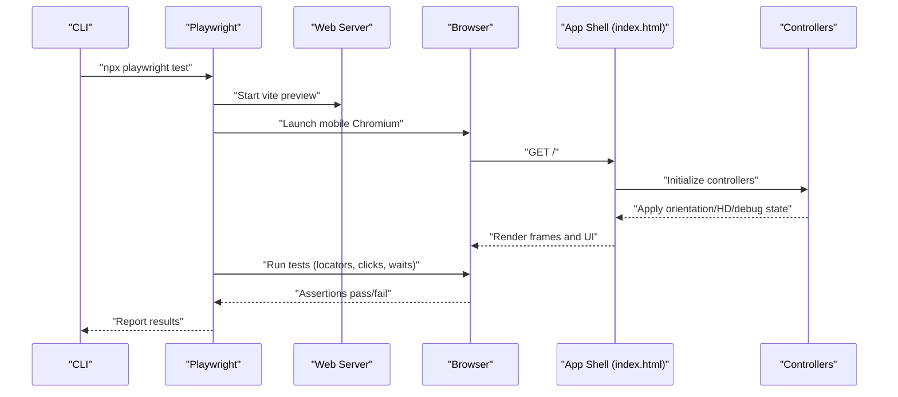
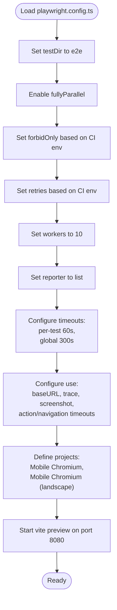
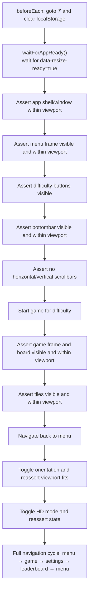
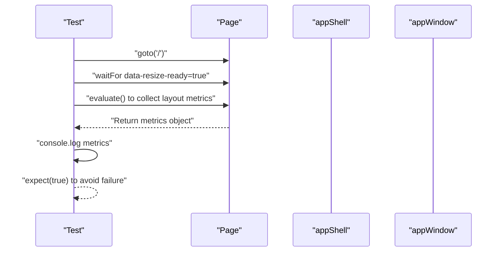
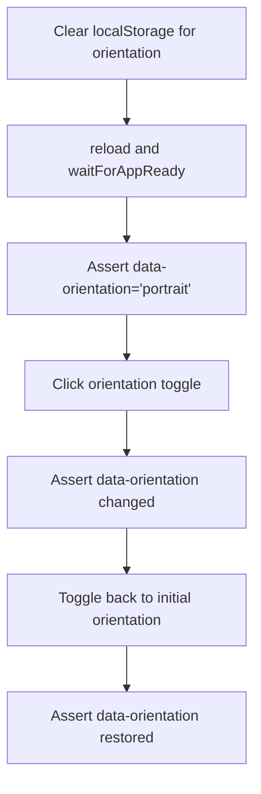
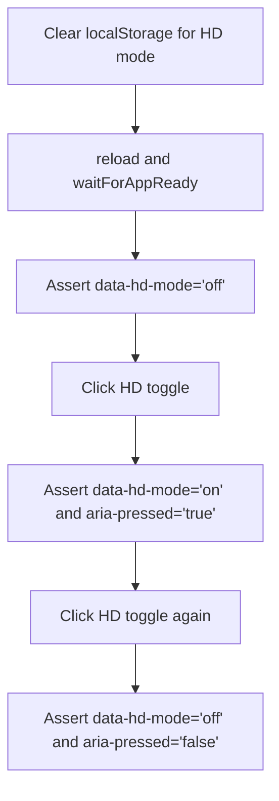
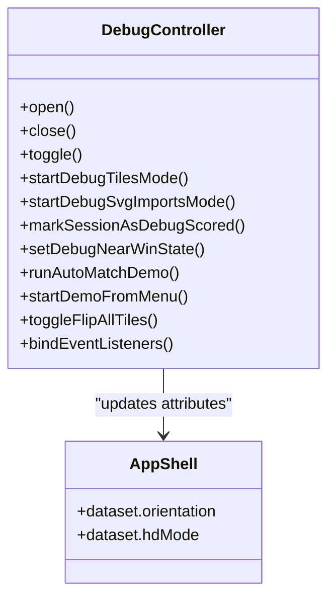
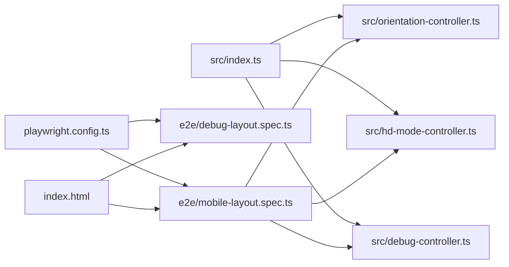

# End-to-End Testing

<cite>
**Referenced Files in This Document**
- [playwright.config.ts](file://playwright.config.ts)
- [package.json](file://package.json)
- [e2e/mobile-layout.spec.ts](file://e2e/mobile-layout.spec.ts)
- [e2e/debug-layout.spec.ts](file://e2e/debug-layout.spec.ts)
- [index.html](file://index.html)
- [src/index.ts](file://src/index.ts)
- [src/debug-controller.ts](file://src/debug-controller.ts)
- [src/orientation-controller.ts](file://src/orientation-controller.ts)
- [src/hd-mode-controller.ts](file://src/hd-mode-controller.ts)
- [.github/workflows/pages.yml](file://.github/workflows/pages.yml)
- [docs/testing-strategy.md](file://docs/testing-strategy.md)
</cite>

## Table of Contents
1. [Introduction](#introduction)
2. [Project Structure](#project-structure)
3. [Core Components](#core-components)
4. [Architecture Overview](#architecture-overview)
5. [Detailed Component Analysis](#detailed-component-analysis)
6. [Dependency Analysis](#dependency-analysis)
7. [Performance Considerations](#performance-considerations)
8. [Troubleshooting Guide](#troubleshooting-guide)
9. [Conclusion](#conclusion)
10. [Appendices](#appendices)

## Introduction
This document describes end-to-end testing for browser automation using the Playwright framework. It focuses on user workflows, responsive layout validation, and cross-browser compatibility testing for a mobile-first application. It documents configuration, page object patterns, and visual regression strategies, and provides practical examples for game initialization, mobile responsiveness, debug mode functionality, and user interaction flows. It also covers test execution environments, CI/CD integration, and automated browser testing strategies.

## Project Structure
The repository organizes E2E tests under the e2e directory and integrates with Playwright for browser automation. The application’s HTML shell defines the DOM structure and key selectors used by E2E tests. Controllers in src implement core behaviors validated by E2E tests, including orientation, HD mode, and debug features.

**Diagram sources**
- [playwright.config.ts:1-51](file://playwright.config.ts#L1-L51)
- [package.json:1-1](file://package.json#L1-L1)
- [e2e/mobile-layout.spec.ts:1-534](file://e2e/mobile-layout.spec.ts#L1-L534)
- [e2e/debug-layout.spec.ts:1-60](file://e2e/debug-layout.spec.ts#L1-L60)
- [index.html:1-196](file://index.html#L1-L196)
- [src/index.ts:1-1100](file://src/index.ts#L1-L1100)
- [src/orientation-controller.ts:1-105](file://src/orientation-controller.ts#L1-L105)
- [src/hd-mode-controller.ts:1-81](file://src/hd-mode-controller.ts#L1-L81)
- [src/debug-controller.ts:1-470](file://src/debug-controller.ts#L1-L470)

**Section sources**
- [playwright.config.ts:1-51](file://playwright.config.ts#L1-L51)
- [package.json:1-1](file://package.json#L1-L1)
- [e2e/mobile-layout.spec.ts:1-534](file://e2e/mobile-layout.spec.ts#L1-L534)
- [e2e/debug-layout.spec.ts:1-60](file://e2e/debug-layout.spec.ts#L1-L60)
- [index.html:1-196](file://index.html#L1-L196)
- [src/index.ts:1-1100](file://src/index.ts#L1-L1100)
- [src/orientation-controller.ts:1-105](file://src/orientation-controller.ts#L1-L105)
- [src/hd-mode-controller.ts:1-81](file://src/hd-mode-controller.ts#L1-L81)
- [src/debug-controller.ts:1-470](file://src/debug-controller.ts#L1-L470)

## Core Components
- Playwright configuration defines test directory, parallelism, timeouts, tracing, screenshots, and device projects for mobile Chromium and landscape variants.
- E2E suites:
  - Mobile layout suite validates viewport-bound frames, menus, game board, orientation toggling, HD mode, and navigation flows.
  - Debug layout capture logs computed layout metrics for diagnostics.
- Application controllers:
  - Orientation controller manages portrait/landscape modes and UI state attributes.
  - HD mode controller manages HD mode state and UI attributes.
  - Debug controller exposes debug modes and UI toggles used by E2E tests.

**Section sources**
- [playwright.config.ts:9-51](file://playwright.config.ts#L9-L51)
- [e2e/mobile-layout.spec.ts:1-534](file://e2e/mobile-layout.spec.ts#L1-L534)
- [e2e/debug-layout.spec.ts:1-60](file://e2e/debug-layout.spec.ts#L1-L60)
- [src/orientation-controller.ts:1-105](file://src/orientation-controller.ts#L1-L105)
- [src/hd-mode-controller.ts:1-81](file://src/hd-mode-controller.ts#L1-L81)
- [src/debug-controller.ts:1-470](file://src/debug-controller.ts#L1-L470)

## Architecture Overview
The E2E pipeline uses Playwright to launch a local static server, navigate to the app shell, and assert UI correctness across screens and interactions. The tests rely on selectors defined in the HTML shell and validate behaviors orchestrated by controllers.

**Diagram sources**
- [playwright.config.ts:45-50](file://playwright.config.ts#L45-L50)
- [index.html:14-196](file://index.html#L14-L196)
- [src/index.ts:1-1100](file://src/index.ts#L1-L1100)
- [src/orientation-controller.ts:1-105](file://src/orientation-controller.ts#L1-L105)
- [src/hd-mode-controller.ts:1-81](file://src/hd-mode-controller.ts#L1-L81)
- [src/debug-controller.ts:1-470](file://src/debug-controller.ts#L1-L470)

## Detailed Component Analysis

### Playwright Configuration
Key configuration aspects:
- Test directory and parallelization for efficient execution.
- CI-aware enforcement and retries.
- Global and per-test timeouts suitable for mobile emulation.
- Trace collection on first retry and screenshots on failure.
- Projects targeting Pixel 7 and landscape variants.
- Local static server via vite preview.

**Diagram sources**
- [playwright.config.ts:9-51](file://playwright.config.ts#L9-L51)

**Section sources**
- [playwright.config.ts:9-51](file://playwright.config.ts#L9-L51)

### Mobile Layout Suite (Page Object Pattern)
The mobile layout suite demonstrates:
- Centralized selectors and helper functions for readability and reuse.
- Robust readiness checks using dataset attributes.
- Viewport-bound assertions for frames and tiles.
- Navigation flows across screens with cross-screen viewport validation.
- Orientation toggling and HD mode toggling validations.

**Diagram sources**
- [e2e/mobile-layout.spec.ts:36-45](file://e2e/mobile-layout.spec.ts#L36-L45)
- [e2e/mobile-layout.spec.ts:48-71](file://e2e/mobile-layout.spec.ts#L48-L71)
- [e2e/mobile-layout.spec.ts:73-79](file://e2e/mobile-layout.spec.ts#L73-L79)
- [e2e/mobile-layout.spec.ts:81-88](file://e2e/mobile-layout.spec.ts#L81-L88)
- [e2e/mobile-layout.spec.ts:94-175](file://e2e/mobile-layout.spec.ts#L94-L175)
- [e2e/mobile-layout.spec.ts:211-279](file://e2e/mobile-layout.spec.ts#L211-L279)
- [e2e/mobile-layout.spec.ts:283-379](file://e2e/mobile-layout.spec.ts#L283-L379)
- [e2e/mobile-layout.spec.ts:449-487](file://e2e/mobile-layout.spec.ts#L449-L487)
- [e2e/mobile-layout.spec.ts:491-533](file://e2e/mobile-layout.spec.ts#L491-L533)

**Section sources**
- [e2e/mobile-layout.spec.ts:1-534](file://e2e/mobile-layout.spec.ts#L1-L534)

### Debug Layout Capture
The debug layout capture test:
- Waits for the app shell to be ready.
- Evaluates and logs layout metrics including viewport, devicePixelRatio, UA, body styles, CSS variables, and bounding boxes.
- Uses console logging for diagnostics without asserting.

**Diagram sources**
- [e2e/debug-layout.spec.ts:3-59](file://e2e/debug-layout.spec.ts#L3-L59)

**Section sources**
- [e2e/debug-layout.spec.ts:1-60](file://e2e/debug-layout.spec.ts#L1-L60)

### Orientation Controller Integration
Orientation behavior validated by E2E:
- Defaults to portrait on mobile.
- Toggling updates data attributes and UI state.
- Board and app window remain within viewport after orientation change.

**Diagram sources**
- [src/orientation-controller.ts:9-23](file://src/orientation-controller.ts#L9-L23)
- [src/orientation-controller.ts:50-76](file://src/orientation-controller.ts#L50-L76)
- [e2e/mobile-layout.spec.ts:289-323](file://e2e/mobile-layout.spec.ts#L289-L323)
- [e2e/mobile-layout.spec.ts:325-378](file://e2e/mobile-layout.spec.ts#L325-L378)

**Section sources**
- [src/orientation-controller.ts:1-105](file://src/orientation-controller.ts#L1-L105)
- [e2e/mobile-layout.spec.ts:283-379](file://e2e/mobile-layout.spec.ts#L283-L379)

### HD Mode Controller Integration
HD mode behavior validated by E2E:
- Defaults to off on mobile.
- Toggling updates data attributes and UI state.
- Assertions verify aria-pressed and data attributes.

**Diagram sources**
- [src/hd-mode-controller.ts:39-55](file://src/hd-mode-controller.ts#L39-L55)
- [src/hd-mode-controller.ts:57-73](file://src/hd-mode-controller.ts#L57-L73)
- [e2e/mobile-layout.spec.ts:459-487](file://e2e/mobile-layout.spec.ts#L459-L487)

**Section sources**
- [src/hd-mode-controller.ts:1-81](file://src/hd-mode-controller.ts#L1-L81)
- [e2e/mobile-layout.spec.ts:449-487](file://e2e/mobile-layout.spec.ts#L449-L487)

### Debug Controller Integration
Debug features validated by E2E:
- Debug menu visibility and toggling.
- Near-win state preparation and rendering.
- Auto-match demo execution.
- Flip-all-tiles toggle behavior.

**Diagram sources**
- [src/debug-controller.ts:87-470](file://src/debug-controller.ts#L87-L470)
- [src/index.ts:100-106](file://src/index.ts#L100-L106)

**Section sources**
- [src/debug-controller.ts:1-470](file://src/debug-controller.ts#L1-L470)
- [src/index.ts:100-106](file://src/index.ts#L100-L106)

### Visual Regression Testing Approaches
Recommended strategies:
- Use Playwright’s built-in screenshot comparison via the Playwright Test reporter and CI artifacts.
- Capture full-page screenshots on failure and compare against baselines in CI.
- For layout-sensitive components, assert bounding boxes and viewport containment as in the existing suite.
- For visual parity across devices, run the same suite against multiple device projects configured in Playwright.

[No sources needed since this section provides general guidance]

### Practical Examples

#### Game Initialization and Board Rendering
- Navigate to home, wait for resize-ready, select difficulty, and assert board presence and tile counts.

**Section sources**
- [e2e/mobile-layout.spec.ts:73-79](file://e2e/mobile-layout.spec.ts#L73-L79)
- [e2e/mobile-layout.spec.ts:211-279](file://e2e/mobile-layout.spec.ts#L211-L279)

#### Mobile Responsiveness and Viewport Bounds
- Validate that frames and tiles remain within viewport boundaries across orientations and screens.

**Section sources**
- [e2e/mobile-layout.spec.ts:48-71](file://e2e/mobile-layout.spec.ts#L48-L71)
- [e2e/mobile-layout.spec.ts:219-263](file://e2e/mobile-layout.spec.ts#L219-L263)

#### Debug Mode Functionality
- Toggle debug features and assert state changes and UI updates.

**Section sources**
- [src/debug-controller.ts:118-144](file://src/debug-controller.ts#L118-L144)
- [src/debug-controller.ts:199-234](file://src/debug-controller.ts#L199-L234)
- [src/debug-controller.ts:238-273](file://src/debug-controller.ts#L238-L273)
- [src/debug-controller.ts:277-298](file://src/debug-controller.ts#L277-L298)

#### User Interaction Flows
- Navigate across screens and assert viewport containment at each step.

**Section sources**
- [e2e/mobile-layout.spec.ts:491-533](file://e2e/mobile-layout.spec.ts#L491-L533)

## Dependency Analysis
The E2E tests depend on:
- Playwright configuration for environment and device projects.
- HTML shell selectors for UI elements.
- Controllers for state transitions validated by tests.

**Diagram sources**
- [playwright.config.ts:1-51](file://playwright.config.ts#L1-L51)
- [e2e/mobile-layout.spec.ts:1-534](file://e2e/mobile-layout.spec.ts#L1-L534)
- [e2e/debug-layout.spec.ts:1-60](file://e2e/debug-layout.spec.ts#L1-L60)
- [index.html:14-196](file://index.html#L14-L196)
- [src/index.ts:1-1100](file://src/index.ts#L1-L1100)
- [src/orientation-controller.ts:1-105](file://src/orientation-controller.ts#L1-L105)
- [src/hd-mode-controller.ts:1-81](file://src/hd-mode-controller.ts#L1-L81)
- [src/debug-controller.ts:1-470](file://src/debug-controller.ts#L1-L470)

**Section sources**
- [playwright.config.ts:1-51](file://playwright.config.ts#L1-L51)
- [e2e/mobile-layout.spec.ts:1-534](file://e2e/mobile-layout.spec.ts#L1-L534)
- [e2e/debug-layout.spec.ts:1-60](file://e2e/debug-layout.spec.ts#L1-L60)
- [index.html:14-196](file://index.html#L14-L196)
- [src/index.ts:1-1100](file://src/index.ts#L1-L1100)
- [src/orientation-controller.ts:1-105](file://src/orientation-controller.ts#L1-L105)
- [src/hd-mode-controller.ts:1-81](file://src/hd-mode-controller.ts#L1-L81)
- [src/debug-controller.ts:1-470](file://src/debug-controller.ts#L1-L470)

## Performance Considerations
- Prefer spot-checking tiles in viewport validation to keep tests fast.
- Use waitFor attached/visible states judiciously to avoid flakiness.
- Leverage retries in CI to mitigate transient failures.
- Keep selectors stable and scoped to minimize rework when UI changes.

[No sources needed since this section provides general guidance]

## Troubleshooting Guide
Common issues and remedies:
- Tests failing due to timing:
  - Increase actionTimeout and navigationTimeout in configuration.
  - Use explicit waitFor states for readiness signals.
- Flaky viewport checks:
  - Add small stabilization waits after interactions.
  - Verify bounding boxes and viewport sizes before assertions.
- CI-only failures:
  - Enable trace collection on first retry and review traces.
  - Ensure web server is started before tests and reuseExistingServer is disabled in CI.

**Section sources**
- [playwright.config.ts:16-30](file://playwright.config.ts#L16-L30)
- [playwright.config.ts:23-24](file://playwright.config.ts#L23-L24)
- [playwright.config.ts:45-49](file://playwright.config.ts#L45-L49)

## Conclusion
The E2E suite leverages Playwright to validate a mobile-first application’s layout, navigation, and interactive behaviors. By combining robust readiness checks, viewport-bound assertions, and controller-driven state transitions, the suite ensures reliability across devices and orientations. Extending visual regression and adding cross-device projects will further strengthen confidence in UI stability.

[No sources needed since this section summarizes without analyzing specific files]

## Appendices

### CI/CD Integration
- GitHub Pages workflow builds, validates, and deploys the site. While separate from Playwright E2E, the same Node and npm toolchain can run Playwright tests in CI jobs.

**Section sources**
- [.github/workflows/pages.yml:1-66](file://.github/workflows/pages.yml#L1-L66)

### Test Execution Environments
- Scripts for running Playwright E2E tests are defined in package.json. Use the script to execute tests locally or in CI.

**Section sources**
- [package.json:1-1](file://package.json#L1-L1)

### Relationship Between Unit and E2E Coverage
- Unit tests cover controllers and modules extensively; E2E complements with end-to-end flows and UI validations.

**Section sources**
- [docs/testing-strategy.md:18-58](file://docs/testing-strategy.md#L18-L58)