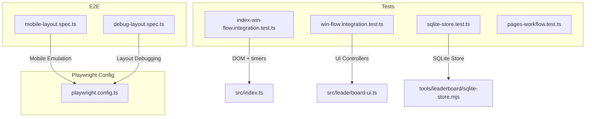
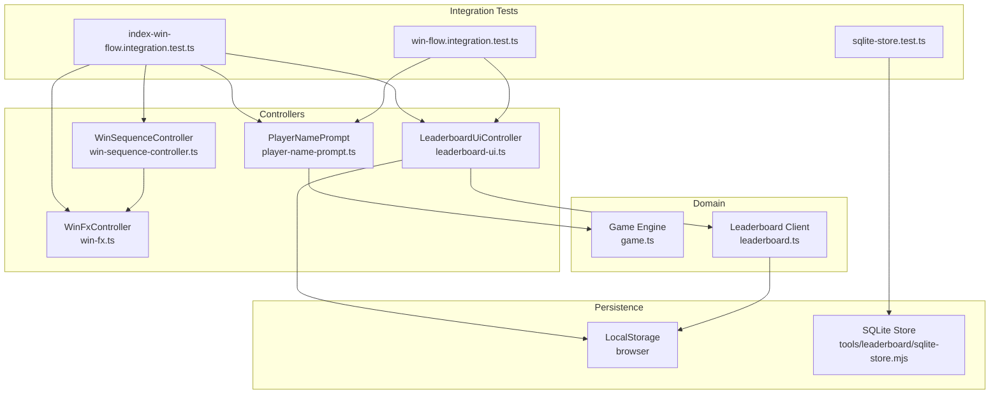
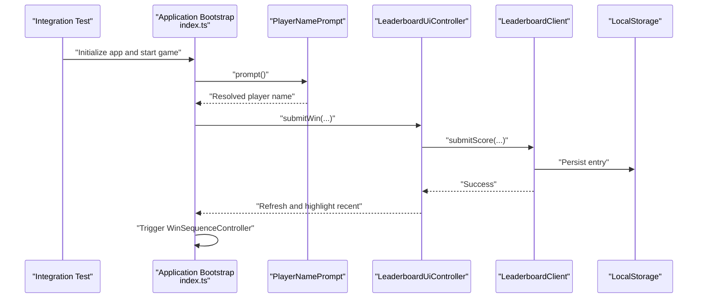
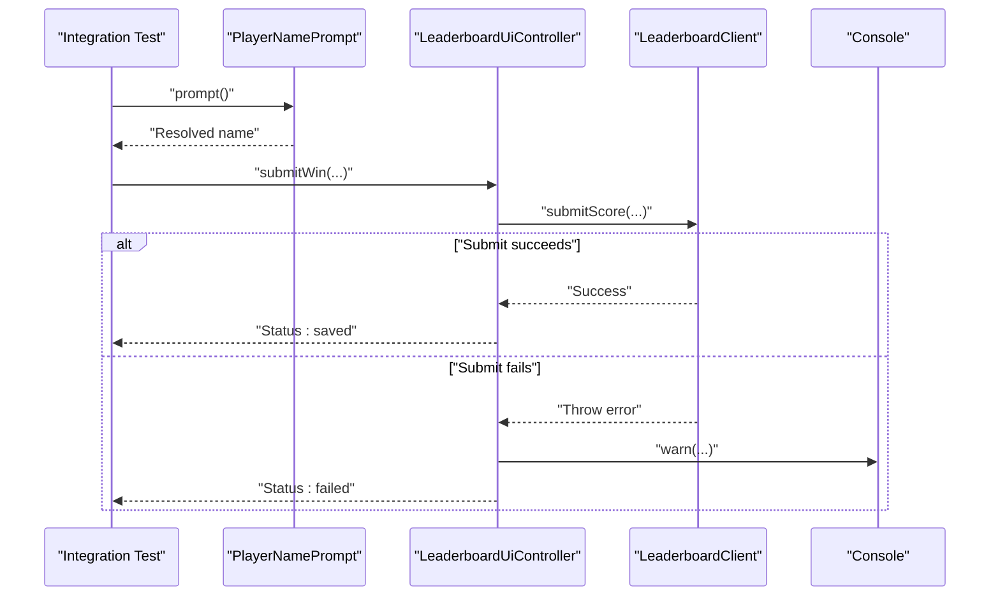
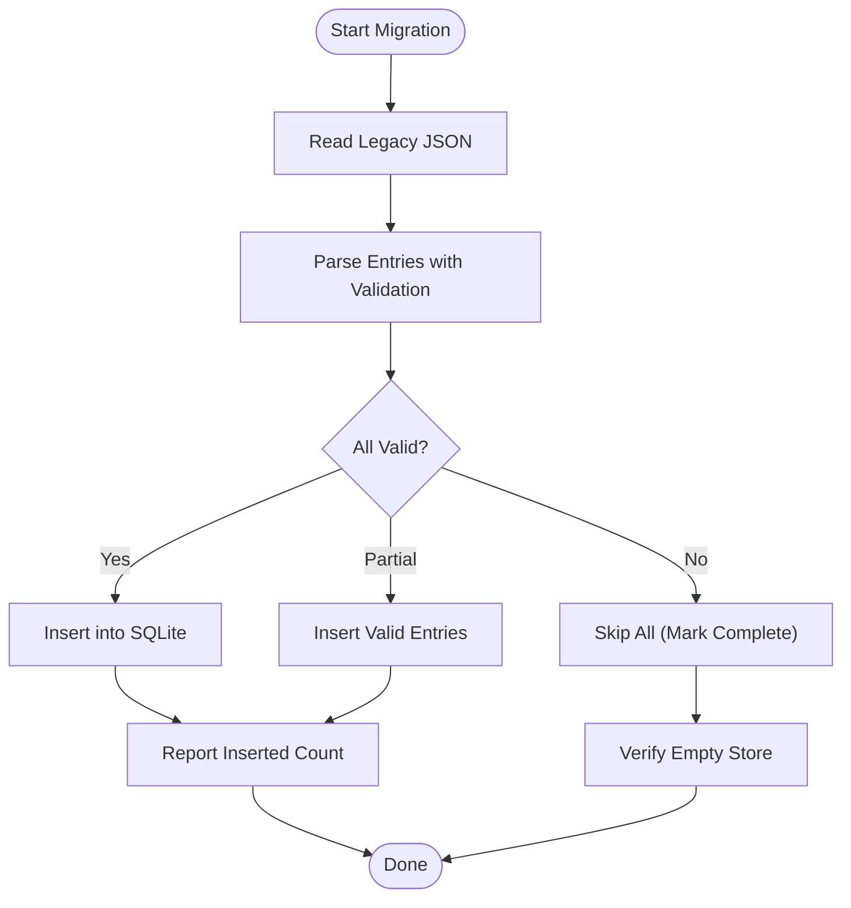
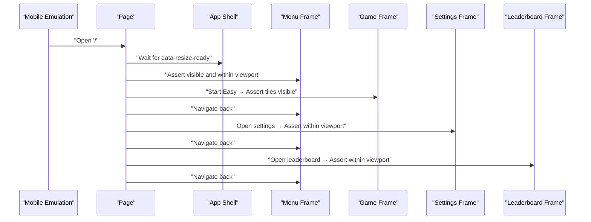
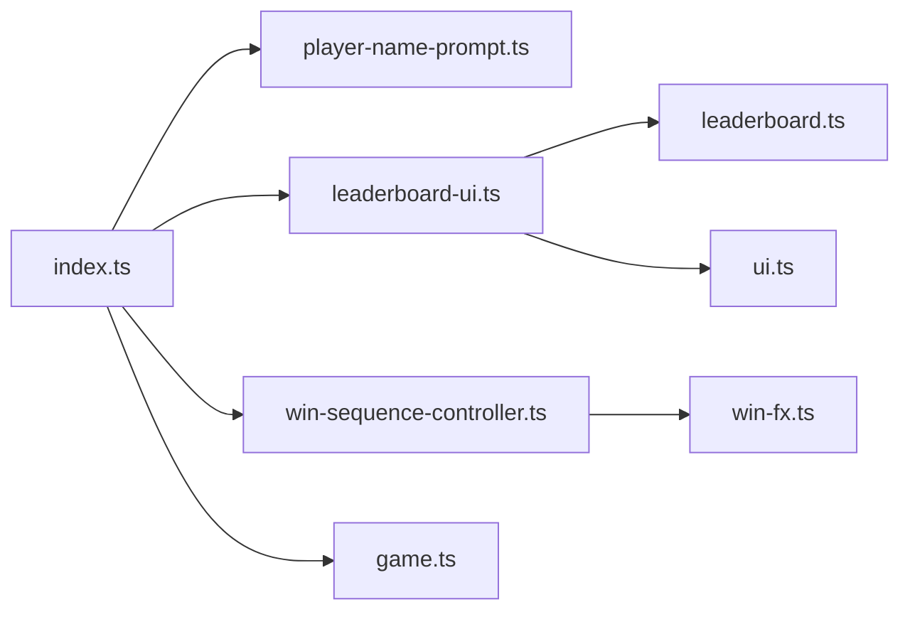

# Integration Testing

<cite>
**Referenced Files in This Document**
- [index-win-flow.integration.test.ts](file://tests/index-win-flow.integration.test.ts)
- [win-flow.integration.test.ts](file://tests/win-flow.integration.test.ts)
- [sqlite-store.test.ts](file://tests/sqlite-store.test.ts)
- [pages-workflow.test.ts](file://tests/pages-workflow.test.ts)
- [playwright.config.ts](file://playwright.config.ts)
- [mobile-layout.spec.ts](file://e2e/mobile-layout.spec.ts)
- [debug-layout.spec.ts](file://e2e/debug-layout.spec.ts)
- [index.ts](file://src/index.ts)
- [leaderboard.ts](file://src/leaderboard.ts)
- [leaderboard-ui.ts](file://src/leaderboard-ui.ts)
- [player-name-prompt.ts](file://src/player-name-prompt.ts)
- [win-sequence-controller.ts](file://src/win-sequence-controller.ts)
- [win-fx.ts](file://src/win-fx.ts)
- [ui.ts](file://src/ui.ts)
- [game.ts](file://src/game.ts)
- [test-helpers.ts](file://tests/test-helpers.ts)
</cite>

## Table of Contents
1. [Introduction](#introduction)
2. [Project Structure](#project-structure)
3. [Core Components](#core-components)
4. [Architecture Overview](#architecture-overview)
5. [Detailed Component Analysis](#detailed-component-analysis)
6. [Dependency Analysis](#dependency-analysis)
7. [Performance Considerations](#performance-considerations)
8. [Troubleshooting Guide](#troubleshooting-guide)
9. [Conclusion](#conclusion)
10. [Appendices](#appendices)

## Introduction
This document provides comprehensive integration testing guidance for validating component interactions, end-to-end game flows, page navigation, and data persistence. It focuses on:
- End-to-end win sequences and leaderboard persistence
- Multi-component coordination across UI, game logic, and persistence layers
- Test environment setup for browser DOM simulation and mobile device emulation
- Cross-component communication validation and state synchronization

## Project Structure
The repository organizes tests into unit, integration, and end-to-end categories:
- Unit and integration tests live under tests/
- End-to-end tests live under e2e/
- Playwright configuration defines mobile device profiles and server lifecycle

**Diagram sources**
- [index-win-flow.integration.test.ts:1-271](file://tests/index-win-flow.integration.test.ts#L1-L271)
- [win-flow.integration.test.ts:1-197](file://tests/win-flow.integration.test.ts#L1-L197)
- [sqlite-store.test.ts:1-269](file://tests/sqlite-store.test.ts#L1-L269)
- [mobile-layout.spec.ts:1-534](file://e2e/mobile-layout.spec.ts#L1-L534)
- [debug-layout.spec.ts:1-60](file://e2e/debug-layout.spec.ts#L1-L60)
- [playwright.config.ts:1-51](file://playwright.config.ts#L1-L51)

**Section sources**
- [index-win-flow.integration.test.ts:1-271](file://tests/index-win-flow.integration.test.ts#L1-L271)
- [win-flow.integration.test.ts:1-197](file://tests/win-flow.integration.test.ts#L1-L197)
- [sqlite-store.test.ts:1-269](file://tests/sqlite-store.test.ts#L1-L269)
- [mobile-layout.spec.ts:1-534](file://e2e/mobile-layout.spec.ts#L1-L534)
- [debug-layout.spec.ts:1-60](file://e2e/debug-layout.spec.ts#L1-L60)
- [playwright.config.ts:1-51](file://playwright.config.ts#L1-L51)

## Core Components
This section outlines the key components involved in integration testing and their roles in end-to-end flows.

- Application bootstrap and orchestration
  - Loads UI frames, manages sessions, and coordinates game state transitions
  - Coordinates player name prompts, leaderboard submissions, and win sequences
  - References: [index.ts:1-1100](file://src/index.ts#L1-L1100)

- Leaderboard subsystem
  - Computes scores, persists entries, and renders leaderboards
  - Provides client abstraction for local storage-backed persistence
  - References: [leaderboard.ts:1-541](file://src/leaderboard.ts#L1-L541), [leaderboard-ui.ts:1-234](file://src/leaderboard-ui.ts#L1-L234)

- Player name prompt
  - Captures and sanitizes player names, with fallbacks and persistence
  - References: [player-name-prompt.ts:1-124](file://src/player-name-prompt.ts#L1-L124)

- Win sequence and celebrations
  - Orchestrates sound, visual effects, and frame transitions upon win
  - References: [win-sequence-controller.ts:1-141](file://src/win-sequence-controller.ts#L1-L141), [win-fx.ts:1-830](file://src/win-fx.ts#L1-L830)

- UI view layer
  - Updates HUD elements (time, attempts, status)
  - References: [ui.ts:1-49](file://src/ui.ts#L1-L49)

- Game engine
  - Core game logic, tile selection, win detection, and state management
  - References: [game.ts:1-419](file://src/game.ts#L1-L419)

**Section sources**
- [index.ts:1-1100](file://src/index.ts#L1-L1100)
- [leaderboard.ts:1-541](file://src/leaderboard.ts#L1-L541)
- [leaderboard-ui.ts:1-234](file://src/leaderboard-ui.ts#L1-L234)
- [player-name-prompt.ts:1-124](file://src/player-name-prompt.ts#L1-L124)
- [win-sequence-controller.ts:1-141](file://src/win-sequence-controller.ts#L1-L141)
- [win-fx.ts:1-830](file://src/win-fx.ts#L1-L830)
- [ui.ts:1-49](file://src/ui.ts#L1-L49)
- [game.ts:1-419](file://src/game.ts#L1-L419)

## Architecture Overview
The integration test architecture spans DOM simulation, controller composition, and persistence layers. The following diagram maps the primary integration test flows to their underlying components.

**Diagram sources**
- [index-win-flow.integration.test.ts:1-271](file://tests/index-win-flow.integration.test.ts#L1-L271)
- [win-flow.integration.test.ts:1-197](file://tests/win-flow.integration.test.ts#L1-L197)
- [sqlite-store.test.ts:1-269](file://tests/sqlite-store.test.ts#L1-L269)
- [player-name-prompt.ts:1-124](file://src/player-name-prompt.ts#L1-L124)
- [leaderboard-ui.ts:1-234](file://src/leaderboard-ui.ts#L1-L234)
- [win-sequence-controller.ts:1-141](file://src/win-sequence-controller.ts#L1-L141)
- [win-fx.ts:1-830](file://src/win-fx.ts#L1-L830)
- [game.ts:1-419](file://src/game.ts#L1-L419)
- [leaderboard.ts:1-541](file://src/leaderboard.ts#L1-L541)

## Detailed Component Analysis

### End-to-End Win Flow Integration
This integration validates the complete win sequence from tile match to persisted leaderboard entry and celebratory effects.

**Diagram sources**
- [index-win-flow.integration.test.ts:181-237](file://tests/index-win-flow.integration.test.ts#L181-L237)
- [index.ts:716-766](file://src/index.ts#L716-L766)
- [player-name-prompt.ts:59-117](file://src/player-name-prompt.ts#L59-L117)
- [leaderboard-ui.ts:119-172](file://src/leaderboard-ui.ts#L119-L172)
- [leaderboard.ts:432-454](file://src/leaderboard.ts#L432-L454)

**Section sources**
- [index-win-flow.integration.test.ts:181-237](file://tests/index-win-flow.integration.test.ts#L181-L237)
- [index.ts:716-766](file://src/index.ts#L716-L766)
- [player-name-prompt.ts:59-117](file://src/player-name-prompt.ts#L59-L117)
- [leaderboard-ui.ts:119-172](file://src/leaderboard-ui.ts#L119-L172)
- [leaderboard.ts:432-454](file://src/leaderboard.ts#L432-L454)

### Win Flow Integration (Controller-Level)
This integration isolates controller interactions and validates submission outcomes and error handling.

**Diagram sources**
- [win-flow.integration.test.ts:18-76](file://tests/win-flow.integration.test.ts#L18-L76)
- [win-flow.integration.test.ts:131-195](file://tests/win-flow.integration.test.ts#L131-L195)
- [player-name-prompt.ts:59-117](file://src/player-name-prompt.ts#L59-L117)
- [leaderboard-ui.ts:119-172](file://src/leaderboard-ui.ts#L119-L172)
- [leaderboard.ts:432-454](file://src/leaderboard.ts#L432-L454)

**Section sources**
- [win-flow.integration.test.ts:18-76](file://tests/win-flow.integration.test.ts#L18-L76)
- [win-flow.integration.test.ts:131-195](file://tests/win-flow.integration.test.ts#L131-L195)
- [player-name-prompt.ts:59-117](file://src/player-name-prompt.ts#L59-L117)
- [leaderboard-ui.ts:119-172](file://src/leaderboard-ui.ts#L119-L172)
- [leaderboard.ts:432-454](file://src/leaderboard.ts#L432-L454)

### Leaderboard Persistence and Migration
This integration validates SQLite-backed persistence and migration from legacy JSON.

**Diagram sources**
- [sqlite-store.test.ts:90-247](file://tests/sqlite-store.test.ts#L90-L247)
- [sqlite-store.test.ts:249-267](file://tests/sqlite-store.test.ts#L249-L267)

**Section sources**
- [sqlite-store.test.ts:90-247](file://tests/sqlite-store.test.ts#L90-L247)
- [sqlite-store.test.ts:249-267](file://tests/sqlite-store.test.ts#L249-L267)

### Page Navigation and Layout Validation (E2E)
This end-to-end suite validates viewport-fitting behavior, navigation cycles, and orientation changes across mobile devices.

**Diagram sources**
- [mobile-layout.spec.ts:94-175](file://e2e/mobile-layout.spec.ts#L94-L175)
- [mobile-layout.spec.ts:489-533](file://e2e/mobile-layout.spec.ts#L489-L533)

**Section sources**
- [mobile-layout.spec.ts:94-175](file://e2e/mobile-layout.spec.ts#L94-L175)
- [mobile-layout.spec.ts:489-533](file://e2e/mobile-layout.spec.ts#L489-L533)

## Dependency Analysis
This section maps dependencies among components and how they interact during integration tests.

**Diagram sources**
- [index.ts:1-1100](file://src/index.ts#L1-L1100)
- [player-name-prompt.ts:1-124](file://src/player-name-prompt.ts#L1-L124)
- [leaderboard-ui.ts:1-234](file://src/leaderboard-ui.ts#L1-L234)
- [win-sequence-controller.ts:1-141](file://src/win-sequence-controller.ts#L1-L141)
- [win-fx.ts:1-830](file://src/win-fx.ts#L1-L830)
- [ui.ts:1-49](file://src/ui.ts#L1-L49)
- [game.ts:1-419](file://src/game.ts#L1-L419)

**Section sources**
- [index.ts:1-1100](file://src/index.ts#L1-L1100)
- [leaderboard-ui.ts:1-234](file://src/leaderboard-ui.ts#L1-L234)
- [leaderboard.ts:1-541](file://src/leaderboard.ts#L1-L541)
- [player-name-prompt.ts:1-124](file://src/player-name-prompt.ts#L1-L124)
- [win-sequence-controller.ts:1-141](file://src/win-sequence-controller.ts#L1-L141)
- [win-fx.ts:1-830](file://src/win-fx.ts#L1-L830)
- [ui.ts:1-49](file://src/ui.ts#L1-L49)
- [game.ts:1-419](file://src/game.ts#L1-L419)

## Performance Considerations
- Timers and async sequencing
  - Use fake timers to deterministically advance asynchronous operations in integration tests
  - Reference: [index-win-flow.integration.test.ts:103-108](file://tests/index-win-flow.integration.test.ts#L103-L108), [win-flow.integration.test.ts:19-52](file://tests/win-flow.integration.test.ts#L19-L52)
- DOM measurement and rendering
  - Mock DOMRect and element measurements to avoid flakiness
  - Reference: [test-helpers.ts:10-27](file://tests/test-helpers.ts#L10-L27)
- Animation scaling and cleanup
  - Scale durations by animation speed and ensure cleanup timeouts are cleared
  - Reference: [win-sequence-controller.ts:66-118](file://src/win-sequence-controller.ts#L66-L118), [win-fx.ts:180-206](file://src/win-fx.ts#L180-L206)

[No sources needed since this section provides general guidance]

## Troubleshooting Guide
- Local storage limits and malformed entries
  - Validate storage payload sizes and handle oversized or malformed entries gracefully
  - Reference: [leaderboard.ts:374-422](file://src/leaderboard.ts#L374-L422)
- Migration robustness
  - Ensure migration skips invalid entries and marks completion to prevent repeated attempts
  - Reference: [sqlite-store.test.ts:90-151](file://tests/sqlite-store.test.ts#L90-L151), [sqlite-store.test.ts:211-247](file://tests/sqlite-store.test.ts#L211-L247)
- Console warnings and error surfacing
  - Capture and assert console warnings for submission failures
  - Reference: [win-flow.integration.test.ts:149-195](file://tests/win-flow.integration.test.ts#L149-L195)
- Static site publishing workflow
  - Confirm textures directory is included in GitHub Pages artifacts
  - Reference: [pages-workflow.test.ts:6-12](file://tests/pages-workflow.test.ts#L6-L12)

**Section sources**
- [leaderboard.ts:374-422](file://src/leaderboard.ts#L374-L422)
- [sqlite-store.test.ts:90-151](file://tests/sqlite-store.test.ts#L90-L151)
- [sqlite-store.test.ts:211-247](file://tests/sqlite-store.test.ts#L211-L247)
- [win-flow.integration.test.ts:149-195](file://tests/win-flow.integration.test.ts#L149-L195)
- [pages-workflow.test.ts:6-12](file://tests/pages-workflow.test.ts#L6-L12)

## Conclusion
The integration testing strategy leverages DOM simulation, controller-level isolation, and end-to-end mobile emulation to validate:
- End-to-end win sequences and leaderboard persistence
- Cross-component coordination and state synchronization
- Data integrity during migration and persistence
- Page navigation and viewport compliance across mobile devices

Adopting the patterns and references outlined here ensures reliable, maintainable integration tests that scale with the application’s complexity.

[No sources needed since this section summarizes without analyzing specific files]

## Appendices
- Test environment setup
  - Use Vitest with jsdom environment for DOM simulation and fake timers
  - Use Playwright with mobile device profiles for E2E validation
  - Reference: [playwright.config.ts:1-51](file://playwright.config.ts#L1-L51)
- Helper utilities for deterministic tests
  - Mock DOMRect, board tile buttons, and Math.random sequences
  - Reference: [test-helpers.ts:10-87](file://tests/test-helpers.ts#L10-L87)

**Section sources**
- [playwright.config.ts:1-51](file://playwright.config.ts#L1-L51)
- [test-helpers.ts:10-87](file://tests/test-helpers.ts#L10-L87)