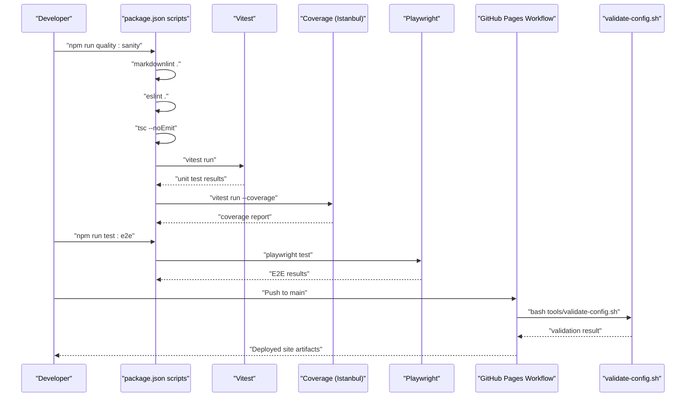
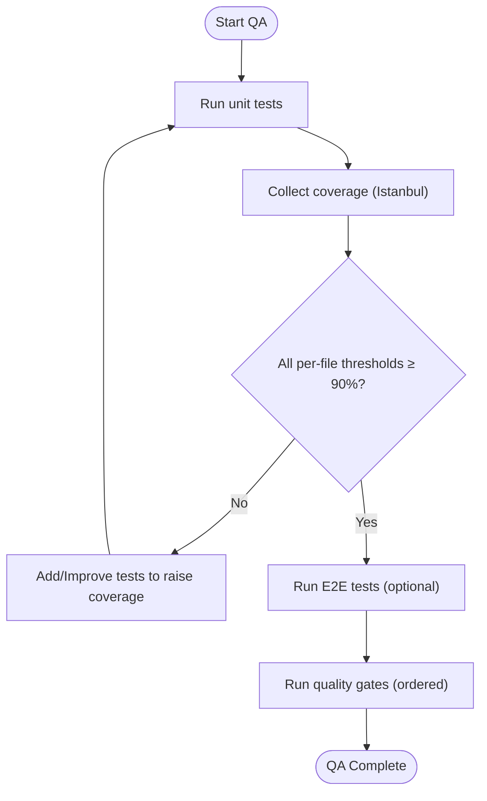
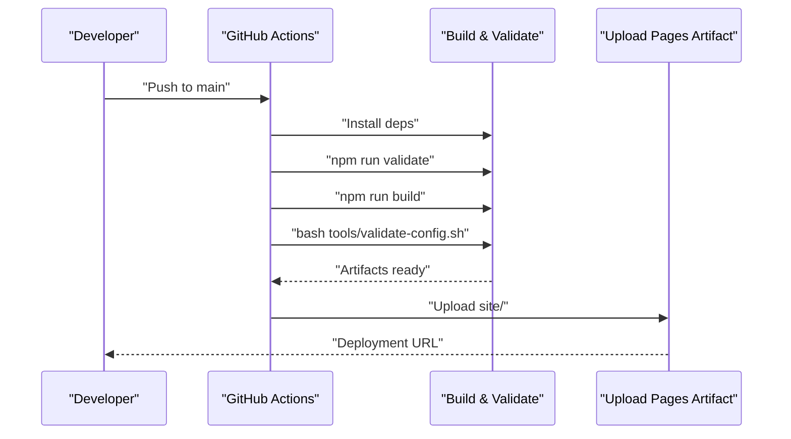
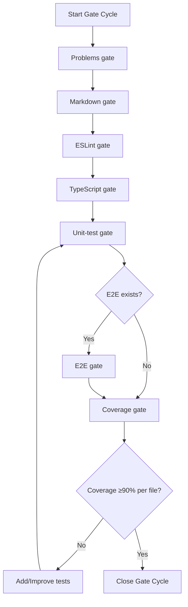
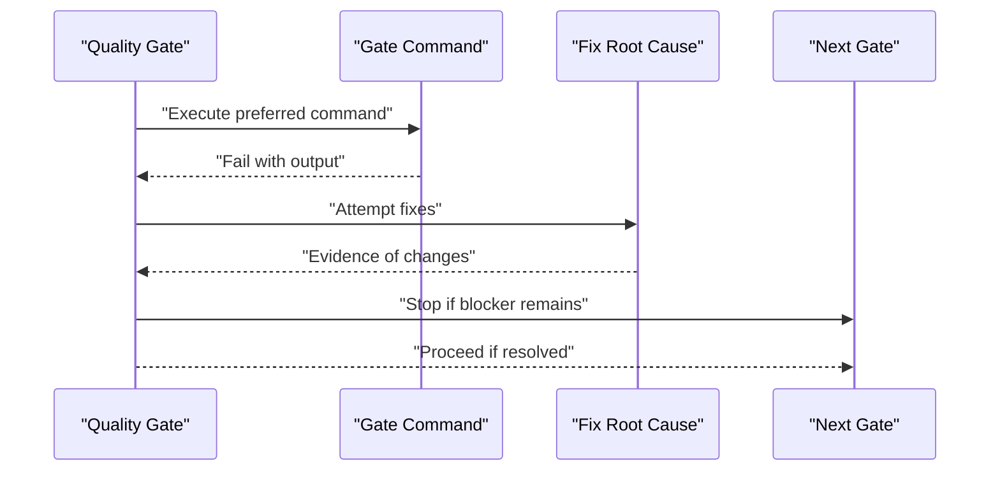
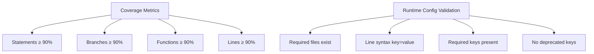
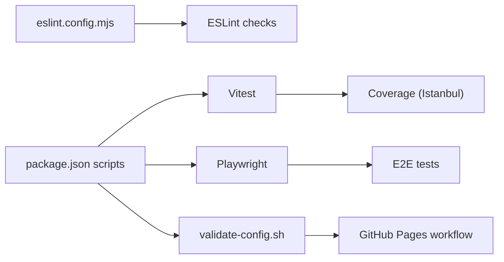

# Quality Assurance

<cite>
**Referenced Files in This Document**
- [README.md](file://README.md)
- [docs/testing-strategy.md](file://docs/testing-strategy.md)
- [package.json](file://package.json)
- [vitest.config.ts](file://vitest.config.ts)
- [playwright.config.ts](file://playwright.config.ts)
- [.github/workflows/pages.yml](file://.github/workflows/pages.yml)
- [.github/dependabot.yml](file://.github/dependabot.yml)
- [.github/skills/run-quality-gate/SKILL.md](file://.github/skills/run-quality-gate/SKILL.md)
- [.github/skills/run-quality-gate/REFERENCE.md](file://.github/skills/run-quality-gate/REFERENCE.md)
- [tools/validate-config.sh](file://tools/validate-config.sh)
- [tests/test-helpers.ts](file://tests/test-helpers.ts)
- [tests/test-helpers.test.ts](file://tests/test-helpers.test.ts)
- [eslint.config.mjs](file://eslint.config.mjs)
</cite>

## Table of Contents
1. [Introduction](#introduction)
2. [Project Structure](#project-structure)
3. [Core Components](#core-components)
4. [Architecture Overview](#architecture-overview)
5. [Detailed Component Analysis](#detailed-component-analysis)
6. [Dependency Analysis](#dependency-analysis)
7. [Performance Considerations](#performance-considerations)
8. [Troubleshooting Guide](#troubleshooting-guide)
9. [Conclusion](#conclusion)
10. [Appendices](#appendices)

## Introduction
This document defines the quality assurance strategy for the project, focusing on testing methodology, coverage requirements, quality gates, and continuous integration workflows. It consolidates repository policies for unit and end-to-end testing, coverage enforcement, validation scripts, and CI/CD practices. It also provides practical guidance for configuring GitHub Actions, maintaining test suite health, debugging strategies, and performance testing approaches.

## Project Structure
The QA-related assets are organized as follows:
- Testing and coverage: Vitest configuration, test runner scripts, and test helpers
- End-to-end testing: Playwright configuration and E2E specs
- CI/CD: GitHub Pages workflow and Dependabot configuration
- Quality gates and skills: Canonical commands and gate ordering for repository hygiene
- Validation: Bash script for runtime configuration file validation
- Linting: ESLint flat config with repository-wide ignores

```mermaid
graph TB
subgraph "Testing"
VConf["vitest.config.ts"]
TScripts["package.json<br/>scripts"]
THelpers["tests/test-helpers.ts"]
end
subgraph "E2E"
PConf["playwright.config.ts"]
E2E["e2e/*.spec.ts"]
end
subgraph "CI/CD"
GHPages[".github/workflows/pages.yml"]
Dep["dependabot.yml"]
end
subgraph "Quality Gates"
QGate["run-quality-gate SKILL.md"]
QRef["run-quality-gate REFERENCE.md"]
end
subgraph "Validation"
VC["tools/validate-config.sh"]
ESL["eslint.config.mjs"]
end
TScripts --> VConf
TScripts --> PConf
TScripts --> VC
GHPages --> VC
QGate --> TScripts
QRef --> TScripts
THelpers --> VConf
```

**Diagram sources**
- [vitest.config.ts:1-31](file://vitest.config.ts#L1-L31)
- [package.json:1-1](file://package.json#L1-L1)
- [playwright.config.ts:1-51](file://playwright.config.ts#L1-L51)
- [.github/workflows/pages.yml:1-66](file://.github/workflows/pages.yml#L1-L66)
- [.github/dependabot.yml:1-21](file://.github/dependabot.yml#L1-L21)
- [.github/skills/run-quality-gate/SKILL.md:1-105](file://.github/skills/run-quality-gate/SKILL.md#L1-L105)
- [.github/skills/run-quality-gate/REFERENCE.md:1-104](file://.github/skills/run-quality-gate/REFERENCE.md#L1-L104)
- [tools/validate-config.sh:1-129](file://tools/validate-config.sh#L1-L129)
- [eslint.config.mjs:1-49](file://eslint.config.mjs#L1-L49)

**Section sources**
- [README.md:123-142](file://README.md#L123-L142)
- [docs/testing-strategy.md:18-27](file://docs/testing-strategy.md#L18-L27)
- [package.json:1-1](file://package.json#L1-L1)

## Core Components
- Test runner and coverage
  - Vitest with jsdom environment for DOM-dependent modules
  - Coverage via Istanbul provider with configured exclusions
  - Scripts: single run, coverage, watch, and E2E
- Quality gates and canonical commands
  - Ordered gates: Problems → Markdown → ESLint → TypeScript → Unit → E2E → Coverage
  - Canonical commands for hygiene and release readiness
- Validation pipeline
  - Pre-deploy validation of runtime config files
  - Markdown linting, ESLint, and TypeScript checks
- CI/CD
  - GitHub Pages workflow for build, validation, and deployment
  - Dependabot for automated dependency updates

**Section sources**
- [docs/testing-strategy.md:18-27](file://docs/testing-strategy.md#L18-L27)
- [vitest.config.ts:9-30](file://vitest.config.ts#L9-L30)
- [package.json:1-1](file://package.json#L1-L1)
- [.github/skills/run-quality-gate/SKILL.md:10-104](file://.github/skills/run-quality-gate/SKILL.md#L10-L104)
- [tools/validate-config.sh:1-129](file://tools/validate-config.sh#L1-L129)
- [.github/workflows/pages.yml:1-66](file://.github/workflows/pages.yml#L1-L66)

## Architecture Overview
The QA architecture integrates local developer workflows with CI gates and deployment validation.



**Diagram sources**
- [README.md:123-142](file://README.md#L123-L142)
- [package.json:1-1](file://package.json#L1-L1)
- [vitest.config.ts:9-30](file://vitest.config.ts#L9-L30)
- [playwright.config.ts:1-51](file://playwright.config.ts#L1-L51)
- [.github/workflows/pages.yml:1-66](file://.github/workflows/pages.yml#L1-L66)
- [tools/validate-config.sh:1-129](file://tools/validate-config.sh#L1-L129)

## Detailed Component Analysis

### Testing Strategy and Coverage Requirements
- Coverage policy
  - Enforced per-file thresholds: Statements, Branches, Functions, Lines ≥ 90%
  - Coverage collected via Istanbul provider; reports in multiple formats
  - Exclusions include dev tooling, bootstrap entrypoint, compiled output, linter config, test config, and CI skill definitions
- Test runner
  - Vitest with jsdom environment for DOM-dependent modules
  - Scripts: test, test:coverage, test:watch
- Conventions
  - One test file per source module
  - Mock external I/O; deterministic timing and randomness
  - Prefer verifying public APIs and restoring timers/mocks after each test
- Error handling patterns
  - Network, parse/validation, and storage errors are distinguished and tested via mocked failures



**Diagram sources**
- [docs/testing-strategy.md:29-82](file://docs/testing-strategy.md#L29-L82)
- [vitest.config.ts:16-28](file://vitest.config.ts#L16-L28)
- [.github/skills/run-quality-gate/SKILL.md:66-75](file://.github/skills/run-quality-gate/SKILL.md#L66-L75)

**Section sources**
- [docs/testing-strategy.md:29-117](file://docs/testing-strategy.md#L29-L117)
- [vitest.config.ts:16-28](file://vitest.config.ts#L16-L28)

### Continuous Integration Workflows
- GitHub Pages workflow
  - Runs on push to main and manual dispatch
  - Steps: checkout, setup Node, install deps, validate, build, validate runtime configs, prepare artifacts, upload to GitHub Pages
  - Uses a static site preparation step to copy assets and config into the site folder
- Dependabot
  - Daily updates for npm packages
  - Weekly updates for GitHub Actions workflows



**Diagram sources**
- [.github/workflows/pages.yml:1-66](file://.github/workflows/pages.yml#L1-L66)
- [tools/validate-config.sh:1-129](file://tools/validate-config.sh#L1-L129)

**Section sources**
- [.github/workflows/pages.yml:1-66](file://.github/workflows/pages.yml#L1-L66)
- [.github/dependabot.yml:1-21](file://.github/dependabot.yml#L1-L21)

### Quality Gates and Automated Testing Pipelines
- Ordered gates
  - Problems (VS Code diagnostics), Markdown, ESLint, TypeScript, Unit tests, E2E tests, Coverage
  - Gates must be closed in order; later gates do not run if an earlier gate is open
- Canonical commands
  - quality:sanity: markdownlint + eslint + tsc + vitest
  - quality:full: above + Playwright E2E
  - test:coverage: coverage report with ≥90% thresholds
- Discovery and fallback
  - Skill reference enumerates preferred command fallbacks for each gate



**Diagram sources**
- [.github/skills/run-quality-gate/SKILL.md:23-104](file://.github/skills/run-quality-gate/SKILL.md#L23-L104)
- [.github/skills/run-quality-gate/REFERENCE.md:13-104](file://.github/skills/run-quality-gate/REFERENCE.md#L13-L104)

**Section sources**
- [.github/skills/run-quality-gate/SKILL.md:10-104](file://.github/skills/run-quality-gate/SKILL.md#L10-L104)
- [.github/skills/run-quality-gate/REFERENCE.md:13-104](file://.github/skills/run-quality-gate/REFERENCE.md#L13-L104)

### Test Execution Policies and Failure Handling Procedures
- Test execution
  - Single run, watch mode, and coverage collection are supported
  - E2E tests use Playwright with mobile device profiles and extended timeouts
- Failure handling
  - Ordered remediation: fix root cause in code/tests/tooling
  - Gate stops at the blocker; report exact command, output, fixes attempted, remaining blockers, and smallest next change
  - No suppression unless explicitly approved by the user



**Diagram sources**
- [.github/skills/run-quality-gate/SKILL.md:76-86](file://.github/skills/run-quality-gate/SKILL.md#L76-L86)

**Section sources**
- [.github/skills/run-quality-gate/SKILL.md:76-86](file://.github/skills/run-quality-gate/SKILL.md#L76-L86)

### Quality Metrics Tracking
- Coverage metrics
  - Current project-wide metrics and per-file coverage targets
  - All source files must meet or exceed 90% for Statements, Branches, Functions, and Lines
- Validation metrics
  - Runtime config file validation enforces presence, syntax, required keys, and absence of deprecated keys



**Diagram sources**
- [docs/testing-strategy.md:59-82](file://docs/testing-strategy.md#L59-L82)
- [tools/validate-config.sh:14-129](file://tools/validate-config.sh#L14-L129)

**Section sources**
- [docs/testing-strategy.md:59-82](file://docs/testing-strategy.md#L59-L82)
- [tools/validate-config.sh:14-129](file://tools/validate-config.sh#L14-L129)

### Practical Examples: GitHub Actions, Pre-commit Hooks, and Test Suite Health
- GitHub Actions workflow configuration
  - Use the Pages workflow to validate and deploy the site
  - Add pre-deploy validation steps using the runtime config validator
- Pre-commit hooks
  - Integrate markdownlint, ESLint, and TypeScript checks via repository scripts
  - Optionally integrate Vitest and coverage checks in a pre-commit hook to enforce early feedback
- Maintaining test suite health
  - Use test helpers for deterministic mocks and DOM fixtures
  - Keep controller modules isolated and testable; verify error paths and edge cases
  - Regularly re-run quality gates and address blockers promptly

**Section sources**
- [.github/workflows/pages.yml:33-40](file://.github/workflows/pages.yml#L33-L40)
- [README.md:123-142](file://README.md#L123-L142)
- [tests/test-helpers.ts:1-87](file://tests/test-helpers.ts#L1-L87)
- [tests/test-helpers.test.ts:1-73](file://tests/test-helpers.test.ts#L1-L73)

### Debugging Strategies, Test Maintenance, and Performance Testing
- Debugging strategies
  - Use VS Code Problems scan after test and coverage runs
  - Leverage Playwright traces and screenshots on failure for E2E debugging
- Test maintenance
  - Follow conventions: deterministic mocks, mocking of I/O, and restoration of timers/mocks
  - Add tests after major code reviews or bug fixes to maintain coverage targets
- Performance testing
  - Use Playwright mobile profiles to detect layout regressions on constrained devices
  - Consider adding performance budgets and profiling in CI for critical paths

**Section sources**
- [README.md:133-141](file://README.md#L133-L141)
- [playwright.config.ts:21-30](file://playwright.config.ts#L21-L30)
- [docs/testing-strategy.md:84-97](file://docs/testing-strategy.md#L84-L97)

## Dependency Analysis
The QA system depends on:
- Test runner and coverage: Vitest and Istanbul provider
- Linting: ESLint flat config with recommended rules
- E2E: Playwright with mobile device profiles
- CI: GitHub Actions Pages workflow
- Validation: Bash script for runtime config files



**Diagram sources**
- [eslint.config.mjs:1-49](file://eslint.config.mjs#L1-L49)
- [package.json:1-1](file://package.json#L1-L1)
- [vitest.config.ts:16-28](file://vitest.config.ts#L16-L28)
- [playwright.config.ts:1-51](file://playwright.config.ts#L1-L51)
- [tools/validate-config.sh:1-129](file://tools/validate-config.sh#L1-L129)
- [.github/workflows/pages.yml:1-66](file://.github/workflows/pages.yml#L1-L66)

**Section sources**
- [eslint.config.mjs:1-49](file://eslint.config.mjs#L1-L49)
- [package.json:1-1](file://package.json#L1-L1)
- [vitest.config.ts:16-28](file://vitest.config.ts#L16-L28)
- [playwright.config.ts:1-51](file://playwright.config.ts#L1-L51)
- [tools/validate-config.sh:1-129](file://tools/validate-config.sh#L1-L129)
- [.github/workflows/pages.yml:1-66](file://.github/workflows/pages.yml#L1-L66)

## Performance Considerations
- Favor deterministic tests to avoid flakiness and improve repeatability
- Use mocking to eliminate slow I/O and external dependencies
- Keep coverage thresholds strict to ensure robustness across modules
- Use mobile device profiles in E2E to catch performance regressions on constrained environments

## Troubleshooting Guide
- Coverage below threshold
  - Add targeted tests for uncovered branches/functions
  - Avoid expanding exclusions; prefer increasing test coverage
- E2E failures
  - Inspect Playwright traces and screenshots
  - Verify base URL and web server startup in CI
- Lint/type errors
  - Apply auto-fixes first, then fix remaining issues manually
- Runtime config validation failures
  - Ensure required files exist, syntax is key=value, required keys are present, and deprecated keys are absent

**Section sources**
- [.github/skills/run-quality-gate/SKILL.md:66-86](file://.github/skills/run-quality-gate/SKILL.md#L66-L86)
- [playwright.config.ts:45-49](file://playwright.config.ts#L45-L49)
- [tools/validate-config.sh:14-129](file://tools/validate-config.sh#L14-L129)

## Conclusion
The project’s QA strategy combines strict coverage requirements, ordered quality gates, and CI-driven validation to ensure high code quality. Developers should run canonical commands locally, adhere to testing conventions, and rely on CI for pre-deploy checks. By maintaining test suite health and following debugging practices, the team can sustain reliability and performance across releases.

## Appendices
- Canonical commands for QA
  - quality:sanity: markdownlint + eslint + tsc + vitest
  - quality:full: above + Playwright E2E
  - test:coverage: coverage report with ≥90% thresholds
- Coverage exclusions rationale
  - Dev tooling, bootstrap entrypoint, compiled output, linter config, test config, and CI skill definitions are intentionally excluded

**Section sources**
- [.github/skills/run-quality-gate/SKILL.md:78-80](file://.github/skills/run-quality-gate/SKILL.md#L78-L80)
- [docs/testing-strategy.md:34-57](file://docs/testing-strategy.md#L34-L57)
- [vitest.config.ts:16-28](file://vitest.config.ts#L16-L28)