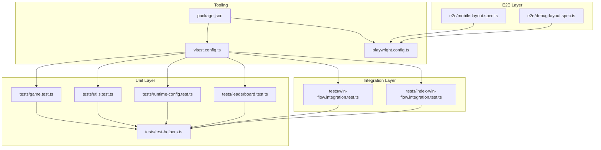
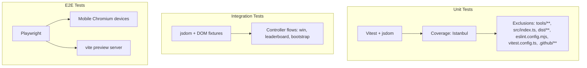
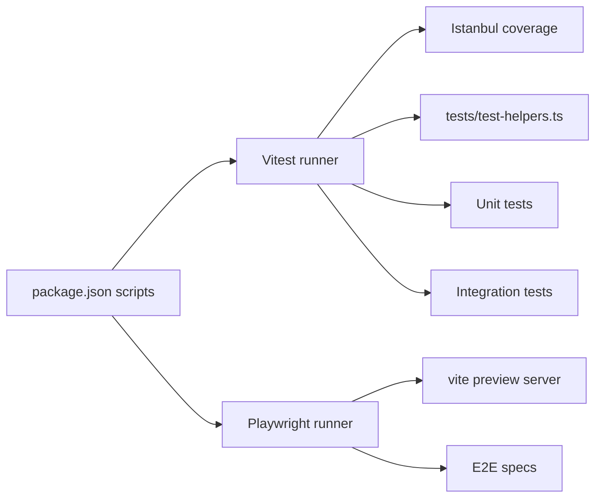

# Testing Framework

<cite>
**Referenced Files in This Document**
- [vitest.config.ts](file://vitest.config.ts)
- [playwright.config.ts](file://playwright.config.ts)
- [package.json](file://package.json)
- [docs/testing-strategy.md](file://docs/testing-strategy.md)
- [tests/test-helpers.ts](file://tests/test-helpers.ts)
- [tests/game.test.ts](file://tests/game.test.ts)
- [tests/leaderboard.test.ts](file://tests/leaderboard.test.ts)
- [tests/runtime-config.test.ts](file://tests/runtime-config.test.ts)
- [tests/utils.test.ts](file://tests/utils.test.ts)
- [tests/win-flow.integration.test.ts](file://tests/win-flow.integration.test.ts)
- [tests/index-win-flow.integration.test.ts](file://tests/index-win-flow.integration.test.ts)
- [e2e/mobile-layout.spec.ts](file://e2e/mobile-layout.spec.ts)
- [e2e/debug-layout.spec.ts](file://e2e/debug-layout.spec.ts)
- [.github/copilot-instructions.md](file://.github/copilot-instructions.md)
</cite>

## Table of Contents
1. [Introduction](#introduction)
2. [Project Structure](#project-structure)
3. [Core Components](#core-components)
4. [Architecture Overview](#architecture-overview)
5. [Detailed Component Analysis](#detailed-component-analysis)
6. [Dependency Analysis](#dependency-analysis)
7. [Performance Considerations](#performance-considerations)
8. [Troubleshooting Guide](#troubleshooting-guide)
9. [Conclusion](#conclusion)
10. [Appendices](#appendices)

## Introduction
This document describes the multi-layered testing strategy for MEMORYBLOX, covering unit tests, integration tests, and end-to-end (E2E) tests. It explains Vitest configuration, test organization patterns, coverage requirements, Playwright setup for browser automation, test helpers, and quality gates. It also documents mocking strategies, assertion patterns, continuous integration workflows, and practical guidance for writing effective tests, debugging failures, and maintaining test suites. The testing philosophy emphasizes 90%+ coverage thresholds, edge case testing, and regression prevention.

## Project Structure
The testing system is organized into three layers:
- Unit tests: Fast, isolated tests using Vitest with jsdom environment. Located under tests/.
- Integration tests: Module-level flows using jsdom and realistic DOM fixtures. Located under tests/.
- End-to-end tests: Browser automation using Playwright against a live preview server. Located under e2e/.

**Diagram sources**
- [vitest.config.ts:1-31](file://vitest.config.ts#L1-L31)
- [playwright.config.ts:1-51](file://playwright.config.ts#L1-L51)
- [package.json:1-1](file://package.json#L1-L1)
- [tests/test-helpers.ts:1-87](file://tests/test-helpers.ts#L1-L87)
- [tests/game.test.ts:1-455](file://tests/game.test.ts#L1-L455)
- [tests/utils.test.ts:1-377](file://tests/utils.test.ts#L1-L377)
- [tests/runtime-config.test.ts:1-436](file://tests/runtime-config.test.ts#L1-L436)
- [tests/leaderboard.test.ts:1-868](file://tests/leaderboard.test.ts#L1-L868)
- [tests/win-flow.integration.test.ts:1-197](file://tests/win-flow.integration.test.ts#L1-L197)
- [tests/index-win-flow.integration.test.ts:1-271](file://tests/index-win-flow.integration.test.ts#L1-L271)
- [e2e/mobile-layout.spec.ts:1-534](file://e2e/mobile-layout.spec.ts#L1-L534)
- [e2e/debug-layout.spec.ts:1-60](file://e2e/debug-layout.spec.ts#L1-L60)

**Section sources**
- [vitest.config.ts:1-31](file://vitest.config.ts#L1-L31)
- [playwright.config.ts:1-51](file://playwright.config.ts#L1-L51)
- [package.json:1-1](file://package.json#L1-L1)
- [docs/testing-strategy.md:18-27](file://docs/testing-strategy.md#L18-L27)

## Core Components
- Vitest configuration defines coverage provider, exclusions, and unit-test behavior. Coverage excludes tooling, bootstrap entrypoints, and CI configs.
- Playwright configuration targets mobile devices, parallel execution, timeouts, and automatic web server startup for E2E tests.
- Test helpers provide deterministic mocks for DOM, timers, and random sequences to stabilize tests.
- Scripts in package.json orchestrate validation, unit tests, coverage, watch mode, and E2E runs.
- Quality gates integrate linting, type checking, artifact generation, and test execution into sanity and full quality checks.

Key capabilities:
- Deterministic randomness via Math.random() spies with predefined sequences.
- DOM fixture creation for controllers and UI components.
- Fake timers for timing-sensitive tests.
- Comprehensive coverage reporting and per-file thresholds.

**Section sources**
- [vitest.config.ts:16-29](file://vitest.config.ts#L16-L29)
- [playwright.config.ts:9-51](file://playwright.config.ts#L9-L51)
- [tests/test-helpers.ts:68-87](file://tests/test-helpers.ts#L68-L87)
- [package.json:1-1](file://package.json#L1-L1)
- [docs/testing-strategy.md:59-82](file://docs/testing-strategy.md#L59-L82)

## Architecture Overview
The testing architecture spans three layers with increasing fidelity and scope:

**Diagram sources**
- [vitest.config.ts:16-29](file://vitest.config.ts#L16-L29)
- [playwright.config.ts:45-49](file://playwright.config.ts#L45-L49)
- [tests/win-flow.integration.test.ts:11-76](file://tests/win-flow.integration.test.ts#L11-L76)
- [tests/index-win-flow.integration.test.ts:110-179](file://tests/index-win-flow.integration.test.ts#L110-L179)

## Detailed Component Analysis

### Vitest Configuration and Coverage
- Provider: Istanbul for coverage collection.
- Exclusions: Tooling, bootstrap entrypoint, build output, linter config, test config, and CI definitions.
- Coverage policy: Enforced per-file thresholds for statements, branches, functions, and lines.

Practical implications:
- Exclude non-essential paths to focus coverage on shipped game logic.
- Bootstrap entrypoint is intentionally excluded from unit coverage; compensate with integration tests.

**Section sources**
- [vitest.config.ts:16-29](file://vitest.config.ts#L16-L29)
- [docs/testing-strategy.md:34-57](file://docs/testing-strategy.md#L34-L57)

### Playwright Setup and E2E Execution
- Projects: Mobile Chromium and landscape variants.
- Parallelism: Fully parallel execution with worker concurrency.
- Timeouts: Extended per-test and global timeouts suitable for mobile emulation.
- Tracing and screenshots: Enabled on first retry for CI diagnostics.
- Web server: Uses vite preview to serve the app locally for E2E tests.

Quality gates:
- Scripts run validation (lint, typecheck, markdownlint, artifacts) plus unit/E2E tests.

**Section sources**
- [playwright.config.ts:9-51](file://playwright.config.ts#L9-L51)
- [.github/copilot-instructions.md:55-76](file://.github/copilot-instructions.md#L55-L76)

### Test Organization Patterns
- One test file per source module under tests/.
- Tests avoid network and filesystem I/O by mocking fetch and localStorage.
- Timing-sensitive tests use fake timers and restore after each test.
- Prefer deterministic mocks over Math.random(); use provided helpers for reproducible sequences.

Examples of conventions:
- Mock fetch responses using test helpers.
- Stub global APIs (AudioContext, window properties) in integration tests.
- Use fake timers around asynchronous flows.

**Section sources**
- [docs/testing-strategy.md:84-97](file://docs/testing-strategy.md#L84-L97)
- [tests/test-helpers.ts:3-87](file://tests/test-helpers.ts#L3-L87)
- [tests/index-win-flow.integration.test.ts:110-179](file://tests/index-win-flow.integration.test.ts#L110-L179)

### Coverage Requirements and Metrics
- Coverage collected via Istanbul; reports include HTML, Clover, and JSON.
- Policy: All reported cells must be ≥90% for statements, branches, functions, and lines.
- Recent metrics show high coverage across modules, including dedicated controller tests.

**Section sources**
- [docs/testing-strategy.md:29-33](file://docs/testing-strategy.md#L29-L33)
- [docs/testing-strategy.md:61-82](file://docs/testing-strategy.md#L61-L82)

### Test Helpers Utilities
Key utilities:
- createMockTextResponse: Returns a mock Response for fetch.
- createMockDomRect: Creates a DOMRect for geometry tests.
- createBoardTileButton: Builds a tile DOM element with getBoundingClientRect.
- createDeterministicWinFxRandomSequence: Provides a deterministic sequence for particle tests.
- createRandomSequenceMock: Spies on Math.random() to return a controlled sequence.

Usage patterns:
- Replace Math.random() with deterministic sequences for animation and particle tests.
- Build DOM fixtures for controller tests to simulate user interactions.

**Section sources**
- [tests/test-helpers.ts:3-87](file://tests/test-helpers.ts#L3-L87)

### Unit Tests: Game Logic
Highlights:
- Edge-case coverage for board states, mismatch resolution, and win conditions.
- Range checks and state corruption detection for invalid inputs.
- Deterministic timing via fake timers for elapsed time calculations.

Patterns:
- Spy on performance.now() to control time progression.
- Assert board state transitions and status flags.

**Section sources**
- [tests/game.test.ts:15-74](file://tests/game.test.ts#L15-L74)
- [tests/game.test.ts:254-305](file://tests/game.test.ts#L254-L305)
- [tests/game.test.ts:337-454](file://tests/game.test.ts#L337-L454)

### Unit Tests: Runtime Configuration
Highlights:
- Robust parsing of configuration files with tolerance for comments, whitespace, and malformed lines.
- Clamping and fallback behaviors for numeric and list-valued keys.
- Graceful fallback to defaults on network or parse errors.

Patterns:
- Mock fetch responses with createMockTextResponse.
- Validate clamping and normalization logic.

**Section sources**
- [tests/runtime-config.test.ts:108-435](file://tests/runtime-config.test.ts#L108-L435)
- [tests/test-helpers.ts:3-8](file://tests/test-helpers.ts#L3-L8)

### Unit Tests: Leaderboard
Highlights:
- Network error handling for fetch failures and non-OK responses.
- Parse/validation error handling and recovery from corrupted storage.
- Scoring computation with debug, auto-demo, and tile-multiplier penalties.
- Size guardrails for localStorage payloads.

Patterns:
- Mock fetch and localStorage to simulate various failure scenarios.
- Normalize and rank entries with tie-breaking rules.

**Section sources**
- [tests/leaderboard.test.ts:26-121](file://tests/leaderboard.test.ts#L26-L121)
- [tests/leaderboard.test.ts:496-647](file://tests/leaderboard.test.ts#L496-L647)
- [tests/leaderboard.test.ts:649-800](file://tests/leaderboard.test.ts#L649-L800)

### Unit Tests: Utilities
Highlights:
- Clamp, format time, shuffle, and DOM element requirement helpers.
- Wheel scroll enhancements for sliders and horizontally overflowing containers.
- Sanitization of player names.

Patterns:
- Fire wheel events and assert scroll behavior.
- Validate boundary conditions and default fallbacks.

**Section sources**
- [tests/utils.test.ts:44-73](file://tests/utils.test.ts#L44-L73)
- [tests/utils.test.ts:125-256](file://tests/utils.test.ts#L125-L256)
- [tests/utils.test.ts:262-353](file://tests/utils.test.ts#L262-L353)
- [tests/utils.test.ts:355-377](file://tests/utils.test.ts#L355-L377)

### Integration Tests: Win Flow
Highlights:
- Captures player name, submits score, and verifies leaderboard UI updates.
- Falls back to default name when prompt closes without input.
- Surfaces submission failures and maintains UI correctness.

Patterns:
- Use fake timers and manual async flushing to advance time.
- Mock client to simulate submission failures.

**Section sources**
- [tests/win-flow.integration.test.ts:18-76](file://tests/win-flow.integration.test.ts#L18-L76)
- [tests/win-flow.integration.test.ts:78-129](file://tests/win-flow.integration.test.ts#L78-L129)
- [tests/win-flow.integration.test.ts:131-195](file://tests/win-flow.integration.test.ts#L131-L195)

### Integration Tests: Real Bootstrap Flow
Highlights:
- Loads the real application bootstrap via dynamic import and simulates a win.
- Verifies DOM readiness, UI interactions, and leaderboard persistence.
- Includes an Easter egg test for menu texture reset.

Patterns:
- Stub global APIs (fetch, AudioContext, window properties) to isolate behavior.
- Use DOM fixtures and fake timers to simulate user actions.

**Section sources**
- [tests/index-win-flow.integration.test.ts:110-179](file://tests/index-win-flow.integration.test.ts#L110-L179)
- [tests/index-win-flow.integration.test.ts:181-237](file://tests/index-win-flow.integration.test.ts#L181-L237)
- [tests/index-win-flow.integration.test.ts:239-270](file://tests/index-win-flow.integration.test.ts#L239-L270)

### E2E Tests: Mobile Layout and Navigation
Highlights:
- Validates viewport bounds, scrollbars, and visibility of UI elements across screens.
- Tests orientation toggle, HD mode, and cross-screen navigation while staying within viewport.
- Debug spec captures layout metrics for mobile Chrome.

Patterns:
- Use waitFor readiness signals to ensure app bootstraps before assertions.
- Assert bounding boxes and attributes across multiple difficulties and orientations.

**Section sources**
- [e2e/mobile-layout.spec.ts:36-175](file://e2e/mobile-layout.spec.ts#L36-L175)
- [e2e/mobile-layout.spec.ts:179-279](file://e2e/mobile-layout.spec.ts#L179-L279)
- [e2e/mobile-layout.spec.ts:281-379](file://e2e/mobile-layout.spec.ts#L281-L379)
- [e2e/mobile-layout.spec.ts:381-445](file://e2e/mobile-layout.spec.ts#L381-L445)
- [e2e/mobile-layout.spec.ts:447-533](file://e2e/mobile-layout.spec.ts#L447-L533)
- [e2e/debug-layout.spec.ts:3-59](file://e2e/debug-layout.spec.ts#L3-L59)

### Continuous Integration Workflows
Quality gates:
- quality:sanity: runs validation (markdownlint, eslint, tsc, fallow) followed by unit tests.
- quality:full: extends sanity with E2E tests.
- Coverage: separate coverage run with Istanbul reporting.

Scripts orchestration:
- test, test:coverage, test:watch, test:e2e, and development commands.

**Section sources**
- [.github/copilot-instructions.md:55-76](file://.github/copilot-instructions.md#L55-L76)
- [package.json:1-1](file://package.json#L1-L1)

## Dependency Analysis
The testing stack depends on:
- Vitest for unit and integration tests with jsdom.
- Istanbul for coverage reporting.
- Playwright for E2E tests with mobile device profiles.
- vite preview for serving the app during E2E tests.

**Diagram sources**
- [package.json:1-1](file://package.json#L1-L1)
- [vitest.config.ts:16-29](file://vitest.config.ts#L16-L29)
- [playwright.config.ts:45-49](file://playwright.config.ts#L45-L49)
- [tests/test-helpers.ts:1-87](file://tests/test-helpers.ts#L1-L87)

**Section sources**
- [package.json:1-1](file://package.json#L1-L1)
- [vitest.config.ts:16-29](file://vitest.config.ts#L16-L29)
- [playwright.config.ts:45-49](file://playwright.config.ts#L45-L49)

## Performance Considerations
- Use fake timers to avoid real-time waits in unit/integration tests.
- Prefer deterministic mocks for random-heavy logic (e.g., particle systems).
- Keep E2E tests focused and parallelized; avoid excessive retries in CI.
- Exclude non-essential paths from coverage to reduce overhead.

## Troubleshooting Guide
Common issues and resolutions:
- Network failures in configuration/loading tests:
  - Mock fetch to reject or return non-OK responses; verify fallback to defaults.
  - See runtime-config and leaderboard tests for patterns.
- Storage errors and corrupted data:
  - Simulate localStorage corruption and verify graceful recovery.
- Randomness determinism:
  - Use createRandomSequenceMock to replace Math.random() with a controlled sequence.
- Timers and async flows:
  - Use vi.useFakeTimers() and runAllTimersAsync; restore timers after each test.
- E2E viewport and layout:
  - Wait for data attributes indicating app readiness before assertions.
  - Validate bounding boxes and scrollbars to catch regressions.

**Section sources**
- [tests/runtime-config.test.ts:214-222](file://tests/runtime-config.test.ts#L214-L222)
- [tests/leaderboard.test.ts:496-502](file://tests/leaderboard.test.ts#L496-L502)
- [tests/test-helpers.ts:68-87](file://tests/test-helpers.ts#L68-L87)
- [tests/index-win-flow.integration.test.ts:112-119](file://tests/index-win-flow.integration.test.ts#L112-L119)
- [e2e/mobile-layout.spec.ts:36-45](file://e2e/mobile-layout.spec.ts#L36-L45)

## Conclusion
The testing framework employs a robust multi-layered strategy: unit tests for isolated logic, integration tests for controller and bootstrap flows, and E2E tests for mobile-specific UI and navigation. Vitest and Playwright configurations emphasize reliability, determinism, and comprehensive coverage. Quality gates ensure that validation, testing, and coverage checks are consistently executed, maintaining high standards for correctness and regression prevention.

## Appendices

### Practical Examples Index
- Unit tests:
  - Game logic: [tests/game.test.ts:15-74](file://tests/game.test.ts#L15-L74), [tests/game.test.ts:254-305](file://tests/game.test.ts#L254-L305), [tests/game.test.ts:337-454](file://tests/game.test.ts#L337-L454)
  - Runtime config: [tests/runtime-config.test.ts:108-435](file://tests/runtime-config.test.ts#L108-L435)
  - Leaderboard: [tests/leaderboard.test.ts:26-121](file://tests/leaderboard.test.ts#L26-L121), [tests/leaderboard.test.ts:496-647](file://tests/leaderboard.test.ts#L496-L647)
  - Utilities: [tests/utils.test.ts:125-256](file://tests/utils.test.ts#L125-L256), [tests/utils.test.ts:262-353](file://tests/utils.test.ts#L262-L353)
- Integration tests:
  - Win flow: [tests/win-flow.integration.test.ts:18-76](file://tests/win-flow.integration.test.ts#L18-L76)
  - Bootstrap flow: [tests/index-win-flow.integration.test.ts:181-237](file://tests/index-win-flow.integration.test.ts#L181-L237)
- E2E tests:
  - Mobile layout: [e2e/mobile-layout.spec.ts:94-175](file://e2e/mobile-layout.spec.ts#L94-L175), [e2e/mobile-layout.spec.ts:179-279](file://e2e/mobile-layout.spec.ts#L179-L279)
  - Debug layout: [e2e/debug-layout.spec.ts:3-59](file://e2e/debug-layout.spec.ts#L3-L59)

### Mocking Strategies Reference
- Fetch responses: [tests/test-helpers.ts:3-8](file://tests/test-helpers.ts#L3-L8)
- DOM fixtures: [tests/test-helpers.ts:10-55](file://tests/test-helpers.ts#L10-L55)
- Randomness: [tests/test-helpers.ts:68-87](file://tests/test-helpers.ts#L68-L87)
- Global stubs (integration): [tests/index-win-flow.integration.test.ts:117-153](file://tests/index-win-flow.integration.test.ts#L117-L153)

### Assertion Patterns Reference
- DOM visibility and viewport bounds: [e2e/mobile-layout.spec.ts:48-71](file://e2e/mobile-layout.spec.ts#L48-L71)
- Timer-driven flows: [tests/game.test.ts:266-304](file://tests/game.test.ts#L266-L304)
- Leaderboard ranking and penalties: [tests/leaderboard.test.ts:649-800](file://tests/leaderboard.test.ts#L649-L800)