# Unit Testing

<cite>
**Referenced Files in This Document**
- [vitest.config.ts](file://vitest.config.ts)
- [package.json](file://package.json)
- [docs/testing-strategy.md](file://docs/testing-strategy.md)
- [tests/test-helpers.ts](file://tests/test-helpers.ts)
- [tests/test-helpers.test.ts](file://tests/test-helpers.test.ts)
- [tests/game.test.ts](file://tests/game.test.ts)
- [tests/board.test.ts](file://tests/board.test.ts)
- [tests/utils.test.ts](file://tests/utils.test.ts)
- [tests/sound-manager.test.ts](file://tests/sound-manager.test.ts)
- [tests/win-fx.test.ts](file://tests/win-fx.test.ts)
- [tests/tile-layout.test.ts](file://tests/tile-layout.test.ts)
- [tests/window-resize.test.ts](file://tests/window-resize.test.ts)
- [tests/index-win-flow.integration.test.ts](file://tests/index-win-flow.integration.test.ts)
</cite>

## Table of Contents
1. [Introduction](#introduction)
2. [Project Structure](#project-structure)
3. [Core Components](#core-components)
4. [Architecture Overview](#architecture-overview)
5. [Detailed Component Analysis](#detailed-component-analysis)
6. [Dependency Analysis](#dependency-analysis)
7. [Performance Considerations](#performance-considerations)
8. [Troubleshooting Guide](#troubleshooting-guide)
9. [Conclusion](#conclusion)
10. [Appendices](#appendices)

## Introduction
This document explains how to develop unit tests for individual components using the Vitest framework in this project. It covers test organization patterns, mock strategies for browser APIs, helper utilities for DOM manipulation, assertion patterns, test isolation techniques, and coverage measurement. Practical examples demonstrate testing game logic, board rendering, sound management, and utility functions. It also provides guidelines for mocking Math.random(), DOMRect, and HTML elements, along with best practices for setup/teardown and test data factories.

## Project Structure
The project uses Vitest as the test runner with jsdom environment for DOM-dependent tests. Tests are organized one-to-one with source modules under the tests/ directory. Coverage excludes non-source assets and the browser bootstrap entrypoint to focus on meaningful unit coverage.

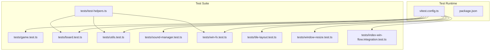

**Diagram sources**
- [vitest.config.ts:1-31](file://vitest.config.ts#L1-L31)
- [package.json:1-1](file://package.json#L1-L1)
- [tests/test-helpers.ts:1-87](file://tests/test-helpers.ts#L1-L87)
- [tests/game.test.ts:1-455](file://tests/game.test.ts#L1-L455)
- [tests/board.test.ts:1-606](file://tests/board.test.ts#L1-L606)
- [tests/utils.test.ts:1-377](file://tests/utils.test.ts#L1-L377)
- [tests/sound-manager.test.ts:1-768](file://tests/sound-manager.test.ts#L1-L768)
- [tests/win-fx.test.ts:1-883](file://tests/win-fx.test.ts#L1-L883)
- [tests/tile-layout.test.ts:1-128](file://tests/tile-layout.test.ts#L1-L128)
- [tests/window-resize.test.ts:1-87](file://tests/window-resize.test.ts#L1-L87)
- [tests/index-win-flow.integration.test.ts:106-148](file://tests/index-win-flow.integration.test.ts#L106-L148)

**Section sources**
- [vitest.config.ts:1-31](file://vitest.config.ts#L1-L31)
- [package.json:1-1](file://package.json#L1-L1)
- [docs/testing-strategy.md:18-27](file://docs/testing-strategy.md#L18-L27)

## Core Components
- Test runner and environment: Vitest with jsdom for DOM tests.
- Coverage configuration: Istanbul provider with exclusions for tools, bootstrap entrypoint, dist, linter config, and test config.
- Helper utilities: Deterministic mocks for Math.random(), DOMRect, HTML elements, and response objects.
- Assertion patterns: Expect-style assertions with spies and fake timers for time-sensitive tests.
- Isolation: beforeEach/afterEach hooks to fake timers and restore mocks; localStorage clearing; module resets for integration tests.

Key capabilities demonstrated:
- Game logic assertions and error conditions.
- Board rendering and keyboard navigation.
- Utility functions for DOM and input handling.
- Sound manager discovery, selection, and playback with deterministic randomness.
- Win effects with deterministic particle generation and timing.
- Tile layout computation and constraints.
- Window resize controller with synthetic pointer events and DOM bounds.

**Section sources**
- [vitest.config.ts:16-29](file://vitest.config.ts#L16-L29)
- [tests/test-helpers.ts:1-87](file://tests/test-helpers.ts#L1-L87)
- [tests/game.test.ts:15-74](file://tests/game.test.ts#L15-L74)
- [tests/board.test.ts:18-401](file://tests/board.test.ts#L18-L401)
- [tests/utils.test.ts:44-377](file://tests/utils.test.ts#L44-L377)
- [tests/sound-manager.test.ts:112-137](file://tests/sound-manager.test.ts#L112-L137)
- [tests/win-fx.test.ts:82-786](file://tests/win-fx.test.ts#L82-L786)
- [tests/tile-layout.test.ts:17-127](file://tests/tile-layout.test.ts#L17-L127)
- [tests/window-resize.test.ts:55-83](file://tests/window-resize.test.ts#L55-L83)
- [tests/index-win-flow.integration.test.ts:110-148](file://tests/index-win-flow.integration.test.ts#L110-L148)

## Architecture Overview
The unit testing architecture centers on:
- One test file per source module.
- Shared helpers in tests/test-helpers.ts for DOM and randomness.
- Fake timers for time-sensitive animations and timeouts.
- Spies and stubs for browser APIs (performance.now, Math.random, fetch, localStorage, AudioContext).
- Integration tests for bootstrap and win flow.

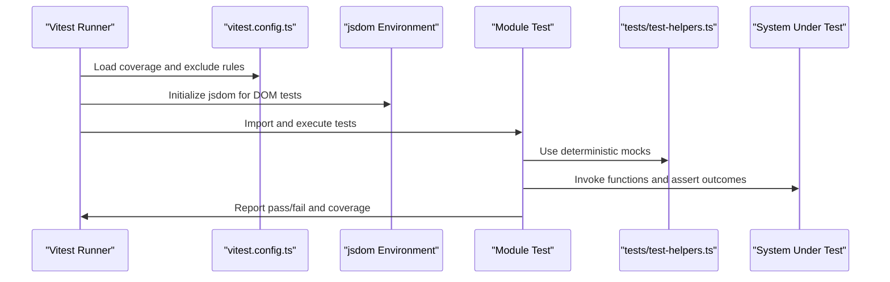

**Diagram sources**
- [vitest.config.ts:10-29](file://vitest.config.ts#L10-L29)
- [tests/test-helpers.ts:1-87](file://tests/test-helpers.ts#L1-L87)
- [tests/game.test.ts:1-455](file://tests/game.test.ts#L1-L455)
- [tests/board.test.ts:1-606](file://tests/board.test.ts#L1-L606)
- [tests/utils.test.ts:1-377](file://tests/utils.test.ts#L1-L377)
- [tests/sound-manager.test.ts:1-768](file://tests/sound-manager.test.ts#L1-L768)
- [tests/win-fx.test.ts:1-883](file://tests/win-fx.test.ts#L1-L883)

## Detailed Component Analysis

### Game Logic Tests
Focus areas:
- State transitions and error handling for tile selection.
- Near-win preparation and remaining pair counting.
- Elapsed time calculation with mocked performance.now.
- Reset behavior and deck validation.

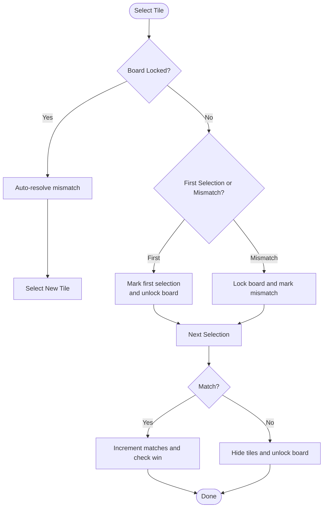

**Diagram sources**
- [tests/game.test.ts:76-176](file://tests/game.test.ts#L76-L176)
- [tests/game.test.ts:178-219](file://tests/game.test.ts#L178-L219)
- [tests/game.test.ts:221-252](file://tests/game.test.ts#L221-L252)
- [tests/game.test.ts:254-305](file://tests/game.test.ts#L254-L305)
- [tests/game.test.ts:307-335](file://tests/game.test.ts#L307-L335)
- [tests/game.test.ts:337-454](file://tests/game.test.ts#L337-L454)

Practical guidance:
- Use vi.spyOn(performance, "now") to control time-dependent assertions.
- Validate error paths with RangeError and state corruption checks.
- Assert side effects on state (matches, isBoardLocked, firstSelection, secondSelection).

**Section sources**
- [tests/game.test.ts:15-74](file://tests/game.test.ts#L15-L74)
- [tests/game.test.ts:76-176](file://tests/game.test.ts#L76-L176)
- [tests/game.test.ts:178-219](file://tests/game.test.ts#L178-L219)
- [tests/game.test.ts:221-252](file://tests/game.test.ts#L221-L252)
- [tests/game.test.ts:254-305](file://tests/game.test.ts#L254-L305)
- [tests/game.test.ts:307-335](file://tests/game.test.ts#L307-L335)
- [tests/game.test.ts:337-454](file://tests/game.test.ts#L337-L454)

### Board Rendering and Interaction Tests
Focus areas:
- Layout configuration and responsive sizing.
- Accessibility attributes and disabled states.
- Click and keyboard navigation handling.
- Animation timing with fake timers.
- Back-face cache invalidation and re-rendering.

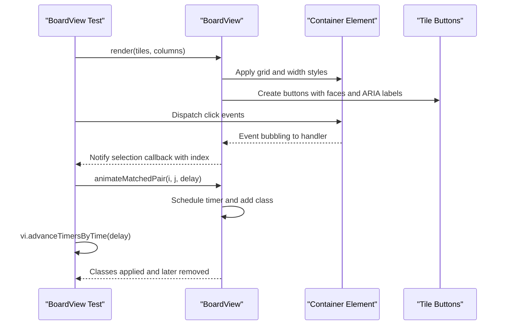

**Diagram sources**
- [tests/board.test.ts:18-401](file://tests/board.test.ts#L18-L401)
- [tests/board.test.ts:200-250](file://tests/board.test.ts#L200-L250)
- [tests/board.test.ts:252-401](file://tests/board.test.ts#L252-L401)

Practical guidance:
- Use createBoardTileButton and createMockDomRect to construct DOM fixtures.
- Use vi.useFakeTimers()/advanceTimersByTime for animation timing.
- Assert ARIA attributes and disabled states for accessibility.

**Section sources**
- [tests/board.test.ts:18-401](file://tests/board.test.ts#L18-L401)
- [tests/board.test.ts:200-250](file://tests/board.test.ts#L200-L250)
- [tests/board.test.ts:252-401](file://tests/board.test.ts#L252-L401)

### Utility Functions Tests
Focus areas:
- Clamp, shuffle, and format elapsed time.
- Horizontal wheel scrolling and slider wheel scrolling.
- Player name sanitization.

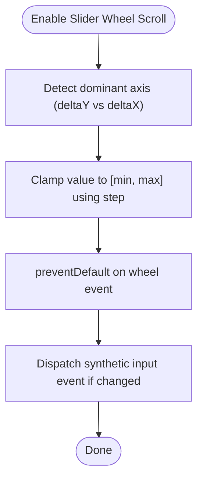

**Diagram sources**
- [tests/utils.test.ts:125-256](file://tests/utils.test.ts#L125-L256)
- [tests/utils.test.ts:262-353](file://tests/utils.test.ts#L262-L353)

Practical guidance:
- Use synthetic events (WheelEvent) and input elements to simulate user interactions.
- Mock getBoundingClientRect via Object.defineProperty for overflow scenarios.
- Validate preventDefault behavior and boundary conditions.

**Section sources**
- [tests/utils.test.ts:44-377](file://tests/utils.test.ts#L44-L377)

### Sound Manager Tests
Focus areas:
- Asset discovery via JSON, HTML directory listings, and asset index endpoints.
- Pool selection by filename patterns.
- Playback orchestration and muting state persistence.
- Deterministic randomness for round-robin selection.

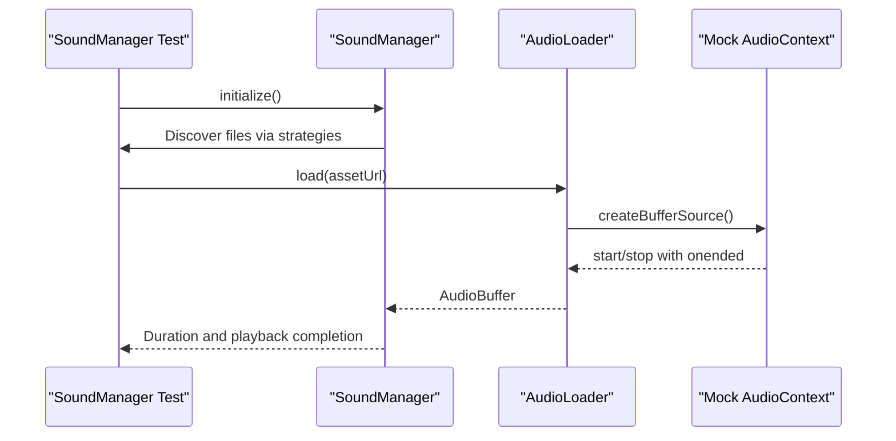

**Diagram sources**
- [tests/sound-manager.test.ts:112-137](file://tests/sound-manager.test.ts#L112-L137)
- [tests/sound-manager.test.ts:230-251](file://tests/sound-manager.test.ts#L230-L251)
- [tests/sound-manager.test.ts:384-418](file://tests/sound-manager.test.ts#L384-L418)
- [tests/sound-manager.test.ts:456-512](file://tests/sound-manager.test.ts#L456-L512)

Practical guidance:
- Spy on Math.random for deterministic selection.
- Mock fetch responses for JSON and HTML listings.
- Use localStorage stubs to verify mute persistence.
- Validate onStarted callback invocation with duration.

**Section sources**
- [tests/sound-manager.test.ts:112-137](file://tests/sound-manager.test.ts#L112-L137)
- [tests/sound-manager.test.ts:230-251](file://tests/sound-manager.test.ts#L230-L251)
- [tests/sound-manager.test.ts:384-418](file://tests/sound-manager.test.ts#L384-L418)
- [tests/sound-manager.test.ts:456-512](file://tests/sound-manager.test.ts#L456-L512)

### Win Effects Tests
Focus areas:
- Deterministic particle generation using a pre-defined random sequence.
- Timing-driven animation phases and cleanup.
- Screen-level effects (flash, vignette, shake) and particle effects (shimmer, ember, firework).
- Speed limits and particle budget enforcement.

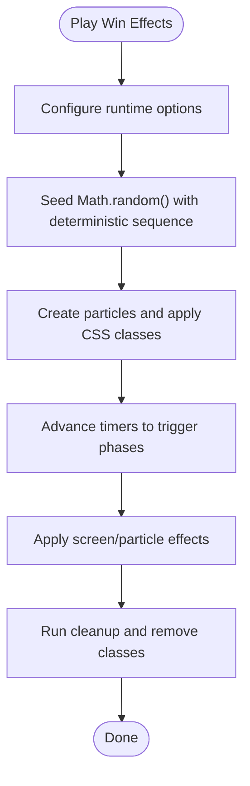

**Diagram sources**
- [tests/win-fx.test.ts:82-154](file://tests/win-fx.test.ts#L82-L154)
- [tests/win-fx.test.ts:625-641](file://tests/win-fx.test.ts#L625-L641)
- [tests/win-fx.test.ts:643-663](file://tests/win-fx.test.ts#L643-L663)
- [tests/win-fx.test.ts:665-691](file://tests/win-fx.test.ts#L665-L691)

Practical guidance:
- Use createRandomSequenceMock and createDeterministicWinFxRandomSequence for reproducible particle behavior.
- Use vi.useFakeTimers()/runAllTimers to drive asynchronous effects.
- Verify CSS classes and property values for visual effects.

**Section sources**
- [tests/win-fx.test.ts:82-154](file://tests/win-fx.test.ts#L82-L154)
- [tests/win-fx.test.ts:625-641](file://tests/win-fx.test.ts#L625-L641)
- [tests/win-fx.test.ts:643-663](file://tests/win-fx.test.ts#L643-L663)
- [tests/win-fx.test.ts:665-691](file://tests/win-fx.test.ts#L665-L691)

### Tile Layout Tests
Focus areas:
- Multiplier clamping and resolution based on tile count.
- Layout computation for different difficulties and multipliers.

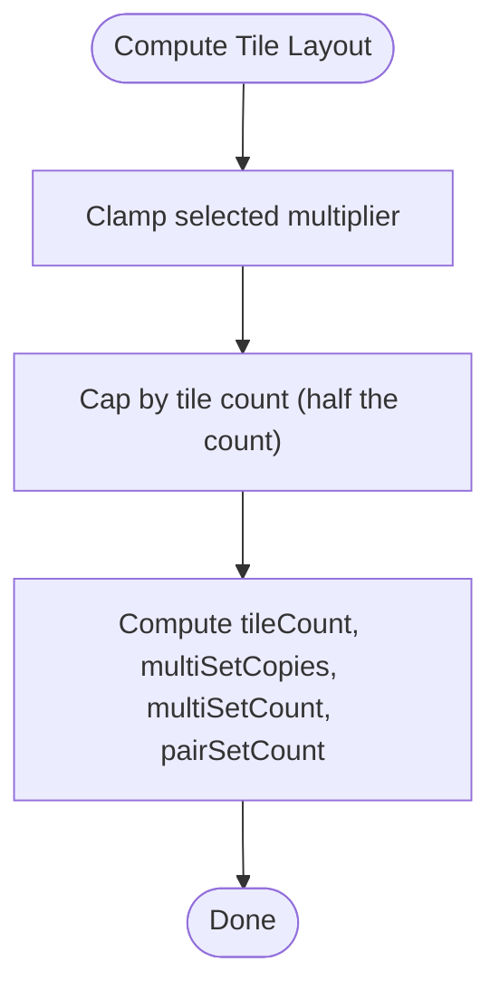

**Diagram sources**
- [tests/tile-layout.test.ts:17-127](file://tests/tile-layout.test.ts#L17-L127)

**Section sources**
- [tests/tile-layout.test.ts:17-127](file://tests/tile-layout.test.ts#L17-L127)

### Window Resize Controller Tests
Focus areas:
- Synthetic pointer events and getBoundingClientRect stubbing.
- Resize handle interactions and scaling limits.

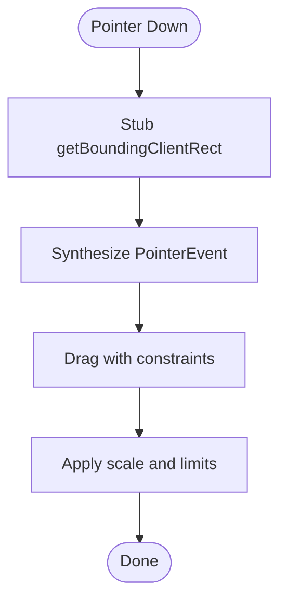

**Diagram sources**
- [tests/window-resize.test.ts:55-83](file://tests/window-resize.test.ts#L55-L83)
- [tests/window-resize.test.ts:18-53](file://tests/window-resize.test.ts#L18-L53)

**Section sources**
- [tests/window-resize.test.ts:55-83](file://tests/window-resize.test.ts#L55-L83)
- [tests/window-resize.test.ts:18-53](file://tests/window-resize.test.ts#L18-L53)

### Integration Test Pattern (Bootstrap Win Flow)
Focus areas:
- Module reset and global stubs for fetch, AudioContext, window properties.
- Timer-driven flow and readiness detection.

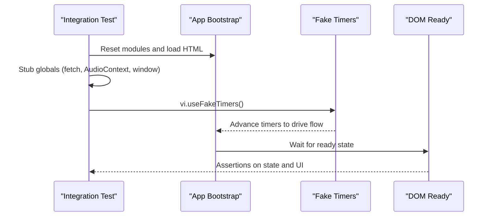

**Diagram sources**
- [tests/index-win-flow.integration.test.ts:110-148](file://tests/index-win-flow.integration.test.ts#L110-L148)

**Section sources**
- [tests/index-win-flow.integration.test.ts:110-148](file://tests/index-win-flow.integration.test.ts#L110-L148)

## Dependency Analysis
- Test helpers are shared across multiple test suites to reduce duplication.
- DOM-dependent tests rely on jsdom environment and synthetic events.
- Time-sensitive tests consistently use vi.useFakeTimers() and vi.restoreAllMocks() in afterEach hooks.
- Coverage excludes non-unit concerns (tools, bootstrap entrypoint) to maintain high unit coverage.

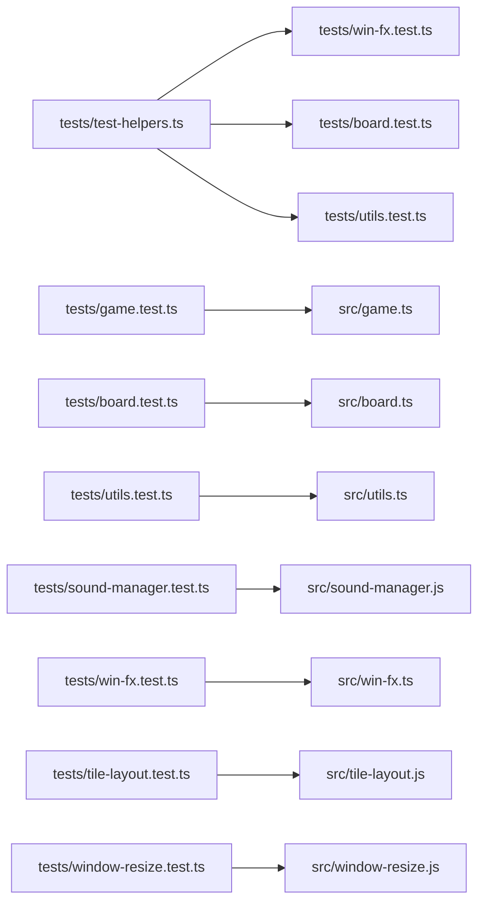

**Diagram sources**
- [tests/test-helpers.ts:1-87](file://tests/test-helpers.ts#L1-L87)
- [tests/win-fx.test.ts:1-12](file://tests/win-fx.test.ts#L1-L12)
- [tests/board.test.ts:5](file://tests/board.test.ts#L5)
- [tests/utils.test.ts:13](file://tests/utils.test.ts#L13)
- [tests/sound-manager.test.ts:13](file://tests/sound-manager.test.ts#L13)
- [tests/game.test.ts:13](file://tests/game.test.ts#L13)
- [tests/tile-layout.test.ts:6](file://tests/tile-layout.test.ts#L6)
- [tests/window-resize.test.ts:4](file://tests/window-resize.test.ts#L4)

**Section sources**
- [vitest.config.ts:16-29](file://vitest.config.ts#L16-L29)
- [tests/test-helpers.ts:1-87](file://tests/test-helpers.ts#L1-L87)

## Performance Considerations
- Prefer deterministic randomness for particle and animation tests to avoid flakiness and long runs.
- Use fake timers to advance time deterministically; avoid real-time waits.
- Minimize DOM operations in loops; reuse fixtures created by helper utilities.
- Keep integration tests focused and isolated to reduce overhead.

## Troubleshooting Guide
Common issues and resolutions:
- Flaky timing tests: Ensure vi.useFakeTimers() is used and restored in afterEach; use vi.advanceTimersByTime or vi.runAllTimers.
- Math.random() interference: Use createRandomSequenceMock to seed deterministic sequences; restore mocks after use.
- DOM API stubbing: Use vi.spyOn(element, "getBoundingClientRect") or Object.defineProperty for properties like innerWidth/innerHeight.
- Fetch and storage mocking: Spy on global.fetch and localStorage getters/setters; clear state in afterEach.
- Integration test pollution: Reset modules and stub globals in beforeEach; clear timers and localStorage.

**Section sources**
- [tests/win-fx.test.ts:77-80](file://tests/win-fx.test.ts#L77-L80)
- [tests/sound-manager.test.ts:134-137](file://tests/sound-manager.test.ts#L134-L137)
- [tests/window-resize.test.ts:79-83](file://tests/window-resize.test.ts#L79-L83)
- [tests/index-win-flow.integration.test.ts:111-116](file://tests/index-win-flow.integration.test.ts#L111-L116)

## Conclusion
This project’s unit tests leverage Vitest with jsdom, deterministic randomness, and carefully crafted helpers to isolate components and assert behavior across game logic, UI rendering, utilities, sound management, and win effects. By following the established patterns—fake timers, spies, deterministic mocks, and strict isolation—you can write maintainable, fast, and reliable unit tests that keep coverage high and regressions low.

## Appendices

### Mock Strategies Reference
- Math.random(): Use createRandomSequenceMock with a predefined sequence; fallback to 0.5 for empty sequences.
- DOMRect: Use createMockDomRect to construct a lightweight DOMRect with computed right/bottom.
- HTML elements: Use createBoardTileButton to build structured tile buttons with faces and getBoundingClientRect stubbing.
- Responses: Use createMockTextResponse for simple text responses; createJsonResponse/createNotFoundResponse for fetch mocking.

**Section sources**
- [tests/test-helpers.ts:3-87](file://tests/test-helpers.ts#L3-L87)
- [tests/test-helpers.test.ts:13-72](file://tests/test-helpers.test.ts#L13-L72)

### Coverage Measurement
- Provider: Istanbul via @vitest/coverage-istanbul.
- Exclusions: tools/**, src/index.ts, dist/**, eslint.config.mjs, vitest.config.ts, .github/**.
- Policy: Enforce 90%+ coverage across statements, branches, functions, and lines.

**Section sources**
- [vitest.config.ts:16-29](file://vitest.config.ts#L16-L29)
- [docs/testing-strategy.md:29-44](file://docs/testing-strategy.md#L29-L44)
- [docs/testing-strategy.md:61-72](file://docs/testing-strategy.md#L61-L72)