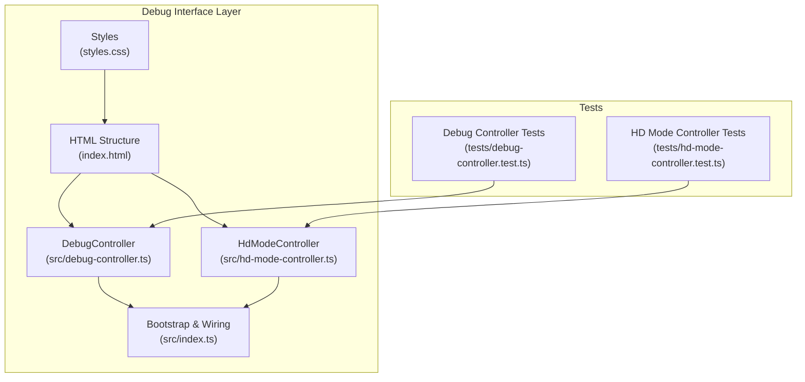
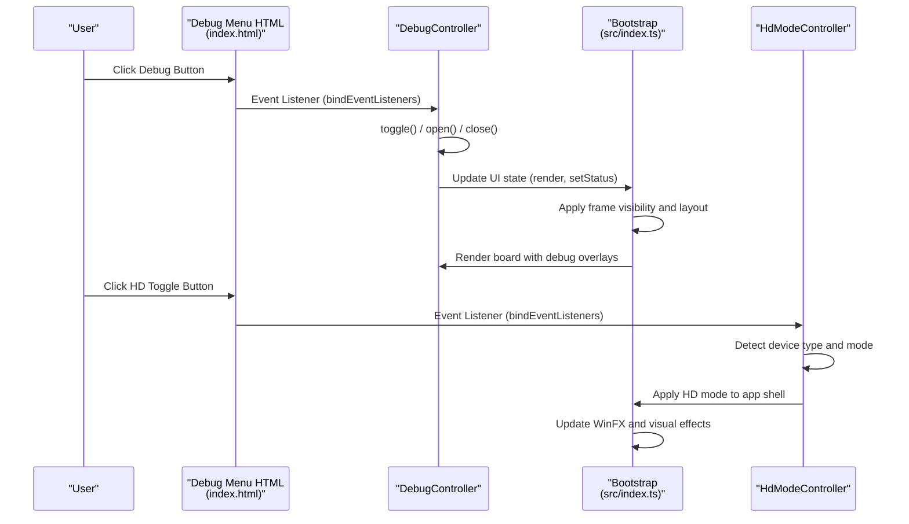
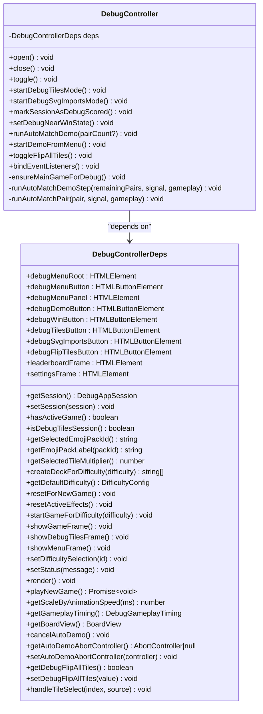
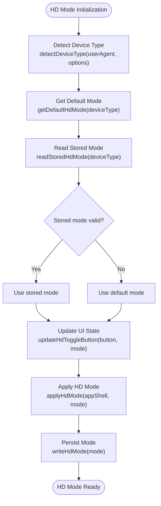
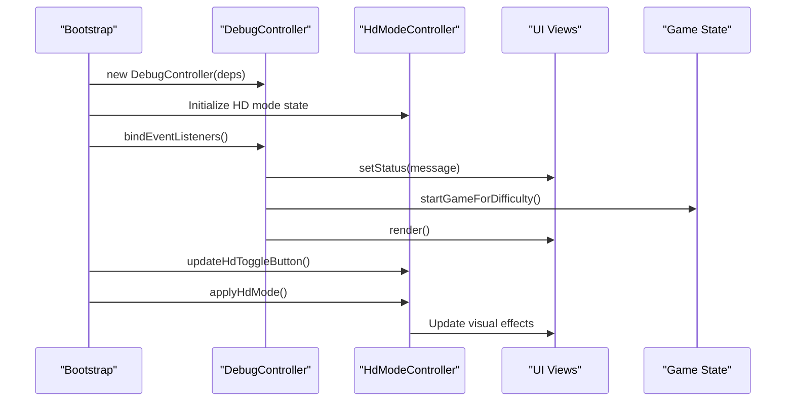
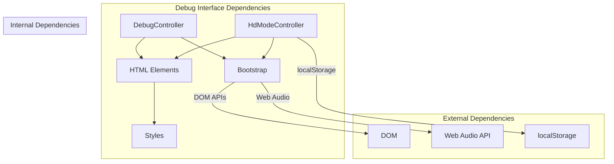

# Debug Interface and Developer Tools

<cite>
**Referenced Files in This Document**
- [debug-controller.ts](file://src/debug-controller.ts)
- [hd-mode-controller.ts](file://src/hd-mode-controller.ts)
- [index.ts](file://src/index.ts)
- [index.html](file://index.html)
- [styles.css](file://styles.css)
- [debug-controller.test.ts](file://tests/debug-controller.test.ts)
- [hd-mode-controller.test.ts](file://tests/hd-mode-controller.test.ts)
- [README.md](file://README.md)
</cite>

## Table of Contents
1. [Introduction](#introduction)
2. [Project Structure](#project-structure)
3. [Core Components](#core-components)
4. [Architecture Overview](#architecture-overview)
5. [Detailed Component Analysis](#detailed-component-analysis)
6. [Dependency Analysis](#dependency-analysis)
7. [Performance Considerations](#performance-considerations)
8. [Troubleshooting Guide](#troubleshooting-guide)
9. [Conclusion](#conclusion)

## Introduction
This document provides comprehensive documentation for the debug interface system and developer tools in the MEMORYBLOX project. It covers the debug controller implementation for managing the debug menu, debug modes, and developer workflow integration, as well as the HD mode controller for high-resolution rendering testing. The guide explains debug menu visibility, toggle mechanisms, debug information display, HD mode activation, and practical usage patterns for development and testing.

## Project Structure
The debug interface system spans several key files:
- Debug controller implementation and tests
- HD mode controller implementation and tests
- Application bootstrap wiring and HTML structure
- Styles for debug UI components
- README documentation for developer context

**Diagram sources**
- [debug-controller.ts:87-470](file://src/debug-controller.ts#L87-L470)
- [hd-mode-controller.ts:1-81](file://src/hd-mode-controller.ts#L1-L81)
- [index.ts:930-1085](file://src/index.ts#L930-L1085)
- [index.html:172-181](file://index.html#L172-L181)
- [styles.css:326-446](file://styles.css#L326-L446)
- [debug-controller.test.ts:1-705](file://tests/debug-controller.test.ts#L1-L705)
- [hd-mode-controller.test.ts:1-182](file://tests/hd-mode-controller.test.ts#L1-L182)

**Section sources**
- [README.md:30-46](file://README.md#L30-L46)
- [index.html:172-181](file://index.html#L172-L181)
- [styles.css:326-446](file://styles.css#L326-L446)

## Core Components
This section outlines the primary components of the debug interface system and their responsibilities.

- DebugController: Manages debug menu visibility, debug modes, and developer workflow actions. It coordinates game state changes, UI updates, and debug-specific behaviors.
- HdModeController: Handles high-definition rendering mode detection, persistence, and UI updates for HD mode toggling.
- Bootstrap & Wiring: Initializes controllers, binds event listeners, and manages application-wide state transitions.
- HTML Structure: Defines the debug menu DOM elements and accessibility attributes.
- Styles: Provides styling for debug menu components and responsive behavior.

Key responsibilities:
- Debug menu lifecycle (open/close/toggle)
- Debug modes: Tiles inspection, SVG imports preview, near-win state, auto-match demo, flip-all-tiles
- HD mode detection and persistence
- Accessibility attributes and keyboard navigation
- Console logging integration via status messages

**Section sources**
- [debug-controller.ts:87-114](file://src/debug-controller.ts#L87-L114)
- [hd-mode-controller.ts:39-55](file://src/hd-mode-controller.ts#L39-L55)
- [index.ts:930-971](file://src/index.ts#L930-L971)
- [index.html:172-181](file://index.html#L172-L181)

## Architecture Overview
The debug interface integrates tightly with the application bootstrap layer. The DebugController receives dependencies for UI manipulation, game state, and rendering. The HD mode controller operates independently but integrates with the bootstrap to apply HD mode to the application shell.

**Diagram sources**
- [debug-controller.ts:302-369](file://src/debug-controller.ts#L302-L369)
- [index.ts:1063-1068](file://src/index.ts#L1063-L1068)
- [hd-mode-controller.ts:53-73](file://src/hd-mode-controller.ts#L53-L73)
- [index.html:172-181](file://index.html#L172-L181)

## Detailed Component Analysis

### DebugController Implementation
The DebugController orchestrates all debug-related functionality, including menu management, debug modes, and developer workflow integration.

**Diagram sources**
- [debug-controller.ts:17-59](file://src/debug-controller.ts#L17-L59)
- [debug-controller.ts:87-470](file://src/debug-controller.ts#L87-L470)

Key debug modes and behaviors:
- Debug Tiles Mode: Creates a specialized game session for tile inspection and visual verification
- SVG Imports Mode: Generates a hard-difficulty game with SVG-only icon sets for import testing
- Near-Win State: Prepares a board state with one remaining pair for quick testing
- Auto-Match Demo: Automated tile matching demonstration with configurable delays
- Flip All Tiles: Reveals all tiles for visual inspection without affecting scoring

Debug menu interactions:
- Menu visibility controlled via open/close/toggle methods
- Event listeners for button clicks and external clicks
- Keyboard shortcut handling (Escape key)
- Accessibility attributes (ARIA-expanded, aria-controls)

**Section sources**
- [debug-controller.ts:96-144](file://src/debug-controller.ts#L96-L144)
- [debug-controller.ts:146-187](file://src/debug-controller.ts#L146-L187)
- [debug-controller.ts:199-234](file://src/debug-controller.ts#L199-L234)
- [debug-controller.ts:238-273](file://src/debug-controller.ts#L238-L273)
- [debug-controller.ts:277-298](file://src/debug-controller.ts#L277-L298)
- [debug-controller.ts:302-369](file://src/debug-controller.ts#L302-L369)

### HD Mode Controller
The HD mode controller manages high-resolution rendering mode detection, persistence, and UI updates.

**Diagram sources**
- [hd-mode-controller.ts:28-55](file://src/hd-mode-controller.ts#L28-L55)
- [hd-mode-controller.ts:57-73](file://src/hd-mode-controller.ts#L57-L73)

Device detection logic:
- Pattern-based detection for mobile/tablet devices
- Special handling for desktop-class iPad scenarios
- Local storage persistence for user preference

UI integration:
- ARIA attributes for accessibility (aria-pressed, aria-label)
- Visual feedback through button state updates
- Application-wide HD mode application to visual effects

**Section sources**
- [hd-mode-controller.ts:14-37](file://src/hd-mode-controller.ts#L14-L37)
- [hd-mode-controller.ts:43-55](file://src/hd-mode-controller.ts#L43-L55)
- [hd-mode-controller.ts:57-73](file://src/hd-mode-controller.ts#L57-L73)

### Bootstrap Integration and Event Wiring
The application bootstrap initializes controllers, wires events, and manages state transitions.

**Diagram sources**
- [index.ts:930-971](file://src/index.ts#L930-L971)
- [index.ts:1063-1068](file://src/index.ts#L1063-L1068)
- [index.ts:1084-1089](file://src/index.ts#L1084-L1089)

**Section sources**
- [index.ts:930-971](file://src/index.ts#L930-L971)
- [index.ts:1063-1068](file://src/index.ts#L1063-L1068)
- [index.ts:1084-1089](file://src/index.ts#L1084-L1089)

## Dependency Analysis
The debug interface system exhibits clear separation of concerns with well-defined dependencies.

**Diagram sources**
- [debug-controller.ts:17-59](file://src/debug-controller.ts#L17-L59)
- [hd-mode-controller.ts:3-55](file://src/hd-mode-controller.ts#L3-L55)
- [index.ts:930-971](file://src/index.ts#L930-L971)

Coupling and cohesion:
- DebugController depends on a clean dependency injection interface (DebugControllerDeps)
- HdModeController maintains pure functions with minimal external dependencies
- Bootstrap layer coordinates initialization and event binding
- HTML and CSS provide declarative structure and styling

Potential circular dependencies:
- None identified; dependencies flow unidirectionally from bootstrap to controllers

**Section sources**
- [debug-controller.ts:17-59](file://src/debug-controller.ts#L17-L59)
- [hd-mode-controller.ts:3-55](file://src/hd-mode-controller.ts#L3-L55)
- [index.ts:930-971](file://src/index.ts#L930-L971)

## Performance Considerations
The debug interface is designed for development efficiency with minimal runtime overhead:

- Debounced rendering: The render function updates UI only when game state changes
- Cancellable operations: AbortController instances prevent resource leaks during demos
- Animation scaling: Timing adjustments respect user animation speed preferences
- Minimal DOM manipulation: Debug menu uses hidden/display toggles rather than dynamic construction
- Efficient state updates: Direct property assignments avoid unnecessary computations

Best practices for development workflow:
- Use debug modes for rapid iteration without affecting leaderboards
- Leverage auto-match demo for automated testing scenarios
- Utilize flip-all-tiles for visual verification during development
- Apply HD mode for high-resolution testing on supported devices

## Troubleshooting Guide
Common issues and resolutions for the debug interface system:

Debug menu not responding:
- Verify event listeners are bound during bootstrap initialization
- Check that debug menu elements exist in the DOM
- Ensure proper ARIA attributes for accessibility

Debug modes not working:
- Confirm active game state before invoking debug actions
- Verify session state reflects debug mode appropriately
- Check that board views are properly initialized

HD mode issues:
- Validate device detection logic for target platforms
- Confirm localStorage availability and permissions
- Ensure visual effects update correctly after mode change

Console logging integration:
- Status messages are displayed via UI status element
- Debug actions update status with contextual information
- Error conditions log meaningful messages to console

**Section sources**
- [debug-controller.test.ts:120-181](file://tests/debug-controller.test.ts#L120-L181)
- [debug-controller.test.ts:354-521](file://tests/debug-controller.test.ts#L354-L521)
- [hd-mode-controller.test.ts:15-95](file://tests/hd-mode-controller.test.ts#L15-L95)
- [hd-mode-controller.test.ts:111-132](file://tests/hd-mode-controller.test.ts#L111-L132)

## Conclusion
The debug interface system provides comprehensive developer tools for MEMORYBLOX, combining a flexible debug controller with robust HD mode management. The system emphasizes accessibility, performance, and developer productivity through well-structured components, clear separation of concerns, and extensive test coverage. The debug controller offers essential development workflows including automated demos, visual inspection modes, and high-resolution testing capabilities, while the HD mode controller ensures optimal visual quality across device types.