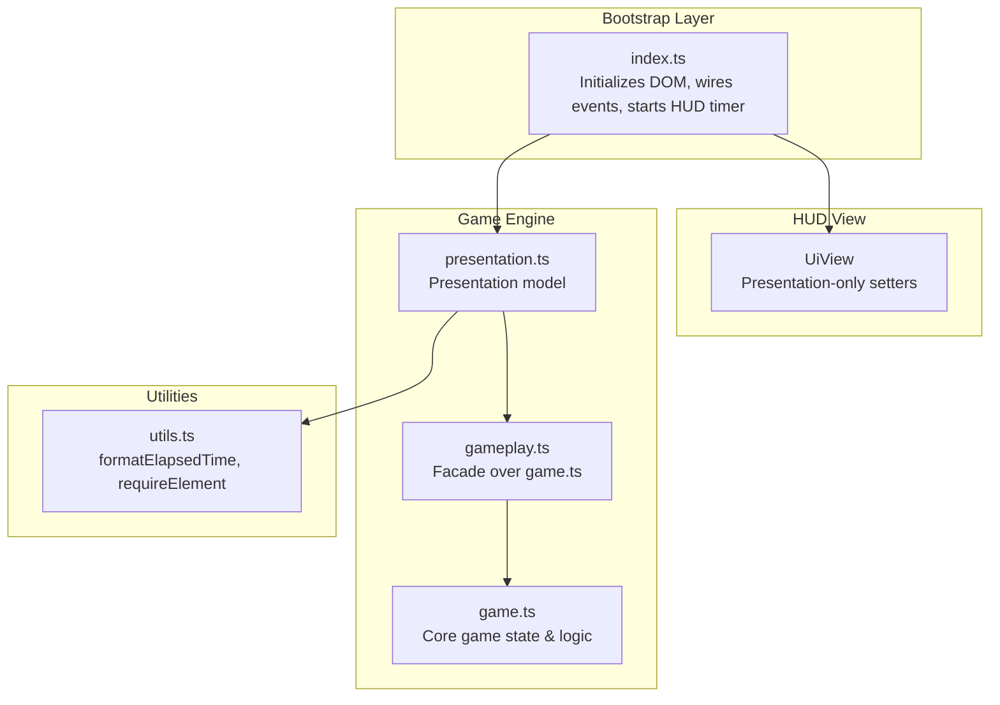
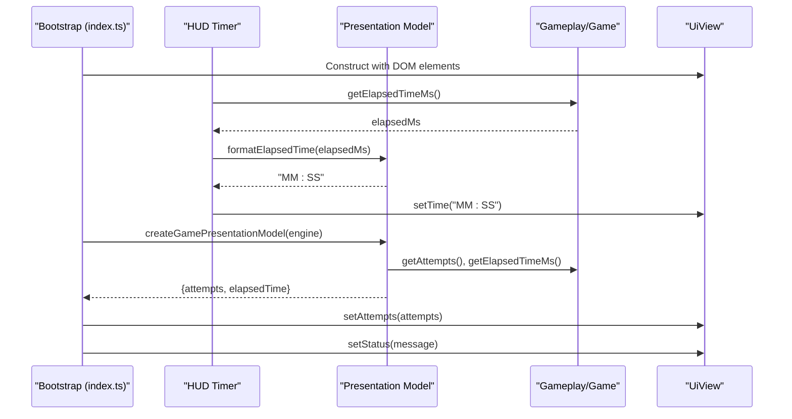
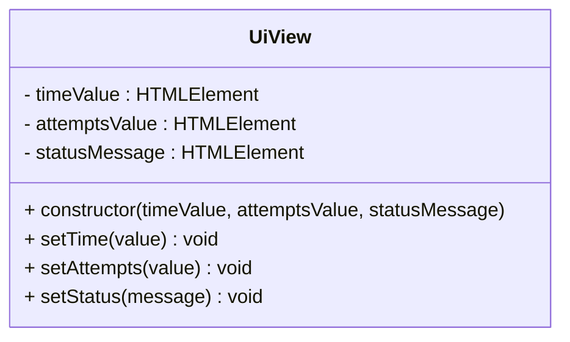
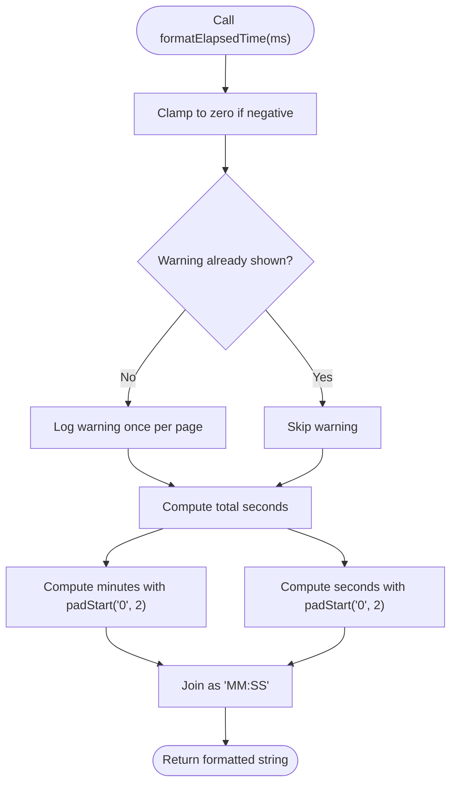
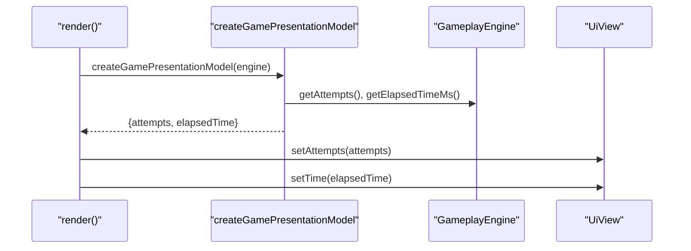
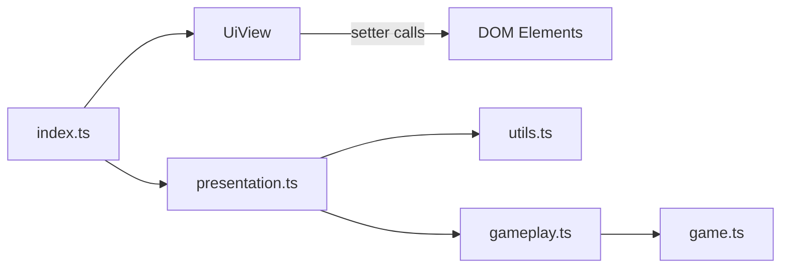

# HUD and Game Status Display

<cite>
**Referenced Files in This Document**
- [ui.ts](file://src/ui.ts)
- [index.ts](file://src/index.ts)
- [index.html](file://index.html)
- [utils.ts](file://src/utils.ts)
- [presentation.ts](file://src/presentation.ts)
- [gameplay.ts](file://src/gameplay.ts)
- [game.ts](file://src/game.ts)
- [ui.test.ts](file://tests/ui.test.ts)
- [utils.test.ts](file://tests/utils.test.ts)
- [presentation.test.ts](file://tests/presentation.test.ts)
</cite>

## Table of Contents
1. [Introduction](#introduction)
2. [Project Structure](#project-structure)
3. [Core Components](#core-components)
4. [Architecture Overview](#architecture-overview)
5. [Detailed Component Analysis](#detailed-component-analysis)
6. [Dependency Analysis](#dependency-analysis)
7. [Performance Considerations](#performance-considerations)
8. [Troubleshooting Guide](#troubleshooting-guide)
9. [Conclusion](#conclusion)

## Introduction
This document explains the Heads-Up Display (HUD) system responsible for real-time game status presentation. It focuses on the UiView class implementation, covering time display formatting, attempt counter updates, and dynamic status messaging. It emphasizes the separation of concerns between display views and event handling: UI views are presentation-only and receive updates through setter methods, while event wiring resides in the bootstrap layer. The document also describes how the HUD integrates with the game engine to present elapsed time, move counts, and game state messages, along with DOM element requirements, text content updates, and visual feedback mechanisms. Finally, it outlines implementation patterns for extending the HUD with new status indicators while maintaining the view-controller separation principle.

## Project Structure
The HUD system spans several modules:
- UiView: Presentation-only view for time, attempts, and status.
- Bootstrap layer (index.ts): Initializes DOM elements, wires events, and drives the HUD updates.
- Utils: Provides time formatting utilities used by the HUD.
- Presentation: Transforms gameplay state into a presentation model consumed by the HUD.
- Gameplay/Game: Core game logic and state used by the presentation model.

**Diagram sources**
- [index.ts:130-136](file://src/index.ts#L130-L136)
- [index.ts:809-813](file://src/index.ts#L809-L813)
- [presentation.ts:12-24](file://src/presentation.ts#L12-L24)
- [utils.ts:44-58](file://src/utils.ts#L44-L58)
- [gameplay.ts:28-41](file://src/gameplay.ts#L28-L41)
- [game.ts:12-42](file://src/game.ts#L12-L42)

**Section sources**
- [index.ts:130-136](file://src/index.ts#L130-L136)
- [index.ts:809-813](file://src/index.ts#L809-L813)
- [presentation.ts:12-24](file://src/presentation.ts#L12-L24)
- [utils.ts:44-58](file://src/utils.ts#L44-L58)
- [gameplay.ts:28-41](file://src/gameplay.ts#L28-L41)
- [game.ts:12-42](file://src/game.ts#L12-L42)

## Core Components
- UiView: A presentation-only class that updates three DOM elements:
  - timeValue: displays formatted elapsed time.
  - attemptsValue: displays the number of attempts.
  - statusMessage: displays dynamic status messages.
- Bootstrap layer (index.ts):
  - Retrieves DOM elements by ID.
  - Creates a UiView instance wired to the bottom bar’s time, attempts, and status elements.
  - Starts a HUD timer that periodically updates the time display.
  - Calls UiView setters during rendering and game events.
- Presentation model (presentation.ts):
  - Builds a GamePresentationModel containing attempts and formatted elapsed time.
  - Supplies UiView with the latest values during each render cycle.
- Utilities (utils.ts):
  - formatElapsedTime converts milliseconds to a zero-padded "MM:SS" string.
- Game engine (gameplay.ts, game.ts):
  - GameplayEngine exposes getters for attempts and elapsed time.
  - game.ts provides core state and time computation.

Key separation of concerns:
- UiView does not handle events or DOM wiring; all event wiring is in index.ts.
- UiView only receives updates via setter methods from the bootstrap/rendering layer.

**Section sources**
- [ui.ts:15-48](file://src/ui.ts#L15-L48)
- [index.ts:130-136](file://src/index.ts#L130-L136)
- [index.ts:809-813](file://src/index.ts#L809-L813)
- [index.ts:482-496](file://src/index.ts#L482-L496)
- [presentation.ts:12-24](file://src/presentation.ts#L12-L24)
- [utils.ts:44-58](file://src/utils.ts#L44-L58)
- [gameplay.ts:28-41](file://src/gameplay.ts#L28-L41)
- [game.ts:289-299](file://src/game.ts#L289-L299)

## Architecture Overview
The HUD integrates with the game engine through a clean pipeline:
- The bootstrap layer initializes DOM elements and creates UiView.
- A periodic HUD timer queries the gameplay engine for elapsed time and calls UiView.setTime.
- During each render cycle, the presentation model supplies attempts and formatted elapsed time, which UiView updates.
- Game events (selections, mismatches, matches, wins) trigger status updates via UiView.setStatus.

**Diagram sources**
- [index.ts:130-136](file://src/index.ts#L130-L136)
- [index.ts:809-813](file://src/index.ts#L809-L813)
- [index.ts:482-496](file://src/index.ts#L482-L496)
- [presentation.ts:12-24](file://src/presentation.ts#L12-L24)
- [utils.ts:44-58](file://src/utils.ts#L44-L58)
- [gameplay.ts:74-76](file://src/gameplay.ts#L74-L76)
- [game.ts:289-299](file://src/game.ts#L289-L299)

## Detailed Component Analysis

### UiView Class
UiView is a presentation-only view responsible for updating three DOM elements:
- timeValue: receives formatted elapsed time text.
- attemptsValue: receives the attempt count as text.
- statusMessage: receives dynamic status messages.

Implementation highlights:
- Constructor accepts three HTMLElement instances and stores them privately.
- Public setters update textContent of the respective elements.
- No event handling or interactive behavior is exposed.

**Diagram sources**
- [ui.ts:15-48](file://src/ui.ts#L15-L48)

**Section sources**
- [ui.ts:15-48](file://src/ui.ts#L15-L48)

### DOM Elements and Requirements
The HUD relies on specific DOM elements defined in the HTML:
- timeValue: span element displaying formatted elapsed time.
- attemptsValue: span element displaying the number of attempts.
- statusMessage: paragraph element displaying dynamic status messages.

These elements are retrieved by the bootstrap layer and passed to UiView.

**Section sources**
- [index.html:183-186](file://index.html#L183-L186)
- [index.html:152-160](file://index.html#L152-L160)
- [index.ts:130-136](file://src/index.ts#L130-L136)
- [index.ts:809-813](file://src/index.ts#L809-L813)

### Time Display Formatting
The HUD formats elapsed time using a zero-padded "MM:SS" string:
- formatElapsedTime clamps negative values to zero and logs a warning once per page load.
- presentation.ts uses formatElapsedTime to convert elapsed milliseconds into a display-ready string.

**Diagram sources**
- [utils.ts:44-58](file://src/utils.ts#L44-L58)
- [presentation.ts](file://src/presentation.ts#L22)

**Section sources**
- [utils.ts:44-58](file://src/utils.ts#L44-L58)
- [presentation.ts](file://src/presentation.ts#L22)

### Attempt Counter Updates
During each render cycle, the presentation model provides the current attempt count, which the bootstrap layer applies to UiView. The presentation model reads attempts from the gameplay engine.

**Section sources**
- [presentation.ts](file://src/presentation.ts#L21)
- [gameplay.ts:74-76](file://src/gameplay.ts#L74-L76)
- [index.ts](file://src/index.ts#L805)

### Dynamic Status Messaging
The bootstrap layer updates UiView.setStatus in response to game events:
- Menu transitions and frame changes.
- Tile selection outcomes (first pick, mismatch, match, win).
- Leaderboard and settings interactions.

These updates provide contextual feedback to the player.

**Section sources**
- [index.ts](file://src/index.ts#L516)
- [index.ts](file://src/index.ts#L673)
- [index.ts](file://src/index.ts#L679)
- [index.ts](file://src/index.ts#L748)
- [index.ts](file://src/index.ts#L773)
- [index.ts](file://src/index.ts#L926)
- [index.ts](file://src/index.ts#L959)

### HUD Timer Integration
The bootstrap layer starts a periodic timer that:
- Queries the gameplay engine for elapsed time.
- Formats the time using formatElapsedTime.
- Updates UiView.setTime.

The timer respects cancellation and abort signals to avoid redundant updates when the game is inactive.

**Section sources**
- [index.ts:482-496](file://src/index.ts#L482-L496)
- [utils.ts:44-58](file://src/utils.ts#L44-L58)

### Rendering Pipeline and View-Controller Separation
The render function demonstrates the separation of concerns:
- Creates a presentation model from the gameplay engine.
- Updates UiView.setAttempts and UiView.setTime.
- Does not handle events directly; event handlers call render and update UiView.setStatus.

**Diagram sources**
- [index.ts:781-807](file://src/index.ts#L781-L807)
- [presentation.ts:12-24](file://src/presentation.ts#L12-L24)
- [gameplay.ts:74-76](file://src/gameplay.ts#L74-L76)

**Section sources**
- [index.ts:781-807](file://src/index.ts#L781-L807)
- [presentation.ts:12-24](file://src/presentation.ts#L12-L24)

### Extending the HUD with New Indicators
To add a new HUD indicator while maintaining separation of concerns:
- Add a new DOM element in the HTML footer (e.g., a new stat or message area).
- Retrieve the element in the bootstrap layer and pass it to UiView alongside existing elements.
- Extend the presentation model to compute the new value and expose it to the bootstrap layer.
- Call the corresponding UiView setter during render or in response to relevant game events.

This pattern preserves the view’s presentation-only responsibility and keeps event wiring centralized in the bootstrap layer.

**Section sources**
- [index.html:183-186](file://index.html#L183-L186)
- [index.ts:130-136](file://src/index.ts#L130-L136)
- [index.ts:809-813](file://src/index.ts#L809-L813)
- [presentation.ts:5-10](file://src/presentation.ts#L5-L10)

## Dependency Analysis
The HUD system exhibits low coupling and clear boundaries:
- UiView depends only on HTMLElement and string/number primitives.
- Bootstrap layer depends on UiView, DOM selectors, and presentation utilities.
- Presentation model depends on gameplay facade and formatting utilities.
- Gameplay engine depends on core game state and logic.

**Diagram sources**
- [ui.ts:15-48](file://src/ui.ts#L15-L48)
- [index.ts:809-813](file://src/index.ts#L809-L813)
- [presentation.ts:12-24](file://src/presentation.ts#L12-L24)
- [utils.ts:44-58](file://src/utils.ts#L44-L58)
- [gameplay.ts:28-41](file://src/gameplay.ts#L28-L41)
- [game.ts:12-42](file://src/game.ts#L12-L42)

**Section sources**
- [ui.ts:15-48](file://src/ui.ts#L15-L48)
- [index.ts:809-813](file://src/index.ts#L809-L813)
- [presentation.ts:12-24](file://src/presentation.ts#L12-L24)
- [utils.ts:44-58](file://src/utils.ts#L44-L58)
- [gameplay.ts:28-41](file://src/gameplay.ts#L28-L41)
- [game.ts:12-42](file://src/game.ts#L12-L42)

## Performance Considerations
- HUD timer interval is configurable and throttled by animation speed scaling to balance responsiveness and performance.
- Negative elapsed time is clamped to zero to avoid costly reflows caused by inconsistent time strings.
- Presentation model recomputes only the minimal required values (attempts, elapsed time) during each render cycle.

[No sources needed since this section provides general guidance]

## Troubleshooting Guide
Common issues and resolutions:
- Missing DOM elements: requireElement throws if a required selector is not found. Verify IDs in the HTML match the bootstrap layer expectations.
- HUD not updating:
  - Ensure the HUD timer is started and not aborted.
  - Confirm render is invoked after game state changes.
- Unexpected negative time:
  - formatElapsedTime clamps negative values and logs a warning once per page load. Investigate timing anomalies if warnings persist.
- Status messages not appearing:
  - Ensure setStatus is called during relevant game events and that the status element is visible.

**Section sources**
- [utils.ts:44-58](file://src/utils.ts#L44-L58)
- [index.ts:467-496](file://src/index.ts#L467-L496)
- [index.ts:781-807](file://src/index.ts#L781-L807)
- [index.ts:130-136](file://src/index.ts#L130-L136)

## Conclusion
The HUD system cleanly separates presentation from behavior:
- UiView is presentation-only and receives updates via setter methods.
- The bootstrap layer manages DOM wiring, timers, and event-driven updates.
- The presentation model mediates between the game engine and the HUD.
This design enables easy extension of HUD indicators while preserving clear responsibilities and predictable behavior.