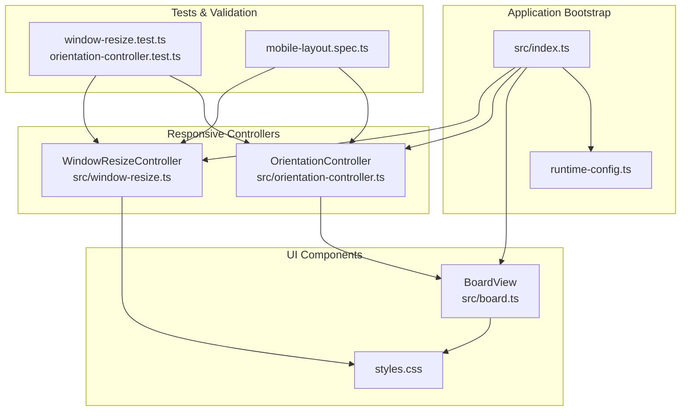
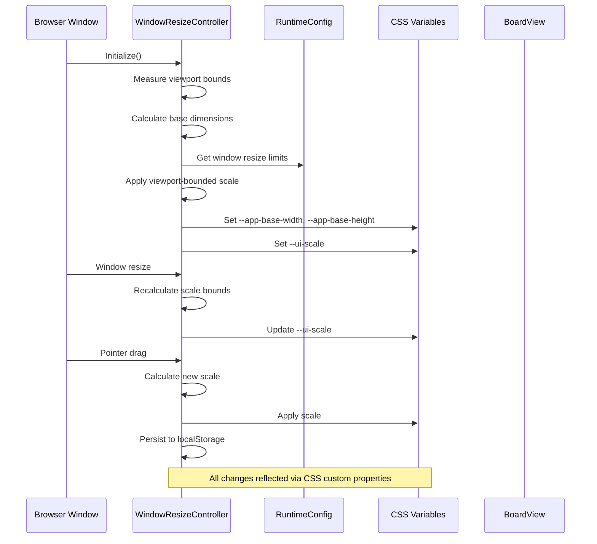
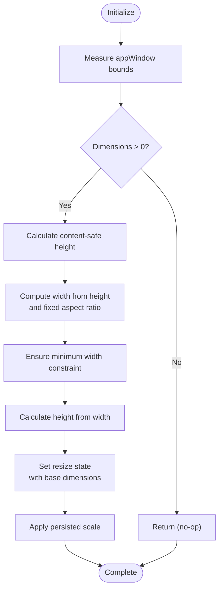
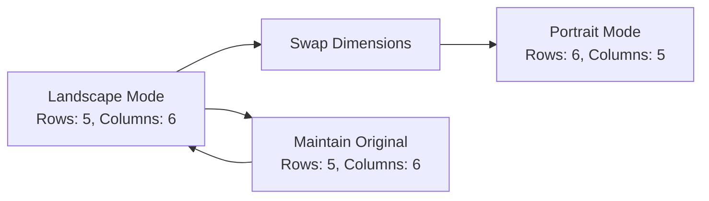
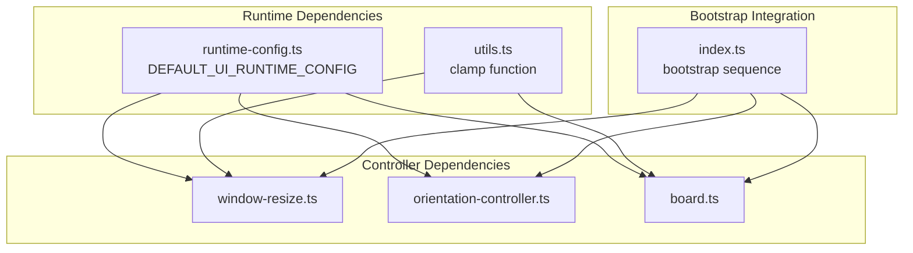

# Responsive Layout and Device Adaptation

<cite>
**Referenced Files in This Document**
- [window-resize.ts](file://src/window-resize.ts)
- [orientation-controller.ts](file://src/orientation-controller.ts)
- [board.ts](file://src/board.ts)
- [runtime-config.ts](file://src/runtime-config.ts)
- [index.ts](file://src/index.ts)
- [styles.css](file://styles.css)
- [window-resize.test.ts](file://tests/window-resize.test.ts)
- [orientation-controller.test.ts](file://tests/orientation-controller.test.ts)
- [mobile-layout.spec.ts](file://e2e/mobile-layout.spec.ts)
</cite>

## Table of Contents
1. [Introduction](#introduction)
2. [Project Structure](#project-structure)
3. [Core Components](#core-components)
4. [Architecture Overview](#architecture-overview)
5. [Detailed Component Analysis](#detailed-component-analysis)
6. [Dependency Analysis](#dependency-analysis)
7. [Performance Considerations](#performance-considerations)
8. [Troubleshooting Guide](#troubleshooting-guide)
9. [Conclusion](#conclusion)

## Introduction
This document provides comprehensive coverage of the responsive design system, focusing on window resize handling and device orientation adaptation. The system ensures optimal gameplay across various screen sizes and orientations through dynamic scaling, viewport-bound calculations, and adaptive layout switching. It covers breakpoint detection, layout recalculations, viewport adjustments, orientation handling, and cross-device compatibility considerations.

## Project Structure
The responsive design system is implemented through coordinated components:

- **Window Resize Controller**: Manages viewport measurements, scale calculations, and drag-based resizing
- **Orientation Controller**: Handles device rotation and adapts difficulty/dimensions accordingly  
- **Board View**: Renders game boards with responsive sizing and layout configuration
- **Runtime Configuration**: Provides adjustable parameters for scaling and layout behavior
- **CSS Styles**: Implements responsive breakpoints and viewport-aware styling

**Diagram sources**
- [index.ts:1047-1061](file://src/index.ts#L1047-L1061)
- [window-resize.ts:38-101](file://src/window-resize.ts#L38-L101)
- [orientation-controller.ts:66-76](file://src/orientation-controller.ts#L66-L76)

**Section sources**
- [index.ts:1074-1100](file://src/index.ts#L1074-L1100)
- [runtime-config.ts:99-156](file://src/runtime-config.ts#L99-L156)

## Core Components

### Window Resize Controller
The WindowResizeController manages responsive scaling through viewport measurements and boundary calculations:

- **Base Dimension Measurement**: Calculates base width/height from measured viewport and fixed aspect ratio
- **Scale Persistence**: Stores user preferences in localStorage for consistent experience
- **Viewport-Bounded Scaling**: Ensures UI fits within available viewport with configurable padding
- **Drag-Based Resizing**: Provides manual scaling control with pointer gesture handling

Key implementation patterns:
- Uses CSS custom properties (--app-base-width, --app-base-height, --ui-scale) for reactive scaling
- Implements deferred initialization to handle mobile viewport settling
- Supports visualViewport API for accurate mobile measurements

**Section sources**
- [window-resize.ts:108-151](file://src/window-resize.ts#L108-L151)
- [window-resize.ts:196-232](file://src/window-resize.ts#L196-L232)
- [window-resize.ts:236-296](file://src/window-resize.ts#L236-L296)

### Orientation Controller
Handles device rotation and layout adaptation:

- **Mode Persistence**: Stores user preference in localStorage with device-aware defaults
- **Difficulty Adaptation**: Swaps rows/columns for portrait mode to optimize gameplay
- **Layout Configuration**: Provides orientation-aware resize configurations
- **UI State Management**: Updates button states and data attributes for accessibility

**Section sources**
- [orientation-controller.ts:9-23](file://src/orientation-controller.ts#L9-L23)
- [orientation-controller.ts:25-33](file://src/orientation-controller.ts#L25-L33)
- [orientation-controller.ts:66-99](file://src/orientation-controller.ts#L66-L99)

### Board View and Layout System
Manages responsive board rendering with configurable spacing and sizing:

- **Dynamic Grid Calculation**: Computes board width based on target tile size and gaps
- **Layout Configuration**: Supports adjustable tile sizes, gaps, and padding
- **Responsive Sizing**: Uses CSS min() functions to prevent overflow
- **Accessibility Compliance**: Maintains proper ARIA attributes and keyboard navigation

**Section sources**
- [board.ts:121-330](file://src/board.ts#L121-L330)
- [board.ts:574-584](file://src/board.ts#L574-L584)

## Architecture Overview

**Diagram sources**
- [window-resize.ts:108-151](file://src/window-resize.ts#L108-L151)
- [window-resize.ts:196-232](file://src/window-resize.ts#L196-L232)
- [styles.css:142-179](file://styles.css#L142-L179)

## Detailed Component Analysis

### Window Resize Controller Implementation

The WindowResizeController provides comprehensive viewport adaptation through several key mechanisms:

#### Base Dimension Calculation
The controller calculates optimal base dimensions using the fixed aspect ratio and measured viewport:

**Diagram sources**
- [window-resize.ts:108-131](file://src/window-resize.ts#L108-L131)

#### Scale Clamping and Boundary Detection
Scale calculations incorporate viewport boundaries and user preferences:

- **Viewport Bounds**: Uses visualViewport API when available, falls back to window.innerWidth/Height
- **Padding Considerations**: Accounts for UI chrome and safe areas
- **Boundary Calculation**: Computes maximum scale based on available viewport space
- **User Preferences**: Restores previously saved scale from localStorage

#### Drag-Based Resizing Interaction
The controller supports manual resizing through pointer gestures:

- **Pointer Capture**: Uses setPointerCapture/releasePointerCapture for gesture stability
- **Dual-Axis Scaling**: Calculates equivalent scales from both width and height deltas
- **Aspect Ratio Preservation**: Maintains the fixed aspect ratio during resizing
- **Persistence**: Saves final scale to localStorage on drag completion

**Section sources**
- [window-resize.ts:196-232](file://src/window-resize.ts#L196-L232)
- [window-resize.ts:236-296](file://src/window-resize.ts#L236-L296)

### Orientation Controller Functionality

The orientation controller manages device rotation and layout adaptation:

#### Mode Persistence and Defaults
- **Storage Key**: Uses "memoryblox-orientation-mode" for preference storage
- **Device-Aware Defaults**: Mobile devices default to portrait, desktop to landscape
- **Legacy Compatibility**: Falls back to landscape for unknown stored values

#### Difficulty Adaptation
For portrait mode, the controller swaps difficulty dimensions to optimize gameplay:

**Diagram sources**
- [orientation-controller.ts:25-33](file://src/orientation-controller.ts#L25-L33)

#### Orientation-Aware Resize Configuration
The controller provides orientation-specific resize parameters:

- **Aspect Ratio Inversion**: Inverts fixed aspect ratio for portrait mode
- **Dimension Swapping**: Exchanges minWidthPx and minHeightPx for portrait orientation
- **Preserved Limits**: Maintains resize limits and base sizes appropriately

**Section sources**
- [orientation-controller.ts:66-99](file://src/orientation-controller.ts#L66-L99)

### CSS Responsive Design Integration

The responsive system integrates deeply with CSS for optimal performance:

#### CSS Custom Properties for Scaling
The controller manipulates CSS custom properties that drive responsive behavior:

- **--app-base-width**: Base application width in pixels
- **--app-base-height**: Base application height in pixels  
- **--ui-scale**: Current scaling factor applied to the entire UI
- **--app-max-width-px**: Maximum application width constraint

#### Viewport-Fit Styling
CSS ensures proper viewport fitting through:

- **calc() Functions**: Uses mathematical expressions to maintain proportions
- **min() Functions**: Prevents overflow by constraining sizes to viewport limits
- **transform Scaling**: Applies CSS transforms for smooth scaling without layout thrashing

#### Media Queries for Adaptive Behavior
The stylesheet includes responsive breakpoints:

- **max-width: 860px**: Optimizes UI for smaller screens with stacked layouts
- **Flexible Grid Systems**: Uses CSS Grid and Flexbox for adaptive component arrangement
- **Touch-Friendly Controls**: Adjusts button sizes and spacing for mobile interaction

**Section sources**
- [styles.css:142-179](file://styles.css#L142-L179)
- [styles.css:1504-1592](file://styles.css#L1504-L1592)

## Dependency Analysis

**Diagram sources**
- [runtime-config.ts:99-156](file://src/runtime-config.ts#L99-L156)
- [index.ts:1047-1061](file://src/index.ts#L1047-L1061)

The dependency structure ensures loose coupling while maintaining clear separation of concerns:

- **WindowResizeController** depends only on configuration interfaces and DOM APIs
- **OrientationController** maintains pure functional interfaces with no DOM dependencies
- **BoardView** receives configuration through dependency injection
- **Bootstrap** coordinates all components through dependency injection patterns

**Section sources**
- [index.ts:1074-1100](file://src/index.ts#L1074-L1100)
- [runtime-config.ts:5-66](file://src/runtime-config.ts#L5-L66)

## Performance Considerations

### Efficient Scale Calculations
The responsive system employs several performance optimizations:

- **CSS Transform Scaling**: Uses transform: scale() instead of recalculating layout positions
- **Debounced Initialization**: Delays scale calculation until viewport settles on mobile devices
- **Boundary Caching**: Stores calculated bounds to avoid repeated DOM measurements
- **Minimal DOM Manipulation**: Updates only CSS custom properties rather than restructuring DOM

### Memory Management
- **Event Listener Cleanup**: Properly removes event listeners during drag operations
- **Timeout Management**: Cancels pending timeouts when reinitialization occurs
- **Weak References**: Uses WeakSet for tile back-face caching to prevent memory leaks

### Mobile-Specific Optimizations
- **visualViewport API**: Leverages accurate viewport measurements on mobile devices
- **Touch-Friendly Gestures**: Implements pointer capture for stable drag interactions
- **Reduced Motion Support**: Adapts animations based on user preferences

## Troubleshooting Guide

### Common Issues and Solutions

#### Scale Not Applying Correctly
**Symptoms**: UI appears too large or small after resize
**Causes**: 
- Incorrect viewport measurements
- Scale bounds exceeded
- LocalStorage corruption

**Solutions**:
- Verify visualViewport API availability on target devices
- Check windowResizeLimits configuration values
- Clear localStorage entries for "memoryblox-window-scale"

#### Orientation Toggle Not Working
**Symptoms**: Rotation button doesn't change layout
**Causes**:
- Missing data-orientation attribute
- Board layout not updated
- Stored preference conflicts

**Solutions**:
- Ensure applyOrientationBoardLayout is called after mode change
- Verify orientationMode state synchronization
- Clear localStorage "memoryblox-orientation-mode" entry

#### Touch Device Responsiveness Issues
**Symptoms**: Drag gestures feel unresponsive or inconsistent
**Causes**:
- Pointer capture failures
- Missing visualViewport support
- Event listener conflicts

**Solutions**:
- Implement proper pointer event handling
- Provide fallbacks for devices without visualViewport
- Ensure event listeners are properly cleaned up

**Section sources**
- [window-resize.test.ts:153-164](file://tests/window-resize.test.ts#L153-L164)
- [orientation-controller.test.ts:134-164](file://tests/orientation-controller.test.ts#L134-L164)

## Conclusion

The responsive design system provides robust cross-device compatibility through carefully orchestrated components that work together seamlessly. The WindowResizeController ensures optimal scaling across all viewport sizes, while the OrientationController adapts gameplay for different device orientations. The integration with CSS custom properties enables efficient, declarative responsive behavior that maintains performance while providing an excellent user experience across desktop, tablet, and mobile devices.

The system's modular design, comprehensive testing coverage, and attention to accessibility and performance considerations make it a solid foundation for responsive web applications. The combination of automatic viewport adaptation and manual user control provides flexibility while maintaining consistent behavior across diverse device capabilities.