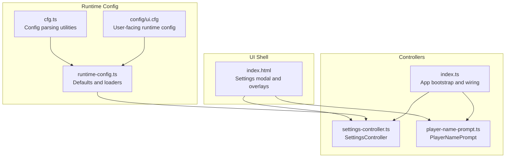
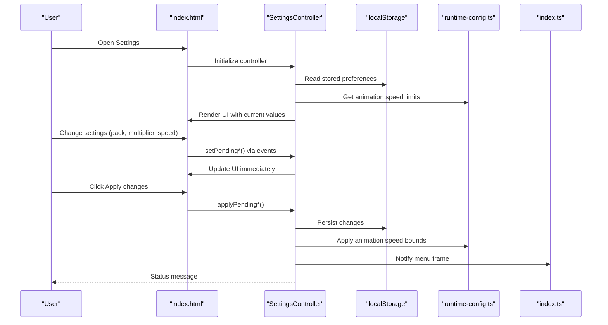
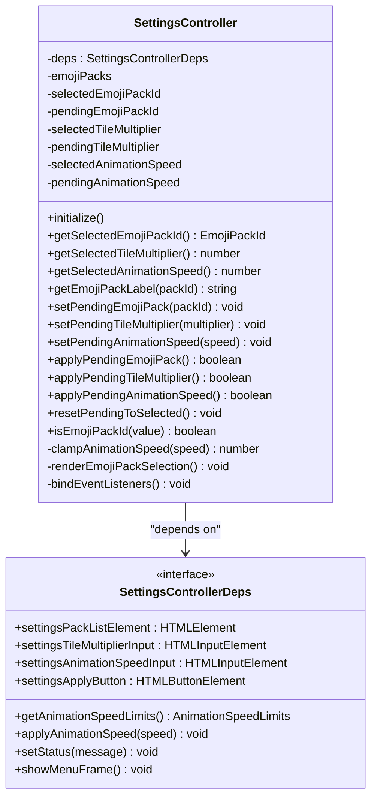
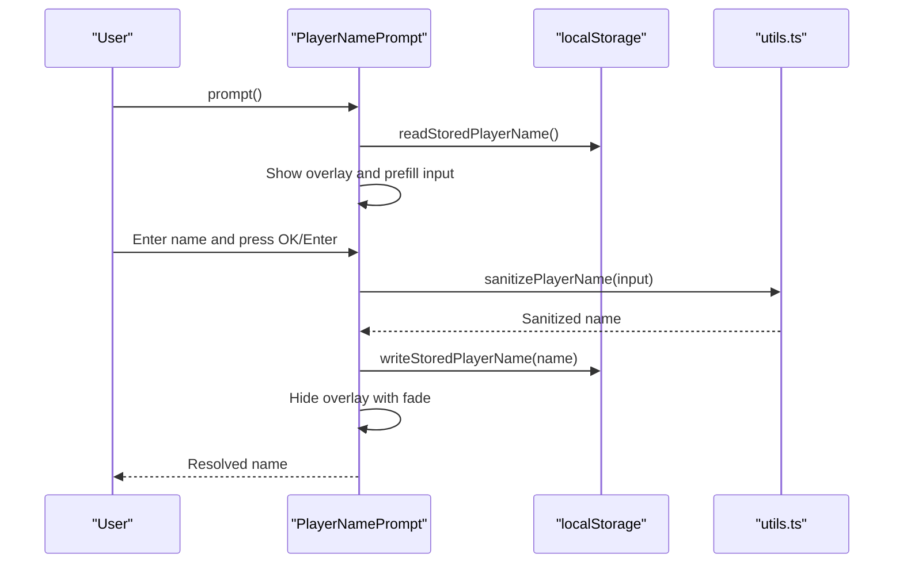
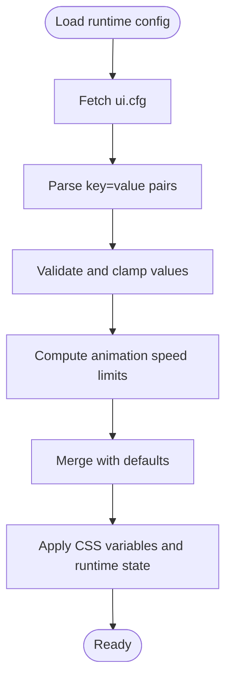
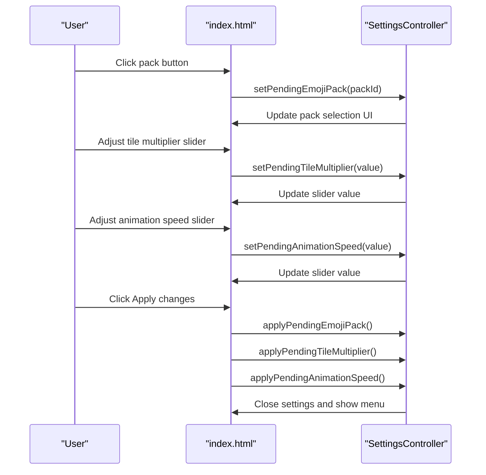
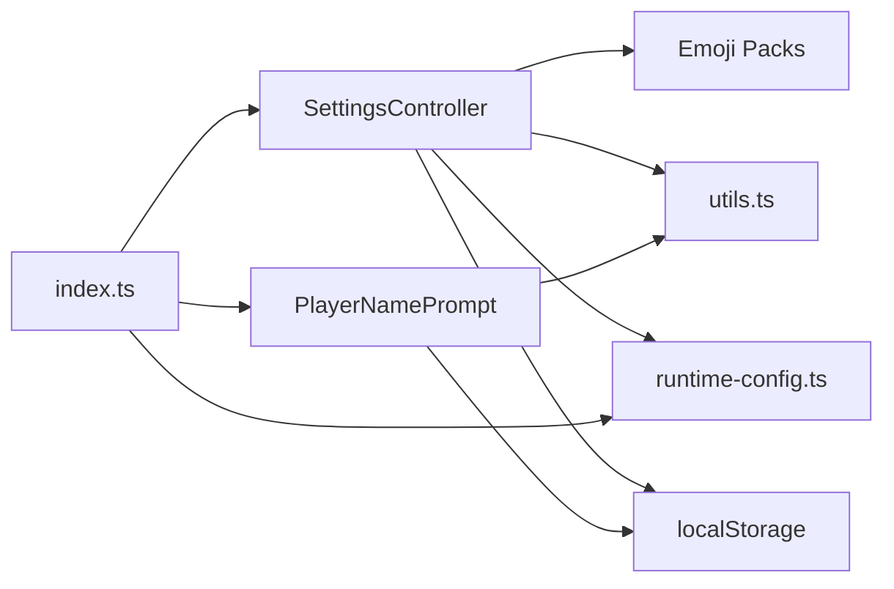

# Settings Interface and User Preferences

<cite>
**Referenced Files in This Document**
- [settings-controller.ts](file://src/settings-controller.ts)
- [player-name-prompt.ts](file://src/player-name-prompt.ts)
- [runtime-config.ts](file://src/runtime-config.ts)
- [cfg.ts](file://src/cfg.ts)
- [index.ts](file://src/index.ts)
- [utils.ts](file://src/utils.ts)
- [index.html](file://index.html)
- [ui.cfg](file://config/ui.cfg)
- [settings-controller.test.ts](file://tests/settings-controller.test.ts)
- [player-name-prompt.test.ts](file://tests/player-name-prompt.test.ts)
</cite>

## Table of Contents
1. [Introduction](#introduction)
2. [Project Structure](#project-structure)
3. [Core Components](#core-components)
4. [Architecture Overview](#architecture-overview)
5. [Detailed Component Analysis](#detailed-component-analysis)
6. [Dependency Analysis](#dependency-analysis)
7. [Performance Considerations](#performance-considerations)
8. [Troubleshooting Guide](#troubleshooting-guide)
9. [Conclusion](#conclusion)
10. [Appendices](#appendices)

## Introduction
This document explains the settings interface system responsible for managing user preferences and customization options. It covers:
- Settings controller implementation with two-phase commit, validation, persistence, and UI synchronization
- Player name prompt for initial setup and user identification
- Settings storage mechanisms, default value handling, and preference inheritance
- Settings modal interface, form validation, and real-time preference updates
- Guidance for extending the settings system, maintaining backward compatibility, and handling edge cases

## Project Structure
The settings system spans several modules:
- Settings controller manages user preferences and UI binding
- Runtime configuration loads and validates UI-related settings from configuration files
- Player name prompt handles initial user identification and persistence
- Index integrates settings controller into the application lifecycle
- Tests validate behavior and edge cases

**Diagram sources**
- [index.html:62-92](file://index.html#L62-L92)
- [runtime-config.ts:99-156](file://src/runtime-config.ts#L99-L156)
- [cfg.ts:54-96](file://src/cfg.ts#L54-L96)
- [settings-controller.ts:33-295](file://src/settings-controller.ts#L33-L295)
- [player-name-prompt.ts:31-118](file://src/player-name-prompt.ts#L31-L118)
- [index.ts:919-928](file://src/index.ts#L919-L928)

**Section sources**
- [index.html:62-92](file://index.html#L62-L92)
- [runtime-config.ts:99-156](file://src/runtime-config.ts#L99-L156)
- [cfg.ts:54-96](file://src/cfg.ts#L54-L96)
- [settings-controller.ts:33-295](file://src/settings-controller.ts#L33-L295)
- [player-name-prompt.ts:31-118](file://src/player-name-prompt.ts#L31-L118)
- [index.ts:919-928](file://src/index.ts#L919-L928)

## Core Components
- SettingsController: central state machine for emoji pack, tile multiplier, and animation speed with two-phase commit and persistence
- PlayerNamePrompt: modal dialog for initial player identity with sanitization and persistence
- RuntimeConfig: loads and validates UI settings from config files with sensible defaults
- Index integration: wires controllers into the app lifecycle and exposes settings to gameplay

Key responsibilities:
- Preference persistence: localStorage-backed for settings and player name
- Validation: input sanitization, clamping, and emoji pack ID verification
- UI synchronization: live updates to inputs and visual feedback
- Real-time updates: applying animation speed immediately to gameplay

**Section sources**
- [settings-controller.ts:33-295](file://src/settings-controller.ts#L33-L295)
- [player-name-prompt.ts:31-118](file://src/player-name-prompt.ts#L31-L118)
- [runtime-config.ts:238-353](file://src/runtime-config.ts#L238-L353)
- [index.ts:919-928](file://src/index.ts#L919-L928)

## Architecture Overview
The settings system follows a layered architecture:
- UI shell defines the settings modal and overlays
- Controllers encapsulate state and persistence
- Runtime configuration supplies defaults and validation rules
- Application bootstrap initializes and binds controllers

**Diagram sources**
- [index.html:62-92](file://index.html#L62-L92)
- [settings-controller.ts:133-295](file://src/settings-controller.ts#L133-L295)
- [runtime-config.ts:151-156](file://src/runtime-config.ts#L151-L156)
- [index.ts:919-928](file://src/index.ts#L919-L928)

## Detailed Component Analysis

### SettingsController
SettingsController implements a two-phase commit pattern:
- Pending state: uncommitted values shown in the UI
- Selected state: committed values persisted and applied
- Apply: commits pending to selected and persists to localStorage
- Reset: discards pending changes when settings reopen

Preference categories:
- Emoji pack: validated against known pack IDs
- Tile multiplier: clamped to configured range
- Animation speed: clamped to runtime limits and applied immediately

UI synchronization:
- Renders pack selection with ARIA attributes
- Updates input values on pending changes
- Provides status messages for user feedback

Persistence:
- Uses localStorage keys for each preference category
- Validates stored values and falls back to defaults when invalid

Validation:
- Emoji pack ID validation ensures only known packs are accepted
- Numeric inputs are sanitized and clamped to safe ranges

Real-time updates:
- Animation speed is applied immediately to CSS variables and effects

**Diagram sources**
- [settings-controller.ts:14-49](file://src/settings-controller.ts#L14-L49)
- [settings-controller.ts:33-295](file://src/settings-controller.ts#L33-L295)

**Section sources**
- [settings-controller.ts:33-295](file://src/settings-controller.ts#L33-L295)
- [settings-controller.test.ts:44-362](file://tests/settings-controller.test.ts#L44-L362)

### PlayerNamePrompt
PlayerNamePrompt manages the initial player identification flow:
- Reads stored name from localStorage and pre-fills the input
- Sanitizes input using a dedicated utility
- Persists the resolved name to localStorage
- Supports Enter key submission and click submission
- Provides graceful fallbacks when input is empty

Accessibility and UX:
- Overlay dialog with ARIA attributes
- Fade-out animation with configurable duration
- Focus management and keyboard support

**Diagram sources**
- [player-name-prompt.ts:59-118](file://src/player-name-prompt.ts#L59-L118)
- [utils.ts:139-144](file://src/utils.ts#L139-L144)

**Section sources**
- [player-name-prompt.ts:31-118](file://src/player-name-prompt.ts#L31-L118)
- [player-name-prompt.test.ts:69-235](file://tests/player-name-prompt.test.ts#L69-L235)
- [utils.ts:139-144](file://src/utils.ts#L139-L144)

### Runtime Configuration and Defaults
RuntimeConfig loads UI settings from config files and provides defaults:
- Loads ui.cfg, shadow.cfg, win-fx.cfg, and leaderboard.cfg
- Parses numeric and list-like values with validation and clamping
- Supplies animation speed limits and other runtime parameters
- Exposes typed defaults for UI configuration

**Diagram sources**
- [runtime-config.ts:238-353](file://src/runtime-config.ts#L238-L353)
- [cfg.ts:54-96](file://src/cfg.ts#L54-L96)
- [ui.cfg:1-76](file://config/ui.cfg#L1-L76)

**Section sources**
- [runtime-config.ts:238-353](file://src/runtime-config.ts#L238-L353)
- [cfg.ts:54-96](file://src/cfg.ts#L54-L96)
- [ui.cfg:1-76](file://config/ui.cfg#L1-L76)

### Settings Modal Interface and Events
The settings modal in the UI shell provides:
- Emoji pack selection with radio-style buttons
- Tile multiplier slider with ticks
- Animation speed slider with ticks
- Apply changes button

Event handling:
- Click on pack buttons sets pending pack and status
- Input events on sliders set pending values and status
- Apply button commits all changes and closes the modal

**Diagram sources**
- [index.html:62-92](file://index.html#L62-L92)
- [settings-controller.ts:223-295](file://src/settings-controller.ts#L223-L295)

**Section sources**
- [index.html:62-92](file://index.html#L62-L92)
- [settings-controller.ts:223-295](file://src/settings-controller.ts#L223-L295)

## Dependency Analysis
SettingsController depends on:
- Emoji pack registry and validation
- Utility functions for clamping and formatting
- Runtime configuration for animation speed limits
- DOM elements for UI binding
- Status and navigation callbacks

PlayerNamePrompt depends on:
- localStorage for persistence
- Utility function for sanitization
- DOM elements for overlay and input

Integration points:
- Index wires SettingsController with UI elements and runtime configuration
- Index applies animation speed changes globally and scales gameplay timing

**Diagram sources**
- [settings-controller.ts:1-23](file://src/settings-controller.ts#L1-L23)
- [player-name-prompt.ts:1-3](file://src/player-name-prompt.ts#L1-L3)
- [index.ts:919-928](file://src/index.ts#L919-L928)

**Section sources**
- [settings-controller.ts:1-23](file://src/settings-controller.ts#L1-L23)
- [player-name-prompt.ts:1-3](file://src/player-name-prompt.ts#L1-L3)
- [index.ts:919-928](file://src/index.ts#L919-L928)

## Performance Considerations
- Two-phase commit minimizes unnecessary writes and UI thrashing
- Immediate animation speed application reduces latency for user feedback
- Clamping and validation occur on the hot path to prevent invalid states
- Slider wheel scrolling improves accessibility and reduces DOM churn
- CSS variables propagate animation speed changes efficiently across the app

## Troubleshooting Guide
Common issues and resolutions:
- Invalid stored emoji pack ID: controller falls back to default pack
- Non-finite numeric inputs: ignored until valid numbers are entered
- Out-of-range animation speed: clamped to runtime limits
- Empty player name: falls back to stored name or default "Player"
- Parity mode for emoji packs: warns or throws depending on configuration

Validation and error handling:
- Emoji pack ID validation prevents unknown values
- Numeric parsing checks for finiteness and clamps to valid ranges
- Config loading gracefully falls back to defaults on parse errors
- UI status messages inform users of pending changes and apply outcomes

**Section sources**
- [settings-controller.ts:142-151](file://src/settings-controller.ts#L142-L151)
- [settings-controller.ts:299-358](file://src/settings-controller.ts#L299-L358)
- [runtime-config.ts:238-353](file://src/runtime-config.ts#L238-L353)
- [player-name-prompt.ts:42-57](file://src/player-name-prompt.ts#L42-L57)
- [runtime-config.ts:902-917](file://src/runtime-config.ts#L902-L917)

## Conclusion
The settings interface system provides a robust, accessible, and performant way to manage user preferences. Its two-phase commit model, strong validation, and immediate UI feedback ensure a smooth user experience. The integration with runtime configuration and global animation scaling keeps the application responsive and consistent across preferences.

## Appendices

### Settings Storage Mechanisms and Keys
- Emoji pack: stored under a dedicated key in localStorage
- Tile multiplier: stored as a numeric string
- Animation speed: stored as a numeric string
- Player name: stored under a dedicated key in localStorage

Default value handling:
- Emoji pack defaults to a predefined default pack ID
- Tile multiplier defaults to 1
- Animation speed defaults to the runtime-configured default
- Player name defaults to null, prompting the prompt

Preference inheritance:
- SettingsController inherits defaults from runtime configuration
- UI shell reflects current settings and applies changes immediately

**Section sources**
- [settings-controller.ts:10-12](file://src/settings-controller.ts#L10-L12)
- [settings-controller.ts:299-358](file://src/settings-controller.ts#L299-L358)
- [runtime-config.ts:99-156](file://src/runtime-config.ts#L99-L156)
- [player-name-prompt.ts:3-18](file://src/player-name-prompt.ts#L3-L18)

### Extending the Settings System
Guidance for adding new options:
- Define a new preference category with a dedicated localStorage key
- Add UI elements in the settings modal
- Implement pending and apply methods in SettingsController
- Wire event handlers to update pending state and status
- Persist changes in apply methods
- Integrate with runtime configuration if applicable
- Maintain backward compatibility by falling back to defaults for missing values

Backward compatibility:
- Validate stored values and ignore invalid entries
- Provide sensible defaults for new options
- Ensure clamping and normalization prevent runtime errors

Edge cases:
- Empty or whitespace-only inputs are sanitized and trimmed
- Non-finite numeric inputs are ignored until valid
- Out-of-range values are clamped to configured limits
- Unknown emoji pack IDs fall back to defaults

**Section sources**
- [settings-controller.ts:133-295](file://src/settings-controller.ts#L133-L295)
- [settings-controller.ts:299-358](file://src/settings-controller.ts#L299-L358)
- [runtime-config.ts:238-353](file://src/runtime-config.ts#L238-L353)
- [utils.ts:139-144](file://src/utils.ts#L139-L144)