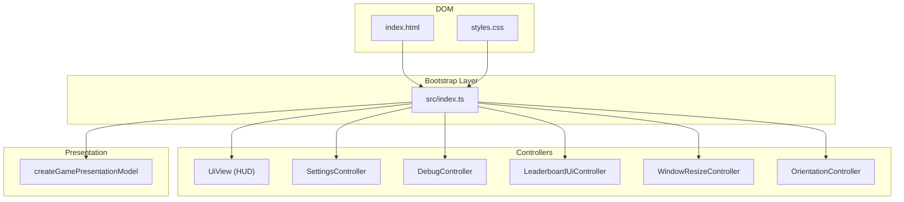
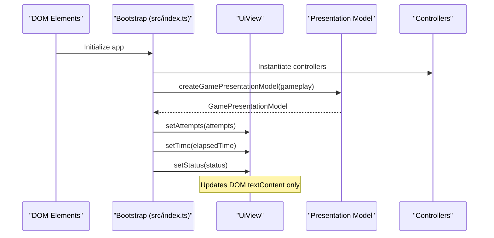
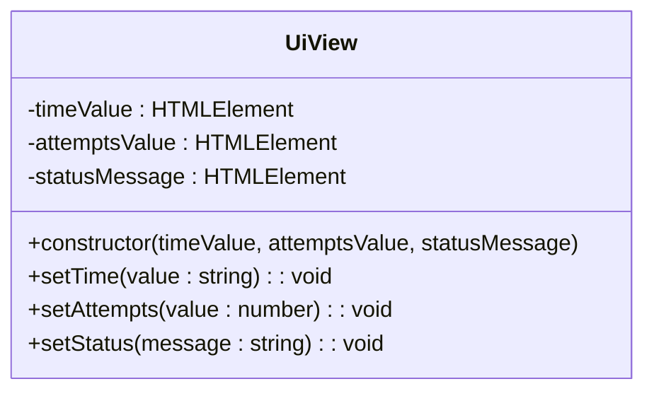
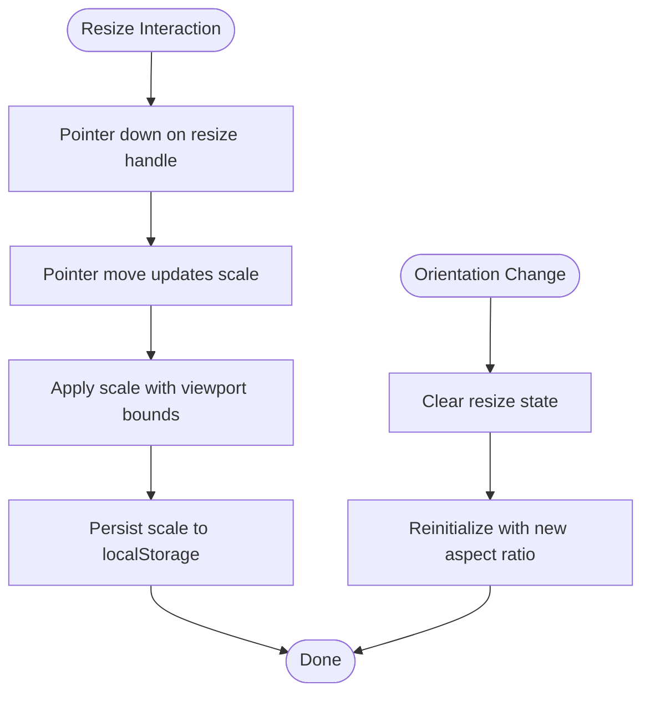
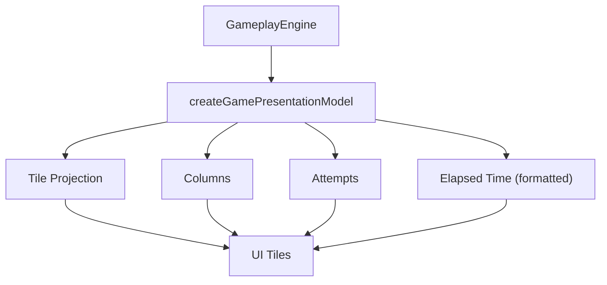
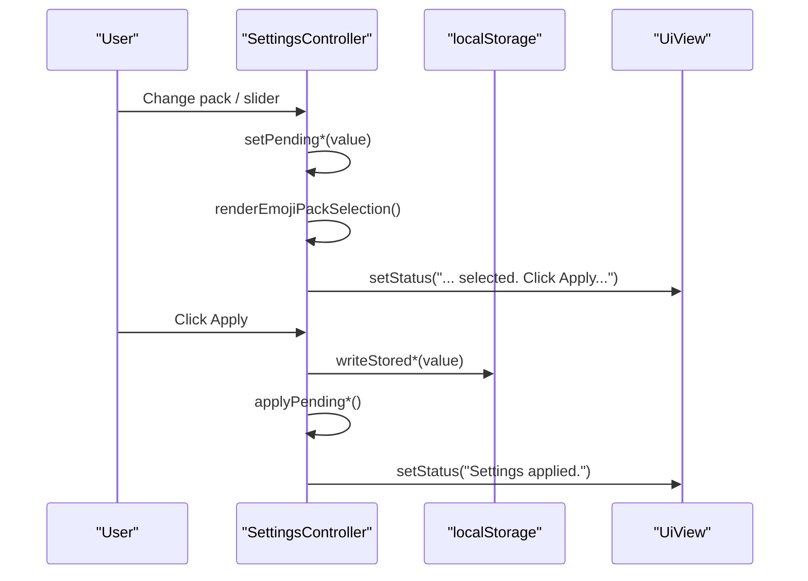
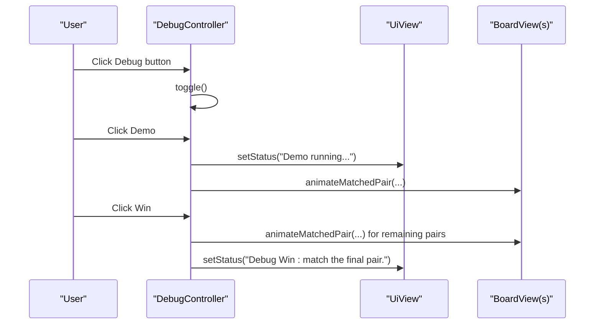
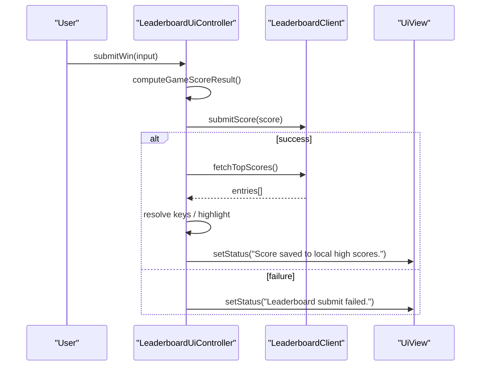
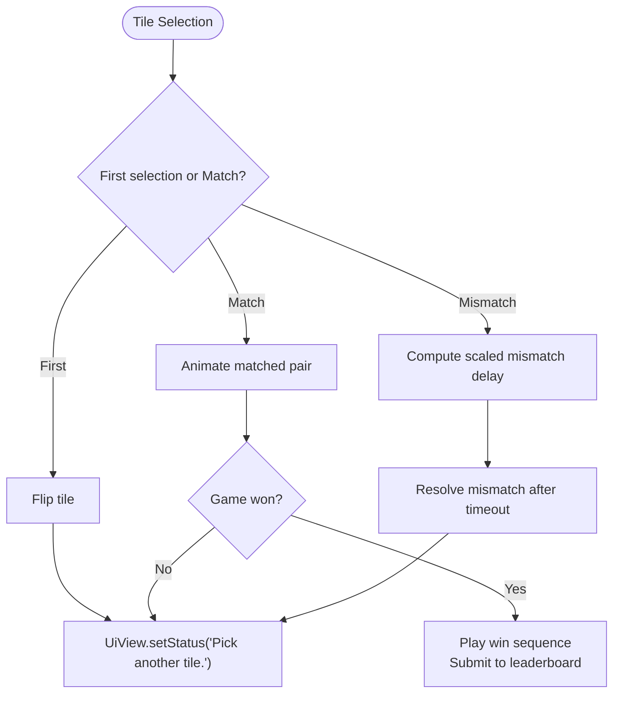
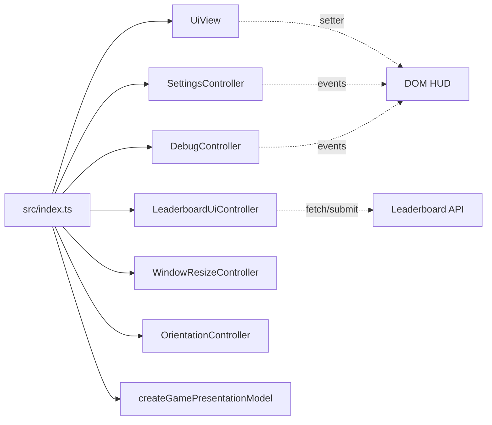

# User Interface System

<cite>
**Referenced Files in This Document**
- [index.html](file://index.html)
- [src/ui.ts](file://src/ui.ts)
- [src/presentation.ts](file://src/presentation.ts)
- [src/window-resize.ts](file://src/window-resize.ts)
- [src/orientation-controller.ts](file://src/orientation-controller.ts)
- [src/settings-controller.ts](file://src/settings-controller.ts)
- [src/leaderboard-ui.ts](file://src/leaderboard-ui.ts)
- [src/leaderboard-view.ts](file://src/leaderboard-view.ts)
- [src/debug-controller.ts](file://src/debug-controller.ts)
- [src/player-name-prompt.ts](file://src/player-name-prompt.ts)
- [src/index.ts](file://src/index.ts)
- [styles.css](file://styles.css)
</cite>

## Table of Contents
1. [Introduction](#introduction)
2. [Project Structure](#project-structure)
3. [Core Components](#core-components)
4. [Architecture Overview](#architecture-overview)
5. [Detailed Component Analysis](#detailed-component-analysis)
6. [Dependency Analysis](#dependency-analysis)
7. [Performance Considerations](#performance-considerations)
8. [Troubleshooting Guide](#troubleshooting-guide)
9. [Conclusion](#conclusion)

## Introduction
This document describes the user interface system with emphasis on the presentation layer and user interaction handling. It covers the Heads-Up Display (HUD) with timer, attempts counter, and status messaging; the responsive design system including window resizing and orientation-aware layouts; presentation model abstractions and UI state management; visual feedback mechanisms; and the separation between display views and controller ownership of event wiring. It also documents the top-bar debug menu, settings interface, and leaderboard integration, along with UI event handling, accessibility considerations, and cross-platform compatibility.

## Project Structure
The UI system is organized around a clear separation of concerns:
- Presentation layer: view classes that render DOM updates based on pure presentation models.
- Controllers: orchestrate state, manage user interactions, and drive the view layer.
- Bootstrap layer: wires controllers to DOM elements and initializes runtime configuration.
- Styles: CSS variables and responsive styles define adaptive layouts and visual themes.

**Diagram sources**
- [src/index.ts:1-1100](file://src/index.ts#L1-L1100)
- [src/ui.ts:1-49](file://src/ui.ts#L1-L49)
- [src/settings-controller.ts:1-372](file://src/settings-controller.ts#L1-L372)
- [src/debug-controller.ts:1-470](file://src/debug-controller.ts#L1-L470)
- [src/leaderboard-ui.ts:1-234](file://src/leaderboard-ui.ts#L1-L234)
- [src/window-resize.ts:1-298](file://src/window-resize.ts#L1-L298)
- [src/orientation-controller.ts:1-105](file://src/orientation-controller.ts#L1-L105)
- [src/presentation.ts:1-25](file://src/presentation.ts#L1-L25)
- [index.html:1-196](file://index.html#L1-L196)
- [styles.css:1-200](file://styles.css#L1-L200)

**Section sources**
- [src/index.ts:1-1100](file://src/index.ts#L1-L1100)
- [index.html:1-196](file://index.html#L1-L196)
- [styles.css:1-200](file://styles.css#L1-L200)

## Core Components
- HUD View (UiView): Pure display view responsible for updating time, attempts, and status text. It receives updates from the controller layer and does not accept event callbacks.
- Presentation Model: A pure projection of gameplay state into UI-friendly fields (tiles, columns, attempts, elapsed time).
- Settings Controller: Manages settings state with a two-phase commit pattern (pending → selected), persists to localStorage, and renders UI updates.
- Debug Controller: Controls the top-bar debug menu, debug modes, and demo automation, while delegating rendering to views.
- Leaderboard UI Controller: Fetches, displays, and submits scores with robust error handling and status messaging.
- Window Resize Controller: Handles pointer-based resizing, viewport-bounded scaling, persistence, and reinitialization on orientation changes.
- Orientation Controller: Manages orientation mode, persists preference, updates UI toggles, and adapts difficulty/layout accordingly.
- Player Name Prompt: Collects and validates player name with fade animations and localStorage persistence.

**Section sources**
- [src/ui.ts:1-49](file://src/ui.ts#L1-L49)
- [src/presentation.ts:1-25](file://src/presentation.ts#L1-L25)
- [src/settings-controller.ts:1-372](file://src/settings-controller.ts#L1-L372)
- [src/debug-controller.ts:1-470](file://src/debug-controller.ts#L1-L470)
- [src/leaderboard-ui.ts:1-234](file://src/leaderboard-ui.ts#L1-L234)
- [src/window-resize.ts:1-298](file://src/window-resize.ts#L1-L298)
- [src/orientation-controller.ts:1-105](file://src/orientation-controller.ts#L1-L105)
- [src/player-name-prompt.ts:1-124](file://src/player-name-prompt.ts#L1-L124)

## Architecture Overview
The system follows a strict separation between display views and controllers:
- Views (e.g., UiView) receive updates via setter methods from controllers.
- Controllers own event wiring and state transitions.
- Presentation models decouple gameplay state from UI rendering.
- Responsive behavior is encapsulated in dedicated controllers (WindowResizeController, OrientationController).

**Diagram sources**
- [src/index.ts:809-807](file://src/index.ts#L809-L807)
- [src/presentation.ts:12-24](file://src/presentation.ts#L12-L24)
- [src/ui.ts:37-47](file://src/ui.ts#L37-L47)

**Section sources**
- [src/index.ts:809-807](file://src/index.ts#L809-L807)
- [src/presentation.ts:12-24](file://src/presentation.ts#L12-L24)
- [src/ui.ts:15-48](file://src/ui.ts#L15-L48)

## Detailed Component Analysis

### HUD Implementation (UiView)
UiView is a display-only view that updates the HUD with:
- Elapsed time
- Attempt count
- Status messages

It enforces separation of concerns by accepting DOM elements in the constructor and exposing setters for the controller layer to push updates. No user input events or interactive wiring is performed here.

**Diagram sources**
- [src/ui.ts:15-48](file://src/ui.ts#L15-L48)

**Section sources**
- [src/ui.ts:15-48](file://src/ui.ts#L15-L48)
- [src/index.ts:809-813](file://src/index.ts#L809-L813)

### Responsive Design System (Window Resize and Orientation)
The responsive system combines:
- WindowResizeController: pointer-based resizing, viewport-bounded scaling, persistence, and deferred re-clamp.
- OrientationController: stores orientation preference, updates UI toggle icons, flips difficulty rows/columns, and adjusts base size/aspect ratio.

**Diagram sources**
- [src/window-resize.ts:236-296](file://src/window-resize.ts#L236-L296)
- [src/window-resize.ts:157-174](file://src/window-resize.ts#L157-L174)
- [src/orientation-controller.ts:66-99](file://src/orientation-controller.ts#L66-L99)

**Section sources**
- [src/window-resize.ts:38-298](file://src/window-resize.ts#L38-L298)
- [src/orientation-controller.ts:5-105](file://src/orientation-controller.ts#L5-L105)
- [src/index.ts:1039-1061](file://src/index.ts#L1039-L1061)

### Presentation Layer Abstractions
The presentation layer transforms gameplay state into UI-friendly fields:
- GamePresentationModel: immutable snapshot of board tiles, columns, attempts, and formatted elapsed time.
- createGamePresentationModel: pure function mapping gameplay engine state to presentation model.

**Diagram sources**
- [src/presentation.ts:5-24](file://src/presentation.ts#L5-L24)

**Section sources**
- [src/presentation.ts:5-24](file://src/presentation.ts#L5-L24)
- [src/index.ts:781-807](file://src/index.ts#L781-L807)

### Settings Interface (SettingsController)
SettingsController manages:
- Two-phase commit: pending values rendered immediately; apply commits to selected and persists to localStorage.
- Emoji pack selection with radio-group semantics and ARIA attributes.
- Tile multiplier and animation speed sliders with clamping and wheel scrolling support.
- Apply button triggers commit and returns to menu with status feedback.

**Diagram sources**
- [src/settings-controller.ts:72-129](file://src/settings-controller.ts#L72-L129)
- [src/settings-controller.ts:223-294](file://src/settings-controller.ts#L223-L294)
- [src/index.ts:919-928](file://src/index.ts#L919-L928)

**Section sources**
- [src/settings-controller.ts:33-295](file://src/settings-controller.ts#L33-L295)
- [src/index.ts:919-928](file://src/index.ts#L919-L928)

### Top-Bar Debug Menu (DebugController)
The debug controller manages:
- Visibility toggling of the debug panel.
- Debug modes: tiles inspection, SVG imports preview, near-win state, auto-match demo, and flip-all-tiles.
- Event wiring for debug actions and global escape handling to close menus.

**Diagram sources**
- [src/debug-controller.ts:96-114](file://src/debug-controller.ts#L96-L114)
- [src/debug-controller.ts:238-263](file://src/debug-controller.ts#L238-L263)
- [src/debug-controller.ts:199-234](file://src/debug-controller.ts#L199-L234)

**Section sources**
- [src/debug-controller.ts:87-470](file://src/debug-controller.ts#L87-L470)
- [src/index.ts:930-971](file://src/index.ts#L930-L971)

### Leaderboard Integration (LeaderboardUiController)
The leaderboard controller:
- Fetches top scores and renders a capped view.
- Submits scores with computed score result and handles errors gracefully.
- Highlights recently submitted entries and provides status messages.

**Diagram sources**
- [src/leaderboard-ui.ts:119-172](file://src/leaderboard-ui.ts#L119-L172)
- [src/leaderboard-view.ts:3-17](file://src/leaderboard-view.ts#L3-L17)
- [src/leaderboard-view.ts:50-80](file://src/leaderboard-view.ts#L50-L80)

**Section sources**
- [src/leaderboard-ui.ts:51-234](file://src/leaderboard-ui.ts#L51-L234)
- [src/leaderboard-view.ts:1-110](file://src/leaderboard-view.ts#L1-L110)

### UI State Management and Visual Feedback
- Timer updates: interval-driven HUD updates via UiView setters.
- Mismatch resolution: delayed flip-back with abort controller pattern.
- Win sequence: animated celebration with sound and optional leaderboard submission.
- Accessibility: live regions, ARIA attributes, reduced motion support, and keyboard navigation.

**Diagram sources**
- [src/index.ts:639-780](file://src/index.ts#L639-L780)
- [src/index.ts:482-496](file://src/index.ts#L482-L496)

**Section sources**
- [src/index.ts:482-496](file://src/index.ts#L482-L496)
- [src/index.ts:639-780](file://src/index.ts#L639-L780)

### Cross-Platform Compatibility and Accessibility
- Mobile orientation toggle with persisted preference and layout adjustments.
- Wheel scrolling enabled for sliders and horizontal scroll for topbar actions.
- Reduced motion support scales delays based on user preference.
- ARIA roles and labels for interactive elements and live regions for status updates.

**Section sources**
- [src/orientation-controller.ts:9-23](file://src/orientation-controller.ts#L9-L23)
- [src/index.ts:1070-1072](file://src/index.ts#L1070-L1072)
- [src/index.ts:311-316](file://src/index.ts#L311-L316)
- [index.html:152-189](file://index.html#L152-L189)

## Dependency Analysis
The bootstrap layer wires all controllers to DOM elements and initializes runtime configuration. Controllers depend on pure presentation models and view classes, while views remain display-only.

**Diagram sources**
- [src/index.ts:1074-1096](file://src/index.ts#L1074-L1096)
- [src/ui.ts:15-48](file://src/ui.ts#L15-L48)
- [src/settings-controller.ts:223-294](file://src/settings-controller.ts#L223-L294)
- [src/debug-controller.ts:302-369](file://src/debug-controller.ts#L302-L369)
- [src/leaderboard-ui.ts:114-172](file://src/leaderboard-ui.ts#L114-L172)

**Section sources**
- [src/index.ts:1074-1096](file://src/index.ts#L1074-L1096)

## Performance Considerations
- Cancellable timers and abort controllers prevent stale callbacks and memory leaks.
- Scaled animation durations respect user-selected animation speed and reduced motion preferences.
- Deferred reinitialization of the resize controller avoids measuring unstable viewport sizes.
- Pure presentation model creation minimizes DOM churn by passing immutable snapshots to views.

[No sources needed since this section provides general guidance]

## Troubleshooting Guide
Common issues and remedies:
- HUD not updating: verify timer interval is started and UiView setters are invoked from render().
- Settings not applying: ensure applyPending* returns true and localStorage writes succeed.
- Leaderboard submission failing: check network availability and error handling logs; UI status indicates failure state.
- Orientation not sticking: confirm persisted mode and reinitialize resize controller after mode change.
- Debug menu not closing: ensure escape key handling and click-outside logic are bound.

**Section sources**
- [src/index.ts:482-496](file://src/index.ts#L482-L496)
- [src/settings-controller.ts:91-121](file://src/settings-controller.ts#L91-L121)
- [src/leaderboard-ui.ts:168-172](file://src/leaderboard-ui.ts#L168-L172)
- [src/orientation-controller.ts:21-23](file://src/orientation-controller.ts#L21-L23)
- [src/debug-controller.ts:338-369](file://src/debug-controller.ts#L338-L369)

## Conclusion
The UI system cleanly separates display views from controllers, ensuring predictable state updates and maintainable event wiring. The HUD, responsive design, settings, debug menu, and leaderboard integrate through pure presentation models and controller-driven flows, with strong accessibility and cross-platform support.