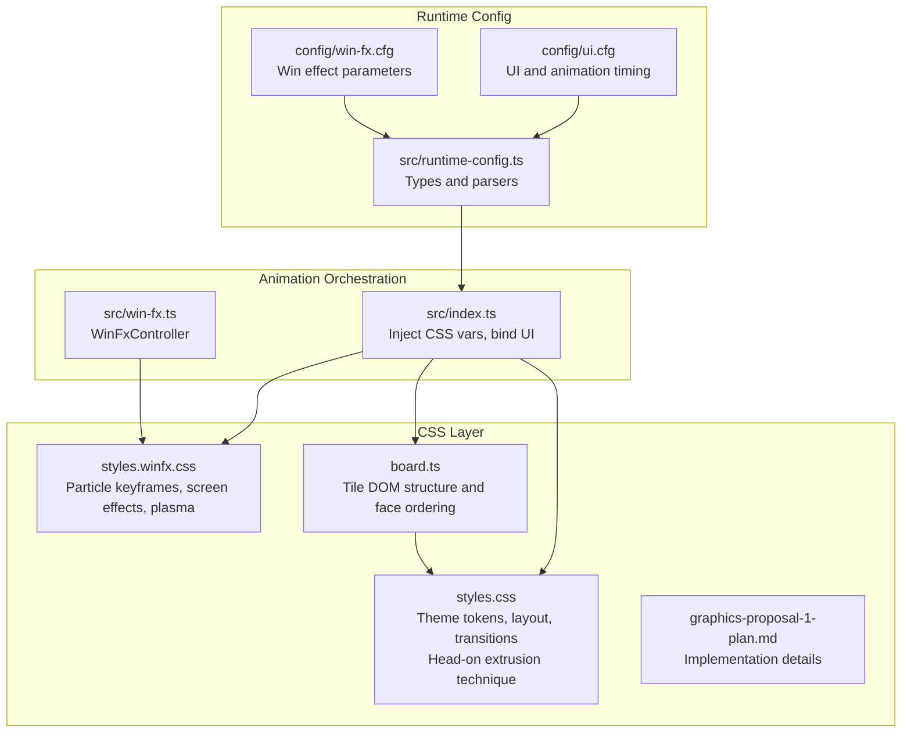
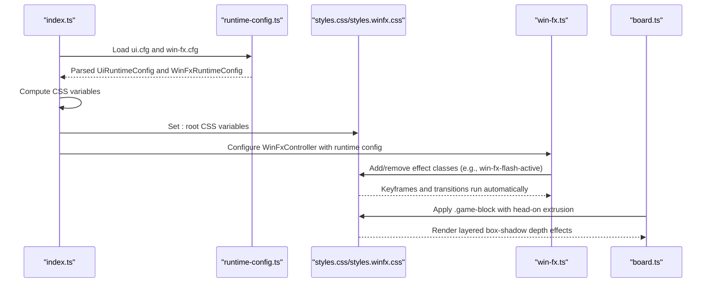
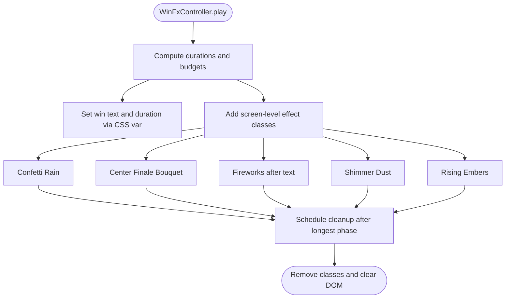
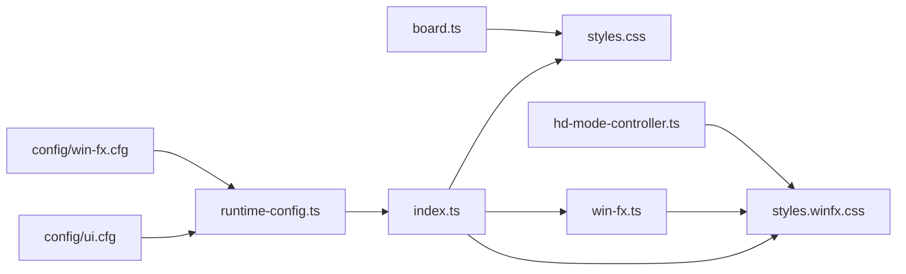

# CSS Styling and Animation Framework

<cite>
**Referenced Files in This Document**
- [styles.css](file://styles.css)
- [styles.winfx.css](file://styles.winfx.css)
- [runtime-config.ts](file://src/runtime-config.ts)
- [win-fx.ts](file://src/win-fx.ts)
- [index.ts](file://src/index.ts)
- [board.ts](file://src/board.ts)
- [ui.cfg](file://config/ui.cfg)
- [win-fx.cfg](file://config/win-fx.cfg)
- [win-fx.test.ts](file://tests/win-fx.test.ts)
- [hd-mode-controller.ts](file://src/hd-mode-controller.ts)
- [graphics-proposal-1-plan.md](file://docs/graphics-proposal-1-plan.md)
</cite>

## Update Summary
**Changes Made**
- Updated tile rendering system from perspective-based 3D to head-on extrusion technique
- Added comprehensive documentation for the new CSS custom properties system for tile depth and side faces
- Revised tile styling architecture to use layered box-shadow effects instead of pseudo-3D faces
- Updated animation pipeline documentation to reflect the new tile rendering approach
- Enhanced visual consistency guidelines for the new extrusion technique

## Table of Contents
1. [Introduction](#introduction)
2. [Project Structure](#project-structure)
3. [Core Components](#core-components)
4. [Architecture Overview](#architecture-overview)
5. [Detailed Component Analysis](#detailed-component-analysis)
6. [Dependency Analysis](#dependency-analysis)
7. [Performance Considerations](#performance-considerations)
8. [Troubleshooting Guide](#troubleshooting-guide)
9. [Conclusion](#conclusion)

## Introduction
This document describes the CSS styling and animation framework responsible for visual effects, runtime configuration, and responsive design. The framework has undergone a major visual transformation from perspective-based 3D rendering to a head-on extrusion technique using layered box-shadow effects. It covers:
- CSS custom properties for runtime configuration
- Animation keyframes and transition timing functions
- The animation pipeline for particle effects, screen flashes, and UI transitions
- Practical examples of CSS variable usage, performance optimization, and responsive patterns
- Guidelines for theme consistency, accessibility, and browser compatibility

## Project Structure
The animation framework spans CSS and TypeScript modules:
- Global UI styles and theme tokens live in the main stylesheet
- Win animation effects are isolated in a dedicated stylesheet
- Runtime configuration is loaded from config files and injected into CSS variables
- The animation controller orchestrates timed effects and applies CSS classes
- Tile rendering now uses a head-on extrusion technique with layered box-shadow effects

**Diagram sources**
- [styles.css:1219-1281](file://styles.css#L1219-L1281)
- [styles.winfx.css:1-865](file://styles.winfx.css#L1-L865)
- [board.ts:36-57](file://board.ts#L36-L57)
- [graphics-proposal-1-plan.md:34-51](file://docs/graphics-proposal-1-plan.md#L34-L51)
- [runtime-config.ts:1-399](file://src/runtime-config.ts#L1-L399)
- [win-fx.ts:1-830](file://src/win-fx.ts#L1-L830)
- [index.ts:860-1059](file://src/index.ts#L860-L1059)
- [ui.cfg:1-76](file://config/ui.cfg#L1-L76)
- [win-fx.cfg:1-30](file://config/win-fx.cfg#L1-L30)

**Section sources**
- [styles.css:1219-1281](file://styles.css#L1219-L1281)
- [styles.winfx.css:1-865](file://styles.winfx.css#L1-L865)
- [board.ts:36-57](file://board.ts#L36-L57)
- [graphics-proposal-1-plan.md:34-51](file://docs/graphics-proposal-1-plan.md#L34-L51)
- [runtime-config.ts:1-399](file://src/runtime-config.ts#L1-L399)
- [win-fx.ts:1-830](file://src/win-fx.ts#L1-L830)
- [index.ts:860-1059](file://src/index.ts#L860-L1059)
- [ui.cfg:1-76](file://config/ui.cfg#L1-L76)
- [win-fx.cfg:1-30](file://config/win-fx.cfg#L1-L30)

## Core Components
- **Head-on extrusion technique**: Replaced perspective-based 3D rendering with layered box-shadow effects for tile blocks
- **CSS custom property system**: Centralized runtime configuration exposed via :root variables and overridden per host element
- **Animation keyframes**: Reusable, named animations for particles, screen effects, and board overlays
- **Transition timing functions**: Ease-in/out, cubic-bezier, and linear curves tuned for performance and feel
- **WinFxController**: JavaScript orchestration of timed effects, particle budgeting, and class-driven screen effects
- **Runtime configuration**: Typed config loaders for UI and win effects, with clamping and validation

**Updated** The tile rendering system now uses a head-on extrusion technique where depth is achieved through layered box-shadow effects rather than 3D transforms.

Practical examples of CSS variable usage:
- Global animation speed: set via --animation-speed-default and consumed by animations to scale durations
- Tile depth and side faces: --tile-depth, --tile-side-right, --tile-side-bottom for extrusion effects
- Tile and board opacity: --tile-front-opacity, --tile-back-opacity, --tile-global-opacity
- Plasma animation durations and opacities: --plasma-bg-drift-duration-ms, --plasma-glow-opacity, etc.
- Gameplay timing: --tile-flip-duration-ms, --tile-match-disappear-duration-ms

**Section sources**
- [styles.css:1223-1226](file://styles.css#L1223-L1226)
- [styles.css:1256-1270](file://styles.css#L1256-L1270)
- [styles.css:13-101](file://styles.css#L13-L101)
- [styles.winfx.css:826-828](file://styles.winfx.css#L826-L828)
- [index.ts:863-884](file://src/index.ts#L863-L884)
- [runtime-config.ts:38-88](file://src/runtime-config.ts#L38-L88)
- [win-fx.ts:826-828](file://src/win-fx.ts#L826-L828)

## Architecture Overview
The animation pipeline integrates runtime configuration, CSS variables, and JavaScript orchestration:
- On startup, index.ts loads UI and win-fx configs, computes CSS variables, and applies them to :root
- WinFxController creates DOM nodes for particles and triggers CSS classes for screen-level effects
- CSS keyframes and transitions render the visual effects, with durations scaled by --animation-speed
- **Updated** Tile rendering uses head-on extrusion technique with layered box-shadow effects for depth perception

**Diagram sources**
- [index.ts:863-900](file://src/index.ts#L863-L900)
- [runtime-config.ts:238-353](file://src/runtime-config.ts#L238-L353)
- [runtime-config.ts:365-398](file://src/runtime-config.ts#L365-L398)
- [styles.css:1219-1281](file://styles.css#L1219-L1281)
- [styles.winfx.css:502-553](file://styles.winfx.css#L502-L553)
- [win-fx.ts:236-562](file://src/win-fx.ts#L236-L562)
- [board.ts:406-434](file://board.ts#L406-L434)

## Detailed Component Analysis

### Head-on Extrusion Technique for Tile Rendering
**Updated** The tile rendering system has been transformed from perspective-based 3D to a head-on extrusion technique:

- **Purpose**: Achieve depth perception without perspective distortion for a flat memory grid
- **Implementation**: Uses layered box-shadow effects to create right and bottom depth faces
- **Depth control**: Managed via --tile-depth CSS custom property (default: 6px)
- **Side face colors**: Controlled by --tile-side-right and --tile-side-bottom variables
- **Hidden faces**: The original .tile-right and .tile-top faces remain hidden but provide structural integrity

The extrusion technique creates:
- Two solid offset shadows forming right and bottom depth faces
- Darker pair shading the far edge for depth perception
- Soft offset shadow providing ground contact
- Clean rotation during tile flips without z-fighting

**Section sources**
- [styles.css:1219-1281](file://styles.css#L1219-L1281)
- [styles.css:1256-1270](file://styles.css#L1256-L1270)
- [graphics-proposal-1-plan.md:34-51](file://docs/graphics-proposal-1-plan.md#L34-L51)
- [board.ts:406-434](file://board.ts#L406-L434)

### CSS Custom Properties System
- **Purpose**: Provide centralized, runtime tunable parameters for animations and visuals
- **Scope**: :root defines global defaults; per-host overrides (e.g., tile-depth, tile-side-right, tile-side-bottom) adjust local depth and shading
- **Examples**:
  - --animation-speed-default: sets the base multiplier for scaling durations
  - --tile-depth, --tile-side-right, --tile-side-bottom: control extrusion depth and side face colors
  - --tile-front-opacity, --tile-back-opacity, --tile-global-opacity: control transparency of tiles
  - --plasma-* variables: control background drift, hue cycles, glow sweep, flares shift, and opacities
  - --tile-flip-duration-ms, --tile-match-disappear-duration-ms: gameplay timing variables

**Updated** The tile depth system now uses --tile-depth, --tile-side-right, and --tile-side-bottom custom properties instead of pseudo-3D faces.

Usage patterns:
- CSS consumes variables directly in animation-duration and transition-duration
- JS updates :root variables and WinFxController bounds to reflect user settings

**Section sources**
- [styles.css:13-101](file://styles.css#L13-L101)
- [styles.css:1223-1226](file://styles.css#L1223-L1226)
- [styles.winfx.css:609-682](file://styles.winfx.css#L609-L682)
- [index.ts:863-884](file://src/index.ts#L863-L884)
- [runtime-config.ts:38-88](file://src/runtime-config.ts#L38-L88)

### Animation Keyframes and Timing Functions
- **Keyframes**: win-fx-title-display, win-fx-piece-blast, win-fx-firework-burst, win-fx-confetti-fall, win-fx-sparkle-twinkle, win-fx-board-pulse, win-fx-screen-flash, win-fx-app-shake, win-fx-board-chroma, win-fx-text-glow-pulse, win-fx-shimmer-drift, win-fx-ember-rise, menu-title-plasma-flow, menu-title-texture-hue, plasma-bg-drift
- **Timing functions**: ease, ease-in-out, cubic-bezier, linear
- **Scaling**: durations are divided by --animation-speed to slow down or speed up

Examples:
- Text display and glow: win-fx-text uses multiple keyframes and ease-in-out
- Particle bursts: win-fx-firework-burst uses cubic-bezier for realistic acceleration/deceleration
- Screen flash: win-fx-screen-flash uses ease-out for quick fade
- Plasma surfaces: menu-title-plasma-flow and menu-title-texture-hue combine linear and ease-in-out

**Section sources**
- [styles.winfx.css:174-500](file://styles.winfx.css#L174-L500)
- [styles.winfx.css:502-553](file://styles.winfx.css#L502-L553)
- [styles.winfx.css:556-587](file://styles.winfx.css#L556-L587)
- [styles.winfx.css:751-786](file://styles.winfx.css#L751-L786)
- [styles.winfx.css:788-828](file://styles.winfx.css#L788-L828)

### Animation Pipeline: Particle Animations, Screen Effects, and UI Transitions
- **Particle creation**: WinFxController generates DOM nodes with computed styles and appends to the particles container
- **Particle properties**: size, color, drift, gravity, rotation, opacity, end scale, and delays are set via CSS variables
- **Screen-level effects**: Classes like win-fx-flash-active, win-fx-vignette-active, win-fx-shake-active, win-fx-chroma-active, win-fx-particles-pulse-active trigger keyframes
- **UI transitions**: Fade-out of game canvases, stat bars, and top/bottom bars use CSS transitions and classes

**Diagram sources**
- [win-fx.ts:236-562](file://src/win-fx.ts#L236-L562)
- [styles.winfx.css:502-553](file://styles.winfx.css#L502-L553)

**Section sources**
- [win-fx.ts:236-562](file://src/win-fx.ts#L236-L562)
- [styles.winfx.css:502-553](file://styles.winfx.css#L502-L553)

### Responsive Design Patterns
- **Fluid typography and spacing**: clamp(), cqw units, and viewport-relative sizing
- **Aspect-ratio aware layouts**: orientation-dependent font sizes and layout adjustments
- **Container queries and aspect-ratio constraints**: base window sizing and scaling limits
- **Reduced motion support**: media query reduces intensive animations while preserving essential feedback

**Section sources**
- [styles.css:50-52](file://styles.css#L50-L52)
- [styles.winfx.css:50-52](file://styles.winfx.css#L50-L52)
- [index.ts:1039-1059](file://src/index.ts#L1039-L1059)
- [styles.winfx.css:556-587](file://styles.winfx.css#L556-L587)

### Theme Consistency and Accessibility
- **Theme tokens**: centralize colors, shadows, and gradients in :root variables
- **Contrast and readability**: physical shadow mixins for text and SVG ensure legibility
- **Motion preferences**: prefers-reduced-motion branch disables or simplifies animations
- **Semantic classes**: separate concerns between visuals and behavior (e.g., .win-fx-* classes)
- **Accessibility preservation**: DOM structure and accessibility attributes maintained despite visual changes

**Section sources**
- [styles.css:13-101](file://styles.css#L13-L101)
- [styles.css:107-124](file://styles.css#L107-L124)
- [styles.winfx.css:556-587](file://styles.winfx.css#L556-L587)

### Browser Compatibility Strategies
- **Feature detection**: supports not blocks for older color-mix support
- **Vendor-neutral filters and gradients**: ensure fallbacks for legacy environments
- **Progressive enhancement**: HD mode toggles advanced effects via data attributes and CSS variables
- **Legacy support**: Maintains compatibility with older browsers while leveraging modern CSS capabilities

**Section sources**
- [styles.css:462-470](file://styles.css#L462-L470)
- [styles.winfx.css:720-741](file://styles.winfx.css#L720-L741)

## Dependency Analysis
- index.ts depends on runtime-config.ts to parse ui.cfg and win-fx.cfg, then injects CSS variables and configures WinFxController
- WinFxController depends on runtime-config types and constants to compute durations and budgets
- styles.winfx.css depends on CSS variables set by index.ts and on runtime-config.ts defaults for keyframe durations
- **Updated** board.ts maintains the four-face DOM structure while styles.css handles the visual rendering through head-on extrusion
- HD mode controller toggles data attributes that drive CSS fallbacks for plasma animations

**Diagram sources**
- [runtime-config.ts:238-353](file://src/runtime-config.ts#L238-L353)
- [runtime-config.ts:365-398](file://src/runtime-config.ts#L365-L398)
- [index.ts:863-900](file://src/index.ts#L863-L900)
- [win-fx.ts:236-562](file://src/win-fx.ts#L236-L562)
- [styles.css:1219-1281](file://styles.css#L1219-L1281)
- [styles.winfx.css:502-553](file://styles.winfx.css#L502-L553)
- [board.ts:406-434](file://board.ts#L406-L434)
- [hd-mode-controller.ts:68-73](file://src/hd-mode-controller.ts#L68-L73)

**Section sources**
- [runtime-config.ts:238-353](file://src/runtime-config.ts#L238-L353)
- [runtime-config.ts:365-398](file://src/runtime-config.ts#L365-L398)
- [index.ts:863-900](file://src/index.ts#L863-L900)
- [win-fx.ts:236-562](file://src/win-fx.ts#L236-L562)
- [styles.winfx.css:502-553](file://styles.winfx.css#L502-L553)
- [board.ts:406-434](file://board.ts#L406-L434)
- [hd-mode-controller.ts:68-73](file://src/hd-mode-controller.ts#L68-L73)

## Performance Considerations
- **Budget-first particle creation**: WinFxController allocates per-phase budgets to prevent starvation under low maxParticles
- **CSS variable scaling**: All durations are divided by --animation-speed to avoid recalculating in JS
- **will-change hints**: Applied to animated elements to improve compositing performance
- **Reduced motion**: Media query branch disables or minimizes intensive animations
- **HD mode fallbacks**: When disabled, plasma animations are removed and solid backgrounds are used
- **Updated** **Optimized tile rendering**: Head-on extrusion technique reduces GPU overhead compared to complex 3D transforms

**Section sources**
- [win-fx.ts:268-301](file://src/win-fx.ts#L268-L301)
- [win-fx.ts:78-93](file://src/win-fx.ts#L78-L93)
- [styles.winfx.css:77-78](file://styles.winfx.css#L77-L78)
- [styles.winfx.css:556-587](file://styles.winfx.css#L556-L587)
- [styles.winfx.css:720-741](file://styles.winfx.css#L720-L741)
- [styles.css:1256-1270](file://styles.css#L1256-L1270)

## Troubleshooting Guide
- **Effects not playing**: Verify that WinFxController.play is invoked and that the win-fx layer is visible; check that screen-level effect classes are being added and removed
- **Incorrect durations**: Confirm --animation-speed and per-effect CSS variables are set; ensure scaleByAnimationSpeed is applied consistently
- **Excessive CPU/GPU usage**: Reduce maxParticles or enable HD mode off; confirm reduced motion media query is respected
- **Plasma animations missing**: Ensure data-hd-mode is set appropriately; verify CSS selectors for .plasma-surface and its pseudo-elements
- **Updated** **Tile depth issues**: Verify --tile-depth, --tile-side-right, and --tile-side-bottom variables are properly set; check that .tile-right and .tile-top faces remain hidden
- **Updated** **Extrusion artifacts**: Ensure board grid gap accommodates the 6px depth offset; verify that the layered box-shadow stack is complete

**Section sources**
- [win-fx.test.ts:99-125](file://tests/win-fx.test.ts#L99-L125)
- [win-fx.test.ts:737-743](file://tests/win-fx.test.ts#L737-L743)
- [win-fx.test.ts:747-765](file://tests/win-fx.test.ts#L747-L765)
- [win-fx.test.ts:871-881](file://tests/win-fx.test.ts#L871-L881)
- [hd-mode-controller.ts:68-73](file://src/hd-mode-controller.ts#L68-L73)
- [styles.css:1256-1270](file://styles.css#L1256-L1270)

## Conclusion
The CSS styling and animation framework leverages a robust system of CSS custom properties, reusable keyframes, and a typed runtime configuration to deliver a highly configurable, performant, and accessible visual experience. The recent transformation to head-on extrusion technique using layered box-shadow effects provides improved visual consistency for flat memory grids while maintaining the framework's flexibility and performance characteristics. By centralizing configuration, scaling durations via CSS variables, and providing fallbacks for reduced motion and HD mode, the system maintains consistency across themes and devices while optimizing performance.