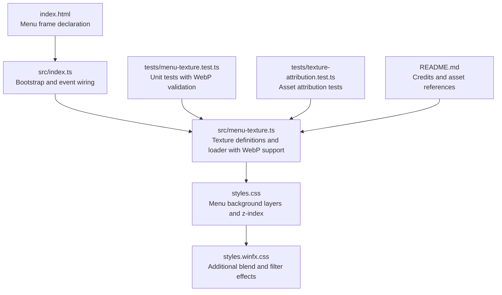
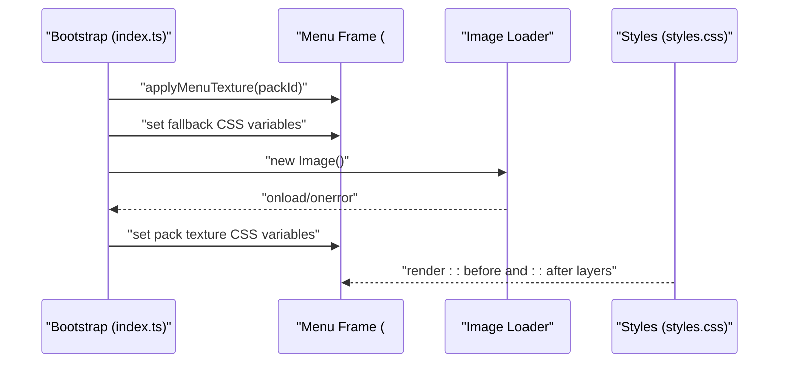
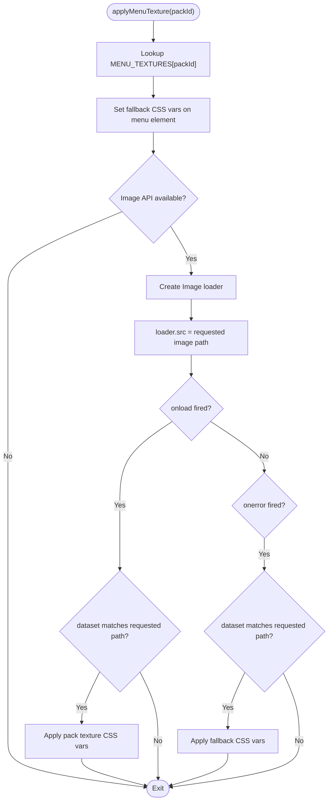
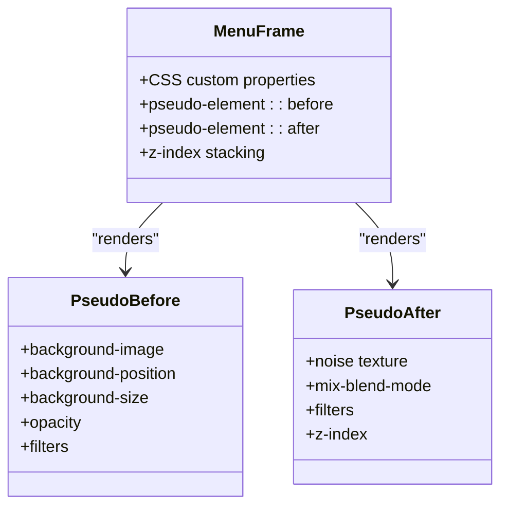
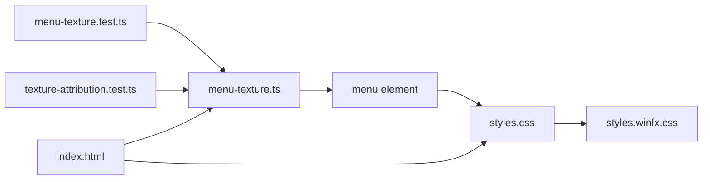

# Menu Texture Overlay System

<cite>
**Referenced Files in This Document**
- [menu-texture.ts](file://src/menu-texture.ts)
- [menu-texture.test.ts](file://tests/menu-texture.test.ts)
- [styles.css](file://styles.css)
- [styles.winfx.css](file://styles.winfx.css)
- [index.html](file://index.html)
- [index.ts](file://src/index.ts)
- [README.md](file://README.md)
- [texture-attribution.test.ts](file://tests/texture-attribution.test.ts)
</cite>

## Update Summary
**Changes Made**
- Updated texture format support documentation to include WebP alongside existing PNG support
- Added comprehensive coverage of WebP format implementation in menu texture definitions
- Enhanced format detection and validation documentation
- Updated asset management guidelines to reflect WebP format adoption
- Revised performance considerations for WebP texture optimization

## Table of Contents
1. [Introduction](#introduction)
2. [Project Structure](#project-structure)
3. [Core Components](#core-components)
4. [Architecture Overview](#architecture-overview)
5. [Detailed Component Analysis](#detailed-component-analysis)
6. [Dependency Analysis](#dependency-analysis)
7. [Performance Considerations](#performance-considerations)
8. [Troubleshooting Guide](#troubleshooting-guide)
9. [Conclusion](#conclusion)
10. [Appendices](#appendices)

## Introduction
This document describes the menu texture overlay system responsible for managing background textures and visual layering in the main menu. The system now supports both PNG and WebP formats alongside SVG, providing enhanced compression and modern web compatibility. It explains the texture loading mechanism, overlay positioning system, responsive texture scaling, CSS-based texture effects, z-index management, and blending modes. It also provides practical examples of customization, theme integration patterns, performance optimization strategies, and guidelines for texture asset management and cross-device scaling.

## Project Structure
The menu texture overlay system spans several modules:
- JavaScript module that defines supported textures, applies them to the menu frame, and manages asynchronous loading with WebP format support.
- Stylesheet that defines the layered background using CSS custom properties and pseudo-elements.
- Test suite validating behavior and asset presence across multiple image formats.
- HTML entry that declares the menu frame and associated DOM structure.
- Application bootstrap that orchestrates texture application and easter egg interactions.

**Diagram sources**
- [index.html:27-38](file://index.html#L27-L38)
- [index.ts:500-520](file://src/index.ts#L500-L520)
- [menu-texture.ts:10-71](file://src/menu-texture.ts#L10-L71)
- [styles.css:707-752](file://styles.css#L707-L752)
- [styles.winfx.css:489-545](file://styles.winfx.css#L489-L545)
- [menu-texture.test.ts:61-85](file://tests/menu-texture.test.ts#L61-L85)
- [texture-attribution.test.ts:6-14](file://tests/texture-attribution.test.ts#L6-L14)
- [README.md:222-225](file://README.md#L222-L225)

**Section sources**
- [index.html:27-38](file://index.html#L27-L38)
- [index.ts:500-520](file://src/index.ts#L500-L520)
- [menu-texture.ts:10-71](file://src/menu-texture.ts#L10-L71)
- [styles.css:707-752](file://styles.css#L707-L752)
- [styles.winfx.css:489-545](file://styles.winfx.css#L489-L545)
- [menu-texture.test.ts:61-85](file://tests/menu-texture.test.ts#L61-L85)
- [texture-attribution.test.ts:6-14](file://tests/texture-attribution.test.ts#L6-L14)
- [README.md:222-225](file://README.md#L222-L225)

## Core Components
- **Enhanced texture definitions and loader**: Defines supported extensions including WebP, PNG, SVG, JPG, and JPEG formats, with default fallback and emoji-pack-specific textures. Applies CSS custom properties to the menu element and handles asynchronous image loading with fallback on error.
- **Menu frame and layered backgrounds**: Uses CSS custom properties and pseudo-elements to render a textured background with blending and opacity controls.
- **Integration points**: Bootstrap wires texture application on menu display and responds to easter egg interactions.

Key responsibilities:
- Texture loading and switching with stable fallbacks across multiple image formats.
- CSS-driven overlay positioning and sizing.
- Z-index stacking for layered visuals.
- Blend modes and filters for artistic effects.

**Section sources**
- [menu-texture.ts:10-71](file://src/menu-texture.ts#L10-L71)
- [menu-texture.ts:73-130](file://src/menu-texture.ts#L73-L130)
- [styles.css:707-752](file://styles.css#L707-L752)
- [styles.winfx.css:489-545](file://styles.winfx.css#L489-L545)

## Architecture Overview
The system uses a two-layer background approach with enhanced format support:
- **Base layer**: A pseudo-element renders the primary menu texture with configurable size and position, supporting WebP, PNG, SVG, JPG, and JPEG formats.
- **Overlay layer**: An additional pseudo-element adds a subtle noise and soft-light blend for atmospheric effect.

The JavaScript component sets CSS custom properties on the menu frame element, enabling dynamic switching between emoji-pack textures while maintaining a stable fallback during transitions. The loader now validates and supports multiple image formats for optimal performance and compatibility.

**Diagram sources**
- [index.ts:500-520](file://src/index.ts#L500-L520)
- [menu-texture.ts:94-130](file://src/menu-texture.ts#L94-L130)
- [styles.css:722-747](file://styles.css#L722-L747)

## Detailed Component Analysis

### Enhanced Texture Loading and Format Support
The loader now supports multiple image formats:
- **Validated supported extensions**: WebP, PNG, SVG, JPG, and JPEG formats are recognized and validated.
- **Format-specific texture definitions**: All emoji-pack textures use WebP format for optimal compression and modern browser support.
- **Default fallback**: The default texture uses WebP format with stable fallback handling.
- **Asynchronous loading**: Creates an Image instance to asynchronously load the requested texture with comprehensive error handling.
- **Race condition prevention**: Prevents race conditions by checking a dataset guard before applying results.

**Diagram sources**
- [menu-texture.ts:94-130](file://src/menu-texture.ts#L94-L130)

**Section sources**
- [menu-texture.ts:22-28](file://src/menu-texture.ts#L22-L28)
- [menu-texture.ts:73-86](file://src/menu-texture.ts#L73-L86)
- [menu-texture.ts:94-130](file://src/menu-texture.ts#L94-L130)
- [menu-texture.test.ts:87-176](file://tests/menu-texture.test.ts#L87-L176)

### Overlay Positioning and Responsive Scaling
The menu frame uses CSS custom properties to control:
- **Background image URL**: Dynamically set from CSS variables for different image formats.
- **Background size**: Configurable size (e.g., cover) for optimal texture scaling.
- **Background position**: Center positioning for balanced visual composition.

These properties are set dynamically by the loader and consumed by pseudo-elements to render the background layer. The menu container itself maintains a relative position and z-index stacking to ensure foreground content appears above the background.

**Diagram sources**
- [styles.css:707-752](file://styles.css#L707-L752)
- [styles.css:722-747](file://styles.css#L722-L747)

**Section sources**
- [styles.css:707-752](file://styles.css#L707-L752)
- [styles.css:722-747](file://styles.css#L722-L747)

### CSS-Based Effects, Z-Index, and Blending Modes
The menu background employs:
- **Primary background layer**: Pseudo-element ::before with configurable size and position, supporting multiple image formats.
- **Overlay layer**: Pseudo-element ::after featuring a noise texture, soft-light blend, and subtle filters.
- **Foreground content**: Placed with higher z-index to ensure readability.

Blend modes and filters:
- **Soft-light blend mode**: Creates a subtle atmospheric effect on the overlay layer.
- **Filters**: Blur and contrast enhance the visual texture without impacting readability.

Z-index management:
- **Stacking context**: The menu frame establishes a stacking context.
- **Layer ordering**: The overlay pseudo-element uses a lower z-index than the foreground content.
- **Background layer**: Acts as the background layer beneath the overlay.

**Section sources**
- [styles.css:722-747](file://styles.css#L722-L747)
- [styles.winfx.css:489-545](file://styles.winfx.css#L489-L545)

### Theme Integration Patterns
The system integrates with themes through:
- **CSS custom properties**: For background images and sizing across multiple formats.
- **Tailwind and DaisyUI utilities**: For consistent UI styling around the menu.
- **Emoji pack selection**: Drives texture choice, ensuring thematic alignment with icon sets.

Integration points:
- **Bootstrap application**: Applies the selected emoji pack's texture when displaying the menu.
- **Easter egg interaction**: Forces the default texture, providing a thematic surprise.

**Section sources**
- [index.ts:500-520](file://src/index.ts#L500-L520)
- [index.ts:1015-1021](file://src/index.ts#L1015-L1021)
- [menu-texture.ts:30-71](file://src/menu-texture.ts#L30-L71)

### Practical Examples
- **Applying specific emoji pack textures**: Using WebP format for optimal performance.
- **Fallback handling**: Reverting to default texture when requested texture fails to load.
- **Immediate fallback via easter egg**: Forcing default texture application.

Validation:
- **Format support testing**: Confirms loader recognizes and validates WebP, PNG, SVG, JPG, and JPEG formats.
- **Asset presence verification**: Tests confirm all menu textures exist and are properly formatted.
- **Attribution compliance**: Asset attribution tests verify proper credit recognition.

**Section sources**
- [menu-texture.test.ts:87-176](file://tests/menu-texture.test.ts#L87-L176)
- [texture-attribution.test.ts:6-14](file://tests/texture-attribution.test.ts#L6-L14)
- [README.md:222-225](file://README.md#L222-L225)

## Dependency Analysis
The menu texture overlay system exhibits low coupling and clear separation of concerns:
- **JavaScript loader**: Depends on DOM APIs, CSS custom properties, and multiple image format support.
- **Styles**: Define visual layering and effects independently of JavaScript.
- **Tests**: Validate behavior and asset presence across multiple image formats without external resources.

**Diagram sources**
- [menu-texture.ts:73-130](file://src/menu-texture.ts#L73-L130)
- [styles.css:707-752](file://styles.css#L707-L752)
- [styles.winfx.css:489-545](file://styles.winfx.css#L489-L545)
- [menu-texture.test.ts:61-85](file://tests/menu-texture.test.ts#L61-L85)
- [texture-attribution.test.ts:6-14](file://tests/texture-attribution.test.ts#L6-L14)
- [index.html:27-38](file://index.html#L27-L38)

**Section sources**
- [menu-texture.ts:73-130](file://src/menu-texture.ts#L73-L130)
- [styles.css:707-752](file://styles.css#L707-L752)
- [styles.winfx.css:489-545](file://styles.winfx.css#L489-L545)
- [menu-texture.test.ts:61-85](file://tests/menu-texture.test.ts#L61-L85)
- [texture-attribution.test.ts:6-14](file://tests/texture-attribution.test.ts#L6-L14)
- [index.html:27-38](file://index.html#L27-L38)

## Performance Considerations
- **Asynchronous texture loading**: The loader defers to the Image API and applies the texture only after load, preventing blocking and ensuring immediate fallback stability.
- **Stable fallbacks**: The system always shows a fallback texture while the requested texture loads, minimizing perceived latency.
- **CSS-driven rendering**: Backgrounds are rendered via CSS pseudo-elements, avoiding heavy DOM manipulation and leveraging GPU-accelerated compositing.
- **Blend and filter costs**: The overlay uses soft-light blend and subtle filters; keep filter intensity moderate to balance visual appeal and performance.
- **Cross-device scaling**: The menu frame relies on CSS custom properties for background sizing and positioning, allowing consistent scaling across devices without JavaScript calculations.
- **WebP optimization**: WebP format provides superior compression ratios compared to PNG, reducing bundle size while maintaining quality.
- **Format detection efficiency**: Enhanced format detection prevents unnecessary loading attempts for unsupported formats.

## Troubleshooting Guide
Common issues and resolutions:
- **Texture not updating**: Verify that the loader sets the correct CSS variables and that the dataset guard prevents stale results.
- **Fallback not applied on error**: Confirm that the loader's error handler sets the default texture and that the dataset guard matches the requested path.
- **Missing assets**: Ensure that menu textures exist and are referenced correctly; tests validate asset presence and supported extensions across multiple formats.
- **Blend artifacts**: Adjust opacity and filter settings on the overlay layer to prevent over-blending with foreground content.
- **WebP format issues**: Verify that WebP files are properly formatted and accessible; check browser compatibility for WebP support.
- **Format validation failures**: Ensure texture paths include proper file extensions (.webp, .png, .svg, .jpg, .jpeg).

**Section sources**
- [menu-texture.test.ts:87-176](file://tests/menu-texture.test.ts#L87-L176)
- [menu-texture.ts:113-127](file://src/menu-texture.ts#L113-L127)
- [styles.css:722-747](file://styles.css#L722-L747)

## Conclusion
The menu texture overlay system provides a robust, CSS-driven solution for background texture management and visual layering. With the addition of WebP format support, it now offers enhanced compression and modern web compatibility while balancing performance with visual polish through asynchronous loading, stable fallbacks, and carefully layered pseudo-elements with blend modes and filters. The system integrates cleanly with the application bootstrap and supports theme-based customization via emoji pack selection across multiple image formats.

## Appendices

### Enhanced Texture Asset Management Guidelines
- **Naming convention**: Use consistent naming for menu textures aligned with emoji pack IDs across all supported formats.
- **Supported formats**: Prefer WebP for optimal compression, with fallback to PNG for maximum compatibility; validate extensions in the loader.
- **Format selection strategy**: Use WebP for modern browsers, PNG for broad compatibility, and SVG for scalable vector graphics.
- **Attribution maintenance**: Maintain credits for artwork and inspirations as demonstrated by the attribution tests and README.
- **Optimization practices**: Compress WebP textures for reduced bundle size while maintaining visual quality; consider PNG for lossless requirements.

**Section sources**
- [menu-texture.ts:3-8](file://src/menu-texture.ts#L3-L8)
- [menu-texture.test.ts:68-84](file://tests/menu-texture.test.ts#L68-L84)
- [texture-attribution.test.ts:6-14](file://tests/texture-attribution.test.ts#L6-L14)
- [README.md:222-225](file://README.md#L222-L225)

### Cross-Device Scaling Strategies
- **CSS custom properties**: Use CSS variables for background sizing and positioning to adapt to various viewport sizes across all supported formats.
- **Relative units**: Combine viewport-relative units with CSS custom properties for scalable layouts regardless of image format.
- **Layered backgrounds**: Keep the background layer separate from foreground content to ensure readability across devices and formats.
- **Format-specific optimization**: Consider aspect ratio and resolution requirements for different image formats when scaling.

**Section sources**
- [styles.css:707-752](file://styles.css#L707-L752)
- [styles.winfx.css:489-545](file://styles.winfx.css#L489-L545)

### WebP Format Implementation Details
- **Format support**: WebP format is fully supported alongside PNG, SVG, JPG, and JPEG formats.
- **File naming convention**: All menu textures use `.webp` extension for consistency.
- **Browser compatibility**: WebP format provides superior compression while maintaining broad browser support.
- **Performance benefits**: WebP files typically offer 25-35% smaller file sizes compared to PNG equivalents.
- **Quality preservation**: WebP maintains visual quality while significantly reducing bandwidth usage.

**Section sources**
- [menu-texture.ts:3-8](file://src/menu-texture.ts#L3-L8)
- [menu-texture.ts:17-21](file://src/menu-texture.ts#L17-L21)
- [menu-texture.ts:31-72](file://src/menu-texture.ts#L31-L72)
- [menu-texture.test.ts:78-85](file://tests/menu-texture.test.ts#L78-L85)