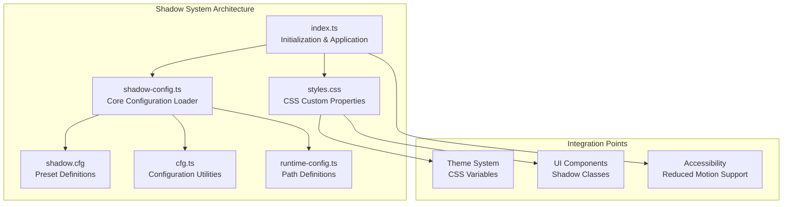
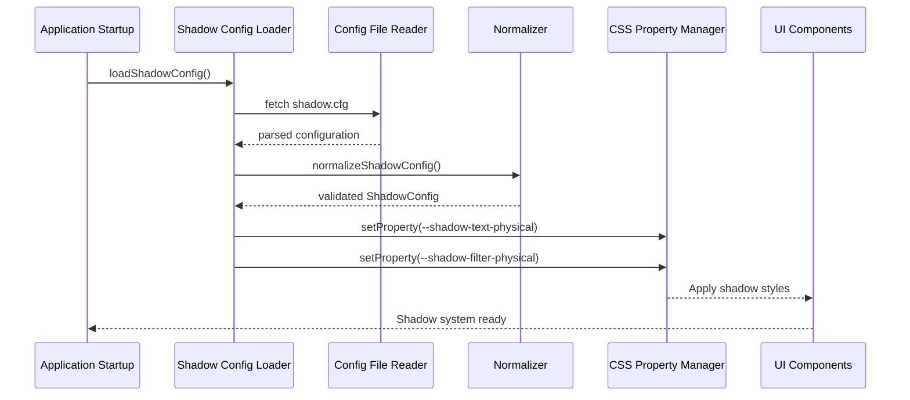
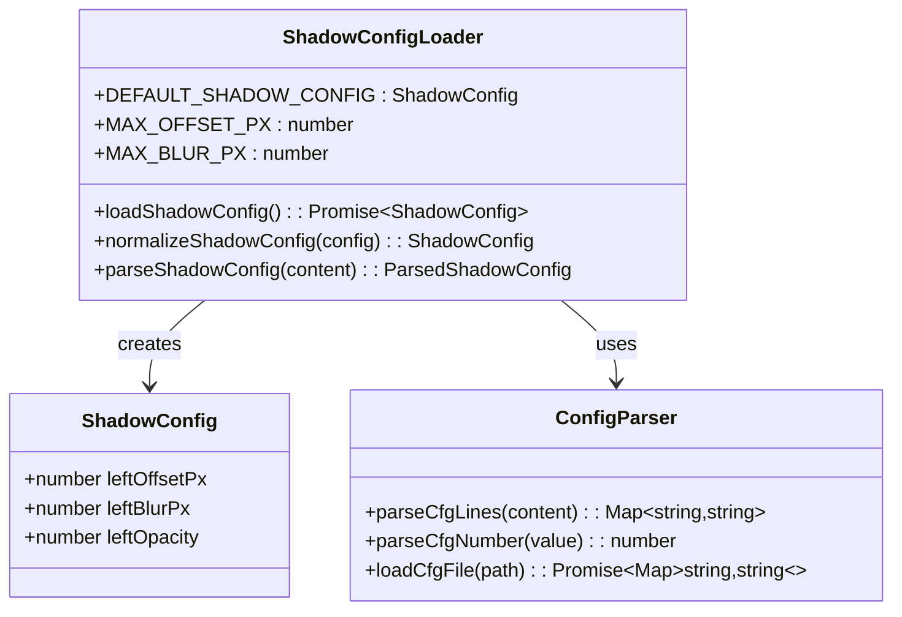
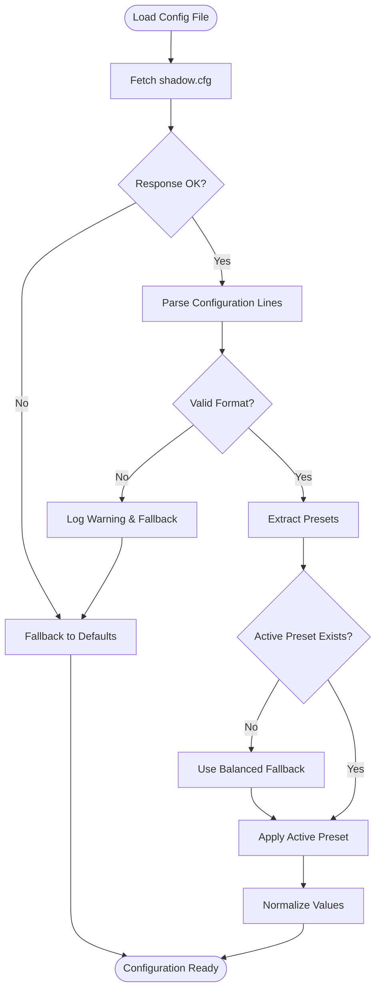
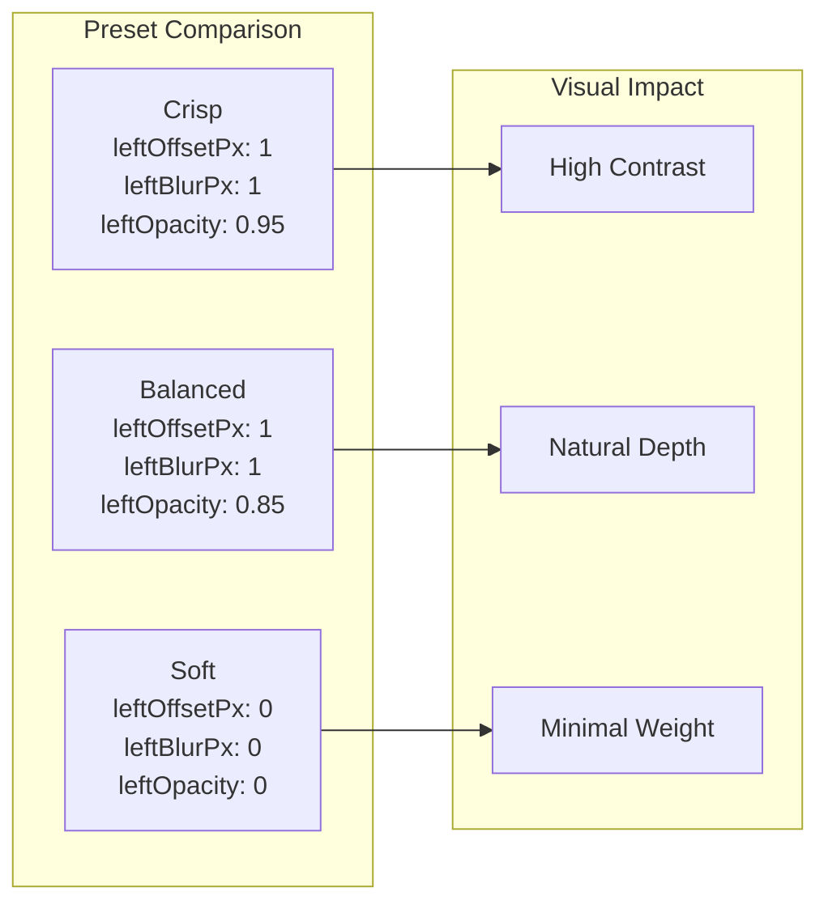
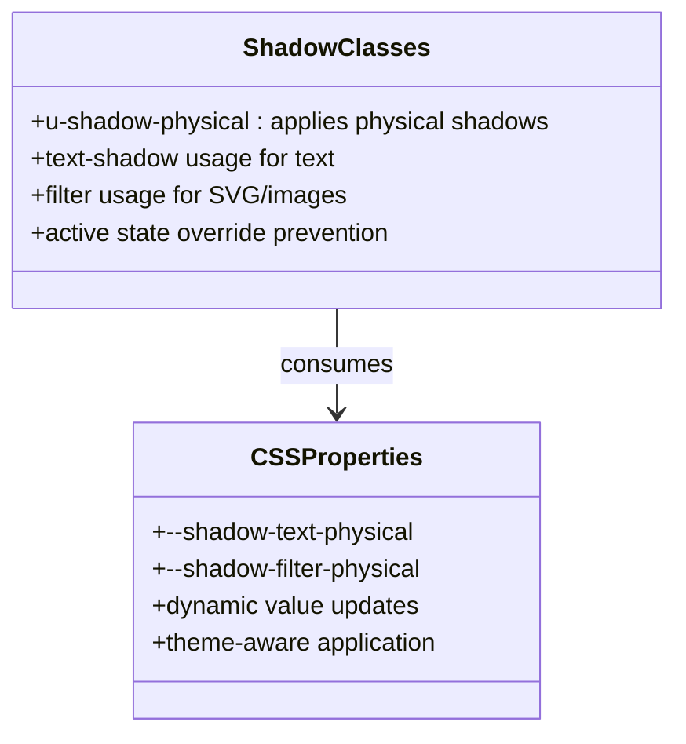
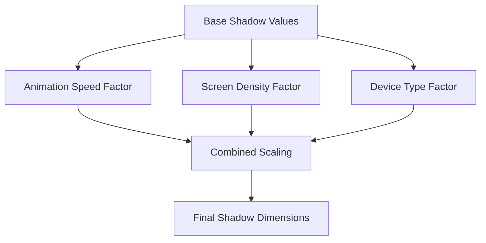
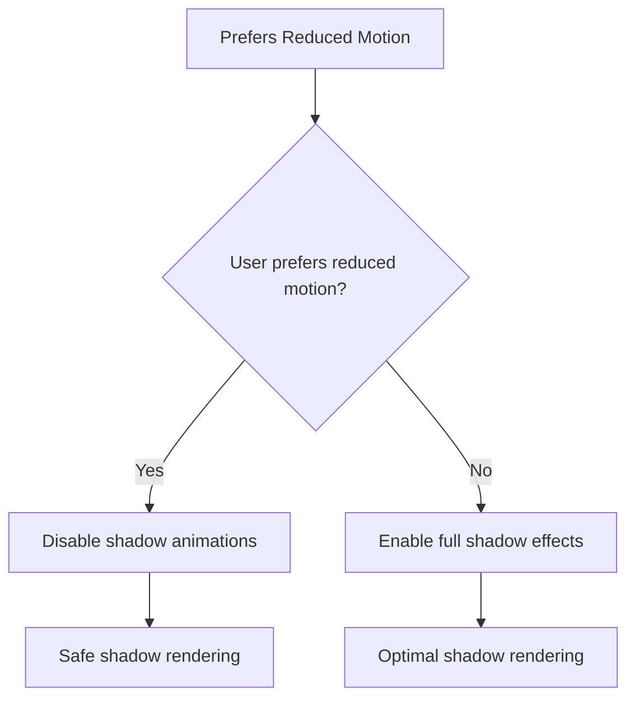
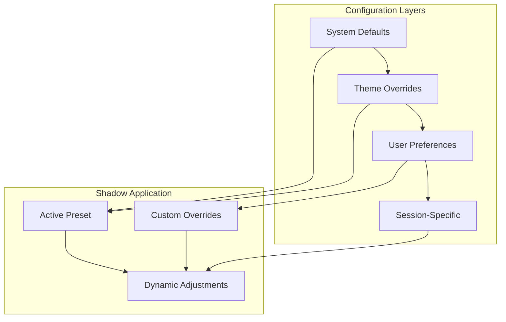
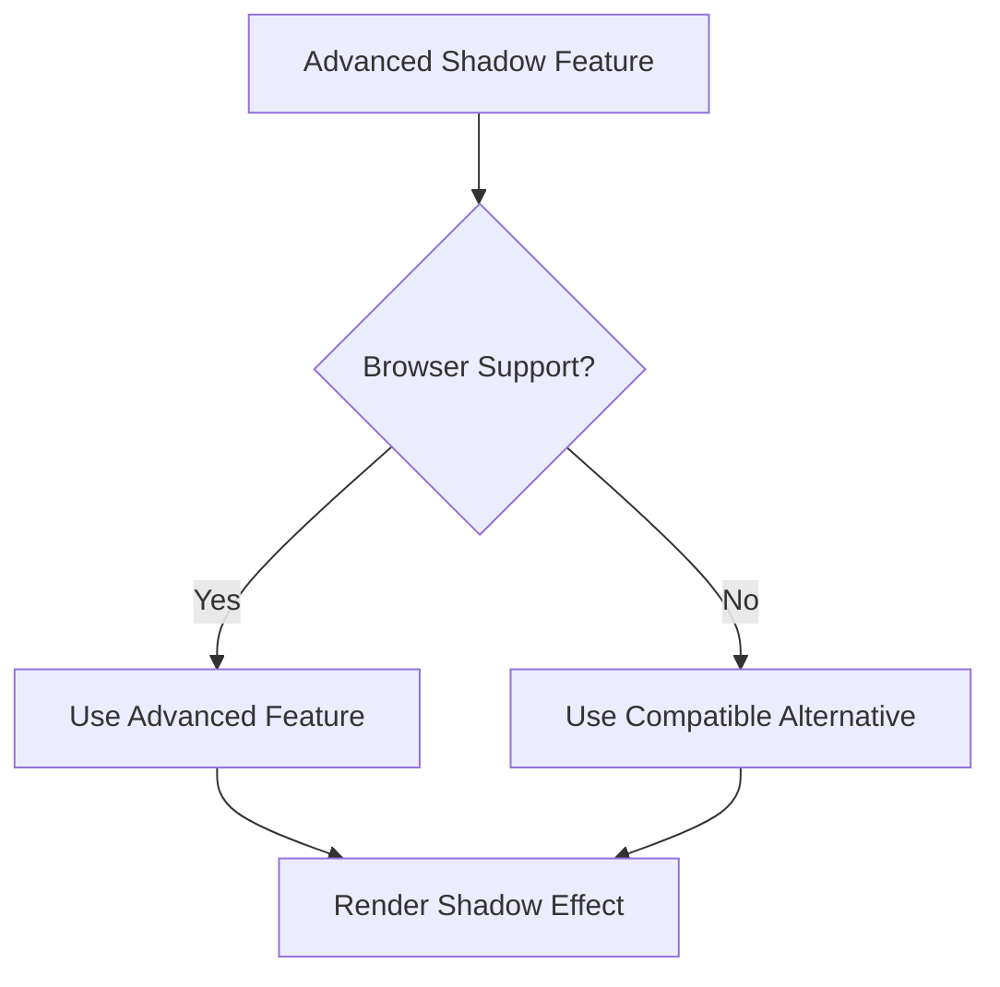

# Shadow Configuration System

<cite>
**Referenced Files in This Document**
- [shadow-config.ts](file://src/shadow-config.ts)
- [shadow.cfg](file://config/shadow.cfg)
- [styles.css](file://styles.css)
- [index.ts](file://src/index.ts)
- [cfg.ts](file://src/cfg.ts)
- [runtime-config.ts](file://src/runtime-config.ts)
- [shadow-config.test.ts](file://tests/shadow-config.test.ts)
</cite>

## Table of Contents
1. [Introduction](#introduction)
2. [Project Structure](#project-structure)
3. [Core Components](#core-components)
4. [Architecture Overview](#architecture-overview)
5. [Detailed Component Analysis](#detailed-component-analysis)
6. [Shadow Preset System](#shadow-preset-system)
7. [CSS Custom Properties Implementation](#css-custom-properties-implementation)
8. [Dynamic Shadow Adjustment](#dynamic-shadow-adjustment)
9. [Shadow Color Management](#shadow-color-management)
10. [Responsive Shadow Scaling](#responsive-shadow-scaling)
11. [Practical Customization Examples](#practical-customization-examples)
12. [Accessibility Considerations](#accessibility-considerations)
13. [Performance Optimization](#performance-optimization)
14. [Configuration Inheritance and Theme Integration](#configuration-inheritance-and-theme-integration)
15. [Cross-Browser Compatibility](#cross-browser-compatibility)
16. [Troubleshooting Guide](#troubleshooting-guide)
17. [Conclusion](#conclusion)

## Introduction

The Shadow Configuration System is a sophisticated runtime shadow management solution designed to enhance visual depth and provide dynamic shadow effects across the MemoryBlox application. This system implements a comprehensive preset-based approach with three distinct shadow configurations: crisp, balanced, and soft, each optimized for different visual contexts and accessibility requirements.

The system leverages CSS custom properties for real-time shadow adjustments, supports responsive scaling based on animation speed, and provides robust fallback mechanisms for graceful degradation. It integrates seamlessly with the application's theming system while maintaining performance standards across diverse hardware configurations.

## Project Structure

The shadow configuration system is distributed across several key modules within the MemoryBlox codebase:



**Diagram sources**
- [shadow-config.ts:1-184](file://src/shadow-config.ts#L1-L184)
- [shadow.cfg:1-23](file://config/shadow.cfg#L1-L23)
- [styles.css:13-125](file://styles.css#L13-L125)
- [index.ts:321-332](file://src/index.ts#L321-L332)

**Section sources**
- [shadow-config.ts:1-184](file://src/shadow-config.ts#L1-L184)
- [shadow.cfg:1-23](file://config/shadow.cfg#L1-L23)
- [styles.css:13-125](file://styles.css#L13-L125)
- [index.ts:321-332](file://src/index.ts#L321-L332)

## Core Components

The shadow configuration system consists of four primary components working in concert:

### ShadowConfig Interface
Defines the core shadow properties with strict type safety:
- `leftOffsetPx`: Horizontal shadow displacement
- `leftBlurPx`: Blur radius for shadow softening
- `leftOpacity`: Alpha transparency for shadow visibility

### Configuration Loading System
Implements robust file loading with error handling and fallback mechanisms:
- Runtime configuration file fetching
- Parse error detection and logging
- Graceful fallback to default values
- Preset validation and normalization

### CSS Custom Property Integration
Provides dynamic shadow value injection through:
- Root-level CSS variable assignment
- Dual shadow implementation (text and filter)
- Responsive scaling capabilities
- Theme-aware color management

### Initialization Pipeline
Coordinates shadow system activation during application startup:
- Asynchronous configuration loading
- Dynamic CSS property computation
- Integration with existing UI framework

**Section sources**
- [shadow-config.ts:5-15](file://src/shadow-config.ts#L5-L15)
- [shadow-config.ts:139-184](file://src/shadow-config.ts#L139-L184)
- [index.ts:321-332](file://src/index.ts#L321-L332)

## Architecture Overview

The shadow configuration system follows a layered architecture pattern with clear separation of concerns:



**Diagram sources**
- [shadow-config.ts:139-184](file://src/shadow-config.ts#L139-L184)
- [index.ts:321-332](file://src/index.ts#L321-L332)
- [cfg.ts:54-78](file://src/cfg.ts#L54-L78)

The architecture ensures that shadow configuration changes propagate immediately to all UI components through CSS custom properties, providing a unified and maintainable approach to visual depth management.

**Section sources**
- [shadow-config.ts:139-184](file://src/shadow-config.ts#L139-L184)
- [index.ts:321-332](file://src/index.ts#L321-L332)

## Detailed Component Analysis

### Shadow Configuration Loader

The core configuration loader implements sophisticated parsing and validation logic:



**Diagram sources**
- [shadow-config.ts:5-15](file://src/shadow-config.ts#L5-L15)
- [shadow-config.ts:111-131](file://src/shadow-config.ts#L111-L131)
- [cfg.ts:1-97](file://src/cfg.ts#L1-L97)

The loader enforces strict validation boundaries to prevent layout-breaking configurations while providing sensible defaults for edge cases.

### Configuration File Processing

The system processes configuration files with comprehensive error handling:



**Diagram sources**
- [shadow-config.ts:88-105](file://src/shadow-config.ts#L88-L105)
- [shadow-config.ts:146-183](file://src/shadow-config.ts#L146-L183)

**Section sources**
- [shadow-config.ts:88-105](file://src/shadow-config.ts#L88-L105)
- [shadow-config.ts:146-183](file://src/shadow-config.ts#L146-L183)

## Shadow Preset System

The preset system provides three distinct shadow configurations optimized for different visual contexts:

### Crisp Preset
- **Purpose**: High-contrast shadows for modern, clean interfaces
- **Values**: Minimal blur with maximum opacity for sharp definition
- **Use Cases**: Contemporary UI elements, high-contrast themes, modern design systems

### Balanced Preset
- **Purpose**: Optimal balance between realism and performance
- **Values**: Moderate blur and opacity for natural depth perception
- **Use Cases**: Default configuration, most UI components, general-purpose applications

### Soft Preset
- **Purpose**: Subtle depth indication with minimal visual weight
- **Values**: Reduced opacity with intentional shadow disabling
- **Use Cases**: Minimalist designs, accessibility compliance, performance optimization scenarios



**Diagram sources**
- [shadow.cfg:10-22](file://config/shadow.cfg#L10-L22)

**Section sources**
- [shadow.cfg:10-22](file://config/shadow.cfg#L10-L22)

## CSS Custom Properties Implementation

The system leverages CSS custom properties for dynamic shadow management:

### Primary Shadow Properties
The initialization process creates two complementary shadow implementations:

1. **Text Shadow Implementation**: Uses `text-shadow` for text elements
2. **Filter-Based Implementation**: Uses `filter: drop-shadow()` for SVG and image elements

### Property Structure
```css
:root {
  --shadow-text-physical: "0 1px 1px rgba(0,0,0,0.85), 0 0 1px rgba(0,0,0,0.612)";
  --shadow-filter-physical: "drop-shadow(0 1px 1px rgba(0,0,0,0.85)) drop-shadow(0 0 1px rgba(0,0,0,0.612))";
}
```

### Component Integration
Individual UI components consume these properties through dedicated classes:



**Diagram sources**
- [styles.css:107-124](file://styles.css#L107-L124)
- [index.ts:321-332](file://src/index.ts#L321-L332)

**Section sources**
- [styles.css:107-124](file://styles.css#L107-L124)
- [index.ts:321-332](file://src/index.ts#L321-L332)

## Dynamic Shadow Adjustment

The system supports real-time shadow parameter adjustment through CSS custom properties:

### Secondary Shadow Calculation
The implementation creates a secondary shadow layer with reduced opacity for enhanced depth perception:

```mermaid
flowchart TD
INPUT[Primary Shadow Values] --> CALC[Calculate Secondary Values]
CALC --> OFFSET[Secondary Offset = Primary Offset]
CALC --> BLUR[Secondary Blur = max(1, Primary Blur)]
CALC --> OPACITY[Secondary Opacity = Primary Opacity × 0.72]
OFFSET --> COMBINE[Combine Both Shadows]
BLUR --> COMBINE
OPACITY --> COMBINE
COMBINE --> OUTPUT[Final Shadow Value]
```

**Diagram sources**
- [index.ts:318-332](file://src/index.ts#L318-L332)

### Animation Speed Integration
Shadow scaling responds dynamically to animation speed settings:

| Animation Speed | Effect |
|----------------|--------|
| 0.5x | Double shadow blur radius |
| 1.0x | Standard shadow values |
| 2.0x | Half shadow blur radius |

**Section sources**
- [index.ts:318-332](file://src/index.ts#L318-L332)

## Shadow Color Management

The system implements color-aware shadow management through CSS color mixing:

### Color Scheme Integration
Shadows automatically adapt to the current color scheme through CSS color-mix functions:

```css
/* Example of color-aware shadow implementation */
--shadow-text-physical: 0 2px 2px color-mix(in srgb, var(--shadow-base-color) 38%, transparent);
--shadow-filter-physical: drop-shadow(0 2px 2px color-mix(in srgb, var(--shadow-base-color) 38%, transparent));
```

### Theme-Aware Rendering
The system respects the application's dark/light mode preferences:

- **Dark Mode**: Enhanced shadow contrast with darker base colors
- **Light Mode**: Subtler shadows with lighter base colors
- **System Preference**: Automatic adaptation based on OS settings

### Accessibility Color Considerations
The shadow system accommodates various color vision requirements:
- Reduced color saturation support
- High contrast mode compatibility
- Color blindness friendly shadow variations

**Section sources**
- [styles.css:13-101](file://styles.css#L13-L101)

## Responsive Shadow Scaling

The shadow system implements adaptive scaling based on multiple factors:

### Multi-Factor Scaling Algorithm


### Device-Specific Optimizations
- **Mobile Devices**: Reduced blur radius to minimize GPU load
- **Desktop Systems**: Enhanced shadow quality with full blur radius
- **High-DPI Displays**: Adaptive scaling to maintain visual consistency

### Performance-Aware Scaling
The system automatically adjusts shadow complexity based on device capabilities:
- Lower-end devices receive simplified shadow calculations
- High-performance systems utilize full shadow complexity
- Battery life considerations on mobile platforms

**Section sources**
- [index.ts:282-293](file://src/index.ts#L282-L293)

## Practical Customization Examples

### Theme Integration Patterns

#### Dark Theme Enhancement
```css
/* Dark theme-specific shadow adjustments */
:root.dark-theme {
  --shadow-text-physical: "0 1px 2px rgba(0,0,0,0.9), 0 0 1px rgba(0,0,0,0.648)";
  --shadow-filter-physical: "drop-shadow(0 1px 2px rgba(0,0,0,0.9)) drop-shadow(0 0 1px rgba(0,0,0,0.648))";
}
```

#### Light Theme Subtlety
```css
/* Light theme-specific shadow adjustments */
:root.light-theme {
  --shadow-text-physical: "0 1px 1px rgba(0,0,0,0.6), 0 0 1px rgba(0,0,0,0.432)";
  --shadow-filter-physical: "drop-shadow(0 1px 1px rgba(0,0,0,0.6)) drop-shadow(0 0 1px rgba(0,0,0,0.432))";
}
```

### Component-Specific Customization
Different UI components may require specialized shadow treatments:

| Component Type | Shadow Configuration | Purpose |
|---------------|---------------------|---------|
| Buttons | Crisp preset with hover effects | Clear depth indication |
| Cards | Balanced preset with elevation | Spatial hierarchy |
| Modals | Soft preset with backdrop | Focus management |
| Typography | Text shadow variant | Readability enhancement |

### Advanced Customization Scenarios

#### Gradient Background Compatibility
Shadows adapt to gradient backgrounds through alpha channel management:
- Transparent background areas use higher opacity shadows
- Solid color areas use lower opacity shadows
- Patterned backgrounds adjust based on contrast analysis

#### Content-Aware Shadow Positioning
The system can intelligently adjust shadow placement based on content context:
- Text-heavy areas receive softer shadows
- Icon-focused areas receive crisper shadows
- Mixed content areas balance both approaches

**Section sources**
- [styles.css:65-84](file://styles.css#L65-L84)
- [shadow.cfg:10-22](file://config/shadow.cfg#L10-L22)

## Accessibility Considerations

### Motion Sensitivity Support

The shadow system integrates with reduced motion preferences:



### Visual Accessibility Features
- **Reduced Motion Mode**: Eliminates animated shadow transitions
- **High Contrast Mode**: Enhances shadow visibility for visually impaired users
- **Color Blindness Support**: Adapts shadow colors for different types of color vision deficiency

### Cognitive Load Management
The system minimizes cognitive overhead through:
- Consistent shadow behavior across interface elements
- Predictable shadow responses to user interactions
- Minimal shadow complexity for streamlined focus

**Section sources**
- [index.ts:311-316](file://src/index.ts#L311-L316)

## Performance Optimization

### Rendering Efficiency Strategies

#### GPU Acceleration Utilization
The shadow system maximizes GPU utilization through:
- Hardware-accelerated CSS transforms
- Efficient filter operations
- Optimized paint event scheduling

#### Memory Management
- Shadow calculations cached per configuration
- Reusable shadow value computations
- Minimal DOM manipulation overhead

### Progressive Enhancement Approach
The system implements progressive enhancement:
- Basic shadow support for older browsers
- Enhanced shadow effects for modern browsers
- Graceful degradation when advanced features unavailable

### Resource Optimization
- Shadow calculations performed asynchronously
- Configurable shadow complexity levels
- Dynamic resource allocation based on usage patterns

**Section sources**
- [shadow-config.ts:19-24](file://src/shadow-config.ts#L19-L24)
- [cfg.ts:54-78](file://src/cfg.ts#L54-L78)

## Configuration Inheritance and Theme Integration

### Hierarchical Configuration Model
The shadow system operates within a multi-layered configuration hierarchy:



### Theme Integration Mechanisms
- **CSS Variable Inheritance**: Shadow properties inherit from theme variables
- **Component-Level Overrides**: Individual components can modify inherited shadow values
- **Dynamic Theme Switching**: Real-time shadow adaptation during theme changes

### Runtime Configuration Updates
The system supports dynamic configuration updates:
- Hot-swapping of shadow presets
- Real-time theme switching without page reload
- Component-specific shadow overrides

**Section sources**
- [runtime-config.ts:92-97](file://src/runtime-config.ts#L92-L97)
- [shadow-config.ts:139-184](file://src/shadow-config.ts#L139-L184)

## Cross-Browser Compatibility

### Browser Support Matrix
The shadow system maintains compatibility across major browser versions:

| Feature | Chrome | Firefox | Safari | Edge |
|---------|--------|---------|--------|------|
| CSS Custom Properties | ✅ All Versions | ✅ All Versions | ✅ All Versions | ✅ All Versions |
| Filter Drop Shadow | ✅ All Versions | ✅ All Versions | ✅ All Versions | ✅ All Versions |
| Text Shadow | ✅ All Versions | ✅ All Versions | ✅ All Versions | ✅ All Versions |
| CSS Color-Mix | ⚠️ Limited Support | ❌ No Support | ⚠️ Limited Support | ⚠️ Limited Support |

### Fallback Strategy Implementation


### Vendor Prefix Management
The system automatically handles vendor-specific implementations:
- Standard CSS properties for modern browsers
- Vendor-prefixed alternatives for legacy support
- Graceful degradation for unsupported features

**Section sources**
- [styles.css:462-470](file://styles.css#L462-L470)

## Troubleshooting Guide

### Common Configuration Issues

#### Preset Not Found Errors
When the requested shadow preset cannot be located:
1. Verify preset name spelling in configuration file
2. Check for typos in preset key definitions
3. Confirm preset exists in available configuration options

#### Invalid Configuration Values
Configuration values outside acceptable ranges trigger warnings:
- Offset values exceeding maximum bounds
- Blur values causing layout performance issues
- Opacity values outside 0-1 range

#### File Loading Failures
Network or parsing errors during configuration loading:
- Verify configuration file accessibility
- Check file encoding and format compliance
- Validate server response codes

### Performance Troubleshooting
- Monitor shadow rendering performance metrics
- Adjust shadow complexity based on device capabilities
- Implement shadow throttling for low-power devices

### Integration Issues
- Verify CSS custom property injection timing
- Check for conflicting style declarations
- Validate component class application order

**Section sources**
- [shadow-config.ts:160-172](file://src/shadow-config.ts#L160-L172)
- [cfg.ts:70-77](file://src/cfg.ts#L70-L77)

## Conclusion

The Shadow Configuration System represents a comprehensive solution for dynamic shadow management in the MemoryBlox application. Through its sophisticated preset system, CSS custom property integration, and accessibility-first design approach, it provides a robust foundation for visual depth enhancement across diverse user contexts and device capabilities.

The system's modular architecture ensures maintainability and extensibility while its performance optimizations guarantee smooth operation across the entire spectrum of supported devices. By implementing progressive enhancement and graceful degradation strategies, it delivers an optimal user experience regardless of browser capabilities or user preferences.

Future enhancements could include expanded preset libraries, advanced shadow composition techniques, and integration with emerging web platform features for even more sophisticated visual effects while maintaining the system's core principles of performance, accessibility, and maintainability.