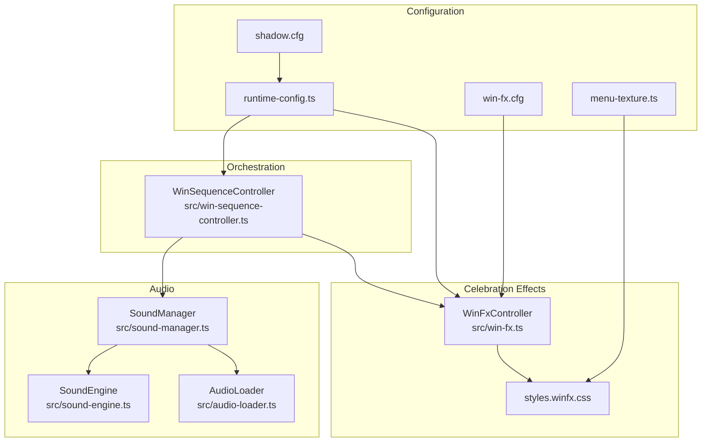
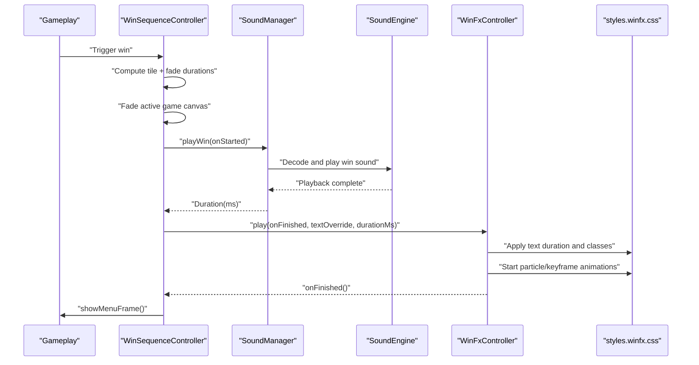
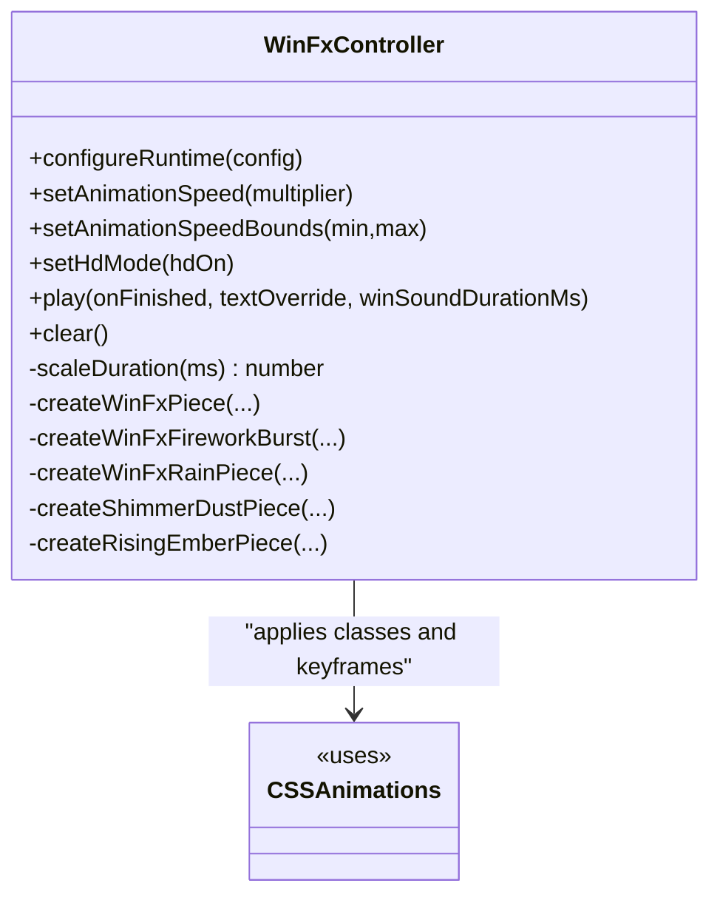
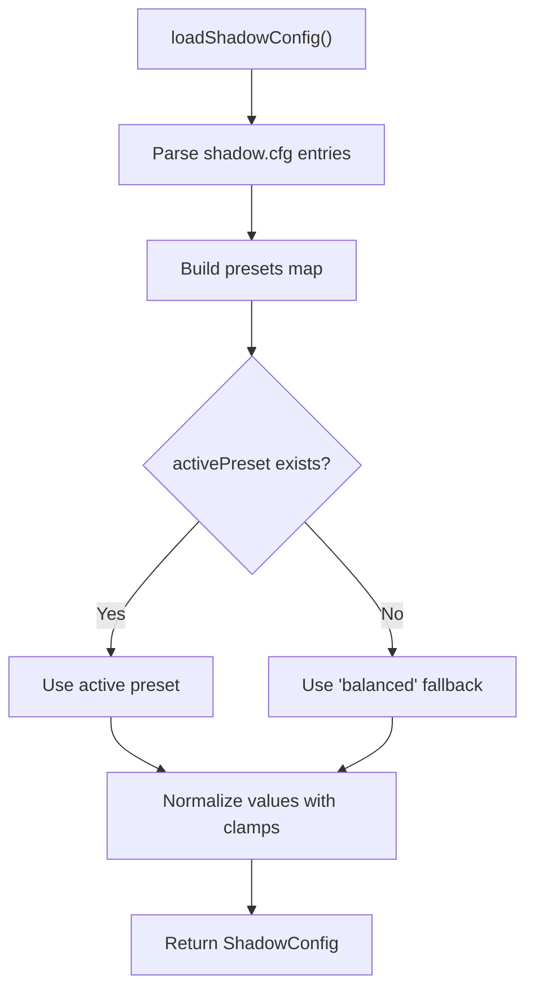
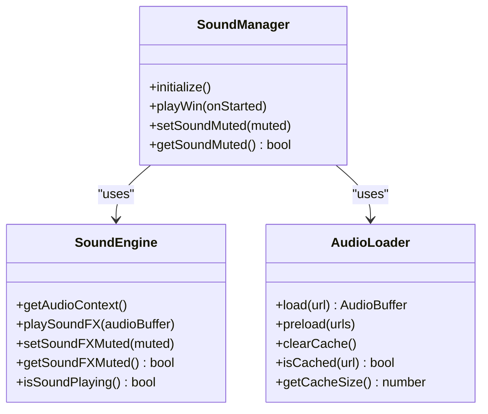
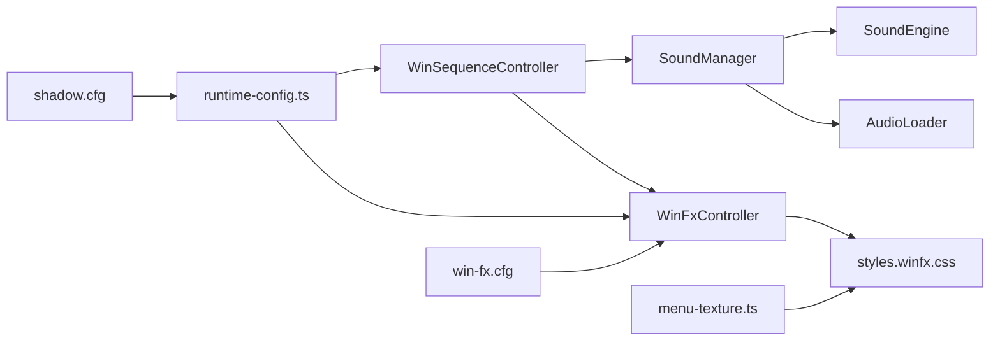

# Visual Effects System

<cite>
**Referenced Files in This Document**
- [win-sequence-controller.ts](file://src/win-sequence-controller.ts)
- [win-fx.ts](file://src/win-fx.ts)
- [shadow-config.ts](file://src/shadow-config.ts)
- [menu-texture.ts](file://src/menu-texture.ts)
- [sound-engine.ts](file://src/sound-engine.ts)
- [sound-manager.ts](file://src/sound-manager.ts)
- [audio-loader.ts](file://src/audio-loader.ts)
- [win-fx.cfg](file://config/win-fx.cfg)
- [shadow.cfg](file://config/shadow.cfg)
- [styles.winfx.css](file://styles.winfx.css)
- [runtime-config.ts](file://src/runtime-config.ts)
- [win-animation-sequence.md](file://docs/win-animation-sequence.md)
</cite>

## Table of Contents
1. [Introduction](#introduction)
2. [Project Structure](#project-structure)
3. [Core Components](#core-components)
4. [Architecture Overview](#architecture-overview)
5. [Detailed Component Analysis](#detailed-component-analysis)
6. [Dependency Analysis](#dependency-analysis)
7. [Performance Considerations](#performance-considerations)
8. [Troubleshooting Guide](#troubleshooting-guide)
9. [Conclusion](#conclusion)
10. [Appendices](#appendices)

## Introduction
This document explains the visual effects system for celebratory animations and enhancements in the game. It covers the win sequence controller orchestration, canvas fade effects, particle systems, timing coordination, shadow configuration presets, menu texture overlays, dual-layer sound engine, CSS animation integration, performance optimizations, customization examples, and accessibility support for motion-sensitive users.

## Project Structure
The visual effects system spans TypeScript controllers and managers, CSS animations, and configuration files:
- Orchestration: WinSequenceController coordinates the board fade and delegates to WinFxController for celebrations.
- Celebration effects: WinFxController generates and animates particles, overlays, and screen-level effects.
- Audio: SoundManager and SoundEngine provide Web Audio API-based playback with caching and round-robin selection.
- Configurations: Runtime configs and .cfg files tune timing, particle budgets, colors, and shadow presets.
- Styles: styles.winfx.css defines CSS animations and classes for all visual effects.



**Diagram sources**
- [win-sequence-controller.ts:21-141](file://src/win-sequence-controller.ts#L21-L141)
- [win-fx.ts:41-830](file://src/win-fx.ts#L41-L830)
- [sound-manager.ts:238-462](file://src/sound-manager.ts#L238-L462)
- [sound-engine.ts:8-110](file://src/sound-engine.ts#L8-L110)
- [audio-loader.ts:7-118](file://src/audio-loader.ts#L7-L118)
- [runtime-config.ts:238-399](file://src/runtime-config.ts#L238-L399)
- [win-fx.cfg:1-30](file://config/win-fx.cfg#L1-L30)
- [shadow.cfg:1-23](file://config/shadow.cfg#L1-L23)
- [menu-texture.ts:1-130](file://src/menu-texture.ts#L1-L130)
- [styles.winfx.css:1-865](file://styles.winfx.css#L1-L865)

**Section sources**
- [win-sequence-controller.ts:1-141](file://src/win-sequence-controller.ts#L1-L141)
- [win-fx.ts:1-830](file://src/win-fx.ts#L1-L830)
- [sound-manager.ts:1-462](file://src/sound-manager.ts#L1-L462)
- [sound-engine.ts:1-110](file://src/sound-engine.ts#L1-L110)
- [audio-loader.ts:1-118](file://src/audio-loader.ts#L1-L118)
- [runtime-config.ts:1-399](file://src/runtime-config.ts#L1-L399)
- [win-fx.cfg:1-30](file://config/win-fx.cfg#L1-L30)
- [shadow.cfg:1-23](file://config/shadow.cfg#L1-L23)
- [menu-texture.ts:1-130](file://src/menu-texture.ts#L1-L130)
- [styles.winfx.css:1-865](file://styles.winfx.css#L1-L865)

## Core Components
- WinSequenceController: Manages the handoff from gameplay to celebration, coordinating canvas fade timing with runtime-configured durations and delegating to WinFxController for particle/text effects. It supports abort/clear semantics and respects reduced-motion preferences.
- WinFxController: Generates and animates all celebratory particles and overlays. Implements a budget-aware phase scheduler, configurable colors/palettes, HD mode toggles, and animation speed scaling.
- SoundManager/SoundEngine/AudioLoader: Dual-layer audio pipeline with Web Audio API, caching, round-robin selection, and robust initialization/discovery of audio assets.
- ShadowConfig: Loads and normalizes shadow presets (crisp, balanced, soft) with safety clamps and fallback behavior.
- MenuTexture: Applies theme-specific menu textures with immediate fallback and safe image loading.
- CSS Animations: styles.winfx.css defines all keyframes and classes for text, particles, overlays, and screen-level effects.

**Section sources**
- [win-sequence-controller.ts:21-141](file://src/win-sequence-controller.ts#L21-L141)
- [win-fx.ts:41-830](file://src/win-fx.ts#L41-L830)
- [sound-manager.ts:238-462](file://src/sound-manager.ts#L238-L462)
- [sound-engine.ts:8-110](file://src/sound-engine.ts#L8-L110)
- [audio-loader.ts:7-118](file://src/audio-loader.ts#L7-L118)
- [shadow-config.ts:1-184](file://src/shadow-config.ts#L1-L184)
- [menu-texture.ts:1-130](file://src/menu-texture.ts#L1-L130)
- [styles.winfx.css:1-865](file://styles.winfx.css#L1-L865)

## Architecture Overview
The system integrates gameplay timing, audio cues, and visual effects through a coordinated sequence:
- WinSequenceController computes fade timing from runtime config, fades the active game canvas, and triggers WinFxController.
- WinFxController reads runtime config and CSS constants to schedule phases and create DOM elements with CSS animations.
- SoundManager resolves a win sound duration and invokes WinFxController with the duration to synchronize text visibility and cleanup timing.
- Screen-level effects are toggled via CSS classes on existing containers.



**Diagram sources**
- [win-sequence-controller.ts:66-118](file://src/win-sequence-controller.ts#L66-L118)
- [sound-manager.ts:421-439](file://src/sound-manager.ts#L421-L439)
- [sound-engine.ts:47-75](file://src/sound-engine.ts#L47-L75)
- [win-fx.ts:236-562](file://src/win-fx.ts#L236-L562)
- [styles.winfx.css:174-500](file://styles.winfx.css#L174-L500)

**Section sources**
- [win-sequence-controller.ts:66-118](file://src/win-sequence-controller.ts#L66-L118)
- [win-fx.ts:236-562](file://src/win-fx.ts#L236-L562)
- [sound-manager.ts:421-439](file://src/sound-manager.ts#L421-L439)
- [sound-engine.ts:47-75](file://src/sound-engine.ts#L47-L75)
- [styles.winfx.css:174-500](file://styles.winfx.css#L174-L500)

## Detailed Component Analysis

### WinSequenceController
Responsibilities:
- Compute durations from UiRuntimeConfig gameplayTiming and animation speed scaling.
- Fade the active game canvas frame (gameFrame or debugTilesFrame) based on active mode.
- Coordinate audio and visual celebrations, with abort/cancel on active game change or clear().
- Respect reduced-motion preference by adjusting matched disappear durations.

Key behaviors:
- Uses AbortController and window timeouts to manage lifecycle.
- Reads active game mode to choose the correct frame for fading.
- Integrates with SoundManager and WinFxController callbacks.

```mermaid
flowchart TD
Start([play() called]) --> ClearPrev["clear(): abort and clear timeouts/classes"]
ClearPrev --> Compute["Compute tile + fade durations"]
Compute --> WaitTile["Wait matched disappear window"]
WaitTile --> Fade["Fade active game canvas frame"]
Fade --> WaitFade["Wait fade duration"]
WaitFade --> Trigger["Trigger SoundManager.playWin()"]
Trigger --> OnStarted{"Sound started?"}
OnStarted --> |Yes| StartFx["WinFxController.play(onFinished, textOverride, durationMs)"]
OnStarted --> |No| Fallback["WinFxController.play(onFinished, textOverride, 0)"]
StartFx --> Cleanup["Cleanup on completion"]
Fallback --> Cleanup
Cleanup --> Done([Show menu frame])
```

**Diagram sources**
- [win-sequence-controller.ts:66-118](file://src/win-sequence-controller.ts#L66-L118)
- [win-sequence-controller.ts:120-139](file://src/win-sequence-controller.ts#L120-L139)

**Section sources**
- [win-sequence-controller.ts:21-141](file://src/win-sequence-controller.ts#L21-L141)

### WinFxController
Responsibilities:
- Manage a generation counter to cancel stale effects safely.
- Configure runtime options (WinFxRuntimeConfig) and HD mode.
- Scale durations by animation speed and clamp to valid ranges.
- Budget-aware phase scheduling across confetti rain, center finale, fireworks, shimmer dust, and rising embers.
- Apply screen-level effects via CSS classes and remove them on cleanup.

Particle system highlights:
- Confetti rain: falls with randomized sizes, weights, and delays.
- Center finale: alternating sparks and symbol particles radiating from center.
- Fireworks: outer sparks and inner cores with distinct animations and delays.
- Shimmer dust: small twinkling particles across the board area.
- Rising embers: warm-toned particles rising from lower half.

Screen-level effects:
- Screen flash overlay.
- Vignette overlay.
- App shake.
- Chromatic aberration.
- Particles pulse.



**Diagram sources**
- [win-fx.ts:41-830](file://src/win-fx.ts#L41-L830)
- [styles.winfx.css:174-500](file://styles.winfx.css#L174-L500)

**Section sources**
- [win-fx.ts:41-830](file://src/win-fx.ts#L41-L830)
- [win-fx.cfg:1-30](file://config/win-fx.cfg#L1-L30)
- [runtime-config.ts:84-201](file://src/runtime-config.ts#L84-L201)

### Shadow Configuration System
Responsibilities:
- Parse activePreset and preset.<name>.<setting> entries from shadow.cfg.
- Normalize values to valid ranges with clamps and fallback defaults.
- Provide a complete ShadowConfig object for downstream consumers.

Presets:
- crisp: subtle offset, blur, and high opacity.
- balanced: moderate offset, blur, and opacity.
- soft: disables shadow by setting offset/blur/opactiy to minimal values.



**Diagram sources**
- [shadow-config.ts:139-183](file://src/shadow-config.ts#L139-L183)
- [shadow.cfg:1-23](file://config/shadow.cfg#L1-L23)

**Section sources**
- [shadow-config.ts:1-184](file://src/shadow-config.ts#L1-L184)
- [shadow.cfg:1-23](file://config/shadow.cfg#L1-L23)

### Menu Texture Overlay System
Responsibilities:
- Define supported extensions and default menu texture.
- Apply theme-specific textures with immediate fallback while asynchronously loading requested images.
- Track requested image paths to prevent race conditions.

Behavior:
- Immediately set default texture properties as fallback.
- Attempt to load requested texture; on success apply; on error revert to default.
- Store dataset markers to coordinate with loader.

**Section sources**
- [menu-texture.ts:1-130](file://src/menu-texture.ts#L1-L130)

### Dual-Layer Sound Engine
Responsibilities:
- SoundManager: Discovers audio files, categorizes by type, maintains round-robin pickers, initializes AudioContext, and plays sounds with proper context resumption.
- SoundEngine: Web Audio API wrapper with gain control, one-shot playback, and mute state.
- AudioLoader: Fetches, decodes, and caches audio buffers to minimize latency and redundant work.



**Diagram sources**
- [sound-manager.ts:238-462](file://src/sound-manager.ts#L238-L462)
- [sound-engine.ts:8-110](file://src/sound-engine.ts#L8-L110)
- [audio-loader.ts:7-118](file://src/audio-loader.ts#L7-L118)

**Section sources**
- [sound-manager.ts:238-462](file://src/sound-manager.ts#L238-L462)
- [sound-engine.ts:8-110](file://src/sound-engine.ts#L8-L110)
- [audio-loader.ts:7-118](file://src/audio-loader.ts#L7-L118)

### CSS Animation Integration
Highlights:
- Text display and glow pulse controlled by a CSS variable derived from runtime config.
- Particle animations use CSS variables for positions, delays, sizes, and physics-like parameters.
- Screen-level effects are toggled via classes on the win layer and app shell elements.
- Reduced-motion media query short-circuits intensive animations while preserving essential text.

Key selectors and animations:
- .win-fx-text: title-display and text-glow-pulse.
- .win-fx-piece variants: blast, firework-burst, confetti-fall, shimmer-drift, ember-rise.
- Screen effects: .win-fx-flash-active, .win-fx-vignette-active, .win-fx-shake-active, .win-fx-chroma-active, .win-fx-particles-pulse-active.

**Section sources**
- [styles.winfx.css:21-500](file://styles.winfx.css#L21-L500)
- [win-fx.ts:253-264](file://src/win-fx.ts#L253-L264)

## Dependency Analysis
- WinSequenceController depends on SoundManager, WinFxController, and UiRuntimeConfig timing.
- WinFxController depends on runtime config, CSS constants, and animation speed scaling.
- SoundManager depends on SoundEngine and AudioLoader; AudioLoader depends on Web Audio API.
- ShadowConfig depends on runtime config paths and parsing utilities.
- MenuTexture applies CSS variables and uses Image for safe loading.



**Diagram sources**
- [win-sequence-controller.ts:10-51](file://src/win-sequence-controller.ts#L10-L51)
- [win-fx.ts:161-168](file://src/win-fx.ts#L161-L168)
- [sound-manager.ts:238-262](file://src/sound-manager.ts#L238-L262)
- [sound-engine.ts:8-29](file://src/sound-engine.ts#L8-L29)
- [audio-loader.ts:7-18](file://src/audio-loader.ts#L7-L18)
- [runtime-config.ts:92-97](file://src/runtime-config.ts#L92-L97)
- [win-fx.cfg:1-30](file://config/win-fx.cfg#L1-L30)
- [shadow.cfg:1-23](file://config/shadow.cfg#L1-L23)
- [menu-texture.ts:73-86](file://src/menu-texture.ts#L73-L86)

**Section sources**
- [win-sequence-controller.ts:10-51](file://src/win-sequence-controller.ts#L10-L51)
- [win-fx.ts:161-168](file://src/win-fx.ts#L161-L168)
- [sound-manager.ts:238-262](file://src/sound-manager.ts#L238-L262)
- [runtime-config.ts:92-97](file://src/runtime-config.ts#L92-L97)

## Performance Considerations
- Lazy creation: All phases use setTimeout to spread DOM insertions and avoid layout spikes.
- Particle budget: Enforced global cap per phase; HD vs low budgets adjust maxParticles.
- Animation speed scaling: Durations scaled by animation speed with minimum thresholds.
- Reduced-motion: Intensive animations disabled; text remains visible and glow pulses.
- Caching: AudioLoader caches decoded buffers; SoundEngine stops previous playback before starting new.
- CSS-driven: Screen-level effects use classes and keyframes with minimal JS overhead.

Practical tips:
- Lower winFx.maxParticles or winFx.maxParticlesLow for constrained devices.
- Adjust winFx.particleDelayJitterMs to smooth CPU usage.
- Use reducedMotionMatchedDisappearDurationMs for accessibility-friendly pacing.

**Section sources**
- [win-fx.ts:268-301](file://src/win-fx.ts#L268-L301)
- [win-fx.ts:826-828](file://src/win-fx.ts#L826-L828)
- [styles.winfx.css:556-587](file://styles.winfx.css#L556-L587)
- [audio-loader.ts:75-88](file://src/audio-loader.ts#L75-L88)
- [runtime-config.ts:310-351](file://src/runtime-config.ts#L310-L351)

## Troubleshooting Guide
Common issues and resolutions:
- No win sound: SoundManager falls back to visual celebration when no win SFX is available.
- Aborted sequence: WinSequenceController clears timeouts and removes classes on abort or active game change.
- Stale effects: WinFxController increments generation to cancel delayed phases.
- Missing textures: MenuTexture reverts to default on load error and prevents race conditions via dataset markers.
- Audio context not running: SoundManager attempts resume on demand.

**Section sources**
- [win-sequence-controller.ts:53-64](file://src/win-sequence-controller.ts#L53-L64)
- [win-fx.ts:180-206](file://src/win-fx.ts#L180-L206)
- [menu-texture.ts:111-130](file://src/menu-texture.ts#L111-L130)
- [sound-manager.ts:441-460](file://src/sound-manager.ts#L441-L460)

## Conclusion
The visual effects system combines precise timing orchestration, scalable particle generation, robust audio delivery, and CSS-driven animations to deliver immersive celebrations. It balances performance and aesthetics across devices, supports accessibility, and allows extensive customization through configuration files and runtime settings.

## Appendices

### Practical Customization Examples
- Adjust win text visibility: Modify winFx.textDisplayDurationMs in win-fx.cfg.
- Control particle density: Tune winFx.maxParticles and winFx.maxParticlesLow.
- Change colors: Update winFx.colors and winFx.rainColors lists.
- Theme shadows: Switch activePreset in shadow.cfg among crisp, balanced, soft.
- Menu theme: Call applyMenuTexture(packId) to switch textures.

**Section sources**
- [win-fx.cfg:1-30](file://config/win-fx.cfg#L1-L30)
- [shadow.cfg:1-23](file://config/shadow.cfg#L1-L23)
- [menu-texture.ts:94-130](file://src/menu-texture.ts#L94-L130)

### Timing Coordination Reference
- Canvas fade duration: gameplay.winCanvasFadeDurationMs.
- Tile disappearance window: matchedDisappearPauseMs + matchedDisappearDurationMs.
- Celebration start: aligns with text appearance and sound cue.
- Cleanup window: max(win sound duration, fireworks window, phase window + buffer).

**Section sources**
- [win-animation-sequence.md:18-50](file://docs/win-animation-sequence.md#L18-L50)
- [runtime-config.ts:117-128](file://src/runtime-config.ts#L117-L128)