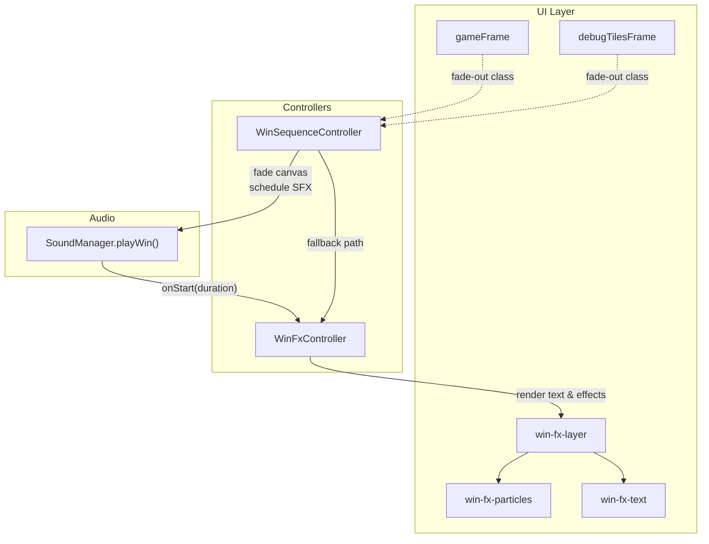
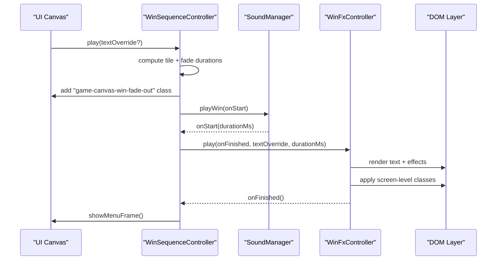
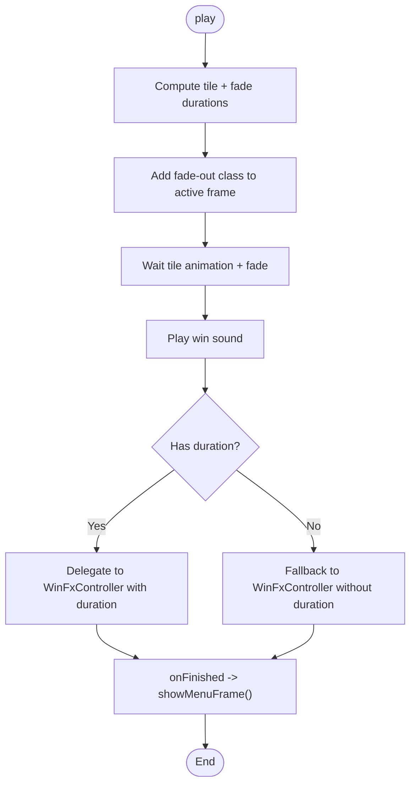
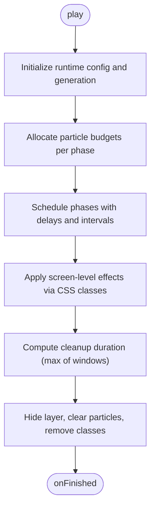

# Win Sequence Controller

<cite>
**Referenced Files in This Document**
- [win-sequence-controller.ts](file://src/win-sequence-controller.ts)
- [win-fx.ts](file://src/win-fx.ts)
- [win-fx.cfg](file://config/win-fx.cfg)
- [win-animation-sequence.md](file://docs/win-animation-sequence.md)
- [styles.winfx.css](file://styles.winfx.css)
- [runtime-config.ts](file://src/runtime-config.ts)
- [win-sequence-controller.test.ts](file://tests/win-sequence-controller.test.ts)
- [win-fx.test.ts](file://tests/win-fx.test.ts)
</cite>

## Table of Contents
1. [Introduction](#introduction)
2. [Project Structure](#project-structure)
3. [Core Components](#core-components)
4. [Architecture Overview](#architecture-overview)
5. [Detailed Component Analysis](#detailed-component-analysis)
6. [Dependency Analysis](#dependency-analysis)
7. [Performance Considerations](#performance-considerations)
8. [Troubleshooting Guide](#troubleshooting-guide)
9. [Conclusion](#conclusion)
10. [Appendices](#appendices)

## Introduction
This document explains the win sequence controller implementation that orchestrates the celebration animation after a player wins. It covers the WinSequenceController class orchestration, the WinFxController particle system, the five-phase celebration pipeline, runtime configuration, timing coordination, and cleanup procedures. It also documents practical customization options (animation speed, HD mode, and runtime configuration), performance optimization strategies, and memory management for particle cleanup.

## Project Structure
The win sequence is composed of two primary modules:
- WinSequenceController: coordinates the pre-celebration handoff (canvas fade) and delegates to the particle controller.
- WinFxController: manages the particle system, phase scheduling, and screen-level effects.



**Diagram sources**
- [win-sequence-controller.ts:66-118](file://src/win-sequence-controller.ts#L66-L118)
- [win-fx.ts:236-562](file://src/win-fx.ts#L236-L562)
- [styles.winfx.css:8-48](file://styles.winfx.css#L8-L48)

**Section sources**
- [win-sequence-controller.ts:1-141](file://src/win-sequence-controller.ts#L1-L141)
- [win-fx.ts:1-830](file://src/win-fx.ts#L1-L830)

## Core Components
- WinSequenceController: Manages the pre-celebration handoff and delegates to WinFxController. It computes timing based on gameplay timing, applies reduced motion adjustments, and handles abort/cleanup semantics.
- WinFxController: Implements the five-phase celebration, particle budgeting, dynamic timing scaling, and screen-level effects. It enforces a global particle cap and cleans up DOM nodes and CSS classes upon completion.

Key responsibilities:
- WinSequenceController
  - Compute tile animation + fade duration
  - Add fade-out class to active game frame
  - Play win sound and pass duration to WinFxController
  - Fallback to visual celebration if no SFX
  - Clear previous sequences and cancel timeouts
- WinFxController
  - Allocate particle budgets per phase
  - Schedule phase start delays and intervals
  - Apply screen-level effects via CSS classes
  - Clean up DOM and classes after the longest-running effect

**Section sources**
- [win-sequence-controller.ts:21-141](file://src/win-sequence-controller.ts#L21-L141)
- [win-fx.ts:41-830](file://src/win-fx.ts#L41-L830)

## Architecture Overview
The win sequence follows a strict timeline:
- Pre-celebration: Wait for matched-pair disappearance window, then fade the active game canvas.
- Celebration: Start win text and sound simultaneously; text duration is driven by the sound asset’s duration.
- Five-phase celebration: Confetti rain, center finale bouquet, fireworks, shimmer dust, rising embers.
- Screen-level effects: Screen flash, vignette, app shake, chroma aberration, and particles pulse.
- Cleanup: Remove layer, particles, and classes after the longest-running effect finishes.



**Diagram sources**
- [win-sequence-controller.ts:66-118](file://src/win-sequence-controller.ts#L66-L118)
- [win-fx.ts:236-562](file://src/win-fx.ts#L236-L562)

## Detailed Component Analysis

### WinSequenceController
Responsibilities:
- Compute scaled durations from gameplay timing and reduced motion preferences.
- Fade the active game canvas (gameFrame or debugTilesFrame) after tile animation.
- Trigger win sound and pass the resolved duration to WinFxController.
- Fallback to visual celebration if no SFX is available.
- Abort/cancel if the active game changes or the controller is cleared.

Key behaviors:
- Timing calculation uses animation speed scaling and reduced motion detection.
- Active frame selection depends on the active game mode.
- Abort signals are propagated via AbortController and checked before invoking callbacks.



**Diagram sources**
- [win-sequence-controller.ts:66-118](file://src/win-sequence-controller.ts#L66-L118)

**Section sources**
- [win-sequence-controller.ts:21-141](file://src/win-sequence-controller.ts#L21-L141)
- [win-sequence-controller.test.ts:119-298](file://tests/win-sequence-controller.test.ts#L119-L298)

### WinFxController
Responsibilities:
- Manage the five-phase celebration pipeline with precise timing and budgeting.
- Enforce a global particle cap per phase and adjust budgets to prevent starvation.
- Apply screen-level effects via CSS classes with automatic removal.
- Clean up DOM nodes and CSS classes after the longest-running effect completes.

Five-phase celebration system:
- Phase 1: Confetti rain
  - Starts after confettiRainDelayMs; creates confettiRainCount pieces over confettiRainSpreadMs.
  - Physics-based fall animation with size/opacity/bounce derived from weights.
- Phase 2: Center finale bouquet
  - Waves of alternating sparks and symbol particles from center.
  - Spread scale increases per wave; total pieces = centerFinaleWaves × centerFinaleCount.
- Phase 3: Fireworks
  - Post-text bursts; each burst spawns FIREWORK_SPARKS_PER_BURST + FIREWORK_CORE_PER_BURST.
  - Burst interval controlled by FIREWORK_BURST_INTERVAL_MS; CSS animation duration is FIREWORK_CSS_ANIMATION_MS.
- Phase 4: Shimmer dust
  - Ambient sparkle particles across board area during firework phase.
  - SHIMMER_DUST_COUNT pieces with small size and drift.
- Phase 5: Rising embers
  - Warm-colored particles rising upward from lower half of board.
  - EMBER_COUNT pieces with upward trajectory and fixed warm color palette.

Screen-level effects:
- Screen flash: Immediate gold radial flash; auto-removed after SCREEN_FLASH_CSS_MS.
- Vignette: Dark radial overlay applied immediately and persists through celebration.
- App shake: Shaking animation on app window at first firework burst; auto-removed after APP_SHAKE_CSS_MS.
- Chroma aberration: RGB text-shadow shimmer on particles container at center finale; auto-removed after CHROMA_CSS_MS.
- Particles pulse: Scale pulse on particles container at firework start; auto-removed after PARTICLES_PULSE_CSS_MS.

Particle budget allocation:
- Budgets are computed up front to prevent later phases from starving when maxParticles is low.
- Required pieces per phase are calculated, and remaining budget is distributed proportionally.
- If total required exceeds maxParticles, a warning is logged and confetti may be reduced to preserve center finale and fireworks.

Dynamic timing calculations:
- All durations are scaled by animation speed using a dedicated scaling function.
- Reduced motion preference adjusts matched disappear duration.
- Delay jitter is applied per particle to smooth out creation spikes.

Cleanup procedures:
- Cleanup is computed as the maximum of:
  - winSoundDurationMs (when provided),
  - firework window,
  - min phase start window plus CLEANUP_BUFFER_MS.
- On cleanup, the layer is hidden, all particle nodes are removed, and screen-level effect classes are removed.



**Diagram sources**
- [win-fx.ts:236-562](file://src/win-fx.ts#L236-L562)

**Section sources**
- [win-fx.ts:41-830](file://src/win-fx.ts#L41-L830)
- [win-fx.test.ts:82-883](file://tests/win-fx.test.ts#L82-L883)
- [win-animation-sequence.md:54-234](file://docs/win-animation-sequence.md#L54-L234)

### Visual Effects and Game State Relationship
- The win sequence is triggered by the active game state; if the active game changes during the sequence, the controller aborts.
- The active frame selection depends on the current game mode (game vs debug-tiles), ensuring the correct canvas is faded.
- The celebration text and sound are coordinated so that the visual text appears alongside the audio when available.

**Section sources**
- [win-sequence-controller.ts:129-140](file://src/win-sequence-controller.ts#L129-L140)
- [win-sequence-controller.test.ts:129-166](file://tests/win-sequence-controller.test.ts#L129-L166)

### Practical Customization Examples
- Runtime configuration via config file:
  - Adjust text display duration, global particle caps (HD-on vs HD-off), and per-phase counts/delays.
  - Modify color palettes for particles and confetti rain.
- Animation speed controls:
  - Set animation speed bounds and apply multipliers; durations are scaled accordingly.
- HD mode toggles:
  - Enable/disable HD mode to switch between maxParticles and maxParticlesLow.

Examples (paths):
- [config/win-fx.cfg:1-30](file://config/win-fx.cfg#L1-L30)
- [runtime-config.ts:158-201](file://src/runtime-config.ts#L158-L201)
- [win-fx.ts:208-234](file://src/win-fx.ts#L208-L234)

**Section sources**
- [win-fx.cfg:1-30](file://config/win-fx.cfg#L1-L30)
- [runtime-config.ts:158-201](file://src/runtime-config.ts#L158-L201)
- [win-fx.ts:208-234](file://src/win-fx.ts#L208-L234)

## Dependency Analysis
WinSequenceController depends on:
- SoundManager for win sound playback and duration reporting.
- WinFxController for rendering the celebration.
- UiRuntimeConfig for gameplay timing and reduced motion adjustments.
- Frame selection helpers for active game mode.

WinFxController depends on:
- Runtime configuration for particle counts, colors, and limits.
- Stylesheet for CSS-driven animations and screen-level effects.
- DOM elements for layer, particles container, and text.

```mermaid
classDiagram
class WinSequenceController {
+play(textOverride?)
+clear()
-getScaledMatchedDisappearDuration()
-getActiveGameCanvasFrame()
}
class WinFxController {
+configureRuntime(config)
+setAnimationSpeed(multiplier)
+setAnimationSpeedBounds(min,max)
+setHdMode(hdOn)
+play(onFinished,textOverride,durationMs)
+clear()
}
class SoundManager {
+playWin(onStart)
}
WinSequenceController --> WinFxController : "delegates"
WinSequenceController --> SoundManager : "plays SFX"
WinFxController --> "DOM Elements" : "renders effects"
```

**Diagram sources**
- [win-sequence-controller.ts:21-141](file://src/win-sequence-controller.ts#L21-L141)
- [win-fx.ts:41-830](file://src/win-fx.ts#L41-L830)

**Section sources**
- [win-sequence-controller.ts:10-19](file://src/win-sequence-controller.ts#L10-L19)
- [win-fx.ts:161-178](file://src/win-fx.ts#L161-L178)

## Performance Considerations
- Lazy creation: Each phase uses setTimeout to spread DOM insertions over time, avoiding layout spikes.
- Global particle cap: Enforced per phase to prevent memory pressure; budget allocation prevents starvation.
- Reduced motion support: Matches prefers-reduced-motion to shorten durations and disable intensive animations.
- CSS-driven animations: Screen-level effects rely on CSS classes and keyframes to minimize JS overhead.
- Cleanup batching: replaceChildren() efficiently removes all particle nodes in a single operation.

[No sources needed since this section provides general guidance]

## Troubleshooting Guide
Common issues and remedies:
- No SFX available: WinSequenceController falls back to visual celebration using the resolved duration.
- Aborted sequence: If the active game changes or the controller is cleared, pending callbacks are canceled and no effects are applied.
- Stale generations: When a new play starts, previous timeouts are canceled; ensure onFinished is not invoked twice.
- Low particle counts: If total required exceeds maxParticles, confetti may be reduced to preserve center finale and fireworks.

**Section sources**
- [win-sequence-controller.ts:94-115](file://src/win-sequence-controller.ts#L94-L115)
- [win-fx.ts:289-301](file://src/win-fx.ts#L289-L301)
- [win-fx.test.ts:443-466](file://tests/win-fx.test.ts#L443-L466)

## Conclusion
The win sequence controller integrates UI handoff, audio synchronization, and a robust particle system to deliver a polished celebration. Its design emphasizes timing coordination, dynamic budgeting, and clean resource management, ensuring smooth performance across devices and user preferences.

[No sources needed since this section summarizes without analyzing specific files]

## Appendices

### Five-Phase Celebration System Details
- Confetti rain: Physics-based fall with size/opacity weighting; created lazily over spread window.
- Center finale bouquet: Alternating sparks and symbols from center; spread increases per wave.
- Fireworks: Post-text bursts with outer sparks and central cores; CSS animation duration enforced.
- Shimmer dust: Ambient sparkle particles during firework phase; small size and drift.
- Rising embers: Warm-colored particles rising upward with sway; fixed color palette.

**Section sources**
- [win-animation-sequence.md:87-170](file://docs/win-animation-sequence.md#L87-L170)
- [styles.winfx.css:139-173](file://styles.winfx.css#L139-L173)

### Screen-Level Effects Reference
- Screen flash: Immediate gold radial flash; auto-removed after CSS animation.
- Vignette: Dark radial overlay applied immediately and persists.
- App shake: Shaking animation on app window at first firework burst.
- Chroma aberration: RGB text-shadow shimmer on particles container at center finale.
- Particles pulse: Scale pulse on particles container at firework start.

**Section sources**
- [win-animation-sequence.md:171-197](file://docs/win-animation-sequence.md#L171-L197)
- [styles.winfx.css:502-553](file://styles.winfx.css#L502-L553)